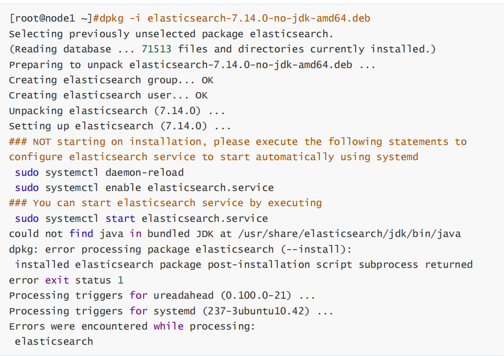

# ELK

# 1 概述

早期IT架构中的系统和应用的日志分散在不同的主机和文件，如果应用出现问题，开发和运维人员想排
查原因，就要先找到相应的主机上的日志文件再进行查找和分析，所以非常不方便，而且还涉及到权限
安全问题，ELK的出现就很好的解决这一问题


**ELK 是由一家 Elastic 公司开发的三个开源项目的首字母缩写，即是三个相关的项目组成的系统**


这三个项目分别是：**Elasticsearch**、**Logstash** 和 **Kibana**。三个项目各有不同的功能

- Elasticsearch 是一个实时的全文搜索,存储库和分析引擎。
- Logstash 是数据处理的管道，能够同时从多个来源采集数据，转换数据，然后将数据发送到诸如Elasticsearch 等存储库中。
- Kibana 则可以让用户在 Elasticsearch 中使用图形和图表对数据进行可视化。

Elastic Stack 是一套适用于数据采集、扩充、存储、分析和可视化的免费开源工具。

目前 Elastic Stack 包括一系列丰富的轻量型数据采集代理，这些代理统称为 Beats，可用来向Elasticsearch 发送数据。

ELK 版本演进: 0.X,1.X,2,X,5.X,6,X,7.X,8.X ....

```yaml
官网: https://www.elastic.co/
ELK官方介绍: https://www.elastic.co/cn/what-is/elk-stack
ELK 下载链接: https://www.elastic.co/cn/downloads/
ELK 说明: https://www.elastic.co/guide/cn/index.html
ELK 权威指南: https://www.elastic.co/guide/cn/elasticsearch/guide/current/index.html
```

**ELK stack的主要优点：**

- 功能强大：Elasticsearch 是实时全文索引，具有强大的搜索功能
- 配置相对简单：Elasticsearch 全部基于 JSON，Logstash使用模块化配置，Kibana的配置都比较简单。
- 检索性能高效：基于优秀的设计，每次查询可以实时响应，即使百亿级数据的查询也能达到秒级响应。
- 集群线性扩展：Elasticsearch 和 Logstash都可以灵活线性扩展
- 前端操作方便：Kibana提供了比较美观UI前端，操作也比较简单

**官方下载**

```
https://www.elastic.co/cn/downloads/
```

**EFK** 由**ElasticSearch**、**Fluentd**和**Kibana**三个开源工具组成。

Fluentd是一个实时开源的数据收集器,和logstash功能相似,这三款开源工具的组合为日志数据提供了分布式的实时搜集与分析的监控系统。

Fluentd官网和文档:

```
https://www.fluentd.org/
https://docs.fluentd.org/
```

# 2 Elasticsearch 部署与管理

Elasticsearch 基于 Java 语言开发，利用全文搜索引擎 Apache Lucene 实现

- **Elasticsearch 很快**
- **Elasticsearch** **具有分布式的本质特征**
- **Elasticsearch** **包含一系列广泛的功能**
- **Elastic Stack** **简化了数据采集、可视化和报告过程**

Elasticsearch 是一个分布式的免费开源搜索和分析引擎，适用于包括文本、数字、地理空间、结构化和非结构化数据等在内的所有类型的数据。

Elasticsearch 基于 Java 语言实现

## 2.1 Elasticsearch 安装说明

**官方文档**

```
https://www.elastic.co/guide/en/elastic-stack/index.html
https://www.elastic.co/guide/en/elasticsearch/reference/master/install-elasticsearch.html
```

**部署方式**

- 包安装
- 二进制安装
- Docker 部署
- Ansible 批量部署

ES支持操作系统版本和 Java 版本官方说明

```
https://www.elastic.co/cn/support/matrix
```


## 2.2 Elasticsearch 安装前准备

### 2.2.1 安装前环境初始化

```sh
CPU 2C
内存4G或更多
操作系统: Ubuntu22.04,Ubuntu20.04,Ubuntu18.04,Rocky8.X,Centos 7.X
操作系统盘50G
主机名设置规则为nodeX.dinginx.org
生产环境建议准备单独的数据磁盘
```

#### 2.2.1.1 主机名

```sh
#各服务器配置自己的主机名
[root@ubuntu2004 ~]# hostnamectl set-hostname es-node01.dinginx.org
[root@ubuntu2004 ~]# hostnamectl set-hostname es-node02.dinginx.org
[root@ubuntu2004 ~]# hostnamectl set-hostname es-node03.dinginx.org
```

#### 2.2.1.2 关闭防火墙和SELinux

```sh
关闭防所有服务器的防火墙和 SELinux

#RHEL系列的系统执行下以下配置
[root@es-node01 ~]# systemctl disable firewalld
[root@es-node01 ~]# systemctl disable NetworkManager
[root@es-node01 ~]# sed -i '/SELINUX/s/enforcing/disabled/' /etc/selinux/config
[root@es-node01 ~]# reboot
```

#### 2.2.1.3 各服务器配置本地域名解析

```sh
#es-node01、es-node02、es-node03三节点执行

cat >> /etc/hosts <<EOF
11.0.1.101 es-node01.dinginx.org
11.0.1.102 es-node02.dinginx.org
11.0.1.103 es-node03.dinginx.org
EOF
```

#### 2.2.1.4 优化资源限制配置

##### 2.2.1.4.1 修改内核参数

内核参数 vm.max_map_count 用于限制一个进程可以拥有的VMA(虚拟内存区域)的数量
使用默认系统配置，二进制安装时会提示下面错误，包安装会自动修改此配置


```sh
#查看默认值
[root@es-node01 ~]#sysctl -a|grep vm.max_map_count
vm.max_map_count = 65530

#修改配置
[root@es-node01 ~]#echo "vm.max_map_count = 262144" >> /etc/sysctl.conf
[root@es-node01 ~]#sysctl -p
vm.max_map_count = 262144

#设置系统最大打开的文件描述符数
[root@es-node01 ~]#echo "fs.file-max = 1000000" >> /etc/sysctl.conf
[root@es-node01 ~]#sysctl -p
vm.max_map_count = 262144
fs.file-max = 1000000

#Ubuntu20.04/22.04默认值已经满足要求
[root@ubuntu2204 ~]#sysctl fs.file-max
fs.file-max = 9223372036854775807
```

**范例: Ubuntu 基于包安装后会自动修改文件**

```sh
root@ubuntu2204:~# cat /usr/lib/sysctl.d/elasticsearch.conf 
vm.max_map_count=262144
```

##### 2.2.1.4.2 修改资源限制配置(可选)

```sh
#在node节点执行

cat >> /etc/security/limits.conf <<EOF
*               soft   core           unlimited
*               hard   core           unlimited
*               soft   nproc           1000000
*               hard   nproc           1000000
*               soft   nofile          1000000
*               hard   nofile          1000000
*               soft   memlock         32000
*               hard   memlock         32000
*               soft   msgqueue        8192000
*               hard   msgqueue        8192000
EOF
```

### 2.2.2 安装 Java 环境 (可选)

Elasticsearch 是基于java的应用,所以依赖JDK环境

**注意: 安装7.X以后版本官方建议要安装集成JDK的包,所以无需再专门安装 JDK**

关于JDK环境说明

```
1.x 2.x 5.x 6.x都没有集成JDK的安装包，也就是需要自己安装java环境
7.x 版本的安装包分为带JDK和不带JDK两种包，带JDK的包在安装时不需要再安装java，如果不带JDK的包
仍然需要自己去安装java
8.X 版本内置JDK，不再支持自行安装的JDK
```

如果安装**no-jdk**的包,才需要**安装java环境**

官网JAVA版支持说明

```
https://www.elastic.co/cn/support/matrix#matrix_jvm
```


因为 Elasticsearch 服务运行需要 Java环境，如果要安装没有JDK的包，需要提前安装JAVA环境，可以使用以下方式安装
如果没有java 环境,安装elasticsearch时会出下面错误提示

****

**方式一：直接使用包管理器yum/apt安装openjdk**

```sh
[root@es-node01 ~]#yum -y install java-1.8.0-openjdk
[root@es-node01 ~]#apt update;apt -y install openjdk-8-jdk
```

**方式二：本地安装在oracle官网下载rpm安装包：**

```sh
[root@es-node01 ~]# yum -y install jdk-8u92-linux-x64.rpm
```

**方式三：安装二进制包并自定义环境变量**

```yaml
下载地址: http://www.oracle.com/technetwork/java/javase/downloads/jdk8-downloads-2133151.html
```

```sh
[root@es-node01 ~]# tar xvf jdk-8u121-linux-x64.tar.gz -C /usr/local/ 
[root@es-node01 ~]# ln -sv /usr/local/jdk1.8.0_121 /usr/local/jdk
[root@es-node01 ~]# ln -sv /usr/local/jdk/bin/java /usr/bin/
[root@es-node01 ~]# vim /etc/profile
export HISTTIMEFORMAT="%F %T `whoami` "
export JAVA_HOME=/usr/local/jdk
export CLASSPATH=.:$JAVA_HOME/jre/lib/rt.jar:$JAVA_HOME/lib/dt.jar:$JAVA_HOME/lib/tools.jar
export PATH=$PATH:$JAVA_HOME/bin
[root@es-node01 ~]# source /etc/profile
[root@es-node01 ~]# java -version
java version "1.8.0_121" 	#确认可以出现当前的java版本号
Java(TM) SE Runtime Environment (build 1.8.0_121-b13)
Java HotSpot(TM) 64-Bit Server VM (build 25.121-b13, mixed mode)
```

## 2.3 Elasticsearch 安装

有两种包: 包含jdk和no-jdk的包

**注意: 官方提示no-jdk的包将被淘汰,建议使用包含JDK的包**

**下载地址：**

```
#包含JDK的版本下载
https://www.elastic.co/downloads/elasticsearch
https://mirrors.tuna.tsinghua.edu.cn/elasticstack/
#不包含JDK的版本下载
https://www.elastic.co/cn/downloads/elasticsearch-no-jdk
```

范例: 查看两种包

```sh
[root@es-node01 ~]#ll -h elasticsearch-8.14.3-amd64.deb 
-rw-r--r-- 1 root root 562M Sep 23 21:53 elasticsearch-8.14.3-amd64.deb
```

### 2.3.1 包安装 Elasticsearch

#### 2.3.1.1 安装 Elasticsearch 包

**下载链接**

```
https://www.elastic.co/cn/downloads/elasticsearch
https://mirrors.tuna.tsinghua.edu.cn/elasticstack/
```

```sh
#下载包
[root@es-node01 ~]#wget https://mirrors.tuna.tsinghua.edu.cn/elasticstack/8.x/apt/pool/main/e/elasticsearch/elasticsearch-8.14.3-amd64.deb
[root@es-node01 ~]#ll -h elasticsearch-8.14.3-amd64.deb 
-rw-r--r-- 1 root root 562M Sep 23 21:53 elasticsearch-8.14.3-amd64.deb

#内置jdk环境包安装
[root@es-node01 ~]#dpkg -i elasticsearch-8.14.3-amd64.deb 
Selecting previously unselected package elasticsearch.
(Reading database ... 72068 files and directories currently installed.)
Preparing to unpack elasticsearch-8.14.3-amd64.deb ...
Creating elasticsearch group... OK
Creating elasticsearch user... OK
Unpacking elasticsearch (8.14.3) ...
Setting up elasticsearch (8.14.3) ...
--------------------------- Security autoconfiguration information ------------------------------

Authentication and authorization are enabled.
TLS for the transport and HTTP layers is enabled and configured.

The generated password for the elastic built-in superuser is : kN_N*jTGvq0UxL+lnjY2

If this node should join an existing cluster, you can reconfigure this with
'/usr/share/elasticsearch/bin/elasticsearch-reconfigure-node --enrollment-token <token-here>'
after creating an enrollment token on your existing cluster.

You can complete the following actions at any time:

Reset the password of the elastic built-in superuser with 
'/usr/share/elasticsearch/bin/elasticsearch-reset-password -u elastic'.

Generate an enrollment token for Kibana instances with 
 '/usr/share/elasticsearch/bin/elasticsearch-create-enrollment-token -s kibana'.

Generate an enrollment token for Elasticsearch nodes with 
'/usr/share/elasticsearch/bin/elasticsearch-create-enrollment-token -s node'.

-------------------------------------------------------------------------------------------------
### NOT starting on installation, please execute the following statements to configure elasticsearch service to start automatically using systemd
 sudo systemctl daemon-reload
 sudo systemctl enable elasticsearch.service
### You can start elasticsearch service by executing
 sudo systemctl start elasticsearch.service

##内置JAVA
[root@es-node01 ~]#dpkg -L elasticsearch 
[root@es-node01 ~]#/usr/share/elasticsearch/jdk/bin/java -version
openjdk version "22.0.1" 2024-04-16
OpenJDK Runtime Environment (build 22.0.1+8-16)
OpenJDK 64-Bit Server VM (build 22.0.1+8-16, mixed mode, sharing)

#JVM优化
#########################JVM优化#################################
## IMPORTANT: JVM heap size
################################################################
##
## The heap size is automatically configured by Elasticsearch
## based on the available memory in your system and the roles
## each node is configured to fulfill. If specifying heap is
## required, it should be done through a file in jvm.options.d,
## which should be named with .options suffix, and the min and
## max should be set to the same value. For example, to set the
## heap to 4 GB, create a new file in the jvm.options.d
## directory containing these lines:
##
## -Xms4g
-Xms512m
## -Xmx4g
-Xms512m
##
## See https://www.elastic.co/guide/en/elasticsearch/reference/8.14/heap-size.html
## for more information
##
################################################################

[root@es-node01 ~]#systemctl enable --now elasticsearch.service		#启动服务

#默认8.X开启xpack安全，导致无法直接访问
[root@es-node01 ~]#curl 127.0.0.1:9200
curl: (52) Empty reply from server

##关闭xpack安全功能

......

# Enable security features
xpack.security.enabled: false		#true改为false

......

[root@es-node01 ~]#curl 127.0.0.1:9200
{
  "name" : "es-node01.dinginx.org",
  "cluster_name" : "elasticsearch",
  "cluster_uuid" : "qG1IJ-a8QwCO7JFAJExb2w",
  "version" : {
    "number" : "8.14.3",
    "build_flavor" : "default",
    "build_type" : "deb",
    "build_hash" : "d55f984299e0e88dee72ebd8255f7ff130859ad0",
    "build_date" : "2024-07-07T22:04:49.882652950Z",
    "build_snapshot" : false,
    "lucene_version" : "9.10.0",
    "minimum_wire_compatibility_version" : "7.17.0",
    "minimum_index_compatibility_version" : "7.0.0"
  },
  "tagline" : "You Know, for Search"
}
```

#### 2.3.1.2 编辑服务配置文件

参考文档：

```
https://www.ibm.com/support/knowledgecenter/zh/SSFPJS_8.5.6/com.ibm.wbpm.main.doc/topics/rfps_esearch_configoptions.html
https://www.elastic.co/guide/en/elasticsearch/reference/index.html
https://www.elastic.co/guide/en/elasticsearch/reference/master/settings.html
https://www.elastic.co/guide/en/elasticsearch/reference/master/important-settings.html
```

**配置文件说明**

```sh
[root@es-node01 ~]# grep "^[a-Z]" /etc/elasticsearch/elasticsearch.yml

#ELK集群名称，单节点无需配置，同一个集群内每个节点的此项必须相同,新加集群的节点此项和其它节点相同即可加入集群,而无需再验证
cluster.name: ELK-Cluster 

#当前节点在集群内的节点名称，同一集群中每个节点要确保此名称唯一
node.name: es-node01 

#ES 数据保存目录，包安装默认路径：/var/lib/elasticsearch/
path.data: /data/es-data 

#ES 日志保存目录，包安装默认路径：/var/llog/elasticsearch/
path.logs: /data/es-logs

#服务启动的时候立即分配(锁定)足够的内存，防止数据写入swap,提高启动速度,但是true会导致启动失败，需要优化
bootstrap.memory_lock: true

#指定该节点用于集群的监听IP，默认监听在127.0.0.1:9300，集群模式必须修改此行，单机默认即可
network.host: 0.0.0.0 

#监听端口
http.port: 9200

#发现集群的node节点列表，可以添加部分或全部节点IP
#在新增节点到已有集群时,此处需指定至少一个已经在集群中的节点地址
discovery.seed_hosts: ["11.0.1.101", "11.0.1.102","11.0.1.103"]

#集群初始化时指定希望哪些节点可以被选举为 master,只在初始化时使用,新加节点到已有集群时此项可不配置
cluster.initial_master_nodes: ["11.0.1.101", "11.0.1.102","11.0.1.103"]

#一个集群中的 N 个节点启动后,才允许进行数据恢复处理，默认是1,一般设为为所有节点的一半以上,防止出现脑裂现象
#当集群无法启动时,可以将之修改为1,或者将下面行注释掉,实现快速恢复启动
gateway.recover_after_nodes: 2

#设置是否可以通过正则表达式或者_all匹配索引库进行删除或者关闭索引库，默认true表示必须需要明确指定索引库名称，不能使用正则表达式和_all，生产环境建议设置为 true，防止误删索引库。
action.destructive_requires_name: true

#如果不参与主节点选举设为false,默认值为true
node.master: false

#存储数据,默认值为true,此值为false则不存储数据而成为一个路由节点
#如果将原有的true改为false,需要先执行/usr/share/elasticsearch/bin/elasticsearch-noderepurpose 清理数据
node.data: true

#7.x以后版本下面指令已废弃，在2.x 5.x 6.x 版本中用于配置节点发现列表
discovery.zen.ping.unicast.hosts: ["11.0.1.101", "11.0.1.102","11.0.1.103"]

#8.X版后默认即开启Xpack功能，可以修改为false禁用
xpack. security. enabled : true

#开启跨域访问支持，默认为false
http.cors.enabled: true

# 跨域访问允许的域名地址，(允许所有域名)以上使用正则
http.cors.allow-origin: "*"
```

**范例：8.X 单机配置**

```sh
#8.X版,修改配置文件一行即可
[root@ubuntu2204 ~]#vim /etc/elasticsearch/elasticsearch.yml
path.data: /var/lib/elasticsearch
path.logs: /var/log/elasticsearch
#network.host: 0.0.0.0         #保留注释此行  
xpack.security.enabled: false  #只需要修改此行true为false即可,其它行默认即可
xpack.security.enrollment.enabled: true
xpack.security.http.ssl:
 enabled: true
 keystore.path: certs/http.p12
xpack.security.transport.ssl:
 enabled: true
 verification_mode: certificate
 keystore.path: certs/transport.p12
 truststore.path: certs/transport.p12
cluster.initial_master_nodes: ["ubuntu2204.dinginx.org"]  #默认此行不做修改
http.host: 0.0.0.0
[root@ubuntu2204 ~]#systemctl enable --now elasticsearch.service 

#查看9200和9300端口
root@ubuntu2204:~# ss -ntl|grep -E '9200|9300'
LISTEN 0      4096   [::ffff:127.0.0.1]:9300            *:*          
LISTEN 0      4096                [::1]:9300         [::]:*          
LISTEN 0      4096                    *:9200            *:*  

#测试访问
root@ubuntu2204:~# curl 11.0.1.10:9200
{
  "name" : "ubuntu2204",
  "cluster_name" : "elasticsearch",
  "cluster_uuid" : "Lur3kHLqQLiHIQPds_8JMw",
  "version" : {
    "number" : "8.8.2",
    "build_flavor" : "default",
    "build_type" : "deb",
    "build_hash" : "98e1271edf932a480e4262a471281f1ee295ce6b",
    "build_date" : "2023-06-26T05:16:16.196344851Z",
    "build_snapshot" : false,
    "lucene_version" : "9.6.0",
    "minimum_wire_compatibility_version" : "7.17.0",
    "minimum_index_compatibility_version" : "7.0.0"
  },
  "tagline" : "You Know, for Search"
}
```

**范例：8.X 集群配置**

```sh
[root@es-node01 ~]#grep -Ev '^(#|$)'  /etc/elasticsearch/elasticsearch.yml 
cluster.name: elk-cluster
node.name: es-node01
path.data: /data/es-data
path.logs: /data/es-logs
network.host: 0.0.0.0          #集群模式必须修改此行，默认是127.0.0.1：9300,否则集群节点无法通过9300端口通信每个节点相同
bootstrap.memory_lock: true
http.port: 9200
discovery.seed_hosts: ["11.0.1.101", "11.0.1.102","11.0.1.103"]		#修改此行，每个节点相同
cluster.initial_master_nodes: ["11.0.1.101", "11.0.1.102","11.0.1.103"]		#修改此行，每个节点相同,和下面重复
action.destructive_requires_name: true
xpack.security.enabled: false			#修改此行，每个节点相同
xpack.security.enrollment.enabled: true
xpack.security.http.ssl:
  enabled: true
  keystore.path: certs/http.p12
xpack.security.transport.ssl:
  enabled: true
  verification_mode: certificate
  keystore.path: certs/transport.p12
  truststore.path: certs/transport.p12

#cluster.initial_master_nodes: ["es-node01.dinginx.org"]		 #将此行注释
http.host: 0.0.0.0

#创建存放路径并授权
[root@es-node01 ~]#mkdir /data/{es-data,es-logs} && chown elasticsearch. /data/es-* && systemctl restart elasticsearch.service

#打开9200和9300端口
[root@es-node03 ~]#ss -ntl|grep -E '9200|9300'
LISTEN   0        4096                   *:9300                *:*              
LISTEN   0        4096                   *:9200                *:*  

#访问测试
[root@es-node01 ~]#curl http://127.0.0.1:9200/_cluster/health?pretty=true
{
  "cluster_name" : "elk-cluster",
  "status" : "green",
  "timed_out" : false,
  "number_of_nodes" : 3,
  "number_of_data_nodes" : 3,
  "active_primary_shards" : 0,
  "active_shards" : 0,
  "relocating_shards" : 0,
  "initializing_shards" : 0,
  "unassigned_shards" : 0,
  "delayed_unassigned_shards" : 0,
  "number_of_pending_tasks" : 0,
  "number_of_in_flight_fetch" : 0,
  "task_max_waiting_in_queue_millis" : 0,
  "active_shards_percent_as_number" : 100.0
}

#查看集群信息
[root@es-node01 ~]#curl 'http://127.0.0.1:9200/_cat/nodes?v'
ip         heap.percent ram.percent cpu load_1m load_5m load_15m node.role   master name
11.0.1.102           32          97   0    0.40    0.51     0.44 cdfhilmrstw -      es-node02
11.0.1.101           23          96   1    1.01    0.53     0.41 cdfhilmrstw *      es-node01
11.0.1.103           21          96   0    0.42    0.48     0.43 cdfhilmrstw -      es-node03
```

#### 2.3.1.3 优化 ELK 资源配置

##### 2.3.1.3.1 开启 bootstrap.memory_lock 优化

开启 **bootstrap.memory_lock:  true** 可以优化性能，但会导致无法启动的错误解决方法

**注意：开启 bootstrap.memory_lock: true 需要足够的内存，建议4G以上，否则内存不足，启动会很慢**

**官方文档:**

```sh
https://www.elastic.co/guide/en/elasticsearch/reference/current/setup-configuration-memory.html#bootstrap-memory_lock
https://www.elastic.co/guide/en/elasticsearch/reference/current/setting-system-settings.html#systemd
```


```sh
[root@node01 ~]#vim /etc/elasticsearch/elasticsearch.yml 
#开启此功能导致无法启动
bootstrap.memory_lock: true
[root@node01 ~]#systemctl restart elasticsearch.service 
Job for elasticsearch.service failed because the control process exited with 
error code.
See "systemctl status elasticsearch.service" and "journalctl -xe" for details.
[root@node01 ~]#tail /data/es-logs/es-cluster.log

#方法1：直接修改elasticsearch.service 
[root@node01 ~]#vim /lib/systemd/system/elasticsearch.service 
[Service]
#加下面一行
LimitMEMLOCK=infinity
#方法2：新建文件
[root@node01 ~]#systemctl edit elasticsearch
### Anything between here and the comment below will become the new contents of 
the file
#加下面两行，注意加在中间位置
[Service]
LimitMEMLOCK=infinity
### Lines below this comment will be discarded
[root@node01 ~]#cat /etc/systemd/system/elasticsearch.service.d/override.conf 
[Service]
LimitMEMLOCK=infinity
[root@node01 ~]#systemctl daemon-reload 
[root@node01 ~]#systemctl restart elasticsearch.service 
[root@node01 ~]#systemctl is-active elasticsearch.service 
active
#测试访问是否成功
[root@node01 ~]#curl http://node01.dinginx.com:9200
[root@node01 ~]#curl http://node02.dinginx.com:9200
[root@node01 ~]#curl http://node03.dinginx.com:9200
```

##### 2.3.1.3.2 内存优化

**官方文档：**

```yaml
https://www.elastic.co/guide/en/elasticsearch/reference/current/important-settings.html#heap-size-settings

#关于heap内存大小
## 虽然JVM可以处理大量的堆内存，但是将堆内存设置为过大的值可能导致以下问题：
堆内存分配的效率低
操作系统内存管理的限制
垃圾回收(Garbage Collection, GC): 压力变大
对象指针的大小: 在某些JVM实现（例如Oracle的HotSpot），在堆（Heap）大小超过32GB之后，对象指针的表示将从32位压缩oops（Ordinary Object Pointers）转变为64位非压缩指针，这导致了内存使用的增加。
```

**推荐使用宿主机物理内存的一半，ES的heap内存最大不超过30G,26G是比较安全的**


**内存优化建议:**

为了保证性能，每个ES节点的JVM内存设置具体要根据 node 要存储的数据量来估算,建议符合下面约定

- 在内存和数据量有一个建议的比例：对于一般日志类文件，1G 内存能存储48G~96GB数据
- JVM 堆内存最大**不要超过30GB**
- **单个分片控制在30-50GB**，太大查询会比较慢，索引恢复和更新时间越长；分片太小，会导致索引碎片化越严重，性能也会下降

**范例:**

```yaml
#假设总数据量为1TB，3个node节点，1个副本；那么实际要存储的大小为2TB
每个节点需要存储的数据量为: 2TB / 3 = 700GB，每个节点还需要预留20%的空间，所以每个node要存储大约 700*100/80=875GB 的数据；每个节点按照内存与存储数据的比率计算：875GB/48GB=18，即需要JVM内存为18GB,小于30GB
因为要尽量控制分片的大小为30GB；875GB/30GB=30个分片,即最多每个节点有30个分片

#思考：假设总数据量为2TB，3个node节点，1个副本呢？
```

**范例：指定heap内存最小和最大内存限制**

```sh
#建议将heap内存设置为物理内存的一半且最小和最大设置一样大,但最大不能超过30G
[root@es-node01 ~]# vim /etc/elasticsearch/jvm.options 
-Xms30g
-Xmx30g

#每天产生1TB左右的数据量的建议服务器配置，还需要定期清理磁盘
16C 64G 6T硬盘 共3台服务器
```

**范例： 修改service文件，做优化配置**

```sh
[root@es-node01 ~]# vim /usr/lib/systemd/system/elasticsearch.service #修改内存限制
LimitNOFILE=1000000  #修改最大打开的文件数，默认值为65535
LimitNPROC=65535   #修改打开最大的进程数，默认值为4096
LimitMEMLOCK=infinity #无限制使用内存，以前旧版需要修改，否则无法启动服务，当前版本无需修改
```

**内存锁定的配置参数：**

```
https://discuss.elastic.co/t/memory-lock-not-working/70576
```

#### 2.3.1.4 目录权限更改

在各个ES服务器创建数据和日志目录并修改目录权限为elasticsearch

```sh
#创建存放路径并授权,#必须分配权限，否则服务无法启动
[root@es-node01 ~]#mkdir /data/{es-data,es-logs} && chown elasticsearch. /data/es-* && systemctl restart elasticsearch.service


[root@es-node01 ~]#ll /data/
total 32
drwxr-xr-x  5 root          root           4096 Sep 24 13:05 ./
drwxr-xr-x 21 root          root           4096 Sep  7  2023 ../
drwxr-xr-x  4 elasticsearch elasticsearch  4096 Sep 24 14:02 es-data/
drwxr-xr-x  2 elasticsearch elasticsearch  4096 Sep 24 13:14 es-logs/
drwx------  2 root          root          16384 Sep  7  2023 lost+found/
```

#### 2.3.1.5 启动 Elasticsearch 服务并验证

```sh
#启动
[root@es-node01 ~]# systemctl enable --now elasticsearch
[root@es-node01 ~]# id elasticsearch 
uid=113(elasticsearch) gid=117(elasticsearch) groups=117(elasticsearch)
[root@es-node01 ~]#ps aux|grep elasticsearch
root       10621  0.0  0.2  21876  9840 pts/3    S+   12:18   0:00 vim /etc/elasticsearch/elasticsearch.yml
elastic+   13029  0.1  2.6 2541072 105284 ?      Ssl  13:14   0:05 /usr/share/elasticsearch/jdk/bin/java -Xms4m -Xmx64m -XX:+UseSerialGC -Dcli.name=server -Dcli.script=/usr/share/elasticsearch/bin/elasticsearch -Dcli.libs=lib/tools/server-cli -Des.path.home=/usr/share/elasticsearch -Des.path.conf=/etc/elasticsearch -Des.distribution.type=deb -cp /usr/share/elasticsearch/lib/*:/usr/share/elasticsearch/lib/cli-launcher/* org.elasticsearch.launcher.CliToolLauncher -p /var/run/elasticsearch/elasticsearch.pid --quiet
elastic+   13102  1.6 21.5 3308948 858060 ?      Sl   13:14   0:51 /usr/share/elasticsearch/jdk/bin/java -Des.networkaddress.cache.ttl=60 -Des.networkaddress.cache.negative.ttl=10 -Djava.security.manager=allow -XX:+AlwaysPreTouch -Xss1m -Djava.awt.headless=true -Dfile.encoding=UTF-8 -Djna.nosys=true -XX:-OmitStackTraceInFastThrow -Dio.netty.noUnsafe=true -Dio.netty.noKeySetOptimization=true -Dio.netty.recycler.maxCapacityPerThread=0 -Dlog4j.shutdownHookEnabled=false -Dlog4j2.disable.jmx=true -Dlog4j2.formatMsgNoLookups=true -Djava.locale.providers=SPI,COMPAT --add-opens=java.base/java.io=org.elasticsearch.preallocate --add-opens=org.apache.lucene.core/org.apache.lucene.store=org.elasticsearch.vec --enable-native-access=org.elasticsearch.nativeaccess -XX:ReplayDataFile=/var/log/elasticsearch/replay_pid%p.log -Djava.library.path=/usr/share/elasticsearch/lib/platform/linux-x64:/usr/java/packages/lib:/usr/lib64:/lib64:/lib:/usr/lib -Djna.library.path=/usr/share/elasticsearch/lib/platform/linux-x64:/usr/java/packages/lib:/usr/lib64:/lib64:/lib:/usr/lib -Des.distribution.type=deb -XX:+UnlockDiagnosticVMOptions -XX:G1NumCollectionsKeepPinned=10000000 -Xms512m -Xmx512m -XX:+UseG1GC -Djava.io.tmpdir=/tmp/elasticsearch-285470383223225162 --add-modules=jdk.incubator.vector -XX:+HeapDumpOnOutOfMemoryError -XX:+ExitOnOutOfMemoryError -XX:HeapDumpPath=/var/lib/elasticsearch -XX:ErrorFile=/var/log/elasticsearch/hs_err_pid%p.log -Xlog:gc*,gc+age=trace,safepoint:file=/var/log/elasticsearch/gc.log:utctime,level,pid,tags:filecount=32,filesize=64m -XX:MaxDirectMemorySize=268435456 -XX:G1HeapRegionSize=4m -XX:InitiatingHeapOccupancyPercent=30 -XX:G1ReservePercent=15 --module-path /usr/share/elasticsearch/lib --add-modules=jdk.net --add-modules=ALL-MODULE-PATH -m org.elasticsearch.server/org.elasticsearch.bootstrap.Elasticsearch
elastic+   13122  0.0  0.2 108944  8868 ?        Sl   13:14   0:00 /usr/share/elasticsearch/modules/x-pack-ml/platform/linux-x86_64/bin/controller
root       15002  0.0  0.0   6432   720 pts/4    S+   14:07   0:00 grep --color=auto elasticsearch

#查看监听port，9200端口集群访问端口,9300集群同步端口
[root@es-node01 ~]#ss -ntlp|grep java
LISTEN    0         4096                     *:9200                   *:*        users:(("java",pid=13102,fd=445))                                              
LISTEN    0         4096                     *:9300                   *:*        users:(("java",pid=13102,fd=443))   

#显示如下信息，表示服务启动，但不意味着集群是健康的
[root@es-node01 ~]#curl 127.0.0.1:9200
{
  "name" : "es-node01",
  "cluster_name" : "elk-cluster",
  "cluster_uuid" : "UgMCqg2JTWyBtLAaA_SbJw",
  "version" : {
    "number" : "8.14.3",
    "build_flavor" : "default",
    "build_type" : "deb",
    "build_hash" : "d55f984299e0e88dee72ebd8255f7ff130859ad0",
    "build_date" : "2024-07-07T22:04:49.882652950Z",
    "build_snapshot" : false,
    "lucene_version" : "9.10.0",
    "minimum_wire_compatibility_version" : "7.17.0",
    "minimum_index_compatibility_version" : "7.0.0"
  },
  "tagline" : "You Know, for Search"
}

##显示如下信息表示集群是健康的
[root@es-node01 ~]#curl 127.0.0.1:9200/_cat/health
1727158170 06:09:30 elk-cluster green 3 3 0 0 0 0 0 0 - 100.0%
```

## 2.4 Elasticsearch 访问

**官方文档**

```html
https://www.elastic.co/guide/en/elasticsearch/reference/master/rest-apis.html
```

Elasticsearch 支持各种语言使用 RESTful API 通过端口 9200 与之进行通信，可以用你习惯的 web 客户端访问 Elasticsearch 
可以用三种方式和 Elasticsearch进行交互

- curl 命令和其它浏览器: 基于命令行,操作不方便
- 插件: 在node节点上安装head,Cerebro 等插件,实现图形操作,查看数据方便
- Kibana: 需要java环境并配置,图形操作,显示格式丰富

### 2.4.1 Shell 命令

```
https://www.elastic.co/guide/en/elasticsearch/reference/current/query-dsl-match-query.html
https://nasuyun.com/docs/api/
```

Elasticsearch 提供了功能十分丰富、多种表现形式的查询 DSL**(Domain Specific Language领域特定语言)**语言
DSL 查询使用 JSON 格式的请求体与 Elasticsearch 交互，可以实现各种各样的增删改查等功能

#### 2.4.1.1 查看 ES 集群状态

**访问 ES**

```sh
#查看支持的指令
curl http://127.0.0.1:9200/_cat

#查看es集群状态
curl http://127.0.0.1:9200/_cat/health
curl 'http://127.0.0.1:9200/_cat/health?v'

#查看集群分健康性,获取到的是一个json格式的返回值，那就可以通过python等工具对其中的信息进行分析
#注意：status 字段为green才是正常状态
curl http://127.0.0.1:9200/_cluster/health?pretty=true

#查看所有的节点信息
curl 'http://127.0.0.1:9200/_cat/nodes?v'

#列出所有的索引 以及每个索引的相关信息
curl 'http://127.0.0.1:9200/_cat/indices?v'
```

**范例:**

```sh
[root@es-node01 ~]#curl http://127.0.0.1:9200/_cat
=^.^=
/_cat/allocation
/_cat/shards
/_cat/shards/{index}
/_cat/master
/_cat/nodes
/_cat/tasks
/_cat/indices
/_cat/indices/{index}
/_cat/segments
/_cat/segments/{index}
/_cat/count
/_cat/count/{index}
/_cat/recovery
/_cat/recovery/{index}
/_cat/health
/_cat/pending_tasks
/_cat/aliases
/_cat/aliases/{alias}
/_cat/thread_pool
/_cat/thread_pool/{thread_pools}
/_cat/plugins
/_cat/fielddata
/_cat/fielddata/{fields}
/_cat/nodeattrs
/_cat/repositories
/_cat/snapshots/{repository}
/_cat/templates
/_cat/component_templates/_cat/ml/anomaly_detectors
/_cat/ml/anomaly_detectors/{job_id}
/_cat/ml/datafeeds
/_cat/ml/datafeeds/{datafeed_id}
/_cat/ml/trained_models
/_cat/ml/trained_models/{model_id}
/_cat/ml/data_frame/analytics
/_cat/ml/data_frame/analytics/{id}
/_cat/transforms
/_cat/transforms/{transform_id}

[root@es-node01 ~]#curl http://127.0.0.1:9200/_cat/master
hYZ9eBiJSv6BYpoWVkbmAA 11.0.1.101 11.0.1.101 es-node01

[root@es-node01 ~]#curl http://127.0.0.1:9200/_cat/nodes
11.0.1.102 67 94 0 0.51 0.47 0.45 cdfhilmrstw - es-node02
11.0.1.101 41 92 0 0.43 0.45 0.45 cdfhilmrstw * es-node01
11.0.1.103 48 94 0 0.54 0.40 0.38 cdfhilmrstw - es-node03

#列出所有的索引 以及每个索引的相关信息
[root@es-node01 ~]#curl '127.0.0.1:9200/_cat/indices?v'
health status index  uuid                   pri rep docs.count docs.deleted store.size pri.store.size dataset.size
green  open   index2 3OXaH2FjQGeqMYL2VNohZQ   1   1          0            0       454b           227b         227b
#查看指定索引信息
curl -XPOST '127.0.0.1:9200/nginx-errorlog-0.107-2021.02.04/_search?pretty'

#创建索引
[root@es-node01 ~]#curl -XPUT '127.0.0.1:9200/index01'
{"acknowledged":true,"shards_acknowledged":true,"index":"index01"}
[root@es-node01 ~]#curl -XPUT '127.0.0.1:9200/index02'
{"acknowledged":true,"shards_acknowledged":true,"index":"index02"}

#查看索引
[root@es-node01 ~]#curl 127.0.0.1:9200/_cat/indices?v
health status index   uuid                   pri rep docs.count docs.deleted store.size pri.store.size dataset.size
green  open   index02 SSrQw1IJTGGrakGxX2XU9Q   1   1          0            0       454b           227b         227b
green  open   index01 0A60ppwsSZW697xkuPN-Xw   1   1          0            0       454b           227b         227b
```

#### 2.4.1.2 创建和查看索引

```java
https://www.elastic.co/guide/en/elasticsearch/reference/current/indices-create-index.html
```

**示例：(副本不包含本身,区别于kafka)**

```yaml
#两个分片，每个分片各一个副本，共四个分片
curl -X PUT '127.0.0.1:9200/test01' \
-H 'Content-Type: application/json' \
-d '{
  "settings": {
    "index": {
      "number_of_shards": 3,
      "number_of_replicas": 2
    }
  }
}'


#创建3个分片和2个副本的索引（3个分片，每个分片各2个副本，共9个分片）
[root@es-node01 ~]#curl -X PUT '127.0.0.1:9200/index3' \
> -H 'Content-Type: application/json' \
> -d '{
>   "settings": {
>     "index": {
>       "number_of_shards": 3,
>       "number_of_replicas": 2
>     }
>   }
> }'
{"acknowledged":true,"shards_acknowledged":true,"index":"index3"}

#查看所有索引
[root@es-node01 ~]#curl '127.0.0.1:9200/_cat/indices?v'
health status index   uuid                   pri rep docs.count docs.deleted store.size pri.store.size dataset.size
green  open   index02 SSrQw1IJTGGrakGxX2XU9Q   1   1          0            0       498b           249b         249b
green  open   index3  2WL6y08cTJuhK8tbB9LEPw   3   2          0            0      2.1kb           747b         747b
green  open   index2  3OXaH2FjQGeqMYL2VNohZQ   1   1          0            0       498b           249b         249b
green  open   index1  g8FFVd9YSXCA8UXnI0ErqA   1   1          0            0       498b           249b         249b
green  open   index01 0A60ppwsSZW697xkuPN-Xw   1   1          0            0       498b           249b         249b

[root@es-node01 ~]#curl '127.0.0.1:9200/index3?pretty'
{
  "index3" : {
    "aliases" : { },
    "mappings" : { },
    "settings" : {
      "index" : {
        "routing" : {
          "allocation" : {
            "include" : {
              "_tier_preference" : "data_content"
            }
          }
        },
        "number_of_shards" : "3",
        "provided_name" : "index3",
        "creation_date" : "1727172087833",
        "number_of_replicas" : "2",
        "uuid" : "2WL6y08cTJuhK8tbB9LEPw",
        "version" : {
          "created" : "8505000"
        }
      }
    }
  }
}


#早期版本，如es1.X,2.X可以直在下面数据目录下直接看到index的名称，5.X版本后只会显示下面信息
#说明: 2WL6y08cTJuhK8tbB9LEPw表示索引ID
## /data/es-data/indices/索引ID/分片ID
[root@es-node01 ~]#ls /data/es-data/indices/ -l
total 16
drwxr-xr-x 6 elasticsearch elasticsearch 4096 Sep 24 18:01 2WL6y08cTJuhK8tbB9LEPw
drwxr-xr-x 4 elasticsearch elasticsearch 4096 Sep 24 15:47 3OXaH2FjQGeqMYL2VNohZQ
drwxr-xr-x 4 elasticsearch elasticsearch 4096 Sep 24 16:03 g8FFVd9YSXCA8UXnI0ErqA
drwxr-xr-x 4 elasticsearch elasticsearch 4096 Sep 24 15:52 SSrQw1IJTGGrakGxX2XU9Q

[root@es-node01 ~]#ll /data/es-data/indices/2WL6y08cTJuhK8tbB9LEPw/
total 24
drwxr-xr-x 6 elasticsearch elasticsearch 4096 Sep 24 18:01 ./
drwxr-xr-x 6 elasticsearch elasticsearch 4096 Sep 24 18:01 ../
drwxr-xr-x 5 elasticsearch elasticsearch 4096 Sep 24 18:01 0/
drwxr-xr-x 5 elasticsearch elasticsearch 4096 Sep 24 18:01 1/
drwxr-xr-x 5 elasticsearch elasticsearch 4096 Sep 24 18:01 2/
drwxr-xr-x 2 elasticsearch elasticsearch 4096 Sep 24 18:01 _state/
```

#### 2.4.1.3 插入文档

**范例:**

```sh
#创建文档时不指定_id，会自动生成
#8.X版本后因为删除了type,所以索引操作：{index}/{type}/需要修改成PUT {index}/_doc/
#index1是索引数据库,book是type
#8.X版本之后

#插入文档
curl -X POST 'http://127.0.0.1:9200/test01/_doc/' \
-H 'Content-Type: application/json' \
-d '{
  "name": "linux",
  "author": "dinginx",
  "version": "1.0"
}'

#查询
[root@es-node01 ~]#curl 127.0.0.1:9200/_cat/indices?v
health status index   uuid                   pri rep docs.count docs.deleted store.size pri.store.size dataset.size
green  open   index02 SSrQw1IJTGGrakGxX2XU9Q   1   1          0            0       498b           249b         249b
green  open   index03 axKgSJfiTiirt2XiT4cj3A   2   1          0            0       996b           498b         498b
green  open   test01  HbUbm1WgTKGxqYm3wH3YRg   2   1          0            0       996b           498b         498b
green  open   index1  g8FFVd9YSXCA8UXnI0ErqA   1   1          1 #显示一条数据 0     12.2kb          6.1kb        6.1kb
green  open   index01 0A60ppwsSZW697xkuPN-Xw   1   1          0            0       498b           249b         249b
green  open   index3  2WL6y08cTJuhK8tbB9LEPw   3   2          0            0      2.1kb           747b         747b
green  open   index2  3OXaH2FjQGeqMYL2VNohZQ   1   1          0            0       498b           249b         249b

[root@es-node01 ~]#curl 'http://127.0.0.1:9200/index1/_search?q=name:linux&pretty'
{
  "took" : 3,
  "timed_out" : false,
  "_shards" : {
    "total" : 1,
    "successful" : 1,
    "skipped" : 0,
    "failed" : 0
  },
  "hits" : {
    "total" : {
      "value" : 1,
      "relation" : "eq"
    },
    "max_score" : 0.2876821,
    "hits" : [
      {
        "_index" : "index1",
        "_id" : "naaZI5IBAmvSJbVZPOuV",
        "_score" : 0.2876821,
        "_source" : {
          "name" : "linux",
          "author" : "wangxiaochun",
          "version" : "1.0"
        }
      }
    ]
  }
}

```

#### 2.4.1.4 查询文档

**范例:**

```sh
#查询索引的中所有文档
[root@es-node01 ~]#curl 'http://127.0.0.1:9200/index1/_search?pretty'
{
  "took" : 2,
  "timed_out" : false,
  "_shards" : {
    "total" : 1,
    "successful" : 1,
    "skipped" : 0,
    "failed" : 0
  },
  "hits" : {
    "total" : {
      "value" : 2,
      "relation" : "eq"
    },
    "max_score" : 1.0,
    "hits" : [
      {
        "_index" : "index1",
        "_id" : "naaZI5IBAmvSJbVZPOuV",
        "_score" : 1.0,
        "_source" : {
          "name" : "linux",
          "author" : "wangxiaochun",
          "version" : "1.0"
        }
      },
      {
        "_index" : "index1",
        "_id" : "3",
        "_score" : 1.0,
        "_source" : {
          "version" : "2.0",
          "name" : "dinginx",
          "author" : "dingbaohang"
        }
      }
    ]
  }
}
```

#### 2.4.1.5 更新文档

**范例:**

```sh
#创建或更新文档
[root@es-node03 ~]# curl -X POST 'http://127.0.0.1:9200/test01/_doc/3' -H 'Content-Type: application/json' -d '{"version": "1.0", "name": "golang", "author": "ding"}'

#获取文档
[root@es-node03 ~]#curl 127.0.0.1:9200/test01/_doc/3?pretty
{
  "_index" : "test01",
  "_id" : "3",
  "_version" : 3,
  "_seq_no" : 12,
  "_primary_term" : 2,
  "found" : true,
  "_source" : {
    "version" : "1.0",
    "name" : "golang",
    "author" : "ding"
  }
}

#更新版本
[root@es-node03 ~]#curl -X POST 'http://127.0.0.1:9200/test01/_doc/3' -H 'Content-Type: application/json' -d '{"version": "2.0", "name": "golang", "author": "ding"}'
[root@es-node03 ~]#curl 'http://127.0.0.1:9200/test01/_doc/3?pretty'
{
  "_index" : "test01",
  "_id" : "3",
  "_version" : 2,
  "_seq_no" : 11,
  "_primary_term" : 2,
  "found" : true,
  "_source" : {
    "version" : "2.0",
    "name" : "golang",
    "author" : "ding"
  }
}

#Elasticsearch 7.x 示例，创建或更新文档
curl -X POST 'http://127.0.0.1:9200/index1/book/3' -H 'Content-Type: application/json' -d '{"version": "2.0", "name": "golang", "author": "zhang"}'

#获取文档
curl 'http://127.0.0.1:9200/index1/_doc/3?pretty'

```

#### 2.4.1.6 删除文档

```sh
#8.X版本
curl -XDELETE http://kibana服务器:9200/<索引名称>/_doc/<文档id>
#7.X版本前
curl -XDELETE http://kibana服务器:9200/<索引名称>/type/<文档id>
```

**范例: 删除指定文档**

```yaml
#8.X
[root@es-node01 ~]#curl 'http://127.0.0.1:9200/index1/_search?pretty'
{
  "took" : 1,
  "timed_out" : false,
  "_shards" : {
    "total" : 1,
    "successful" : 1,
    "skipped" : 0,
    "failed" : 0
  },
  "hits" : {
    "total" : {
      "value" : 1,
      "relation" : "eq"
    },
    "max_score" : 1.0,
    "hits" : [
      {
        "_index" : "index1",
        "_id" : "naaZI5IBAmvSJbVZPOuV",
        "_score" : 1.0,
        "_source" : {
          "name" : "linux",
          "author" : "wangxiaochun",
          "version" : "1.0"
        }
      }
    ]
  }
}
[root@es-node01 ~]#curl -XDELETE 'http://127.0.0.1:9200/index1/_doc/naaZI5IBAmvSJbVZPOuV'
{"_index":"index1","_id":"naaZI5IBAmvSJbVZPOuV","_version":2,"result":"deleted","_shards":{"total":2,"successful":2,"failed":0},"_seq_no":6,"_primary_term":1}[root@es-node01 ~]#
[root@es-node01 ~]#curl 'http://127.0.0.1:9200/index1/_search?pretty'
{
  "took" : 20,
  "timed_out" : false,
  "_shards" : {
    "total" : 1,
    "successful" : 1,
    "skipped" : 0,
    "failed" : 0
  },
  "hits" : {
    "total" : {
      "value" : 0,
      "relation" : "eq"
    },
    "max_score" : null,
    "hits" : [ ]
  }
}

```

#### 2.4.1.7 删除索引

**范例:删除指定索引**

```sh
[root@es-node01 ~]#curl -XDELETE http://127.0.0.1:9200/index2
{"acknowledged":true}

#查看索引是否删除
[root@es-node1 ~]#curl 'http://127.0.0.1:9200/_cat/indices?pretty'

#删除多个指定索引
curl -XDELETE 'http://127.0.0.1:9200/index_one,index_two

#删除通配符多个索引,需要设置action.destructive_requires_name: false
curl -XDELETE 'http://127.0.0.1:9200/index_*'
```

**范例: 删除所有索引**

```sh
#以下需要设置action.destructive_requires_name: false
[root@es-node01 ~]#curl -X DELETE "http://127.0.0.1:9200/*"
[root@es-node01 ~]#curl -X DELETE "127.0.0.1:9200/_all"

#以下无需配置
[root@es-node01 ~]#for i in `curl 'http://127.0.0.1:9200/_cat/indices?v'|awk '{print $3}'`;do curl -XDELETE http://127.0.0.1:9200/$i;done
```

### 2.4.2 Python 脚本：集群健康性检查

```python
#修改脚本中参数值ELASTICSEARCH_URL为ES集群IP
##环境准备
[root@es-node01 ~]#apt install -y python3
[root@es-node01 ~]#apt install -y python3-pip
[root@es-node01 ~]#pip install elasticsearch		#必要时安装

[root@es-node01 ~]#cat elastic.sh 
#!/usr/bin/python3
#coding:utf-8

import subprocess
import json

# Elasticsearch集群健康检查的URL
ELASTICSEARCH_URL = "http://11.0.1.101:9200/_cluster/health?pretty=true"

# 使用subprocess来执行curl命令获取Elasticsearch集群健康状态
try:
    # 使用curl命令获取Elasticsearch集群的健康状态
    result = subprocess.Popen(("curl -sXGET " + ELASTICSEARCH_URL), shell=True, stdout=subprocess.PIPE)
    data = result.stdout.read()  # 从stdout中读取curl返回的数据
except Exception as e:
    print(f"Error occurred while running curl command: {e}")
    data = None

# 如果获取到数据，解析为字典
if data:
    try:
        es_dict = json.loads(data)  # 将JSON格式的字符串转换为Python字典
    except json.JSONDecodeError as e:
        print(f"Failed to parse JSON: {e}")
        es_dict = {}
else:
    es_dict = {}

# 获取集群状态
status = es_dict.get("status")

# 根据状态进行判断并输出结果
if status == "green":
    print("OK")
elif status == "yellow":
    print("Warning: Cluster status is yellow.")
elif status == "red":
    print("Critical: Cluster status is red!")
else:
    print("Not OK: Unable to determine cluster status.")

    
#执行并测试
[root@es-node01 ~]#python3.8 elastic.sh 
OK
```

**示例二：**

```python
##环境准备
[root@es-node01 ~]#apt install -y python3
[root@es-node01 ~]#apt install -y python3-pip
[root@es-node01 ~]#pip install elasticsearch		#必要时安装

[root@es-node01 ~]#cat es_status.py 
from elasticsearch import Elasticsearch
import json

def serialize_es_response(response):
    if hasattr(response, 'body'):
        return response.body
    elif isinstance(response, dict):
        return response
    else:
        return str(response)

def check_cluster_status(es_host='localhost', es_port=9200):
    # 创建Elasticsearch客户端，添加scheme参数
    es = Elasticsearch([{'scheme': 'http', 'host': es_host, 'port': es_port}])
    
    try:
        # 获取集群健康状态
        health = es.cluster.health()
        print("集群健康状态:")
        print(json.dumps(serialize_es_response(health), indent=2))
        
        # 获取集群状态
        stats = es.cluster.stats()
        stats_body = serialize_es_response(stats)
        print("\n集群统计信息:")
        print(json.dumps({
            "cluster_name": stats_body.get('cluster_name'),
            "status": stats_body.get('status'),
            "number_of_nodes": stats_body.get('nodes', {}).get('count', {}).get('total'),
            "number_of_data_nodes": stats_body.get('nodes', {}).get('count', {}).get('data'),
            "active_primary_shards": stats_body.get('indices', {}).get('shards', {}).get('primary'),
            "active_shards": stats_body.get('indices', {}).get('shards', {}).get('total'),
        }, indent=2))
        
        # 获取节点信息
        nodes = es.nodes.info()
        nodes_body = serialize_es_response(nodes)
        print("\n节点信息:")
        for node_id, node_info in nodes_body.get('nodes', {}).items():
            print(f"节点ID: {node_id}")
            print(f"节点名称: {node_info.get('name')}")
            print(f"节点角色: {', '.join(node_info.get('roles', []))}")
            print(f"IP地址: {node_info.get('ip')}")
            print("---")
        
    except Exception as e:
        print(f"连接到Elasticsearch集群时发生错误: {str(e)}")

if __name__ == "__main__":
    check_cluster_status()
 
#执行测试
[root@es-node01 ~]#python3.8 es_status.py 
集群健康状态:
{
  "cluster_name": "elk-cluster",
  "status": "green",
  "timed_out": false,
  "number_of_nodes": 3,
  "number_of_data_nodes": 3,
  "active_primary_shards": 1,
  "active_shards": 2,
  "relocating_shards": 0,
  "initializing_shards": 0,
  "unassigned_shards": 0,
  "delayed_unassigned_shards": 0,
  "number_of_pending_tasks": 0,
  "number_of_in_flight_fetch": 0,
  "task_max_waiting_in_queue_millis": 0,
  "active_shards_percent_as_number": 100.0
}

集群统计信息:
{
  "cluster_name": "elk-cluster",
  "status": "green",
  "number_of_nodes": 3,
  "number_of_data_nodes": 3,
  "active_primary_shards": null,
  "active_shards": 2
}

节点信息:
节点ID: hYZ9eBiJSv6BYpoWVkbmAA
节点名称: es-node01
节点角色: data, data_cold, data_content, data_frozen, data_hot, data_warm, ingest, master, ml, remote_cluster_client, transform
IP地址: 11.0.1.101
---
节点ID: GpWJv16KSBi9k8pHwfX-ow
节点名称: es-node02
节点角色: data, data_cold, data_content, data_frozen, data_hot, data_warm, ingest, master, ml, remote_cluster_client, transform
IP地址: 11.0.1.102
---
节点ID: BRFD5lSgQ0Cho7dZn0qCaA
节点名称: es-node03
节点角色: data, data_cold, data_content, data_frozen, data_hot, data_warm, ingest, master, ml, remote_cluster_client, transform
IP地址: 11.0.1.103
---
```

## 2.5 Elasticsearch 插件

通过使用各种插件可以实现对 ES 集群的状态监控, 数据访问, 管理配置等功能
**ES集群状态:**

- **green 绿色状态**:表示集群各节点运行正常，而且没有丢失任何数据，各主分片和副本分片都运行正常
- **yellow 黄色状态**:表示由于**某个节点宕机**或者其他情况引起的，node节点无法连接、所有主分片都正常分配,有副本分片丢失，但是还没有丢失任何数据
- **red 红色状态**:表示由于某个节点宕机或者其他情况引起的主分片丢失及数据丢失,但仍可读取数据和存储

监控下面两个条件都满足才是正常的状态

- 集群状态为 green
- 所有节点都启动

### 2.5.1 Head 插件

#### 2.5.1.1 Head 介绍

Head 是一个 ES 在生产较为常用的插件，目前此插件更新较慢，还是2018年4月的版本

```yaml
git地址: https://github.com/mobz/elasticsearch-head
```


### 2.5.2 Cerebro 插件 	

#### 2.5.2.1 Cerebro 介绍


Cerebro 是开源的 elasticsearch 集群 Web 管理程序，此工具应用也很广泛，此项目升级比 Head 频繁
当前最新版本为Apr 10, 2021发布的v0.9.4
Cerebro v0.9.3 版本之前需要 java1.8 或者更高版本
Cerebro v0.9.4 版本更高版本需要 Java11
**github链接：**

```
https://github.com/lmenezes/cerebro
```


## 2.6 Elasticsearch 集群工作原理

**官方说明**

```
https://www.elastic.co/guide/en/elasticsearch/reference/current/index.html
```

单机节点 ES 存在单点可用性和性能问题,可以实现Elasticsearch多机的集群解决
**Elasticsearch 支持集群模式**

- 能够提高Elasticsearch可用性，即使部分节点停止服务，整个集群依然可以正常服务
- 能够增大Elasticsearch的性能和容量，如内存、磁盘，使得Elasticsearch集群可以支持PB级的数据

### 2.6.1 ES 节点分类

Elasticsearch 集群的每个节点的角色有所不同,但都会保存集群状态Cluster State的相关的数据信息

- 节点信息：每个节点名称和地址
- 索引信息：所有索引的名称，配置，数据等

ES的节点有下面几种

- Master 节点


**有从提主，无从创从**