# Kafka

## 1.1 消息队列简介

### 1.1.1 消息队列历史

1983 年在MIT 工作的26岁的印度小伙 Vivek Ranadive突发奇想，以前我们的软件相互通信，都是点对点的，而且要实现相同的协议，能不能有一种专门用来通信的中间件，就像主板（BUS）一样，把不同的软件集成起来呢？于是他搞了一家公司（Teknekron），开发了世界上第一个消息队列软件The Information Bus(TIB)。最开始的时候，它被高盛这些公司用在金融交易里面。因为TIB 实现了发布订阅
(Publish/Subscribe)模型，信息的生产者和消费者可以完全解耦，这个特性引起了电信行业特别是新闻机构的注意。1994年路透社收购了
Teknekron。TIB 的成功马上引起了业界大佬IBM 的注意，他们研发了自己的IBM MQ（IBMWesphere）。后面微软也加入了这场竟争，研发了MSMQ。
这个时候，每个厂商的产品是孤立的，大家都有自己的技术壁垒。比如一个应用订阅了IBM MQ 的消息，如果有要订阅MSMQ 的消息，因为协议、API 不同，又要重复去实现。
J2EE 制定了JDBC 的规范，那么那么各个数据库厂商自己去实现协议，提供jar 包，在Java 里面就可以使用相同的API 做操作不同的数据库
了。MQ 产品的问题也是一样的，2001 年的时候，SUN 公司发布了 JMS 规范，它想要在各大厂商的MQ 上面统一包装一层Java 的规范，大家都只需要针对API 编程就可以了，不需要关注使用了什么样的消息中间件，只要选择合适的MQ 驱动。但是JMS 只适用于Java 语言，它是跟语言绑定的，没有从根本上解决这个问题（只是一个API）。
所以在2006 年的时候，AMQP (Advanced Message Queuing Protocol)规范发布了。它是跨语言和跨平台的，真正地促进了消息队列的繁荣发展。
2007 年的时候，Rabbit 技术公司基于Erlang语言开发了符合AMQP 规范RabbitMQ 1.0。从最开始用在金融行业里面，现在RabbitMQ 已经在世界各地的公司中遍地开花。国内的绝大部分大厂都在用RabbitMQ，包括头条，美团，滴滴（TMD），去哪儿，艺龙，淘宝也有用。

### 1.1.2 MQ 定义

```sh
#阿里云消息队列
https://www.aliyun.com/product/ons?spm=5176.234368.h2v3icoap.427.2620db25lcHi1Q&amp;aly_as=Tz_Lue_o
```

在分布式场景中，相对于大量的用户请求来说，内部的功能主机之间、功能模块之间等，数据传递的数据量是无法想象的，因为一个用户请求，会涉及到各种内部的业务逻辑跳转等操作。那么，在大量用户的业务场景中，如何保证所有的内部业务逻辑请求都处于稳定而且快捷的数据传递呢? 消息队列(Message Queue)技术可以满足此需求。

消息队列（Message Queue，简称 MQ）是构建分布式互联网应用的基础设施，通过 MQ 实现的松耦合架构设计可以提高系统可用性以及可扩展性，是适用于现代应用的最佳设计方案。

消息队列是一种异步的服务间通信方式，适用于无服务器和微服务架构。消息在被处理和删除之前一直存储在队列上。每条消息仅可被一位用户处理一次。消息队列可被用于分离重量级处理、缓冲或批处理工作以及缓解高峰期工作负载。

### 1.1.3 MQ 使用场合


**消息队列作为高并发系统的核心组件之一，能够帮助业务系统结构提升开发效率和系统稳定性**

**消息队列主要有以下应用场景**

- 削峰填谷

诸如电商业务中的秒杀、抢红包、企业开门红等大型活动时皆会带来较高的流量脉冲，或因没做相应的保护而导致系统超负荷甚至崩
溃，或因限制太过导致请求大量失败而影响用户体验，消息队列可提供削峰填谷的服务来解决该问题。

- 异步解耦

交易系统作为淘宝等电商的最核心的系统，每笔交易订单数据的产生会引起几百个下游业务系统的关注，包括物流、购物车、积分、流
计算分析等等，整体业务系统庞大而且复杂，消息队列可实现异步通信和应用解耦，确保主站业务的连续性。

- 顺序收发

细数日常中需要保证顺序的应用场景非常多，例如证券交易过程时间优先原则，交易系统中的订单创建、支付、退款等流程，航班中的
旅客登机消息处理等等。与先进先出FIFO（First In First Out）原理类似，消息队列提供的顺序消息即保证消息FIFO。

- 分布式事务一致性

交易系统、支付红包等场景需要确保数据的最终一致性，大量引入消息队列的分布式事务，既可以实现系统之间的解耦，又可以保证最
终的数据一致性。

- 大数据分析

数据在“流动”中产生价值，传统数据分析大多是基于批量计算模型，而无法做到实时的数据分析，利用消息队列与流式计算引擎相结
合，可以很方便的实现业务数据的实时分析。

- 分布式缓存同步

电商的大促，各个分会场琳琅满目的商品需要实时感知价格变化，大量并发访问数据库导致会场页面响应时间长，集中式缓存因带宽瓶
颈，限制了商品变更的访问流量，通过消息队列构建分布式缓存，实时通知商品数据的变化

- 蓄流压测

线上有些链路不方便做压力测试，可以通过堆积一定量消息再放开来压测

### 1.1.4 主流 MQ

目前主流的消息队列软件有 **Kafka、RabbitMQ、ActiveMQ、RocketMQ**等，还有相对小众的消息队列软件如ZeroMQ、Apache Qpid 等。


## 3.2 Kafka 介绍


阿里云消息队列

```
https://www.aliyun.com/product/ons?spm=5176.234368.h2v3icoap.427.2620db25lcHi1Q&amp;aly_as=Tz_Lue_o
```

Kafka 被称为下一代分布式消息系统，由 Scala 和 Java编写，是非营利性组织ASF(Apache Software Foundation)基金会中的一个开源项
目，比如:HTTP Server、Tomcat、Hadoop、ActiveMQ等开源软件都属于 Apache基金会的开源软件，类似的消息系统还有RabbitMQ、
ActiveMQ、ZeroMQ。

Kafka用于构建实时数据管道和流应用程序。 它具有水平可伸缩性，容错性，快速性，可在数千家组织中同时投入生产协同工作。
官网: http://kafka.apache.org/

## 3.3 常用消息队列对比

kafka 最主要的优势是其具备分布式功能、并可以结合 zookeeper 可以实现动态扩容，Kafka 是一种高吞吐量的分布式发布订阅消息系统。

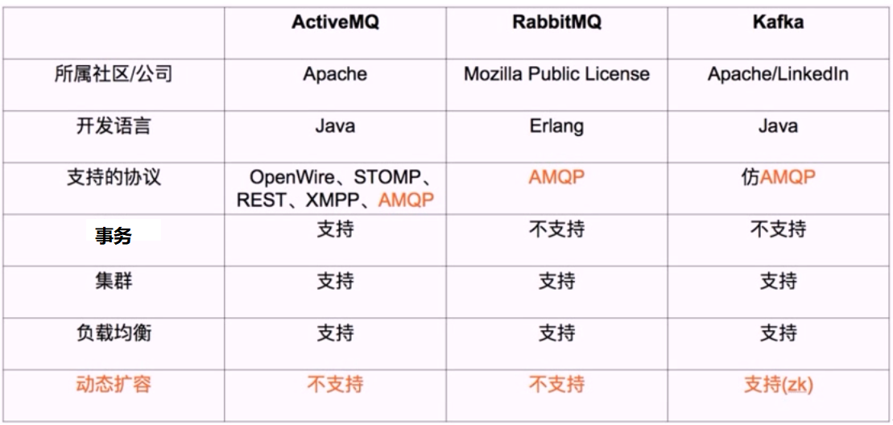

## 3.4 Kafka 特点和优势

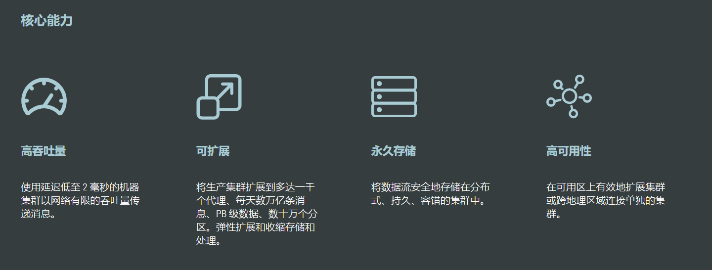

**特点**

- 分布式: 多机实现,不允许单机
- 分区: 一个消息.可以拆分出多个，分别存储在多个位置
- 多副本: 防止信息丢失，可以多来几个备份
- 多订阅者: 可以有很多应用连接kafka
- Zookeeper: 早期版本的Kafka依赖于zookeeper， 2021年4月19日Kafka 2.8.0正式发布，此版本包括了很多重要改动，最主要的是kafka通过自我管理的仲裁来替代ZooKeeper，即Kafka将不再需要ZooKeeper！

**优势**

- Kafka 通过 O(1)的磁盘数据结构提供消息的持久化，这种结构对于即使数以 TB 级别以上的消息存储也能够保持长时间的稳定性能。
- 高吞吐量：即使是非常普通的硬件Kafka也可以支持每秒数百万的消息。支持通过Kafka 服务器分区消息。
- 分布式： Kafka 基于分布式集群实现高可用的容错机制，可以实现自动的故障转移
- 顺序保证：在大多数使用场景下，数据处理的顺序都很重要。大部分消息队列本来就是排序的，并且能保证数据会按照特定的顺序来处理。 Kafka保证一个Partiton内的消息的有序性（分区间数据是无序的，如果对数据的顺序有要求，应将在创建主题时将分区数partitions设置为1）
- 支持 Hadoop 并行数据加载
- 通常用于大数据场合,传递单条消息比较大，而Rabbitmq 消息主要是传输业务的指令数据,单条数据较小

**随机和顺序IO比较**


```
O(1)就是最低的时空复杂度，也就是耗时/耗空间与输入数据大小无关，无论输入数据增大多少倍，耗时/耗空间都不变，哈希算法就是典型的O(1)时间复杂度，无论数据规模多大，都可以在一次计算后找到目标
```

## 3.5 Kafka 角色和流程

### 3.5.1 Kafka 角色

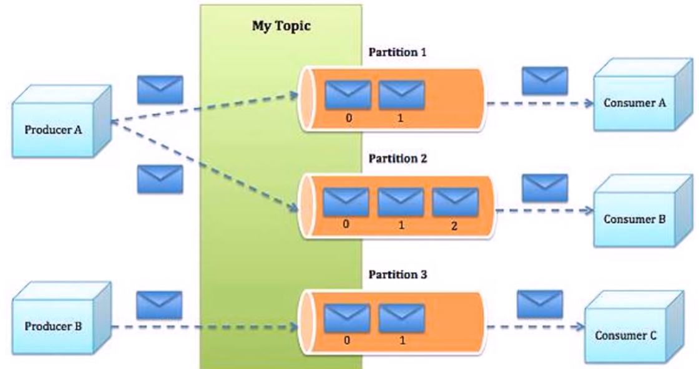

**Producer：**Producer即生产者，消息的产生者，是消息的入口。负责发布消息到Kafka broker。
Consumer：消费者，用于消费消息，即处理消息
**Broker：**Broker是kafka实例，每个服务器上可以有一个或多个kafka的实例，假设每个broker对应一台服务器。每个kafka集群内的broker都有一个不重复的编号，如: broker-0、broker-1等……
**Topic ：**消息的主题，可以理解为消息的分类，一个Topic相当于数据库中的一张表,一条消息相当于关系数据库的一条记录，一个Topic或者相当于Redis中列表类型的一个Key，一条消息即为列表中的一个元素。kafka的数据就保存在topic。在每个broker上都可以创建多个topic。物理上不同 topic 的消息分开存储在不同的文件夹，逻辑上一个 topic的消息虽然保存于一个或多个broker 上, 但用户只需指定消息的topic即可生产或消费数据而不必关心数据存于何处，topic 在逻辑上对record(记录、日志)进行分组保存，消费者需要订阅相应的topic 才能消费topic中的消息。
**Consumer group:** 每个consumer 属于一个特定的consumer group（可为每个consumer 指定 group name，若不指定 group name 则属于默认的group），同一topic的一条消息只能被同一个consumer group 内的一个consumer 消费，类似于一对一的单播机制，但多个consumer group 可同时消费这一消息，类似于一对多的多播机制


**Partition ：**是物理上的概念，每个topic 分割为一个或多个partition，即一个topic切分为多份.创建 topic时可指定 partition 数量，
partition的表现形式就是一个一个的文件夹,该文件夹下存储该partition的数据和索引文件，分区的作用还可以实现负载均衡，提高kafka的吞吐量。同一个topic在不同的分区的数据是不重复的,一般Partition数不要超过节点数，注意同一个partition数据是有顺序的，但不同的partition则是无序的。

**Replication:** 同样数据的副本，包括leader和follower的副本数,基本于数据安全,建议至少2个,是Kafka的高可靠性的保障，和ES的副本有所不同，**Kafka中的副本数包括主分片数,而ES中的副本数不包括主分片数**

为了实现数据的高可用，比如将分区 0 的数据分散到不同的kafka 节点，每一个分区都有一个 broker 作为 Leader 和一个 broker 作为
Follower，类似于ES中的主分片和副本分片，

假设分区为 3, 即分三个分区0-2，副本为3，即每个分区都有一个 leader，再加两个follower，分区 0 的leader为服务器A，则服务器 B 和服务器 C 为 A 的follower，而分区 1 的leader为服务器B，则服务器 A 和C 为服务器B 的follower，而分区 2 的leader 为C，则服务器A 和 B 为C 的follower。

**AR： Assigned Replicas**，分区中的所有副本的统称，包括leader和 follower，AR= lSR+ OSR
**lSR：ln Sync Replicas**，所有与leader副本保持同步的副本 follower和leader本身组成的集合，包括leader和 follower，是AR的子集
**OSR：out-of-Sync Replied**，所有与leader副本同步不能同步的 follower的集合，是AR的子集

**分区和副本的优势：**

- 实现存储空间的横向扩容，即将多个kafka服务器的空间组合利用
- 提升性能，多服务器并行读写
- 实现高可用，每个分区都有一个主分区即 leader 分布在不同的kafka 服务器，并且有对应follower 分布在和leader不同的服务器上

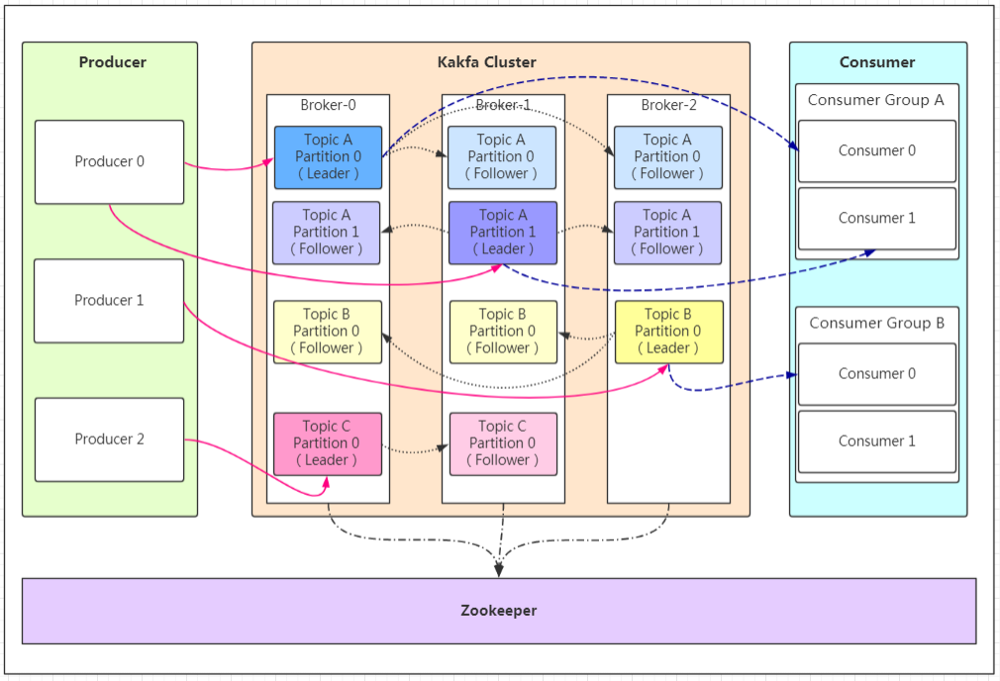

### 3.5.2 Kafka 写入消息的流程

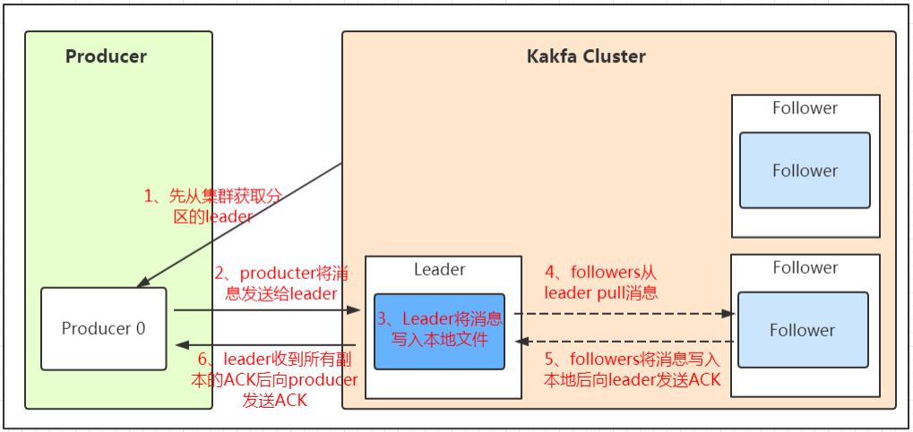

## 3.6 Kafka 部署

### 3.6.1 Kafka 部署说明

kafka 版本选择
kafka 基于scala语言实现,所以使用kafka需要指定scala的相应的版本.kafka 为多个版本的Scala构建。这仅在使用 Scala 时才重要，并且希望为使用的相同 Scala 版本构建一个版本。否则，任何版本都可以

**kafka下载链接**

```basic
https://kafka.apache.org/downloads
```

**kafka版本格式**

```sh
kafka_<scala 版本>_<kafka 版本>
#示例:kafka_2.13-2.7.0.tgz
```

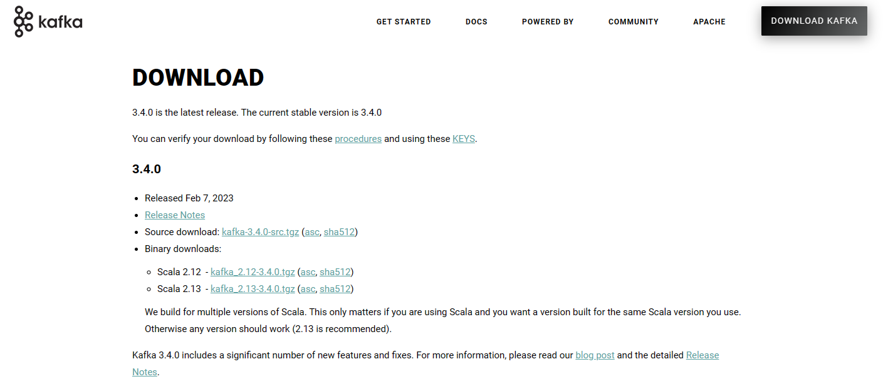

scala 语言官网: https://www.scala-lang.org/
scale 与 java关系:https://baike.baidu.com/item/Scala/2462287?fr=aladdin
Kafka 支持单机和集群部署，生产通常为集群模式
官方文档:

```
http://kafka.apache.org/quickstart
```

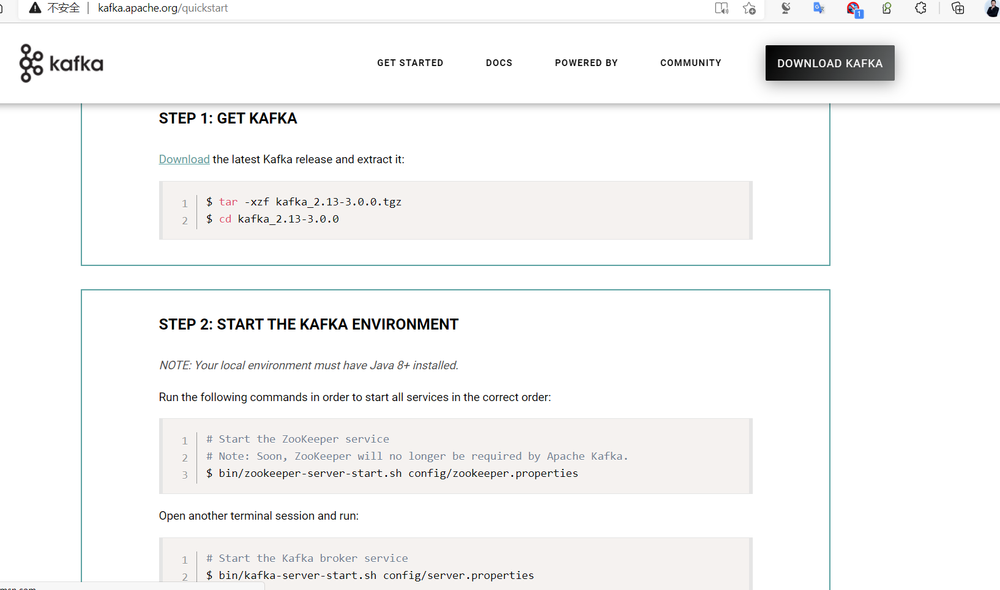

### 3.6.2 单机部署

```sh
#下载二进制包
[root@Rocky8 ~]# wget https://downloads.apache.org/kafka/3.8.0/kafka_2.12-3.8.0.tgz

$ apt update && apt -y install openjdk-8-jdk 
$ tar -xzf kafka_2.13-3.4.0.tgz
$ cd kafka_2.13-3.4.0


#启动zookeeper、kafka
# Start the ZooKeeper service
$ bin/zookeeper-server-start.sh config/zo	okeeper.properties

# Start the Kafka broker service
$ bin/kafka-server-start.sh config/server.properties
```

### 3.6.3 集群部署

#### 3.6.3.1 环境准备 ZooKeeper

当前版本 Kafka 依赖 Zookeeper 服务,但以后将不再依赖

```sh
http://kafka.apache.org/quickstart
# Note: Soon, ZooKeeper will no longer be required by Apache Kafka.
```

**环境说明**

```sh
#在三个Ubuntu18.04节点提前部署zookeeper和kafka三个节点复用
node1:11.0.1.10
node2:11.0.1.11 
node3:11.0.1.12

#注意:生产中zookeeper和kafka一般是分开独立部署的,kafka安装前需要安装java环境
```

**确保三个节点的zookeeper启动**


#### 3.6.3.2 各节点部署 Kafka

##### 3.6.3.2.1 Kafka 节点配置

**配置文件说明**

```sh
#配置文件 ./conf/server.properties内容说明
############################# Server Basics###############################
# broker的id，值为整数，且必须唯一，在一个集群中不能重复
broker.id=1
############################# Socket ServerSettings ######################
# kafka监听端口，默认9092
listeners=PLAINTEXT://10.0.0.101:9092
# 处理网络请求的线程数量，默认为3个
num.network.threads=3
# 执行磁盘IO操作的线程数量，默认为8个
num.io.threads=8
# socket服务发送数据的缓冲区大小，默认100KB
socket.send.buffer.bytes=102400
# socket服务接受数据的缓冲区大小，默认100KB
socket.receive.buffer.bytes=102400
# socket服务所能接受的一个请求的最大大小，默认为100M
socket.request.max.bytes=104857600
############################# Log Basics###################################
# kafka存储消息数据的目录
log.dirs=../data
# 每个topic默认的partition
num.partitions=1
# 设置副本数量为3,当Leader的Replication故障，会进行故障自动转移。
default.replication.factor=3
# 在启动时恢复数据和关闭时刷新数据时每个数据目录的线程数量
num.recovery.threads.per.data.dir=1
############################# Log FlushPolicy #############################
# 消息刷新到磁盘中的消息条数阈值
log.flush.interval.messages=10000
# 消息刷新到磁盘中的最大时间间隔,1s
log.flush.interval.ms=1000
############################# Log RetentionPolicy #########################
# 日志保留小时数，超时会自动删除，默认为7天
log.retention.hours=168
# 日志保留大小，超出大小会自动删除，默认为1G
#log.retention.bytes=1073741824
# 日志分片策略，单个日志文件的大小最大为1G，超出后则创建一个新的日志文件
log.segment.bytes=1073741824
# 每隔多长时间检测数据是否达到删除条件,300s
log.retention.check.interval.ms=300000
############################# Zookeeper ####################################
# Zookeeper连接信息，如果是zookeeper集群，则以逗号隔开
zookeeper.connect=10.0.0.101:2181,10.0.0.102:2181,10.0.0.103:2181
# 连接zookeeper的超时时间,6s
zookeeper.connection.timeout.ms=6000
# 是否允许删除topic，默认为false，topic只会标记为marked for deletion
delete.topic.enable=true
```

**范例：**

```shell
#在所有节点上执行安装java
[root@node1 ~]#apt install openjdk-8-jdk -y

#在所有节点上执行下载，官方下载
[root@node1 ~]#wget https://downloads.apache.org/kafka/3.3.1/kafka_2.13-3.3.1.tgz
[root@node1 ~]#wget https://archive.apache.org/dist/kafka/2.7.0/kafka_2.13-2.7.0.tgz

#国内镜像下载
[root@node1 ~]#wget https://mirrors.tuna.tsinghua.edu.cn/apache/kafka/3.3.1/kafka_2.13-3.3.1.tgz
[root@node1 ~]#wget https://mirrors.tuna.tsinghua.edu.cn/apache/kafka/3.0.0/kafka_2.13-3.0.0.tgz
[root@node1 ~]#wget https://mirror.bit.edu.cn/apache/kafka/2.7.0/kafka_2.13-2.7.0.tgz

#解压缩
[root@node1 ~]#tar xf kafka_2.13-2.7.0.tgz -C /usr/local/
[root@node1 ~]#ln -s /usr/local/kafka_2.13-2.7.0/ /usr/local/kafka

#配置PATH变量
[root@node1 ~]#echo 'PATH=/usr/local/kafka/bin:$PATH' > /etc/profile.d/kafka.sh
[root@node1 ~]#. /etc/profile.d/kafka.sh

#修改配置文件
[root@node1 ~]#vim /usr/local/kafka/config/server.properties
broker.id=1 #每个broker在集群中每个节点的正整数唯一标识，此值保存在log.dirs下的meta.properties文件
listeners=PLAINTEXT://10.0.0.101:9092 #指定当前主机的IP做为监听地址,注意:不支持0.0.0.0
log.dirs=/usr/local/kafka/data #kakfa用于保存数据的目录，所有的消息都会存储在该目录当中
num.partitions=1 #设置创建新的topic时默认分区数量,建议和kafka的节点数量一致
default.replication.factor=3 #指定默认的副本数为3，可以实现故障的自动转移
log.retention.hours=168 #设置kafka中消息保留时间，默认为168小时即7天
zookeeper.connect=10.0.0.101:2181,10.0.0.102:2181,10.0.0.103:2181 #指定连接的zk的地址,zk中存储了broker的元数据信息
zookeeper.connection.timeout.ms=6000 #设置连接zookeeper的超时时间，单位为ms,默认6秒钟

#准备数据目录
[root@node1 ~]#mkdir /usr/local/kafka/data
[root@node1 ~]#scp /usr/local/kafka/config/server.properties 10.0.0.102:/usr/local/kafka/config
[root@node1 ~]#scp /usr/local/kafka/config/server.properties 10.0.0.103:/usr/local/kafka/config

#修改第2个节点配置
[root@node2 ~]#vim /usr/local/kafka/config/server.properties
broker.id=2 #每个broker 在集群中的唯一标识，正整数。
listeners=PLAINTEXT://10.0.0.102:9092 #指定当前主机的IP做为监听地址,注意:不支持0.0.0.0

#修改第3个节点配置
[root@node3 ~]#vim /usr/local/kafka/config/server.properties
broker.id=3  #每个broker 在集群中的唯一标识，正整数。
listeners=PLAINTEXT://10.0.0.103:9092 #指定当前主机的IP做为监听地址,注意:不支持0.0.0.0

#可以调整内存
[root@node1 ~]#vim /usr/local/kafka/bin/kafka-server-start.sh

......

if[ " x$KAFKA_HEAP_OPTS"="x"] ; then
    export KAFKA_HEAP_OPTS=" -Xmx1G -Xms1G"  
fi

......

```

##### 3.6.3.2.2 启动服务

在所有kafka节点执行下面操作

```sh
[root@node1 ~]#kafka-server-start.sh -daemon /usr/local/kafka/config/server.properties
```

##### 3.6.3.2.3 确保服务启动状态

```sh
root@node01:~# ss -ntl|grep 9092
LISTEN 0      50     [::ffff:11.0.1.10]:9092             *:*          
root@node01:~# tail -f /usr/local/kafka/logs/
controller.log                controller.log.2024-09-10-01  kafka-request.log             log-cleaner.log               state-change.log              
controller.log.2024-09-09-08  kafka-authorizer.log          kafkaServer-gc.log            server.log                    
root@node01:~# tail -f /usr/local/kafka/logs/server.log 
[2024-09-09 08:40:22,405] INFO Opening socket connection to server /11.0.1.11:2181. (org.apache.zookeeper.ClientCnxn)
[2024-09-09 08:40:22,406] INFO Socket connection established, initiating session, client: /11.0.1.10:39174, server: /11.0.1.11:2181 (org.apache.zookeeper.ClientCnxn)
[2024-09-09 08:40:22,409] WARN Session 0x20001cb21d50000 for server /11.0.1.11:2181, Closing socket connection. Attempting reconnect except it is a SessionExpiredException. (org.apache.zookeeper.ClientCnxn)
EndOfStreamException: Unable to read additional data from server sessionid 0x20001cb21d50000, likely server has closed socket
	at org.apache.zookeeper.ClientCnxnSocketNIO.doIO(ClientCnxnSocketNIO.java:77)
	at org.apache.zookeeper.ClientCnxnSocketNIO.doTransport(ClientCnxnSocketNIO.java:350)
	at org.apache.zookeeper.ClientCnxn$SendThread.run(ClientCnxn.java:1289)
[2024-09-09 08:40:23,897] INFO Opening socket connection to server /11.0.1.12:2181. (org.apache.zookeeper.ClientCnxn)
[2024-09-09 08:40:23,899] INFO Socket connection established, initiating session, client: /11.0.1.10:34518, server: /11.0.1.12:2181 (org.apache.zookeeper.ClientCnxn)
[2024-09-09 08:40:23,902] INFO Session establishment complete on server /11.0.1.12:2181, session id = 0x20001cb21d50000, negotiated timeout = 18000 (org.apache.zookeeper.ClientCnxn)

#如果使用id,还需要修改/usr/local/kafka/data/meta.properties
#打开zooinspector可以看到三个id
```

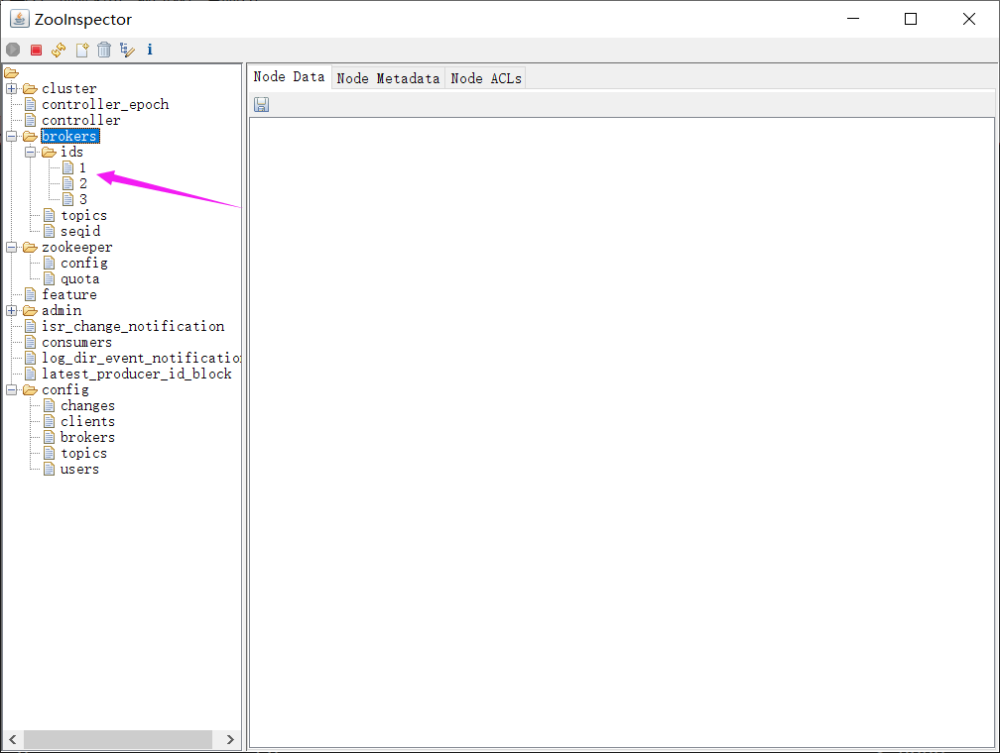

```sh
#Broker 依赖于 Zookeeper，每个Broker 的id 和 Topic、Partition这些元数据信息都会写入Zookeeper 的 ZNode 节点中

#consumer 依赖于Zookeeper，Consumer 在消费消息时，每消费完一条消息，会将产生的offset 保存到 Zookeeper 中，下次消费在当前offset往后继续消费.kafka0.9 之前Consumer 的offset 存储在 Zookeeper 中，kafka0.9 以后offset存储在本地。

#Partition 依赖于 Zookeeper，Partition 完成Replication 备份后，选举出一个Leader，这个是依托于 Zookeeper 的选举机制实现的
```

##### 3.6.3.2.4 准备Kafka的service文件

```sh
[root@node1 ~]#cat /lib/systemd/system/kafka.service
[unit]
Description=Apache kafka
After=network.target

[service]
Type=simple
#Environment=JAVA_HOME=/data/server/java
PIDFile=/usr/local/kafka/kafka.pid
Execstart=/usr/local/kafka/bin/kafka-server-start.sh /usr/local/kafka/config/server. properties
Execstop=/bin/kill  -TERM ${MAINPID}
Restart=always
RestartSec=20

[Install]
wantedBy=multi-user.target

[root@node1 ~]#systemctl daemon-load
[root@node1 ~]#systemctl restart kafka.service
```

## 3.7 Kafka 读写数据

参考文档

```
http://kafka.apache.org/quickstart
```

常见命令

```sh
kafka-topics.sh #消息的管理命令
kafka-console-producer.sh   #生产者的模拟命令
kafka-console-consumer.sh   #消费者的模拟命令
```

### 3.7.1 创建 Topic

**创建topic名为 ding，partitions(分区)为3，replication(每个分区的副本数/每个分区的分区因子)为 2**

```sh
#新版命令
root@node01:~# /usr/local/kafka/bin/kafka-topics.sh --create  --topic dinginx --bootstrap-server 11.0.1.10:9092 --partitions 3 --replication-factor 2
Created topic dinginx.

#在各节点上观察生成的相关数据
[root@node1 ~]#ls /usr/local/kafka/data/
[root@node2 ~]#ls /usr/local/kafka/data/
[root@node3 ~]#ls /usr/local/kafka/data/


#旧版命令新版默认不支持了
root@node01:~# /usr/local/kafka/bin/kafka-topics.sh --create --zookeeper 11.0.1.10:2108,11.0.1.11:2108,11.0.1.12:2108  --partitions 3 --replication-factor 2 --topic wang
zookeeper is not a recognized option
joptsimple.UnrecognizedOptionException: zookeeper is not a recognized option
	at joptsimple.OptionException.unrecognizedOption(OptionException.java:108)
	at joptsimple.OptionParser.handleLongOptionToken(OptionParser.java:510)
	at joptsimple.OptionParserState$2.handleArgument(OptionParserState.java:56)
	at joptsimple.OptionParser.parse(OptionParser.java:396)
	at org.apache.kafka.tools.TopicCommand$TopicCommandOptions.<init>(TopicCommand.java:828)
	at org.apache.kafka.tools.TopicCommand.execute(TopicCommand.java:98)
	at org.apache.kafka.tools.TopicCommand.mainNoExit(TopicCommand.java:88)
	at org.apache.kafka.tools.TopicCommand.main(TopicCommand.java:83)
```


### 3.7.2 获取所有 Topic

```sh
#新版命令
root@node01:~# /usr/local/kafka/bin/kafka-topics.sh --describe --bootstrap-server 11.0.1.10:9092 --topic dinginx
[2024-09-10 02:23:17,252] WARN [AdminClient clientId=adminclient-1] The DescribeTopicPartitions API is not supported, using Metadata API to describe topics. (org.apache.kafka.clients.admin.KafkaAdminClient)
Topic: dinginx	TopicId: qsT8bTufQxG49BEPCGgK5A	PartitionCount: 3	ReplicationFactor: 2	Configs: 
	Topic: dinginx	Partition: 0	Leader: 1	Replicas: 1,2	Isr: 1,2	Elr: N/A	LastKnownElr: N/A
	Topic: dinginx	Partition: 1	Leader: 2	Replicas: 2,3	Isr: 2,3	Elr: N/A	LastKnownElr: N/A
	Topic: dinginx	Partition: 2	Leader: 3	Replicas: 3,1	Isr: 3,1	Elr: N/A	LastKnownElr: N/A


```

### 3.7.3 验证 Topic 详情

状态说明：wang 有三个分区分别为0、1、2，分区0的leader是3 （broker.id），分区 0 有2 个副本，并且状态都为 lsr（ln-sync，表示可以参加选举成为 leader）。

```
root@node01:~# /usr/local/kafka/bin/kafka-topics.sh --describe --bootstrap-server 11.0.1.10:9092 --topic dinginx
[2024-09-11 08:22:10,867] WARN [AdminClient clientId=adminclient-1] The DescribeTopicPartitions API is not supported, using Metadata API to describe topics. (org.apache.kafka.clients.admin.KafkaAdminClient)
Topic: dinginx	TopicId: qsT8bTufQxG49BEPCGgK5A	PartitionCount: 3	ReplicationFactor: 2	Configs: 
	Topic: dinginx	Partition: 0	Leader: 1	Replicas: 1,2	Isr: 1,2	Elr: N/A	LastKnownElr: N/A
	Topic: dinginx	Partition: 1	Leader: 2	Replicas: 2,3	Isr: 2,3	Elr: N/A	LastKnownElr: N/A
	Topic: dinginx	Partition: 2	Leader: 3	Replicas: 3,1	Isr: 3,1	Elr: N/A	LastKnownElr: N/A

```

### 3.7.4 生产 Topic

kafka-console-producer.sh 格式

```sh
#发送消息命令格式:
kafka-console-producer.sh --broker-list <kafkaIP1>:<端口>,<kafkaIP2>:<端口> --topic <topic名称>
```

范例：

```sh
#交互式输入消息,按Ctrl+C退出
root@node01:~# /usr/local/kafka/bin/kafka-console-producer.sh --topic test --broker-list 11.0.1.10:9092
>hello
>hello1
>hello2
>hello3
>hello4
>

#或者下面方式
[root@node1 ~]#root@node02:~# /usr/local/kafka/bin/kafka-console-producer.sh --topic dinginx --bootstrap-server 11.0.1.10:9092
```

### 3.7.5 消费 Topic

kafka-console-consumer.sh 格式

```
#接收消息命令格式:
kafka-console-consumer.sh --bootstrap-server <host>:<post> --topic <topic名称> --from-beginning --consumer-property group.id=<组名称>
```

**注意：**

- 消息者先生产消息，消费都后续才启动，也能收到之前生产的消息
- 同一个消息在同一个group内的消费者只有被一个消费者消费，比如：共100条消息，在一个group内有A，B两个消费者，其中A消费50条，B消费另外的50条消息。从而实现负载均衡，不同group内的消费者则可以同时消费同一个消息
- --from-beginning 表示消费前发布的消息也能收到，默认只能收到消费后发布的新消息

案例：

```sh
#交互式持续接收消息,按Ctrl+C退出
root@node02:~# /usr/local/kafka/bin/kafka-console-consumer.sh --topic test --bootstrap-server 11.0.1.10:9092 --from-beginning --consumer-property group.id=group1
hello
hello1
hello2
hello3
hello4

#一个消息同时只能被同一个组内一个消费者消费（单播机制），实现负载均衡，而不能组可以同时消费同一个消息（多播机制）
#********************消费案例测试**************************#
#生产数据
root@node01:~# /usr/local/kafka/bin/kafka-console-producer.sh --topic test --broker-list 11.0.1.10:9092
>hello
>hello1
>hello2
>hello3
>hello4
>hello5
>hello6
>hello7
>hello8
>

root@node02:~# /usr/local/kafka/bin/kafka-console-consumer.sh --topic test --bootstrap-server 11.0.1.10:9092 --from-beginning --consumer-property group.id=group1
hello
hello1
hello2
hello3
hello4
hello5
hello6
hello7
hello8

#创建同组消费，观察到不能同时消费同一条消息
root@node02:~# /usr/local/kafka/bin/kafka-console-consumer.sh --topic test --bootstrap-server 11.0.1.10:9092 --from-beginning --consumer-property group.id=group2
hello
hello1
hello2
hello3
hello4
hello5

##另一终端打开
root@node02:~# /usr/local/kafka/bin/kafka-console-consumer.sh --topic test --bootstrap-server 11.0.1.10:9092 --from-beginning --consumer-property group.id=group2
hello6
hello7
hello8

#********************消费案例测试**************************#
```

### 3.7.6 删除 Topic

范例：

```sh
#注意：需要修改配置文件server.properties中的delete.topic.enable=true并重启
#新版本
root@node02:~# /usr/local/kafka/bin/kafka-topics.sh --list --bootstrap-server 11.0.1.10:9092
__consumer_offsets
dinginx
test

root@node02:~# /usr/local/kafka/bin/kafka-topics.sh --delete --bootstrap-server 11.0.1.10:9092 --topic test
root@node02:~# /usr/local/kafka/bin/kafka-topics.sh --list --bootstrap-server 11.0.1.10:9092
__consumer_offsets
dinginx
```

**范例：删除zk下面 topic test**

```sh
#无需修改配置文件server.properties，此方法很危险
root@node01:~# zkCli.sh -server 11.0.1.10:2181
[zk: 11.0.1.10:2181(CONNECTING) 0] ls /
[admin, brokers, cluster, config, consumers, controller, controller_epoch, feature, isr_change_notification, latest_producer_id_block, log_dir_event_notification, zookeeper]
[zk: 11.0.1.10:2181(CONNECTED) 1] ls /brokers 
[ids, seqid, topics]
[zk: 11.0.1.10:2181(CONNECTED) 2] ls /brokers/topics 
[__consumer_offsets, dinginx]
```

## 3.8 Kafka 在 ZooKeeper 里面的存储结构

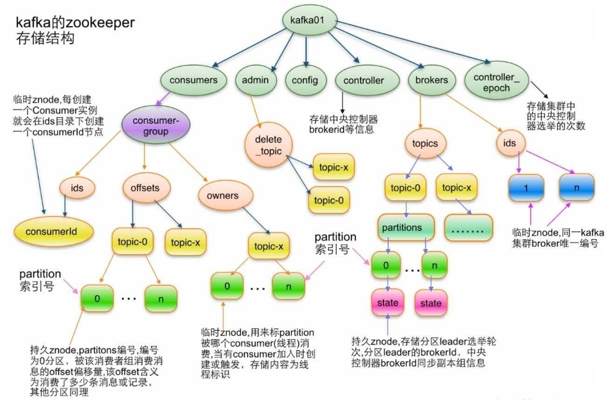

**topic 结构**

```
/brokers/topics/[topic]
```

**partition结构**

```
/brokers/topics/[topic]/partitions/[partitionId]/state
```

**broker信息**

```
/brokers/ids/[o...N]
```

**控制器**

```sh
/controller
存储center controller中央控制器所在kafka broker的信息
```

**消费者**

```sh
消费者信息:
/consumers/[groupId]/ids /[consumerIdstring]
每个consumer都有一个唯一的ID,此id用来标记消费者信息
消费者管理者:
/consumers/[groupId]/owners/[topic]/[partitionid]
```

## 3.9 图形工具 Offset Explorer (Kafka Tool)


## 3.10 基于Web的Kafka集群监控系统 kafka-eagle

### 3.10.1 介绍

Kafka eagle（kafka鹰） 是一款由国内公司开源的Kafka集群监控系统，可以用来监视kafka集群的broker状态、Topic信息、IO、内存、consumer线程、偏移量等信息，并进行可视化图表展示。独特的KQL还可以通过SQL在线查询kafka中的数据。

**官方地址**

```
http://www.kafka-eagle.org/
https://github.com/smartloli/kafka-eagle-bin
https://www.cnblogs.com/smartloli/
```

### 3.10.2 安装

安装说明

```
https://docs.kafka-eagle.org/2.installation
https://www.cnblogs.com/smartloli/p/16728995.html
```

#### 3.10.2.1 安装 JAVA

**注意: 不支持JDK-11**

```
apt update && apt -y install openjdk-8-jdk
```

#### 3.10.2.2 下载安装

```
wget https://github.com/smartloli/kafka-eagle-bin/archive/refs/tags/v3.0.2.tar.gz
```

#### 3.10.2.3 解压安装包

```
tar zxf kafka-eagle-bin-3.0.2.tar.gz 
cd kafka-eagle-bin-3.0.2/ 
tar -zxvf kafka-eagle-web-3.0.2-bin.tar.gz -C /usr/local/
ln -s /usr/local/kafka-eagle-web-3.0.2 /usr/local/kafka-eagle-web
```

#### 3.10.2.4 设置全局变量

**设置相关全局变量KE_HOME**

```sh
[root@Rocky8 ~]# vim /etc/profile.d/efak.sh 

export JAVA_HOME=/usr/lib/jvm/java		#需设置JAVA_HOME变量
export KE_HOME=/root/kafka-eagle-bin-3.0.1/efak                                                             export PATH=$PATH:$KE_HOME/bin                                                               
```

#### 3.10.2.5 修改配置文件

```sh
[root@Rocky8 ~]# cat /usr/local/kafka-eagle-bin-3.0.1/efak/conf/system-config.properties 
######################################
# multi zookeeper & kafka cluster list	#填写 zookeeper集群列表
##kafkazookeeper节点配置属性多个可以添加一个cluster1,如果有多套kafka集群加多个名称
# Settings prefixed with 'kafka.eagle.' will be deprecated, use 'efak.' instead
#############zookeeper地址##########################
efak.zk.cluster.alias=cluster1,cluster2
cluster1.zk.list=11.0.1.10:2181,11.0.1.11:2181,11.0.1.12:2181
#cluster2.zk.list=xdn10:2181,xdn11:2181,xdn12:2181

############### broker 最大规模数量########################
# broker size online list	
######################################
cluster1.efak.broker.size=20

################ zk 客户端线程数#######################
# zk client thread limit
######################################
kafka.zk.limit.size=16

############ EFAK webui 端口###########################
# EFAK webui port
######################################
efak.webui.port=8048

######################################
# kafka offset storage
######################################
cluster1.efak.offset.storage=kafka
#cluster2.efak.offset.storage=zk

######################################
# kafka jmx uri
######################################
cluster1.efak.jmx.uri=service:jmx:rmi:///jndi/rmi://%s/jmxrmi

################# kafka metrics 指标，默认存储15天######################
# kafka metrics, 15 days by default
######################################
efak.metrics.charts=true
efak.metrics.retain=15

######################################
# kafka sql topic records max
######################################
efak.sql.topic.records.max=5000
efak.sql.topic.preview.records.max=10

######################################
# delete kafka topic token
######################################
efak.topic.token=keadmin
####################################### kafka sqlite 数据库地址（需要修改存储路径）
# kafka sqlite jdbc driver address
######################################修改此处,取消下面四行注释
efak.driver=org.sqlite.JDBC
efak.url=jdbc:sqlite:/usr/local/kafka-eagle-bin-3.0.1/efak/db/ke.db
efak.username=root
efak.password=www.kafka-eagle.org

######################################
# kafka mysql jdbc driver address	
######################################需创建ke库
#efak.driver=com.mysql.cj.jdbc.Driver
#efak.url=jdbc:mysql://127.0.0.1:3306/ke?useUnicode=true&characterEncoding=UTF-8&zeroDateTimeBehavior=convertToNull
#efak.username=root
#efak.password=123456

#########################范例:system-config.properties###########################
efak.zk.cluster.alias=cluster1,cluster2
cluster1.zk.list=11.0.1.10:2181,11.0.1.11:2181,11.0.1.12:2181
#cluster2.zk.list=xdn10:2181,xdn11:2181,xdn12:2181
cluster1.efak.broker.size=20
kafka.zk.limit.size=16
efak.webui.port=8048
cluster1.efak.offset.storage=kafka
#cluster2.efak.offset.storage=zk
cluster1.efak.jmx.uri=service:jmx:rmi:///jndi/rmi://%s/jmxrmi
efak.metrics.charts=true
efak.metrics.retain=15
efak.sql.topic.records.max=5000
efak.sql.topic.preview.records.max=10
efak.topic.token=keadmin
efak.driver=org.sqlite.JDBC
efak.url=jdbc:sqlite:/usr/local/kafka-eagle-bin-3.0.1/efak/db/ke.db
efak.username=root
efak.password=www.kafka-eagle.org
#########################范例:system-config.properties###########################
```

#### 3.10.2.6 启动

```
/usr/local/kafka-eagle-web/bin/ke.sh start
```

#### 3.10.2.7 登录

```yaml
http://localhost:8048
默认账号: admin 
默认密码: 123456
```

**默认 kafka 没有开启JMX，无法监控到Kafka的相关数据**

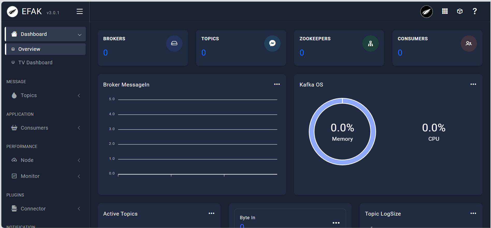

#### 3.10.2.8 修改和监控 Kafka

```sh
root@node01:~# vim /usr/local/kafka/bin/kafka-server-start.sh

......
if[ " x$KAFKA_HEAP_OPTS"="x"] ; then
    export KAFKA_HEAP_OPTS=" -Xmx1G-Xms1G"  
    export JMX_PORT="9999" 	 #添加此行
fi
......

root@node01:~# systemctl restart kafka
```

#### 3.10.2.9 通过 Kafka-eagle 监控

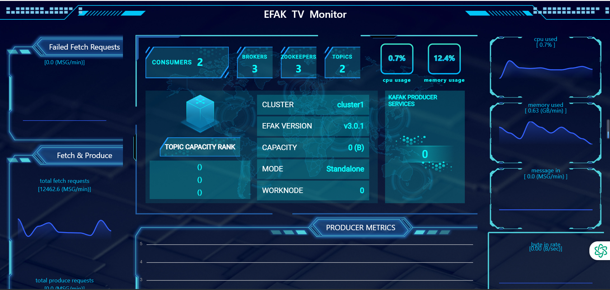

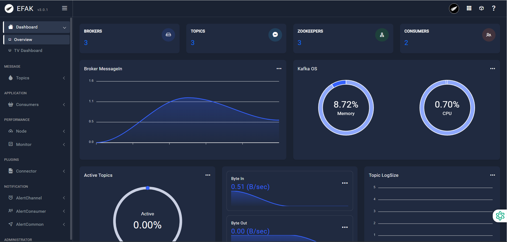

# 1 Dubbo

## 1.1 Dubbo 介绍


Apache Dubbo 是一款 **RPC 服务开发框架**，用于解决微服务架构下的**服务治理与通信问题**，官方提供了 Java、Golang 等多语言 SDK 实
现。使用 Dubbo 开发的微服务原生具备相互之间的远程地址发现与通信能力， 利用 Dubbo 提供的丰富服务治理特性，可以实现诸如服务发现、负载均衡、流量调度等服务治理诉求。Dubbo 被设计为高度可扩展，用户可以方便的实现流量拦截、选址的各种定制逻辑。


在云原生时代，Dubbo 相继衍生出了 Dubbo3、Proxyless Mesh 等架构与解决方案，在易用性、超大规模微服务实践、云原生基础设施适配、安全性等几大方向上进行了全面升级。


Apache Dubbo 提供了六大核心能力：面向接口代理的高性能RPC调用，智能容错和负载均衡，服务自动注册和发现，高度可扩展能力，运行期流量调度，可视化的服务治理与运维


按照微服务架构的定义，采用它的组织能够很好的提高业务迭代效率与系统稳定性，但前提是要先能保证微服务按照期望的方式运行，要做到这一点需要解决服务拆分与定义、数据通信、地址发现、流量管理、数据一致性、系统容错能力等一系列问题。

**Dubbo 可以帮助解决如下微服务实践问题：**

- **微服务编程范式和工具**
- **高性能的 RPC 通信**
- **微服务监控与治理**
- **部署在多种环境**
- **活跃的社区**
- **庞大的用户群体**

**Dubbo 不是什么？**

- **不是应用开发框架的替代者**
- **不仅仅只是一款** **RPC** **框架**
- **不是** **gRPC** **协议的替代品**
- **不只有** **Java 语言实现**

```sh
#阿里云微服务
https://promotion.aliyun.com/ntms/act/edasdubbo.html

#Dubbo 官网
https://dubbo.apache.org/zh/

#Dubbo 架构
https://dubbo.apache.org/zh/docs/v2.7/user/preface/architecture/

#Dubbo 运维
https://dubbo.apache.org/zh/docs/v2.7/admin/

#Dubbo 简介
https://help.aliyun.com/document_detail/99299.html
```

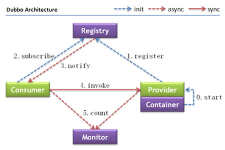

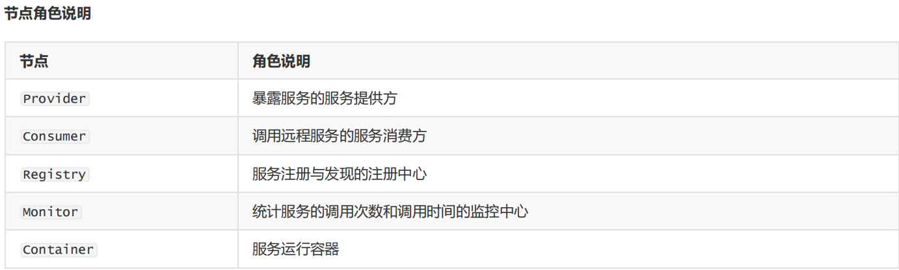

**调用关系说明**

1. 服务容器负责启动，加载，运行服务提供者。
2. 服务提供者在启动时，向注册中心注册自己提供的服务。
3. 服务消费者在启动时，向注册中心订阅自己所需的服务。
4. 注册中心返回服务提供者地址列表给消费者，如果有变更，注册中心将基于长连接推送变更数据给消费者。
5. 服务消费者，从提供者地址列表中，基于软负载均衡算法，选一台提供者进行调用，如果调用失败，再选另一台调用。
6. 服务消费者和提供者，在内存中累计调用次数和调用时间，定时每分钟发送一次统计数据到监控中心。

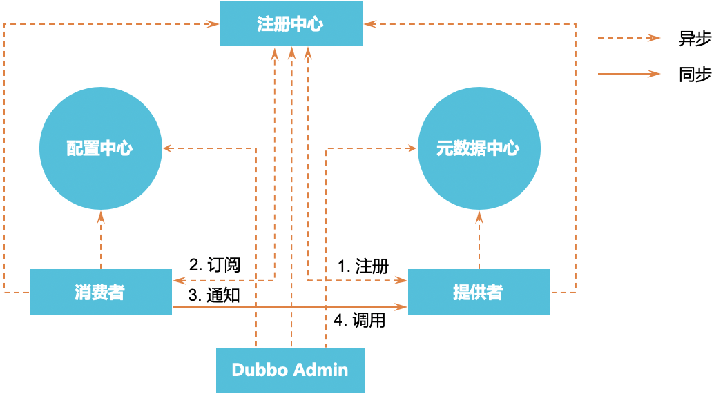

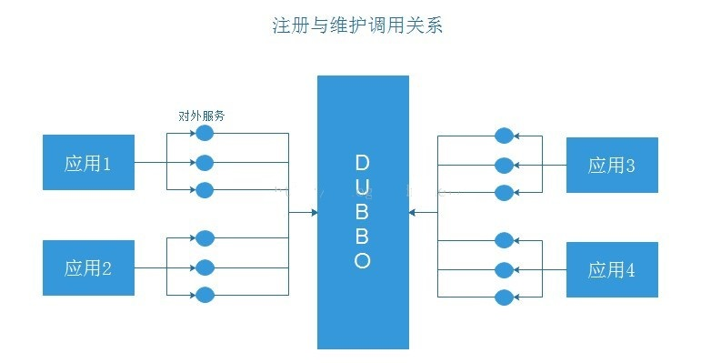

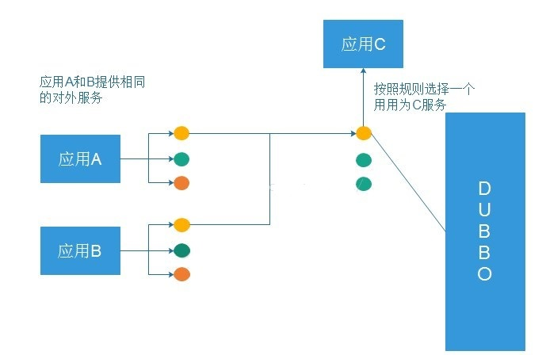

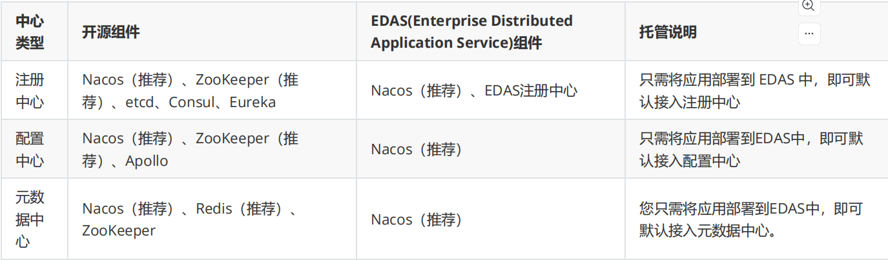

**Dubbo服务框架的工作流程如下：**

1. 提供者在启动时，在注册中心注册服务。
2. 消费者在启动时，在注册中心订阅所需的服务。
3. 注册中心返回提供者地址列表给消费者。如果提供者发生变更，注册中心将推送变更数据给消费者。
4. 消费者基于软负载均衡算法，从提供者地址列表中选一个提供者进行调用。

**Nacos 介绍**

```
Nacos 致力于帮助您发现、配置和管理微服务。Nacos 提供了一组简单易用的特性集，帮助您快速实现动态服务发现、服务配置、服务元数据及流量管理。
Nacos 帮助您更敏捷和容易地构建、交付和管理微服务平台。 Nacos 是构建以“服务”为中心的现代应用架构 (例如微服务范式、云原生范式) 的服务基础设施。

#Nacos 官网
https://nacos.io/zh-cn/
```

## 1.2 实战案例：实现 Dubbo 微服务架构

### 1.2.1 环境准备

准备三台主机，分别主机名为**zookeeper,provider,consumer**

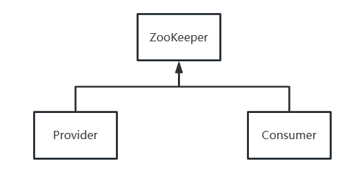

**Provider 主机名解析问题**

默认provider会利用DNS解析自已的主机名为IP，导致provider地址错误，可以想方法让DNS无法解析本机主机名或者为本机IP解决此问
题，可以如下方法解决

- 将provider主机名修改为localhost.localdomain或都任意无法解析的主机名，确保本机主机名无法解析
- 修改所有provider主机的/etc/hosts文件，添加一行 <provider服务器地址> 本机主机名，确保本机主机名正确解析为本机IP
- 修改所有consumer主机的/etc/hosts文件，添加一行 <consumer服务器地址> 本机主机名，确保本机主机名正确解析为本机IP，这项是dubbo-admin所需
- 修改网卡配置文件/etc/netplan/01-netcfg.yaml，删除此行search: [wang.org, wang.com]，确保本机主机名无法解析

**Provider和Consumer主机解析 Zookeeper 地址**

```sh
[root@nacos dubbo-demo-provider]#cat dubbo-server/src/main/java/config.properties 
dubbo.registry=zookeeper://zk1.wang.org:2181?backup=zk2.wang.org:2181,zk3.wang.org:2181
dubbo.port=20880
```

**在Provider和Consumer主机上都修改 Provider主机的 /etc/hosts 加一行**

```sh
#hosts文件都需配置
##provider:11.0.1.13、11.0.1.100（提供服务发现与负载均衡）
##consumer:11.0.1.14

root@provider:~# cat /etc/hosts
......

11.0.1.10 zk1.wang.org
11.0.1.11 zk2.wang.org
11.0.1.12 zk3.wang.org

root@consumer:~# cat /etc/hosts

......

11.0.1.10 zk1.wang.org
11.0.1.11 zk2.wang.org
11.0.1.12 zk3.wang.org
```

### 1.2.2 在 Zookeeper 主机安装 Zookeeper

### 1.2.3 在Provider 和 Consumer安装 maven 并镜像加速

**注意:此项目只支持JDK8,不支持JDK11**

```sh
[root@nacos ~]#apt update && apt -y install openjdk-8-jdk maven
root@consumer:~# mvn --version
Apache Maven 3.6.3
Maven home: /usr/share/maven
Java version: 1.8.0_321, vendor: Oracle Corporation, runtime: /usr/local/jdk1.8.0_321/jre
Default locale: en, platform encoding: UTF-8
OS name: "linux", version: "5.15.0-94-generic", arch: "amd64", family: "unix"

#镜像加速
root@consumer:~# vim /etc/maven/settings.xml

        ......
            
  <mirrors>
    <!-- mirror
     | Specifies a repository mirror site to use instead of a given repository. The repository that
     | this mirror serves has an ID that matches the mirrorOf element of this mirror. IDs are used
     | for inheritance and direct lookup purposes, and must be unique across the set of mirrors.
     |
    <mirror>
      <id>nexus-aliyun</id>
      <mirrorOf>*</mirrorOf>
      <name>Nexus aliyun</name>
      <url>http://maven.aliyun.com/nexus/content/groups/public</url>
    </mirror>
     -->
  </mirrors>

        ......

```

### 1.2.4 编译 Dubbo Provider和 Consumer

```sh
#编译Dubbo Provider
[root@provider ~]#ll -h dubbo-demo-provider.tar.gz 
-rw-r--r-- 1 root root 13M  1月 16 08:33 dubbo-demo-provider.tar.gz
[root@provider ~]#tar xf dubbo-demo-provider.tar.gz
[root@provider ~]#cd dubbo-demo-provider.tar.gz
[root@provider dubbo-demo-provider]#mvn clean package -Dmaven.test.skip=true

#编译Dubbo Consumer
[root@consumer ~]#ll -h dubbo-demo-consumer.tar.gz 
-rw-r--r-- 1 root root 19M  4月 26 08:24 dubbo-demo-consumer.tar.gz
[root@consumer ~]#tar xf dubbo-demo-consumer.tar.gz
[root@consumer ~]#cd dubbo-demo-consumer.tar.gz
[root@consumer dubbo-demo-consumer]#mvn clean package -Dmaven.test.skip=true

```

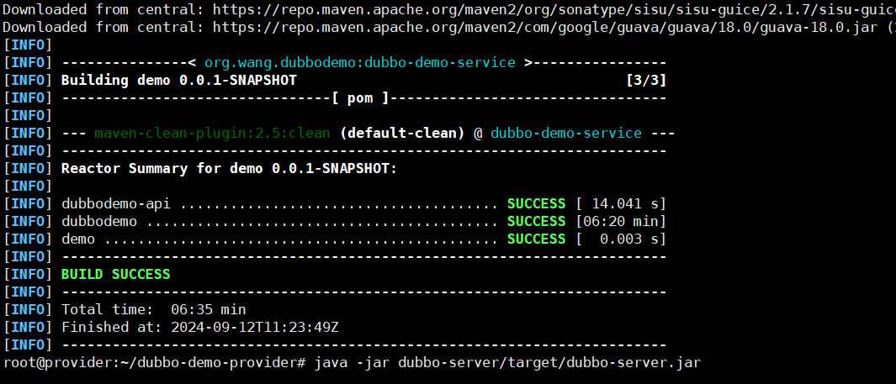


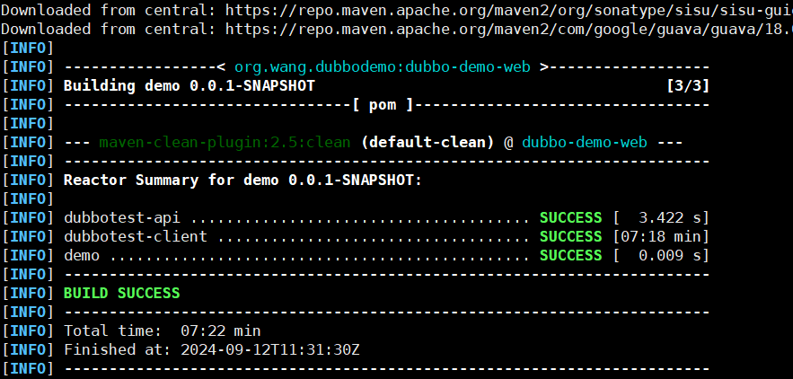

### 1.2.5 启动 Dubbo Provider和 Consumer

**注意：先启动 Provider，再启动 Consumer**
**注意：运行时Provider和Consumer时，对应dubbo-api项目是不需要，但编译时依赖dubbo-api的**

#### 1.2.5.1 先启动 Dubbo Provider

```sh
root@provider:~/dubbo-demo-provider# java -jar dubbo-server/target/dubbo-server.jar
```

#### 1.2.5.2 后启动 Dubbo Consumer

```sh
root@consumer:~/dubbo-demo-consumer# java -jar dubbo-client/target/dubbo-client.jar
```

### 1.2.6 浏览器访问 Dubbo Consumer

```sh
http://<consumer主机IP>:8080/hello?name=dinginx
http://<consumer主机IP>:8080/test?name=dinginx

#观察由多个Provider提供服务
root@consumer:~/dubbo-demo-consumer# for i in dinginx{1..100} ;do curl http://11.0.1.14:8080/hello?name=hello$i;done
```

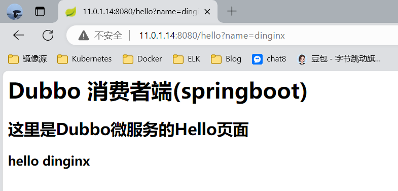

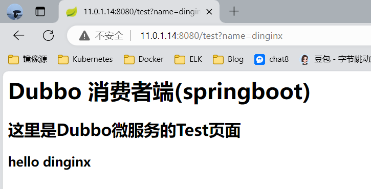

## 1.3 实战案例：编译安装 Dubbo的 Web 管理 Dubbo Admin （新版）

**官方说明**

```sh
https://github.com/apache/dubbo-admin
```

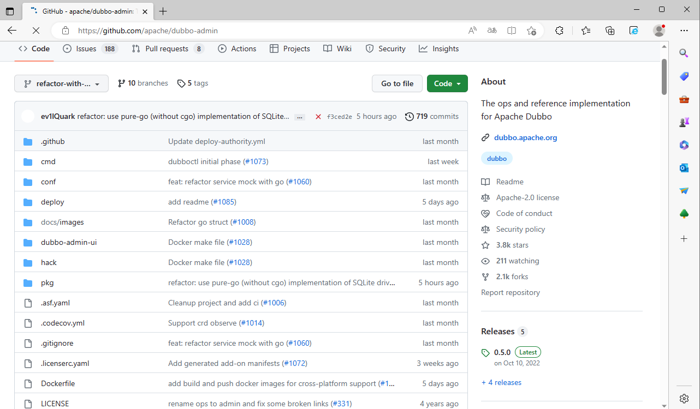

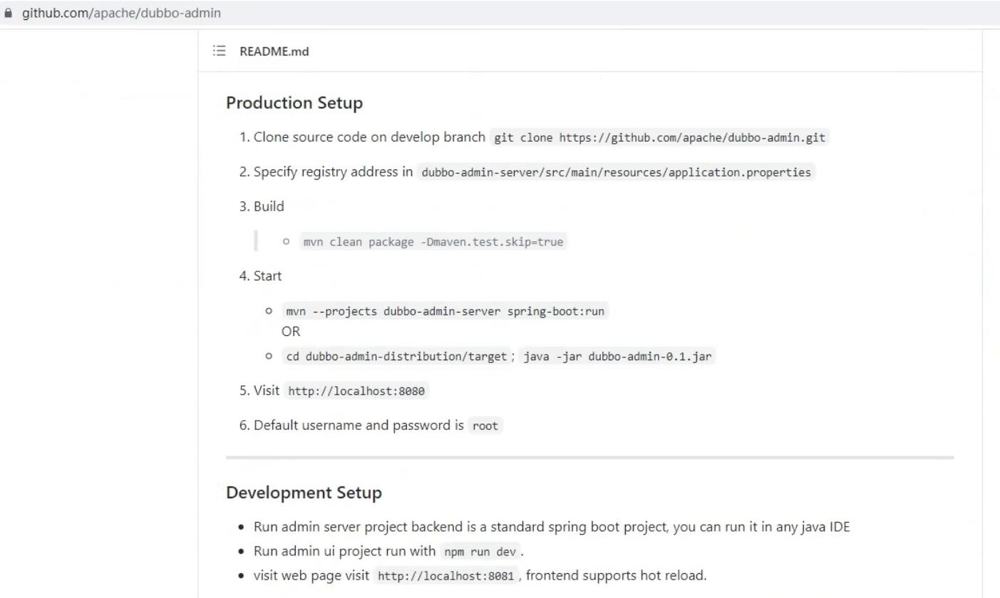

 **注意: 内存建议4G以上,且编译时间可能会花10分钟以上的时间**
**注意: 本项目支持Ubuntu22.04和JDK8和JDK11以下版本**
**当前项目已经用golang重构，需要下载指定branch为develop,再用downlaod zip 形式下载JAVA的源代码**

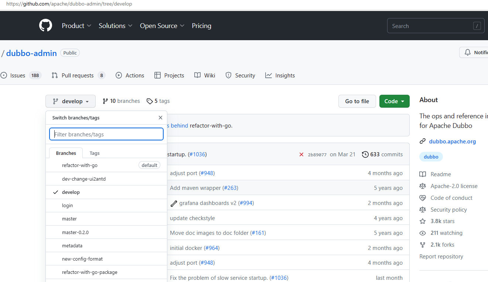

**环境规划：（注意修改解析hosts文件）**

```sh
#zookeeper、kafka集群节点
11.0.1.101 node01		zk1.wang.org
11.0.1.102 node02		zk2.wang.org
11.0.1.103 node03		zk3.wang.org

#生产者provider01、消费者节点consumer01
11.0.1.104 provider01	zk1.wang.org、zk2.wang.org、zk3.wang.org
11.0.1.105 consumer01	zk1.wang.org、zk2.wang.org、zk3.wang.org

#dubbo-admin节点
11.0.1.100 dubbo-admin
```

### 1.3.1 编译 dubbo admin

```sh
[root@nacos ~]#apt update && apt -y install maven
[root@nacos ~]#mvn -version
Apache Maven 3.6.3
Maven home: /usr/share/maven
Java version: 11.0.17, vendor: Ubuntu, runtime: /usr/lib/jvm/java-11-openjdk-amd64
Default locale: zh_CN, platform encoding: UTF-8
OS name: "linux", version: "5.15.0-58-generic", arch: "amd64", family: "unix"

#镜像加速
root@consumer:~# vim /etc/maven/settings.xml

        ......
            
  <mirrors>
    <!-- mirror
     | Specifies a repository mirror site to use instead of a given repository. The repository that
     | this mirror serves has an ID that matches the mirrorOf element of this mirror. IDs are used
     | for inheritance and direct lookup purposes, and must be unique across the set of mirrors.
     |
    <mirror>
      <id>nexus-aliyun</id>
      <mirrorOf>*</mirrorOf>
      <name>Nexus aliyun</name>
      <url>http://maven.aliyun.com/nexus/content/groups/public</url>
    </mirror>
     -->
  </mirrors>

        ......
        
#修改zookeeper 地址为实际IP

......

# centers in dubbo, if you want to add parameters, please add them to the url
admin.registry.address=zookeeper://11.0.1.10:2181,11.0.1.11:2181,11.0.1.12:2181
admin.config-center=zookeeper://11.0.1.10:2181,11.0.1.11:2181,11.0.1.12:2181
admin.metadata-report.address=zookeeper://11.0.1.10:2181,11.0.1.11:2181,11.0.1.12:2181

......

#因为此项目中使用了nodejs,建议用下面方式加速
[root@dubbo-admin ~/dubbo-admin]#apt -y install npm
[root@dubbo-admin ~/dubbo-admin]#npm config get registry
https://registry.npmjs.org/
[root@dubbo-admin ~/dubbo-admin]#npm config set registry https://registry.npm.taobao.org
[root@dubbo-admin ~/dubbo-admin]#npm config get registry
https://registry.npm.taobao.org/

#编译方法1:执行java编译
[root@dubbo-admin ~/dubbo-admin]#mvn clean package

#编译方法2:执行java源码编译并跳过测试单元,推荐此方式
[root@dubbo-admin ~/dubbo-admin]#mvn clean install package -Dmaven.test.skip=true
```

**可能会出现dubbo-admin-ui失败的情况，解决方法见附件1**

**如下显示编译完成**

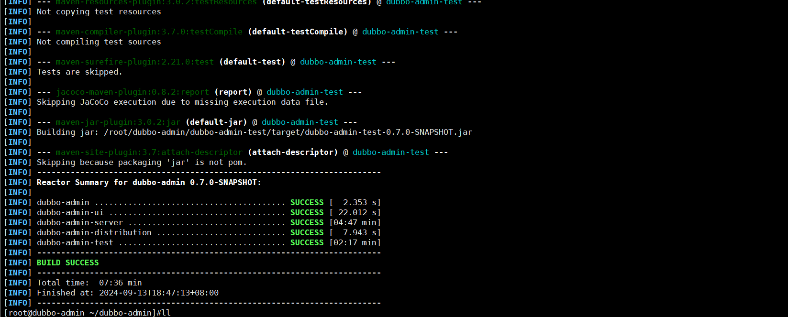

### **1.3.2 **启动服务

```sh
[root@dubbo-admin ~]#ll dubbo-admin/dubbo-admin-server/target/dubbo-admin-server-0.7.0-SNAPSHOT.jar -h
-rw-r--r-- 1 root root 67M Sep 13 18:44 dubbo-admin/dubbo-admin-server/target/dubbo-admin-server-0.7.0-SNAPSHOT.jar
```

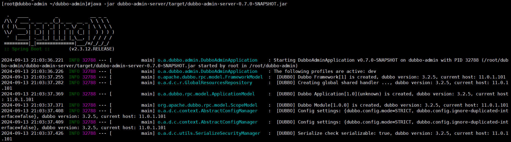

### 1.3.3 登录 Web 界面验证

**访问测试**

浏览器访问下面地址,用登录名和密码为root登录

```sh
http://dubbo-admin主机:<port>/
#默认8080端口
#本机访问: http://11.0.1.100:8080/
```

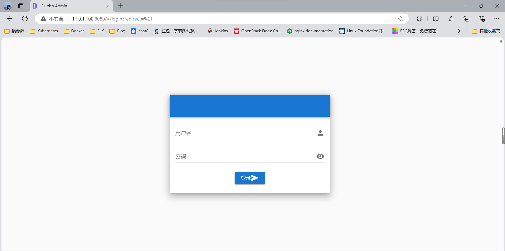

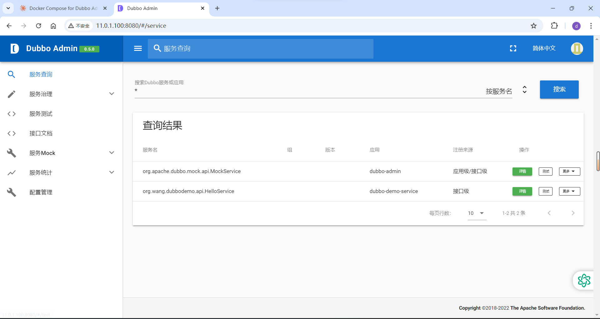


### **附件1：解决编译失败问题**

- **提示 dubbo-admin-ui 构建失败**

**Failed to execute goal com.github.eirslett:frontend-maven-plugin:1.11.0:npm (npm install) on project dubbo-admin-ui: Failed to run task: ‘npm install’ failed. org.apache.commons.exec.ExecuteException: Process exited with an error: 7**
———————**没保存截图**—————————

**意思就是com.github.eirslett:frontend-maven-plugin:1.11.0这个插件运行失败，实际上打开本地仓库发现这个插件根本下载不下来**

**解决方法:**

```sh
[root@dubbo-admin ~/dubbo-admin]#vim dubbo-admin-ui/pom.xml

				......
				
                       <groupId>com.github.eirslett</groupId>
                        <artifactId>frontend-maven-plugin</artifactId>
                        <version>1.11.0</version>			#修改指定版本号
                        <executions>
                            <execution>
                                <id>install node and npm</id>
                                <goals>
                                    <goal>install-node-and-npm</goal>
                                </goals>
                                <configuration>
                                    <nodeVersion>v9.11.1</nodeVersion>
                                </configuration>
                            </execution>

				......
				
#手动去远程仓库查找对应的插件
#链接:https://repo.maven.apache.org/maven2/com/github/eirslett/frontend-maven-plugin/

[root@dubbo-admin ~/dubbo-admin]#wget https://repo.maven.apache.org/maven2/com/github/eirslett/frontend-maven-plugin/1.11.0/

#在本地maven仓库中创建1.9.0文件夹，把jar包放进去（版本号）
[root@provider02 ~]#ls .m2/repository/com/github/eirslett/frontend-maven-plugin/
1.11.0

[root@dubbo-admin ~/dubbo-admin]#ls  -hl /root/.m2/repository/com/github/eirslett/frontend-maven-plugin/1.11.0/frontend-maven-plugin-1.11.0.jar
-rw-r--r-- 1 root root 37K Sep 13 11:09 /root/.m2/repository/com/github/eirslett/frontend-maven-plugin/1.11.0/frontend-maven-plugin-1.11.0.jar

#防止构建时用npm的方式下载插件，删除以下内容
[root@dubbo-admin ~/dubbo-admin]#vim dubbo-admin-ui/pom.xml
			
            ......
				
<goals>
	<goal>npm</goal>
</goals>

				......


#手动安装依赖
https://repo.maven.apache.org/maven2/org/apache/maven/plugins/maven-compiler-plugin/3.8.1/maven-compiler-plugin-3.8.1.jar

mvn install:install-file -Dfile=<path-to-jar> -DgroupId=org.springframework.boot -DartifactId=spring-boot-maven-plugin -Dversion=2.3.0.RELEASE -Dpackaging=jar

mvn install:install-file -Dfile=/data/spring-nacos-test/maven-compiler-plugin-3.8.1.jar \
                         -DgroupId=org.apache.maven.plugins \
                         -DartifactId=maven-compiler-plugin \
                         -Dversion=3.8.1 \
                         -Dpackaging=jar
```


**示例代码：**

```html
[root@dubbo-admin ~/dubbo-admin]#cat dubbo-admin-ui/pom.xml 
<?xml version="1.0" encoding="UTF-8"?>
<project xmlns="http://maven.apache.org/POM/4.0.0" xmlns:xsi="http://www.w3.org/2001/XMLSchema-instance" xsi:schemaLocation="http://maven.apache.org/POM/4.0.0 http://maven.apache.org/xsd/maven-4.0.0.xsd">
    <modelVersion>4.0.0</modelVersion>
    <parent>
        <groupId>org.apache.dubbo</groupId>
        <artifactId>dubbo-admin</artifactId>
        <version>${revision}</version>
    </parent>

    <artifactId>dubbo-admin-ui</artifactId>

    <properties>
        <project.build.sourceEncoding>UTF-8</project.build.sourceEncoding>
        <project.reporting.outputEncoding>UTF-8</project.reporting.outputEncoding>
        <frontend-maven-plugin.version>1.11.0</frontend-maven-plugin.version>
    </properties>

    <profiles>
        <profile>
            <id>ui</id>
            <activation>
                <activeByDefault>true</activeByDefault>
            </activation>
            <build>
                <resources>
                    <resource>
                        <targetPath>${basedir}/target/dist</targetPath>
                        <filtering>true</filtering>
                        <directory>${basedir}</directory>
                        <includes>
                            <include>dubbo-admin-info.json</include>
                        </includes>
                    </resource>
                    <resource>
                        <targetPath>${basedir}/public</targetPath>
                        <filtering>true</filtering>
                        <directory>${basedir}</directory>
                        <includes>
                            <include>dubbo-admin-info.json</include>
                        </includes>
                    </resource>
                </resources>
                <plugins>
                    <plugin>
                        <groupId>com.github.eirslett</groupId>
                        <artifactId>frontend-maven-plugin</artifactId>
                        <version>1.11.0</version>
                        <executions>
                            <execution>
                                <id>install node and npm</id>
                                <goals>
                                    <goal>install-node-and-npm</goal>
                                </goals>
                                <configuration>
                                    <nodeVersion>v9.11.1</nodeVersion>
                                </configuration>
                            </execution>
                            <!-- Install all project dependencies -->
                            <execution>
                                <id>npm install</id>
                                <!-- optional: default phase is "generate-resources" -->
                                <phase>generate-resources</phase>
                                <!-- Optional configuration which provides for running any npm command -->
                                <configuration>
                                    <arguments>install</arguments>
                                </configuration>
                            </execution>
                            <!-- Build and minify static files -->
                            <execution>
                                <id>npm run build</id>
                                <configuration>
                                    <arguments>run build</arguments>
                                </configuration>
                            </execution>
                        </executions>
                    </plugin>
                </plugins>
            </build>
        </profile>
    </profiles>
</project>
```

```sql
java -jar dubbo-admin-distribution/target/dubbo-admin-0.7.0-SNAPSHOT.jar


CREATE DATABASE dubbo_admin;
CREATE USER 'dubbo'@'11.0.1.%' IDENTIFIED BY '123456';
GRANT ALL PRIVILEGES ON dubbo_admin.* TO 'dubbo'@'11.0.1.%';
FLUSH PRIVILEGES;

```

# 2 Nacos


## 2.1 Nacos 介绍和架构

### 2.1.1 什么是Nacos

```sh
https://nacos.io/
https://github.com/alibaba/nacos
```

**Nacos /nɑ:kəʊs/ 是 Dynamic Naming and Configuration Service的首字母简称**
是阿里巴巴开源的一个基于JAVA语言的更易于构建云原生应用的动态服务发现、配置管理和服务管理平台。
Nacos 致力于帮助您发现、配置和管理微服务。Nacos 提供了一组简单易用的特性集，帮助您快速实现动态服务发现、服务配置、服务元数据及流量管理。
Nacos 帮助您更敏捷和容易地构建、交付和管理微服务平台。 Nacos 是构建以“服务”为中心的现代应用架构 (例如微服务范式、云原生范式) 的服务基础设施。

Kubernetes Service
gRPC **&** Dubbo RPC Service
Spring Cloud RESTful Service

**Nacos 的核心功能**

**服务发现和服务健康监测**

```
Nacos 支持基于 DNS 和基于 RPC 的服务发现。服务提供者使用 原生SDK、OpenAPI、或一个独立的Agent TODO注册 Service 后，服
务消费者可以使用DNS TODO 或HTTP&API查找和发现服务。

Nacos 提供对服务的实时的健康检查，阻止向不健康的主机或服务实例发送请求。Nacos 支持传输层 (PING 或 TCP)和应用层 (如HTTP、MySQL、用户自定义）的健康检查。 对于复杂的云环境和网络拓扑环境中（如 VPC、边缘网络等）服务的健康检查，Nacos 提供了 agent 上报模式和服务端主动检测2种健康检查模式。Nacos 还提供了统一的健康检查仪表盘，帮助您根据健康状态管理服务的可用性及流量。
```

**动态配置服务**

```
动态配置服务可以让您以中心化、外部化和动态化的方式管理所有环境的应用配置和服务配置。

动态配置消除了配置变更时重新部署应用和服务的需要，让配置管理变得更加高效和敏捷。

配置中心化管理让实现无状态服务变得更简单，让服务按需弹性扩展变得更容易。

Nacos 提供了一个简洁易用的UI (控制台样例 Demo) 帮助您管理所有的服务和应用的配置。Nacos 还提供包括配置版本跟踪、金丝雀发布、一键回滚配置以及客户端配置更新状态跟踪在内的一系列开箱即用的配置管理特性，帮助您更安全地在生产环境中管理配置变更和降低配置变更带来的风险。
```

**动态 DNS 服务**

```
动态 DNS 服务支持权重路由，让您更容易地实现中间层负载均衡、更灵活的路由策略、流量控制以及数据中心内网的简单DNS解析服
务。动态DNS服务还能让您更容易地实现以 DNS 协议为基础的服务发现，以帮助您消除耦合到厂商私有服务发现 API 上的风险。
Nacos 提供了一些简单的 DNS APIs TODO 帮助您管理服务的关联域名和可用的 IP:PORT 列表.
```

**服务及其元数据管理**

```
Nacos 能让您从微服务平台建设的视角管理数据中心的所有服务及元数据，包括管理服务的描述、生命周期、服务的静态依赖分析、服务的健康状态、服务的流量管理、路由及安全策略、服务的 SLA 以及最首要的 metrics 统计数据。
```

### 2.1.2 基本架构及概念

**Nacos 架构**

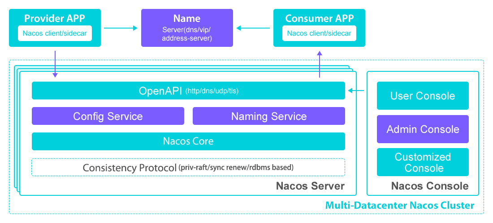

java版本：[Java Downloads | Oracle](https://www.oracle.com/java/technologies/downloads/?er=221886#java8)


## 2.2 nacos部署

**Nacos支持三种部署模式**

- 单机模式 - 用于测试和单机试用。
- 集群模式 - 用于生产环境，确保高可用。
- 多集群模式 - 用于多数据中心场景。

```sh
#环境准备
安装好 JDK，需要 1.8 及其以上版本
建议: 2核 CPU / 4G 内存 及其以上
建议: 生产环境 3 个节点 及其以上
```

### 2.2.1 单机部署

```sh
#官网
https://nacos.io/
https://github.com/alibaba/nacos/releases


#下载二进制包
[root@nacos ~]#wget https://github.com/alibaba/nacos/releases/download/2.4.2.1/nacos-server-2.4.2.1.tar.gz
[root@nacos ~]#tar zxf nacos-server-2.4.2.1.tar.gz -C /usr/local/

[root@nacos ~]#ls /usr/local/nacos/ -l
total 56
drwxr-xr-x 5 root root   4096 Sep 23 16:45 bin
drwxr-xr-x 2  502 staff  4096 Sep  4 16:32 conf
drwxr-xr-x 5 root root   4096 Sep 21 23:12 data
-rw-r--r-- 1 root root    703 Sep 21 23:50 derby.log
drwxr-xr-x 3 root root   4096 Sep 21 23:34 file:
-rw-r--r-- 1  502 staff 16583 Sep  4 16:32 LICENSE
drwxr-xr-x 2 root root   4096 Sep 23 10:39 logs
-rw-r--r-- 1  502 staff  1305 Sep  4 16:32 NOTICE
drwxr-xr-x 2 root root   4096 Sep 23 16:45 target
drwxr-xr-x 3 root root   4096 Sep 21 22:54 work
[root@nacos /usr/local/nacos]#ls bin/
derby.log  file:  logs  shutdown.cmd  shutdown.sh  startup.cmd  startup.sh  work

#修改配置，可选
[root@nacos01 ~]#vi /usr/local/nacos/conf/application.properties
#修改默认的访问URL路径
#server.servlet.contextPath=/nacos
server.servlet.contextPath=/
```

### 2.2.2 启动和关闭服务器

注：Nacos的运行建议至少在2C4G 60G的机器配置下运行。

#### 2.2.2.1 启动服务

```sh
#单机运行
sh startup.sh -m standalone

#如果您使用的是ubuntu系统，或者运行脚本报错提示[[符号找不到，可尝试如下运行：
bash startup.sh -m standalone

#Windows启动命令(standalone代表着单机模式运行，非集群模式):
startup.cmd -m standalone

#实验环境启动
[root@nacos /usr/local/nacos]#/usr/local/nacos/bin/startup.sh -m standalone		#添加单机选项
/usr/local/java/bin/java -Djava.ext.dirs=/usr/local/java/jre/lib/ext:/usr/local/java/lib/ext   -Xms512m -Xmx512m -Xmn256m -Dnacos.standalone=true -Dnacos.member.list= -XX:+UseConcMarkSweepGC -XX:+UseCMSCompactAtFullCollection -XX:CMSInitiatingOccupancyFraction=70 -XX:+CMSParallelRemarkEnabled -XX:SoftRefLRUPolicyMSPerMB=0 -XX:+CMSClassUnloadingEnabled -XX:SurvivorRatio=8  -Xloggc:/usr/local/nacos/logs/nacos_gc.log -verbose:gc -XX:+PrintGCDetails -XX:+PrintGCDateStamps -XX:+PrintGCTimeStamps -XX:+UseGCLogFileRotation -XX:NumberOfGCLogFiles=10 -XX:GCLogFileSize=100M -Dloader.path=/usr/local/nacos/plugins,/usr/local/nacos/plugins/health,/usr/local/nacos/plugins/cmdb,/usr/local/nacos/plugins/selector -Dnacos.home=/usr/local/nacos -jar /usr/local/nacos/target/nacos-server.jar  --spring.config.additional-location=file:/usr/local/nacos/conf/ --logging.config=/usr/local/nacos/conf/nacos-logback.xml --server.max-http-header-size=524288
nacos is starting with standalone
nacos is starting. you can check the /usr/local/nacos/logs/start.out

#查看端口
[root@nacos /usr/local/nacos]#ss -ntlp |grep 8848
LISTEN    0         100                      *:8848                   *:*        users:(("java",pid=195709,fd=167))  
```

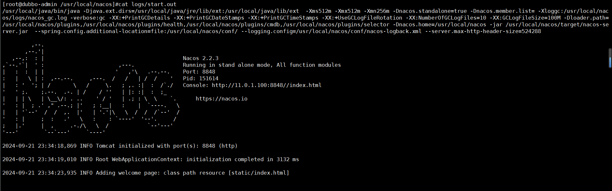

**注：默认使用嵌入式存储**

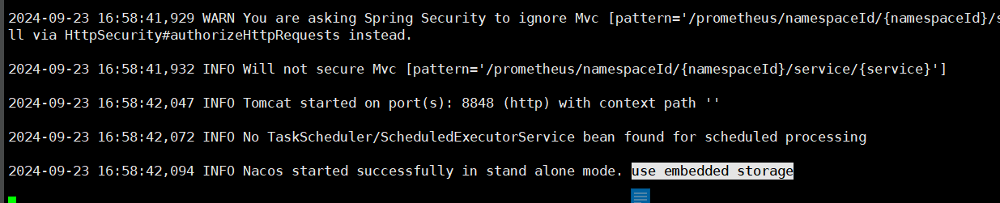

#### 2.2.2.2 关闭服务

```sh
#Linux/Unix/Mac
sh shutdown.sh

#Windows
shutdown.cmd 或者双击shutdown.cmd运行文件
```

### 2.2.3 服务注册 & 发现和配置管理

```sh
# Nacos配置管理命令行示例

# 注意：请替换 ${NACOS_SERVER_ADDR} 为你的Nacos服务器地址，例如 localhost:8848
# 同时，确保替换 ${USERNAME} 和 ${PASSWORD} 为你的Nacos用户名和密码

# 1. 发布配置
curl -X POST "http://11.0.1.101:8848/nacos/v1/cs/configs" \
  -H "Content-Type: application/x-www-form-urlencoded" \
  -d "dataId=dinginx01-service.properties&group=DEFAULT_GROUP&content=spring.datasource.url=jdbc:mysql://11.0.1.100:3306/userdb%0Aspring.datasource.username=root%0Aspring.datasource.password=secret%0Auser.service.greeting=Hello, Nacos Config!%0Amax.users.limit=1000" \
  -u "nacos:nacos"

# 2. 获取配置
curl -X GET "http://${NACOS_SERVER_ADDR}/nacos/v1/cs/configs?dataId=user-service.properties&group=DEFAULT_GROUP" \
  -u "${USERNAME}:${PASSWORD}"

# 3. 更新配置
curl -X POST "http://${NACOS_SERVER_ADDR}/nacos/v1/cs/configs" \
  -H "Content-Type: application/x-www-form-urlencoded" \
  -d "dataId=user-service.properties&group=DEFAULT_GROUP&content=spring.datasource.url=jdbc:mysql://localhost:3306/userdb%0Aspring.datasource.username=root%0Aspring.datasource.password=secret%0Auser.service.greeting=Hello, Updated Nacos Config!%0Amax.users.limit=2000" \
  -u "${USERNAME}:${PASSWORD}"

# 4. 删除配置
curl -X DELETE "http://${NACOS_SERVER_ADDR}/nacos/v1/cs/configs?dataId=user-service.properties&group=DEFAULT_GROUP" \
  -u "${USERNAME}:${PASSWORD}"

# 5. 创建命名空间
curl -X POST "http://${NACOS_SERVER_ADDR}/nacos/v1/console/namespaces" \
  -H "Content-Type: application/x-www-form-urlencoded" \
  -d "customNamespaceId=development&namespaceName=Development&namespaceDesc=For development environment" \
  -u "${USERNAME}:${PASSWORD}"

# 6. 在特定命名空间中发布配置
curl -X POST "http://${NACOS_SERVER_ADDR}/nacos/v1/cs/configs" \
  -H "Content-Type: application/x-www-form-urlencoded" \
  -d "dataId=user-service.properties&group=DEFAULT_GROUP&content=spring.datasource.url=jdbc:mysql://devdb:3306/userdb%0Aspring.datasource.username=devuser%0Aspring.datasource.password=devpassword%0Auser.service.greeting=Hello, Dev Nacos Config!%0Amax.users.limit=500&tenant=development" \
  -u "${USERNAME}:${PASSWORD}"

# 7. 获取特定命名空间中的配置
curl -X GET "http://${NACOS_SERVER_ADDR}/nacos/v1/cs/configs?dataId=user-service.properties&group=DEFAULT_GROUP&tenant=development" \
  -u "${USERNAME}:${PASSWORD}"
```

### 2.2.4 Web 访问

```
http://11.0.1.100:8848
```

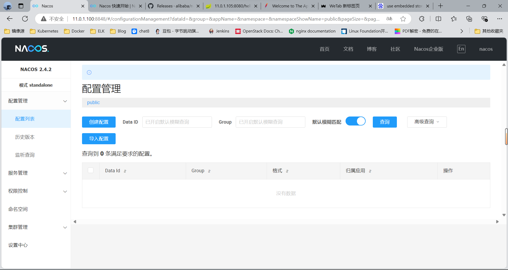

### 2.2.5 单机模式支持 MySQL

在0.7版本之前，在单机模式时**nacos使用嵌入式数据库**实现数据的存储，不方便观察数据存储的基本情况。0.7版本增加了支持mysql数据源能力，具体的操作步骤：

- 安装数据库，版本要求：5.6.5+
- 创建数据库nacos和用户nacos，并授权
- 执行数据库初始化脚本 mysql-schema.sql
- 修改conf/application.properties文件，增加支持mysql数据源配置（目前只支持mysql），添加mysql数据源的url、用户名和密码，加密访问

```sh
spring.datasource.platform=mysql

db.num=1
db.url.0=jdbc:mysql://11.0.1.100:3306/nacos?characterEncoding=utf8&connectTimeout=1000&socketTimeout=3000&autoReconnect=true		#修改外置数据库ip
db.user=nacos
db.password=123456
```

再以单机模式启动nacos，nacos所有写嵌入式数据库的数据都写到了mysql

**范例：**

```sh
[root@nacos ~]#apt update && apt -y install mysql-server 
[root@nacos ~]#mysql
Server version: 8.0.33-0ubuntu0.22.04.4 (Ubuntu)
mysql> create user nacos@'11.0.1.%' identified with mysql_native_password by 'nacos';
mysql> create database nacos;
mysql> grant all on nacos.* to nacos@'11.0.1.%' ;
[root@nacos ~]#mysql -unacos -pnacos -h11.0.1.100 nacos < /usr/local/nacos/conf/mysql-schema.sql

[root@nacos ~]#vim /usr/local/nacos/conf/application.properties
#*************** Config Module Related Configurations ***************#
### If use MySQL as datasource:
### Deprecated configuration property, it is recommended to use `spring.sql.init.platform` replaced.
# spring.datasource.platform=mysql
# spring.sql.init.platform=mysql
spring.sql.init.platform=mysql #加此行
### Count of DB:
# db.num=1
db.num=1                       #加此行
### Connect URL of DB:
# db.url.0=jdbc:mysql://127.0.0.1:3306/nacos?
characterEncoding=utf8&connectTimeout=1000&socketTimeout=3000&autoReconnect=true&useUnicode=true&useSSL=false&serverTimezone=UTC
# db.user.0=nacos
# db.password.0=nacos
##加下面三行
db.url.0=jdbc:mysql://127.0.0.1:3306/nacos?
characterEncoding=utf8&connectTimeout=1000&socketTimeout=3000&autoReconnect=true&useUnicode
=true&useSSL=false&serverTimezone=UTC
db.user.0=nacos
db.password.0=nacos

#如果启动,先关闭服务
[root@nacos ~]#/usr/local/nacos/bin/shutdown.sh
[root@nacos ~]#/usr/local/nacos/bin/startup.sh -m standalone

......

use external storage #使用外部存储
```

### 2.2.6 启用登录验证

```sh
https://nacos.io/zh-cn/docs/auth.html
```

```sh
#生成toke的值，至少32位，否则无法启动
[root@nacos /usr/local/nacos]#openssl rand -base64 33
XJRfjavekucnxD5Wi4UVH4oEL01uu+5U2AtVyiLIhYKf

#修改配置文件,共四行内容
[root@nacos /usr/local/nacos]#vim conf/application.properties

......

#*************** Access Control Related Configurations ***************#
### If enable spring security, this option is deprecated in 1.2.0:
#spring.security.enabled=false

### The ignore urls of auth
nacos.security.ignore.urls=/,/error,/**/*.css,/**/*.js,/**/*.html,/**/*.map,/**/*.svg,/**/*.png,/**/*.ico,/console-ui/public/**,/v1/auth/**,/v1/console/health/**,/actuator/**,/v1/console/server/**

### The auth system to use, currently only 'nacos' and 'ldap' is supported:
nacos.core.auth.system.type=nacos

### If turn on auth system:
nacos.core.auth.enabled=false		#修改false为true

### Turn on/off caching of auth information. By turning on this switch, the update of auth information would have a 15 seconds delay.
nacos.core.auth.caching.enabled=true

### Since 1.4.1, Turn on/off white auth for user-agent: nacos-server, only for upgrade from old version.
nacos.core.auth.enable.userAgentAuthWhite=false

### Since 1.4.1, worked when nacos.core.auth.enabled=true and nacos.core.auth.enable.userAgentAuthWhite=false.
### The two properties is the white list for auth and used by identity the request from other server.
nacos.core.auth.server.identity.key=dinginx		#指定key，否则无法启动
nacos.core.auth.server.identity.value=dinginx		#指定value，否则无法启动

### worked when nacos.core.auth.system.type=nacos
### The token expiration in seconds:
nacos.core.auth.plugin.nacos.token.cache.enable=false
nacos.core.auth.plugin.nacos.token.expire.seconds=18000
### The default token (Base64 String):
nacos.core.auth.plugin.nacos.token.secret.key=XJRfjavekucnxD5Wi4UVH4oEL01uu+5U2AtVyiLIhYKf	#添加前面生成的token

#重启服务生效
[root@nacos ~]#/usr/local/nacos/bin/shutdown.sh
[root@nacos ~]#/usr/local/nacos/bin/startup.sh -m standalone

#注：测试访问,默认用户名和密码都是nacos
```

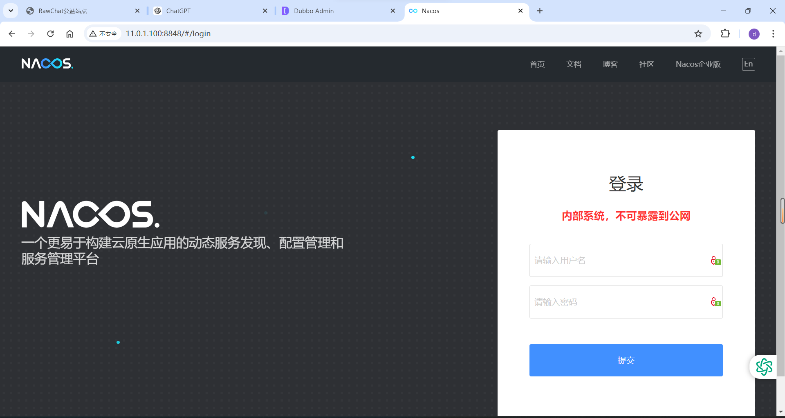

### 2.2.7 集群部署

```sh
集群部署架构图
因此开源的时候推荐用户把所有服务列表放到一个vip下面，然后挂到一个域名下面
http://ip1:port/openAPI 直连ip模式，机器挂则需要修改ip才可以使用。
http://SLB:port/openAPI 挂载SLB模式(内网SLB，不可暴露到公网，以免带来安全风险)，直连SLB即可，下面挂server真实ip，可读性不
好。
http://nacos.com:port/openAPI 域名 + SLB模式(内网SLB，不可暴露到公网，以免带来安全风险)，可读性好，而且换ip方便，推荐模式
```


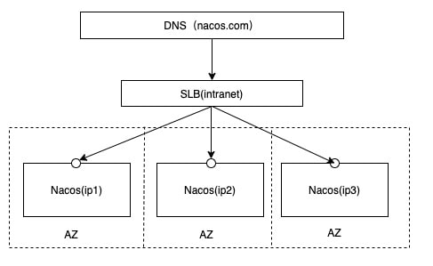

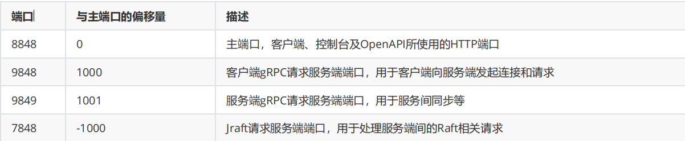

**使用VIP/nginx请求时，需要配置成TCP转发，不能配置http2转发，否则连接会被nginx断开。 9849和7848端口为服务端之间的通信端**
**口，请勿暴露到外部网络环境和客户端测。**

#### 2.2.7.1 部署案例

**环境准备**

```sh
请确保是在环境中安装使用:
64 bit OS Linux/Unix/Mac，推荐使用Linux系统。
64 bit JDK 1.8+；下载. 配置。
Maven 3.2.x+；下载 & 配置。
3个或3个以上Nacos节点才能构成集群。
```


```sh
#下载源码或者安装包
##从 Github 上下载源码方式
apt update && apt -y install git openjdk-8-jdk maven
git clone https://github.com/alibaba/nacos.git
unzip nacos-develop.zip
cd nacos-develop
mvn -Prelease-nacos clean install -U  
cd distribution/target/nacos-server-2.3.0-SNAPSHOT/nacos/

##下载编译后压缩包方式
apt update && apt -y install openjdk-8-jdk
apt update && apt -y install openjdk-11-jdk
wget https://github.com/alibaba/nacos/releases/download/2.2.3/nacos-server-2.2.3.tar.gz
tar xf nacos-server-2.2.3.tar.gz  -C /usr/local/
```

**范例：二进制安装**

```
apt update && apt -y install openjdk-11-jdk
wget https://github.com/alibaba/nacos/releases/download/2.2.3/nacos-server-2.2.3.tar.gz
tar xf nacos-server-2.2.3.tar.gz -C /usr/local/
```

#### **2.2.7.2 确定数据源**

```sh
如果使用内置数据源
	无需进行任何配置
使用外置数据源
	生产使用建议至少主备模式，或者采用高可用数据库。
	初始化 MySQL 数据库
	
#部署创建数据库
[root@ubuntu2204 ~]#apt update && apt -y install mysql-server 
[root@ubuntu2204 ~]#sed -i '/127.0.0.1/s/^/#/' /etc/mysql/mysql.conf.d/mysqld.cnf
[root@ubuntu2204 ~]#systemctl restart mysql
[root@ubuntu2204 ~]#mysql
Welcome to the MySQL monitor. Commands end with ; or \g.
Your MySQL connection id is 25
Server version: 8.0.33-0ubuntu0.22.04.4 (Ubuntu)
mysql> create user nacos@'10.0.0.%' identified with mysql_native_password by 'nacos';
mysql> create database nacos;
mysql> grant all on nacos.* to nacos@'10.0.0.%' ;
[root@node01 ~]#apt update && apt -y install mysql-client
[root@node01 ~]#mysql -unacos -pnacos -h10.0.0.200 nacos < /usr/local/nacos/conf/mysql-schema.sql
```

#### **2.2.7.3 配置集群配置文件**

在nacos的解压目录nacos/的conf目录下，有配置文件cluster.conf，请每行配置成ip:port。**在所有集群节点修改下面文件**

```sh
[root@node1 ~]#vim /usr/local/nacos/conf/cluster.conf
# ip:port
11.0.1.101:8848
11.0.1.102:8848
11.0.1.103:8848

#application.properties 配置
[root@node1 ~]#vi /usr/local/nacos/conf/application.properties

... ...

#*************** Config Module Related Configurations ***************#
### If use MySQL as datasource:
### Deprecated configuration property, it is recommended to use `spring.sql.init.platform` replaced.
# spring.datasource.platform=mysql
spring.sql.init.platform=mysql

### Count of DB:
db.num=1

### Connect URL of DB:
db.url.0=jdbc:mysql://11.0.1.100:3306/nacos?characterEncoding=utf8&connectTimeout=1000&socketTimeout=3000&autoReconnect=true&useUnicode=true&useSSL=false&serverTimezone=UTC
db.user.0=nacos
db.password.0=123456

......

#将配置同步到其它的节点
[root@node1 conf]#scp application.properties cluster.conf 11.0.1.102:/usr/local/nacos/conf
[root@node1 conf]#scp application.properties cluster.conf 11.0.1.103:/usr/local/nacos/conf

#集群启动
##使用内置数据源
/usr/local/nacos/bin/startup.sh -p embedded

##使用外置数据源
/usr/local/nacos/bin/startup.sh

#关闭服务
Linux/Unix/Mac
/usr/local/nacos/bin/shutdown.sh
```

#### 2.2.7.4 服务注册&发现和配置管理

**同2.2.3章节**

#### 2.2.7.5 配置haproxy代理

```sh
#安装haproxy
apt update && apt install -y haproxy

#修改配置文件
cat /etc/haproxy/haproxy.cfg 

......

listen nacos
  bind 0.0.0.0:9999
  log global
  server nacos01 11.0.1.101:8848 check
  server nacos02 11.0.1.102:8848 check
  server nacos03 11.0.1.103:8848 check

listen stats			#haproxy状态页
	mode http
	bind 0.0.0.0:9998
	log global
	stats enable
	stats uri /status
```

#### 2.2.7.6 Web页面访问

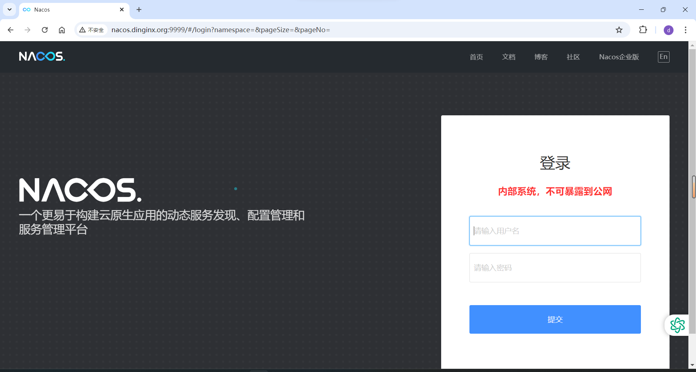

**集群模式**

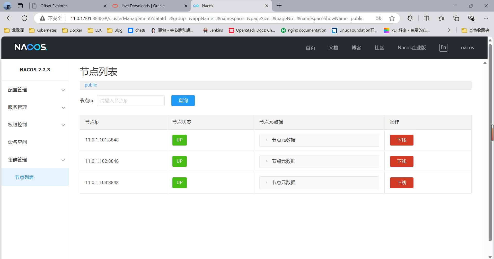

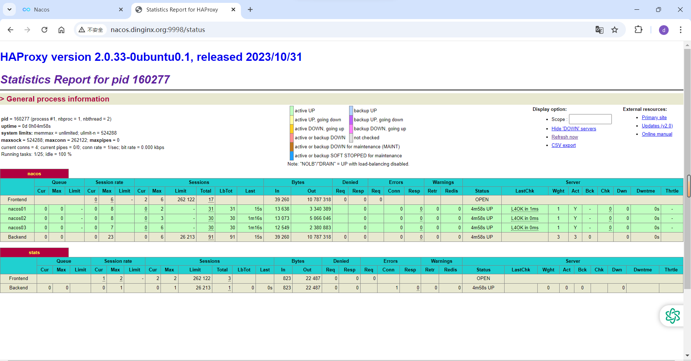


### Nacos配置项目示例

```java
// 假设我们有一个用户服务(user-service)，需要配置数据库连接和一些业务参数

// 1. 在Nacos中创建配置
// 通过Nacos控制台或API创建以下配置：

// Data ID: user-service.properties
// Group: DEFAULT_GROUP
// 配置内容：
spring.datasource.url=jdbc:mysql://localhost:3306/userdb
spring.datasource.username=root
spring.datasource.password=secret
user.service.greeting=Hello, Nacos Config!
max.users.limit=1000

// 2. 在Spring Boot应用中使用配置

// pom.xml
<dependency>
    <groupId>com.alibaba.cloud</groupId>
    <artifactId>spring-cloud-starter-alibaba-nacos-config</artifactId>
</dependency>

// bootstrap.properties
spring.application.name=user-service
spring.cloud.nacos.config.server-addr=127.0.0.1:8848
spring.cloud.nacos.config.file-extension=properties

// UserServiceConfig.java
import org.springframework.boot.context.properties.ConfigurationProperties;
import org.springframework.context.annotation.Configuration;

@Configuration
@ConfigurationProperties(prefix = "user.service")
public class UserServiceConfig {
    private String greeting;
    private int maxUsersLimit;

    // getters and setters
}

// UserController.java
import org.springframework.beans.factory.annotation.Autowired;
import org.springframework.web.bind.annotation.GetMapping;
import org.springframework.web.bind.annotation.RestController;

@RestController
public class UserController {

    @Autowired
    private UserServiceConfig config;

    @GetMapping("/greeting")
    public String greeting() {
        return config.getGreeting();
    }
}

// 3. 动态更新配置
// 在Nacos控制台修改配置后，客户端会自动刷新

// 要在代码中感知配置更新，可以使用@RefreshScope注解：
import org.springframework.cloud.context.config.annotation.RefreshScope;

@RestController
@RefreshScope
public class UserController {
    // ...
}

// 4. 使用多配置文件
// bootstrap.properties
spring.cloud.nacos.config.shared-configs[0].data-id=common-db.properties
spring.cloud.nacos.config.shared-configs[0].group=SHARED_GROUP
spring.cloud.nacos.config.shared-configs[0].refresh=true

spring.cloud.nacos.config.extension-configs[0].data-id=ext-config-common01.properties
spring.cloud.nacos.config.extension-configs[0].group=GLOBALE_GROUP
spring.cloud.nacos.config.extension-configs[0].refresh=true

// 5. 使用命名空间
// bootstrap.properties
spring.cloud.nacos.config.namespace=e5c9d706-abc3-4c30-8c7a-5d2bd1e1f5b8
```


项目测试代码

~~~yaml
下面是详细的 Nacos 集成项目步骤，从创建项目、配置 Nacos，到部署和测试。假设你使用的是 Spring Boot 项目，集成 Nacos 配置中心和服务发现。

### 步骤 1：创建 Spring Boot 项目

#### 1.1 使用 Spring Initializr 创建项目

你可以通过 [Spring Initializr](https://start.spring.io/) 来生成一个 Spring Boot 项目：

- **Project**: Maven Project
- **Language**: Java
- **Spring Boot**: 2.3.0 或更高版本
- **Dependencies**:
  - Spring Web
  - Spring Boot Actuator
  - Spring Cloud Nacos Config
  - Spring Cloud Nacos Discovery

生成项目后，下载并解压生成的项目。

#### 1.2 使用 Maven 构建项目

下载完成后，进入项目根目录，执行 Maven 构建命令：

```bash
mvn clean install
```

### 步骤 2：添加依赖

在 `pom.xml` 中，添加 Nacos 的依赖。如果你使用的是 Spring Cloud Alibaba，可以使用如下依赖：

```xml
<dependency>
    <groupId>com.alibaba.cloud</groupId>
    <artifactId>spring-cloud-starter-alibaba-nacos-config</artifactId>
    <version>2.2.5.RELEASE</version>
</dependency>

<dependency>
    <groupId>com.alibaba.cloud</groupId>
    <artifactId>spring-cloud-starter-alibaba-nacos-discovery</artifactId>
    <version>2.2.5.RELEASE</version>
</dependency>
```

### 步骤 3：配置 Nacos

#### 3.1 配置 `application.yml` 文件

配置文件 `application.yml` 是 Spring Boot 项目中常见的配置文件，用于连接 Nacos 服务。你需要指定 Nacos 服务器地址以及一些基本的配置项。

```yaml
spring:
  application:
    name: dinginx-demo          # 应用名称
  cloud:
    nacos:
      config:
        server-addr: 11.0.1.100:9999  # Nacos 服务器地址
        file-extension: yaml         # 配置文件的类型
      discovery:
        server-addr: 11.0.1.100:9999  # Nacos 服务发现地址

server:
  port: 8800  # 应用的端口号
```

#### 3.2 使用 `bootstrap.yml`（可选）

Spring Boot 项目通常使用 `application.yml`，但是当你希望在应用启动之前加载 Nacos 的配置时，可以使用 `bootstrap.yml` 文件。

```yaml
spring:
  cloud:
    nacos:
      config:
        server-addr: 11.0.1.100:9999  # Nacos 服务器地址
```

### 步骤 4：配置 Nacos 服务和配置中心

#### 4.1 启动 Nacos 服务器

1. 下载 Nacos 服务端：[Nacos GitHub Release](https://github.com/alibaba/nacos/releases)。
2. 解压后进入 Nacos 根目录，启动 Nacos：
   ```bash
   sh startup.sh -m standalone  # 单机模式启动
   ```

3. 启动成功后，访问 Nacos 管理控制台 `http://127.0.0.1:8848/nacos`，使用默认用户名和密码 `nacos/nacos` 登录。

#### 4.2 在 Nacos 上创建配置

1. 登录 Nacos 控制台后，点击 **配置管理** -> **配置列表** -> **发布配置**。
2. 设置配置如下：
   - **Data ID**: `nacos-demo.yaml`（应与 `spring.application.name` 保持一致）
   - **Group**: `DEFAULT_GROUP`
   - **内容**：填入你的应用配置。例如：
     ```yaml
     app:
       name: nacos-demo
       description: "This is a demo application for Nacos configuration management."
       version: 1.0.0
     server:
       port: 8080
     ```

3. 点击 **发布**。

### 步骤 5：读取 Nacos 配置

#### 5.1 使用 `@Value` 读取配置

在 Spring Boot 项目中，我们可以使用 `@Value` 注解读取配置文件中的数据。

```java
import org.springframework.beans.factory.annotation.Value;
import org.springframework.web.bind.annotation.GetMapping;
import org.springframework.web.bind.annotation.RestController;

@RestController
public class ConfigController {

    @Value("${app.name}")
    private String appName;

    @Value("${app.description}")
    private String appDescription;

    @Value("${app.version}")
    private String appVersion;

    @GetMapping("/config")
    public String getConfig() {
        return "App Name: " + appName + "\n"
             + "App Description: " + appDescription + "\n"
             + "App Version: " + appVersion;
    }
}
```

#### 5.2 使用 `@ConfigurationProperties` 读取配置

如果你的配置较多，使用 `@ConfigurationProperties` 更方便管理配置数据：

```java
import org.springframework.boot.context.properties.ConfigurationProperties;
import org.springframework.stereotype.Component;

@Component
@ConfigurationProperties(prefix = "app")
public class AppConfig {

    private String name;
    private String description;
    private String version;

    // Getters and Setters
}
```

控制器使用 `AppConfig` 读取配置：

```java
import org.springframework.beans.factory.annotation.Autowired;
import org.springframework.web.bind.annotation.GetMapping;
import org.springframework.web.bind.annotation.RestController;

@RestController
public class ConfigController {

    @Autowired
    private AppConfig appConfig;

    @GetMapping("/config")
    public String getConfig() {
        return "App Name: " + appConfig.getName() + "\n"
             + "App Description: " + appConfig.getDescription() + "\n"
             + "App Version: " + appConfig.getVersion();
    }
}
```

### 步骤 6：注册服务到 Nacos

为了实现服务注册和发现，你可以通过 `spring.cloud.nacos.discovery` 配置让你的应用自动注册到 Nacos。

在 `application.yml` 中配置如下内容：

```yaml
spring:
  cloud:
    nacos:
      discovery:
        server-addr: 11.0.1.100:9999  # Nacos 服务地址
```

通过注解 `@EnableDiscoveryClient` 启用服务注册：

```java
import org.springframework.cloud.client.discovery.EnableDiscoveryClient;
import org.springframework.web.bind.annotation.RestController;

@EnableDiscoveryClient
@RestController
public class NacosDiscoveryController {
    //...
}
```

### 步骤 7：启动应用并测试

1. 启动 Spring Boot 项目：

   ```bash
   mvn spring-boot:run
   ```

2. 访问测试接口 `http://localhost:8080/config`，你应该能看到从 Nacos 拉取的配置：

   ```
   App Name: nacos-demo
   App Description: This is a demo application for Nacos configuration management.
   App Version: 1.0.0
   ```

### 步骤 8：测试动态配置更新

在 Nacos 控制台中修改配置，比如将 `app.description` 修改为 `"Updated description"`, 保存后，应用将会动态地获取最新的配置。再访问 `http://localhost:8080/config`，你将会看到更新后的数据。

### 总结

以上步骤详细描述了如何从零开始创建一个 Spring Boot 项目，集成 Nacos 配置和服务发现功能，发布应用配置，注册服务，并通过动态配置功能测试应用的运行情况。

关键步骤包括：
1. 创建 Spring Boot 项目。
2. 添加 Maven 依赖。
3. 配置 Nacos 地址并在 Nacos 控制台创建应用配置。
4. 使用 `@Value` 或 `@ConfigurationProperties` 读取 Nacos 配置。
5. 启动项目并测试。
~~~


```sh


```

