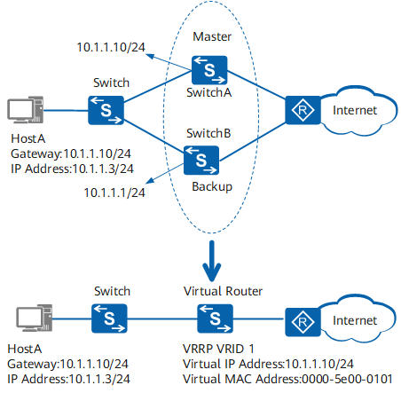
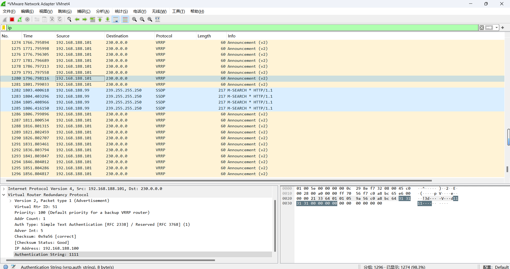
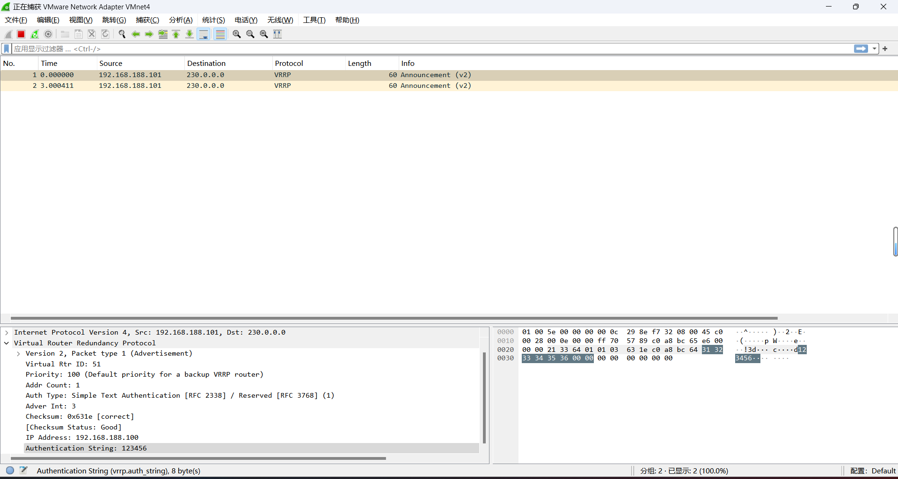
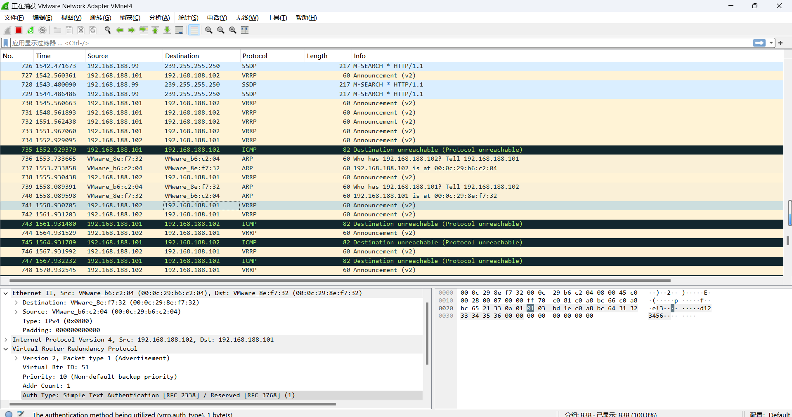
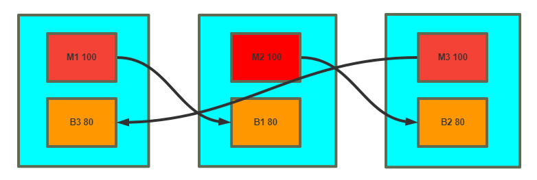
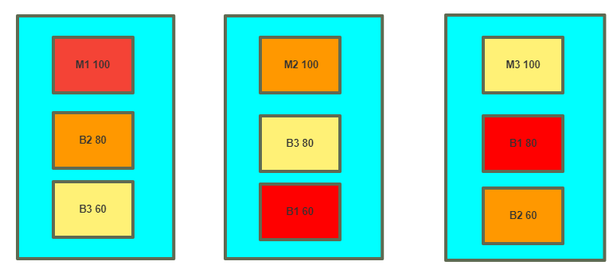

# Keepalived高可用集群

**（keepalived 是高可用集群的通用无状态应用解决方案）**

# 1 介绍

## 1.1 

**三种集群类型**

```sh
LB：nginx/lvs/haproxy

HA：redis/mysql/zookeeper/kafka/KeepAlived 通用的高可用集群,更适合无状态的服务/SPoF: Single Point of Failure，解决单点故障

HPC
```

**vrrp协议：Virtual Router Redundancy Protocol**

```
虚拟路由冗余协议,解决静态网关单点风险
物理层:路由器、三层交换机
软件层:keepalived
```


```sh
https://support.huawei.com/enterprise/zh/doc/EDOC1000141382/19258d72/basic-concepts-of-vrrp
https://wenku.baidu.com/view/dc0afaa6f524ccbff1218416.html
https://wenku.baidu.com/view/281ae109ba1aa8114431d9d0.html
```



**相关术语**

```sh
·虚拟路由器：Virtual Router 
·虚拟路由器标识：VRID(0-255)，唯一标识虚拟路由器
·VIP：Virtual IP 
·VMAC：Virutal MAC (00-00-5e-00-01-VRID)
·物理路由器：
	master：主设备
	backup：备用设备
	priority：优先级
```

keepalived架构

# 2 **Keepalived** **安装**

## 2.1 包安装

```
#CentOS
[root@centos ~]#yum -y install keepalived 
#ubuntu
[root@ubuntu1804 ~]#apt update && apt -y install keepalived
```

### 2.1.1 centos安装keepalived

```sh
[root@Rocky8 ~]# dnf list keepalived
Last metadata expiration check: 0:02:45 ago on Sat 08 Jun 2024 01:39:07 PM CST.
Installed Packages
keepalived.x86_64                               2.1.5-6.el8                                     @AppStream

[root@Rocky8 ~]# dnf install -y keepalived
[root@Rocky8 ~]# dnf info keepalived
Last metadata expiration check: 0:04:14 ago on Sat 08 Jun 2024 01:39:07 PM CST.
Installed Packages
Name         : keepalived
Version      : 2.1.5
Release      : 6.el8
Architecture : x86_64
Size         : 1.5 M
Source       : keepalived-2.1.5-6.el8.src.rpm
Repository   : @System
From repo    : AppStream
Summary      : High Availability monitor built upon LVS, VRRP and service pollers
URL          : http://www.keepalived.org/
License      : GPLv2+
Description  : Keepalived provides simple and robust facilities for load balancing
             : and high availability to Linux system and Linux based infrastructures.
             : The load balancing framework relies on well-known and widely used
             : Linux Virtual Server (IPVS) kernel module providing Layer4 load
             : balancing. Keepalived implements a set of checkers to dynamically and
             : adaptively maintain and manage load-balanced server pool according
             : their health. High availability is achieved by VRRP protocol. VRRP is
             : a fundamental brick for router failover. In addition, keepalived
             : implements a set of hooks to the VRRP finite state machine providing
             : low-level and high-speed protocol interactions. Keepalived frameworks
             : can be used independently or all together to provide resilient
             : infrastructures.
[root@Rocky8 ~]# systemctl start keepalived.service
[root@Rocky8 ~]# ps aux|grep keepalived
root        1946  0.0  0.1 109628  2692 ?        Ss   13:39   0:00 keepalived
root        1947  0.0  0.2 109752  4892 ?        S    13:39   0:00 keepalived
root        1948  0.0  0.1 109628  3024 ?        S    13:39   0:00 keepalived
root        1978  0.0  0.0 221940  1136 pts/0    S+   13:43   0:00 grep --color=auto keepalived

[root@Rocky8 ~]# pstree -p|grep keepalived
           |-keepalived(1946)-+-keepalived(1947)
           |                  `-keepalived(1948)
```

### 2.1.2 ubuntu安装keepalived

范例：Ubuntu20.04

```sh
#查看系统自带版本
[root@ubuntu2004 ~]# apt list keepalived
Listing... Done
keepalived/focal-updates 1:2.0.19-2ubuntu0.2 amd64
N: There are 2 additional versions. Please use the '-a' switch to see them.
[root@ubuntu2004 ~]# apt install keepalived -y

#默认没有配置文件无法启动
[root@ubuntu2004 ~]# systemctl enable --now keepalived.service
[root@ubuntu2004 ~]# systemctl status keepalived.service 
● keepalived.service - Keepalive Daemon (LVS and VRRP)
     Loaded: loaded (/lib/systemd/system/keepalived.service; enabled; vendor preset: enabled)
     Active: inactive (dead)
  Condition: start condition failed at Sat 2024-06-08 13:46:44 CST; 58s ago

Jun 08 13:46:22 ubuntu2004 systemd[1]: Condition check resulted in Keepalive Daemon (LVS and VRRP) being skipped.
Jun 08 13:46:44 ubuntu2004 systemd[1]: Condition check resulted in Keepalive Daemon (LVS and VRRP) being skipped.

#查看服务默认安装目录
[root@ubuntu2004 ~]# dpkg -L keepalived 
/.
/etc
/etc/dbus-1
/etc/dbus-1/system.d
/etc/dbus-1/system.d/org.keepalived.Vrrp1.conf
/etc/default
/etc/default/keepalived
/etc/init.d
/etc/init.d/keepalived
/etc/keepalived
/lib
/lib/systemd
/lib/systemd/system
/lib/systemd/system/keepalived.service
/usr
/usr/bin
/usr/bin/genhash
/usr/sbin
/usr/sbin/keepalived
/usr/share
/usr/share/dbus-1
/usr/share/dbus-1/interfaces
/usr/share/dbus-1/interfaces/org.keepalived.Vrrp1.Instance.xml
/usr/share/dbus-1/interfaces/org.keepalived.Vrrp1.Vrrp.xml
/usr/share/doc
/usr/share/doc/keepalived
/usr/share/doc/keepalived/AUTHOR
/usr/share/doc/keepalived/CONTRIBUTORS
/usr/share/doc/keepalived/README
/usr/share/doc/keepalived/TODO.gz
/usr/share/doc/keepalived/changelog.Debian.gz
/usr/share/doc/keepalived/copyright
/usr/share/doc/keepalived/keepalived.conf.SYNOPSIS
/usr/share/doc/keepalived/samples
/usr/share/doc/keepalived/samples/client.pem
/usr/share/doc/keepalived/samples/dh1024.pem
/usr/share/doc/keepalived/samples/keepalived.conf.HTTP_GET.port
/usr/share/doc/keepalived/samples/keepalived.conf.IPv6
/usr/share/doc/keepalived/samples/keepalived.conf.SMTP_CHECK
/usr/share/doc/keepalived/samples/keepalived.conf.SSL_GET
/usr/share/doc/keepalived/samples/keepalived.conf.conditional_conf
/usr/share/doc/keepalived/samples/keepalived.conf.fwmark
/usr/share/doc/keepalived/samples/keepalived.conf.inhibit
/usr/share/doc/keepalived/samples/keepalived.conf.misc_check
/usr/share/doc/keepalived/samples/keepalived.conf.misc_check_arg
/usr/share/doc/keepalived/samples/keepalived.conf.quorum
/usr/share/doc/keepalived/samples/keepalived.conf.sample
/usr/share/doc/keepalived/samples/keepalived.conf.status_code
/usr/share/doc/keepalived/samples/keepalived.conf.track_interface
/usr/share/doc/keepalived/samples/keepalived.conf.virtual_server_group
/usr/share/doc/keepalived/samples/keepalived.conf.virtualhost
/usr/share/doc/keepalived/samples/keepalived.conf.vrrp
/usr/share/doc/keepalived/samples/keepalived.conf.vrrp.localcheck
/usr/share/doc/keepalived/samples/keepalived.conf.vrrp.lvs_syncd
/usr/share/doc/keepalived/samples/keepalived.conf.vrrp.routes
/usr/share/doc/keepalived/samples/keepalived.conf.vrrp.rules
/usr/share/doc/keepalived/samples/keepalived.conf.vrrp.scripts
/usr/share/doc/keepalived/samples/keepalived.conf.vrrp.static_ipaddress
/usr/share/doc/keepalived/samples/keepalived.conf.vrrp.sync
/usr/share/doc/keepalived/samples/root.pem
/usr/share/doc/keepalived/samples/sample.misccheck.smbcheck.sh
/usr/share/doc/keepalived/samples/sample_notify_fifo.sh
/usr/share/man
/usr/share/man/man1
/usr/share/man/man1/genhash.1.gz
/usr/share/man/man5
/usr/share/man/man5/keepalived.conf.5.gz
/usr/share/man/man8
/usr/share/man/man8/keepalived.8.gz
/usr/share/snmp
/usr/share/snmp/mibs
/usr/share/snmp/mibs/KEEPALIVED-MIB.txt
/usr/share/snmp/mibs/VRRP-MIB.txt
/usr/share/snmp/mibs/VRRPv3-MIB.txt

#利用范例生成配置文件
[root@ubuntu2004 ~]# cp /usr/share/doc/keepalived/samples/keepalived.conf.sample /etc/keepalived/keepalived.conf
[root@ubuntu2004 ~]# systemctl start keepalived

#验证服务状态
[root@ubuntu2004 ~]# pstree -p |grep keepalived
           |-keepalived(9730)-+-keepalived(9744)
           |                  `-keepalived(9746)
[root@ubuntu2004 ~]# ps auxf |grep keepalived
root       10142  0.0  0.0   6432   656 pts/0    S+   13:53   0:00          \_ grep --color=auto keepalived
root        9730  0.0  0.2  25272  8148 ?        Ss   13:52   0:00 /usr/sbin/keepalived --dont-fork
root        9744  0.0  0.0  25272  2848 ?        S    13:52   0:00  \_ /usr/sbin/keepalived --dont-fork
root        9746  0.0  0.0  25272   936 ?        S    13:52   0:00  \_ /usr/sbin/keepalived --dont-fork
```

## 2.2 编译安装

```sh
#Ubuntu20.04和22.04安装相关包
[root@ubuntu2004 ~]# apt update && apt -y install make gcc ipvsadm build-essential pkg-config automake autoconf libipset-dev libnl-3-dev libnl-genl-3-dev libssl-dev libxtables-dev libip4tc-dev libip6tc-dev libmagic-dev libsnmp-dev libglib2.0-dev libpcre2-dev libnftnl-dev libmnl-dev libsystemd-dev

#Ubuntu18.04安装相关包
[root@ubuntu1804 ~]#apt update 
[root@ubuntu1804 ~]#apt -y install gcc curl openssl libssl-dev libpopt-dev daemon build-essential

#红帽系统安装相关包
[root@centos7 ~]#yum install gcc curl openssl-devel libnl3-devel net-snmp-devel

#下载解压
[root@centos7 ~]#wget https://keepalived.org/software/keepalived-2.0.20.tar.gz
[root@centos7 ~]#tar xvf keepalived-2.0.20.tar.gz -C /usr/local/src
[root@centos7 ~]#cd /usr/local/src/keepalived-2.0.20/
```

下载源码并解压

```sh
[root@ubuntu2004 ~]#wget https://keepalived.org/software/keepalived-2.3.1.tar.gz
[root@ubuntu2004 ~]#tar zxf keepalived-2.3.1.tar.gz -C /usr/local/src/
[root@ubuntu2004 /usr/local/src]#ls keepalived-2.3.1/ -l
total 1244
-rw-rw-r--  1 ding ding  44361 May 24 14:46 aclocal.m4
-rw-rw-r--  1 ding ding     41 Sep 28  2009 AUTHOR
-rwxrwxr-x  1 ding ding    100 Dec 21  2020 autogen.sh
drwxrwxr-x  2 ding ding   4096 May 24 14:46 bin_install
drwxrwxr-x  2 ding ding   4096 May 24 14:46 build-aux
-rwxrwxr-x  1 ding ding    100 May  5  2020 build_setup
-rw-rw-r--  1 ding ding 507110 Jan 27  2021 ChangeLog
-rwxrwxr-x  1 ding ding 451003 May 24 14:46 configure
-rw-rw-r--  1 ding ding 118553 May 24 14:37 configure.ac
-rw-rw-r--  1 ding ding    823 Dec 25  2017 CONTRIBUTORS
-rw-rw-r--  1 ding ding  18092 Nov 20  2012 COPYING
drwxrwxr-x  5 ding ding   4096 May 24 14:46 doc
-rw-rw-r--  1 ding ding   2720 Nov 21  2021 Dockerfile.in
-rw-rw-r--  1 ding ding   9954 Mar  2 01:00 INSTALL
drwxrwxr-x 10 ding ding   4096 May 24 14:46 keepalived
-rw-rw-r--  1 ding ding  10714 Jun  7  2023 keepalived.spec.in
drwxrwxr-x  2 ding ding   4096 May 24 14:46 lib
drwxrwxr-x  2 ding ding   4096 May 24 14:46 m4
-rw-rw-r--  1 ding ding   3212 Nov 21  2021 Makefile.am
-rw-rw-r--  1 ding ding  31979 May 24 14:46 Makefile.in
-rw-rw-r--  1 ding ding   2963 Nov 22  2023 README.md
drwxrwxr-x  3 ding ding   4096 Jul  7  2022 snap
-rw-rw-r--  1 ding ding   6898 Mar 15  2021 TODO
drwxrwxr-x  2 ding ding   4096 May 24 14:46 tools

#选项--disable-fwmark 可用于禁用iptables规则,可防止VIP无法访问,无此选项默认会启用iptables规则，注意：新版--disable-fwmark仍然会有iptables规则

#编译源码
[root@ubuntu2004 /usr/local/src/keepalived-2.3.1]# ./configure --prefix=/apps/keepalived
[root@ubuntu2004 /usr/local/src/keepalived-2.3.1]# make -j 2 && make install

#查看版本
[root@ubuntu2004 /usr/local/src/keepalived-2.3.1]#/apps/keepalived/sbin/keepalived -v
Keepalived v2.3.1 (05/24,2024)

Copyright(C) 2001-2024 Alexandre Cassen, <acassen@gmail.com>

Built with kernel headers for Linux 5.4.255
Running on Linux 5.4.0-162-generic #179-Ubuntu SMP Mon Aug 14 08:51:31 UTC 2023
Distro: Ubuntu 20.04.3 LTS

configure options: --prefix=/apps/keepalived

Config options:  LIBIPSET_DYNAMIC NFTABLES LVS VRRP VRRP_AUTH VRRP_VMAC OLD_CHKSUM_COMPAT INIT=systemd SYSTEMD_NOTIFY

System options:  VSYSLOG MEMFD_CREATE IPV6_MULTICAST_ALL IPV4_DEVCONF LIBNL3 RTA_ENCAP RTA_EXPIRES RTA_NEWDST RTA_PREF FRA_SUPPRESS_PREFIXLEN FRA_SUPPRESS_IFGROUP FRA_TUN_ID RTAX_CC_ALGO RTAX_QUICKACK RTEXT_FILTER_SKIP_STATS FRA_L3MDEV FRA_UID_RANGE RTAX_FASTOPEN_NO_COOKIE RTA_VIA FRA_PROTOCOL FRA_IP_PROTO FRA_SPORT_RANGE FRA_DPORT_RANGE RTA_TTL_PROPAGATE IFA_FLAGS LWTUNNEL_ENCAP_MPLS LWTUNNEL_ENCAP_ILA IPTABLES NET_LINUX_IF_H_COLLISION LIBIPVS_NETLINK IPVS_DEST_ATTR_ADDR_FAMILY IPVS_SYNCD_ATTRIBUTES IPVS_64BIT_STATS IPVS_TUN_TYPE IPVS_TUN_CSUM IPVS_TUN_GRE VRRP_IPVLAN IFLA_LINK_NETNSID GLOB_BRACE GLOB_ALTDIRFUNC INET6_ADDR_GEN_MODE VRF SO_MARK

#准备自启动service文件
[root@ubuntu2004 ~]#cp /usr/local/src/keepalived-2.3.1/keepalived/keepalived.service /lib/systemd/system/keepalived.service 

#准备配置文件，默认无配置文件
[root@ubuntu2004 ~]#cp /usr/local/src/keepalived-2.3.1/keepalived/etc/keepalived/keepalived.conf.sample /apps/keepalived/etc/keepalived/keepalived.conf

[root@ubuntu2004 ~]#systemctl enable --now  keepalived.service 
```

## **2.3 KeepAlived** **配置说明**

### 2.3.1 配置文件组成部分

配置文件

```sh
[root@ubuntu2004 ~]#ll /apps/keepalived/etc/keepalived/keepalived.conf
-rw-r--r-- 1 root root 3625 Jun  8 14:49 /apps/keepalived/etc/keepalived/keepalived.conf
```

配置文件组成

```bash
1、GLOBAL CONFIGURATION
	Global definitions：定义邮件配置，route_id，vrrp配置，多播地址等
2、VRRP CONFIGURATION
	VRRP instance(s)：定义每个vrrp虚拟路由器
3、LVS CONFIGURATION
	Virtual server group(s)
	Virtual server(s)：LVS集群的VS和RS
```

### **2.3.2** **配置语法说明**

**帮助**

```sh
#包安装
man keepalived.conf
#编译安装
man /apps/keepalived/share/man/man5/keepalived.conf.5
```

#### 2.3.2.1 全局配置

```bash
#/etc/keepalived/keepalived.conf 
global_defs {
 notification_email {
 root@localhost #keepalived 发生故障切换时邮件发送的目标邮箱，可以按行区分写多个
 root@wangxiaochun.com 
  29308620@qq.com 
 }
 notification_email_from keepalived@localhost  #发邮件的地址
 smtp_server 127.0.0.1     #邮件服务器地址
 smtp_connect_timeout 30   #邮件服务器连接timeout
 router_id ka1.example.com #每个keepalived主机唯一标识，建议使用当前主机名，如果多节点重名可能会影响切换脚本执行
 vrrp_skip_check_adv_addr  #默认会对所有通告报文都检查，会比较消耗性能，启用此配置后，如果收到的通告报文和上一个报文是同一个路由器，则跳过检查
  vrrp_strict               #严格遵守VRRP协议,启用此项后以下状况将无法启动服务或工作异常:1.无VIP地址 2.配置了单播邻居 3.在VRRP版本2中有IPv6地址，开启动此项并且没有配置vrrp_iptables时会自动开启iptables防火墙规则，默认导致VIP无法访问,建议不加此项配置
 vrrp_garp_interval 0      #gratuitous ARP messages 报文发送延迟，0表示不延迟
 vrrp_gna_interval 0       #unsolicited NA messages （不请自来）消息发送延迟
 vrrp_mcast_group4 224.0.0.18 #指定组播IP地址范围：224.0.0.0到239.255.255.255,默认值：224.0.0.18，如果配置了单播，此项失效
 vrrp_iptables   #此项和vrrp_strict同时开启时，则不会添加防火墙规则,如果无配置vrrp_strict项,则无需启用此项配置，注意：新版加此项仍有iptables规则
}
```

#### 2.3.2.2 配置虚拟路由器

```bash
vrrp_instance <STRING> { #<String>为vrrp的实例名,一般为业务名称
 配置参数
 ......
 }
#配置参数：
state MASTER|BACKUP#当前节点在此虚拟路由器上的初始状态，状态为MASTER或者BACKUP，当priority相同时，先启动的节点优先获取VIP
interface IFACE_NAME #绑定为当前VRRP虚拟路由器使用的物理接口，如：eth0,bond0,br0,可以和VIP不在一个网卡，实现心跳功能
virtual_router_id VRID #每个虚拟路由器唯一标识，范围：0-255，每个虚拟路由器此值必须唯一，否则服务无法启动，同属一个虚拟路由器的多个keepalived节点必须相同,务必要确认在同一网络中此值必须唯一
priority 100 #当前物理节点在此虚拟路由器的优先级，范围：1-254，每个keepalived主机节点此值不同，如果多节点此值相同，则先来后到原理获取VIP
advert_int 1 #vrrp通告的时间间隔，默认1s
authentication { #认证机制
 auth_type AH|PASS   #AH为IPSEC认证(不推荐),PASS为简单密码(建议使用)
 auth_pass <PASSWORD> #预共享密钥，仅前8位有效，同一个虚拟路由器的多个keepalived节点必须一样
}
virtual_ipaddress { #虚拟IP,生产环境可能指定几十上百个VIP地址
 <IPADDR>/<MASK> brd <IPADDR> dev <STRING> scope <SCOPE> label <LABEL>
 192.168.200.100 #指定VIP，不指定网卡，默认为eth0,注意：不指定/prefix,默认为/32
 192.168.200.101/24 dev eth1   #指定VIP的网卡，建议和interface指令指定的网卡不在一个网卡
 192.168.200.102/24 dev eth2 label eth2:1 #指定VIP的网卡label 
}
track_interface { #配置监控网络接口，一旦出现故障，则转为FAULT状态实现地址转移
 eth0
 eth1
 …
}
```

**范例：**

```bash
[root@ubuntu2004 ~]#cat /apps/keepalived/etc/keepalived/keepalived.conf
! Configuration File for keepalived

global_defs {
   router_id ka1.dingbh.top
   vrrp_mcast_group4 230.0.0.18
   vrrp_strict 	#开启限制，会自动生效防火墙设置，导致无访问VIP
}

vrrp_instance VI_1 {
    state MASTER
    interface eth0
    virtual_router_id 51	#修改此行
    priority 100
    advert_int 1
    authentication {
        auth_type PASS
        auth_pass 1111
    }
    virtual_ipaddress {
        192.168.200.16
        192.168.200.17
        192.168.200.18
    }

    # Allow packets addressed to the VIPs above to be received
    accept
}

#重启服务并验证
[root@ubuntu2004 ~]#systemctl restart keepalived.service 
[root@ubuntu2004 ~]#ip a
1: lo: <LOOPBACK,UP,LOWER_UP> mtu 65536 qdisc noqueue state UNKNOWN group default qlen 1000
    link/loopback 00:00:00:00:00:00 brd 00:00:00:00:00:00
    inet 127.0.0.1/8 scope host lo
       valid_lft forever preferred_lft forever
    inet6 ::1/128 scope host 
       valid_lft forever preferred_lft forever
2: eth0: <BROADCAST,MULTICAST,UP,LOWER_UP> mtu 1500 qdisc fq_codel state UP group default qlen 1000
    link/ether 00:0c:29:8e:f7:28 brd ff:ff:ff:ff:ff:ff
    inet 11.0.1.101/24 brd 11.0.1.255 scope global eth0
       valid_lft forever preferred_lft forever
    inet 192.168.200.16/32 scope global eth0
       valid_lft forever preferred_lft forever
    inet 192.168.200.17/32 scope global eth0
       valid_lft forever preferred_lft forever
    inet 192.168.200.18/32 scope global eth0
       valid_lft forever preferred_lft forever
    inet6 fe80::20c:29ff:fe8e:f728/64 scope link 
       valid_lft forever preferred_lft forever

[root@ubuntu2004 ~]#iptables -vnL
Chain INPUT (policy ACCEPT 398 packets, 23708 bytes)
 pkts bytes target     prot opt in     out     source               destination         

Chain FORWARD (policy ACCEPT 0 packets, 0 bytes)
 pkts bytes target     prot opt in     out     source               destination         

Chain OUTPUT (policy ACCEPT 494 packets, 45056 bytes)
 pkts bytes target     prot opt in     out     source               destination         
[root@ubuntu2004 ~]#ping 192.168.200.16
PING 192.168.200.16 (192.168.200.16) 56(84) bytes of data.
ping: sendmsg: Operation not permitted
ping: sendmsg: Operation not permitted
^C
--- 192.168.200.16 ping statistics ---
2 packets transmitted, 0 received, 100% packet loss, time 1023ms
```

**范例：keepalived一主一从架构实现**

```bash
#keepalived主机配置
[root@ka1 ~]# hostnamectl set-hostname ka1.dingbh.top
[root@ka1 ~]# vim /apps/keepalived/etc/keepalived/keepalived.conf

! Configuration File for keepalived
  
global_defs {
   router_id ka1.dingbh.top
   vrrp_mcast_group4 230.0.0.0
}

vrrp_instance VI_1 {
    state MASTER		#只做表示，不起实际作用，依靠优先级
    interface eth1		#建议单独设置网段
    virtual_router_id 51
    priority 100		#依靠此项实现主备
    advert_int 5		#默认检测实践，需主备同时修改生效
    authentication {	
        auth_type PASS	#心跳线验证信息，主备服务器须保持一致
        auth_pass 1111
    }
    virtual_ipaddress {
        192.168.188.100/24 dev eth0 label eth0:1	#虚拟地址网卡绑定信息
    }
}

#keepalived备机配置
[root@ka2 ~]# hostnamectl set-hostname ka2.dingbh.top
[root@ka2 ~]#vim /apps/keepalived/etc/keepalived/keepalived.conf

! Configuration File for keepalived
  
global_defs {
   router_id ka2.dingbh.top
   vrrp_mcast_group4 230.0.0.0
}

vrrp_instance VI_1 {
    state BACKUP
    interface eth1
    virtual_router_id 51
    priority 10
    advert_int 5
    authentication {
        auth_type PASS
        auth_pass 1111
    }
    virtual_ipaddress {
        192.168.188.100/24 dev eth0 label eth0:1
    }
}

#验证
[root@ubuntu2004 ~]# ip a
1: lo: <LOOPBACK,UP,LOWER_UP> mtu 65536 qdisc noqueue state UNKNOWN group default qlen 1000
    link/loopback 00:00:00:00:00:00 brd 00:00:00:00:00:00
    inet 127.0.0.1/8 scope host lo
       valid_lft forever preferred_lft forever
    inet6 ::1/128 scope host 
       valid_lft forever preferred_lft forever
2: eth1: <BROADCAST,MULTICAST,UP,LOWER_UP> mtu 1500 qdisc fq_codel state UP group default qlen 1000
    link/ether 00:0c:29:6a:18:af brd ff:ff:ff:ff:ff:ff
    inet 192.168.188.130/24 brd 192.168.188.255 scope global eth1
       valid_lft forever preferred_lft forever
    inet6 fe80::20c:29ff:fe6a:18af/64 scope link 
       valid_lft forever preferred_lft forever

#抓包信息
[root@ubuntu2004 ~]# tcpdump -i eth1 host 230.0.0.0 -nn
tcpdump: verbose output suppressed, use -v or -vv for full protocol decode
listening on eth1, link-type EN10MB (Ethernet), capture size 262144 bytes
19:46:18.633816 IP 192.168.188.101 > 230.0.0.0: VRRPv2, Advertisement, vrid 51, prio 100, authtype simple, intvl 5s, length 20
19:46:23.634695 IP 192.168.188.101 > 230.0.0.0: VRRPv2, Advertisement, vrid 51, prio 100, authtype simple, intvl 5s, length 20
19:46:28.635132 IP 192.168.188.101 > 230.0.0.0: VRRPv2, Advertisement, vrid 51, prio 100, authtype simple, intvl 5s, length 20
```



```bash
#查看虚拟地址
[root@ka1 ~]#hostname -I
11.0.1.101 192.168.188.100 192.168.188.101

[root@ka2 ~]#hostname -I
11.0.1.102 192.168.188.102 

#模拟故障实现地址漂移
[root@ka1 ~]#systemctl stop keepalived.service 
[root@ka1 ~]#hostname -I
11.0.1.101 192.168.188.101

[root@ka2 ~]#hostname -I
11.0.1.102 192.168.188.100 192.168.188.102 

[root@ubuntu2004 ~]# tcpdump -i eth1 host 230.0.0.0 -nn

......

19:49:38.655072 IP 192.168.188.101 > 230.0.0.0: VRRPv2, Advertisement, vrid 51, prio 100, authtype simple, intvl 5s, length 20
19:49:41.343519 IP 192.168.188.101 > 230.0.0.0: VRRPv2, Advertisement, vrid 51, prio 0, authtype simple, intvl 5s, length 20
19:49:42.304855 IP 192.168.188.102 > 230.0.0.0: VRRPv2, Advertisement, vrid 51, prio 10, authtype simple, intvl 5s, length 20
19:49:47.305635 IP 192.168.188.102 > 230.0.0.0: VRRPv2, Advertisement, vrid 51, prio 10, authtype simple, intvl 5s, length 20
19:49:52.305839 IP 192.168.188.102 > 230.0.0.0: VRRPv2, Advertisement, vrid 51, prio 10, authtype simple, intvl 5s, length 20
19:49:57.306133 IP 192.168.188.102 > 230.0.0.0: VRRPv2, Advertisement, vrid 51, prio 10, authtype simple, intvl 5s, length 20
19:50:02.306678 IP 192.168.188.102 > 230.0.0.0: VRRPv2, Advertisement, vrid 51, prio 10, authtype simple, intvl 5s, length 20

......
```


## 2.4 启用 Keepalived 日志功能

默认 keepalived的日志记录在LOG_DAEMON中，记录在/var/log/syslog或messages, 也支持自定义日志配置

**范例：实现日志功能,**

**注意:编译安装方式如果实现有问题，可以重启主机可以解决**

```bash
#包安装修改文件路径
[root@ka1 ~]#vim /etc/sysconfig/keepalived
KEEPALIVED_OPTIONS="-D -S 6"

#编译安装修改文件路径
[root@ka1 ~]#grep ExecStart /lib/systemd/system/keepalived.service
ExecStart=/apps/keepalived/sbin/keepalived   $KEEPALIVED_OPTIONS

#编译安装修改文件路径
[root@ka1 ~]#vim /apps/keepalived/etc/sysconfig/keepalived
# Options for keepalived. See `keepalived --help' output and keepalived(8) and
# keepalived.conf(5) man pages for a list of all options. Here are the most
# common ones :
#
# --vrrp               -P   Only run with VRRP subsystem.
# --check             -C   Only run with Health-checker subsystem.
# --dont-release-vrrp -V   Dont remove VRRP VIPs & VROUTEs on daemon stop.
# --dont-release-ipvs -I   Dont remove IPVS topology on daemon stop.
# --dump-conf         -d   Dump the configuration data.
# --log-detail         -D   Detailed log messages.
# --log-facility       -S   0-7 Set local syslog facility (default=LOG_DAEMON)
#
#修改下面行
KEEPALIVED_OPTIONS="-D -S 6"  

#修改日志服务配置
[root@ka1 ~]#vim /etc/rsyslog.conf
local6.*             /var/log/keepalived.log  

#重启服务生效
[root@ka1 ~]#systemctl restart keepalived.service rsyslog.service 

#如果不行，就重启主机
[root@ka1 ~]#reboot
[root@ka1 ~]#tail -f /var/log/keepalived.log
Jun  9 21:10:18 ka1 Keepalived_vrrp[94100]: (VI_1) received lower priority (10) advert from 192.168.188.102 - discarding
Jun  9 21:10:19 ka1 Keepalived_vrrp[94100]: (VI_1) Receive advertisement timeout
Jun  9 21:10:19 ka1 Keepalived_vrrp[94100]: (VI_1) Entering MASTER STATE
Jun  9 21:10:19 ka1 Keepalived_vrrp[94100]: (VI_1) setting VIPs.
Jun  9 21:10:19 ka1 Keepalived_vrrp[94100]: (VI_1) Sending/queueing gratuitous ARPs on eth0 for 192.168.188.100
Jun  9 21:10:19 ka1 Keepalived_vrrp[94100]: Sending gratuitous ARP on eth0 for 192.168.188.100
Jun  9 21:10:19 ka1 Keepalived_vrrp[94100]: message repeated 4 times: [ Sending gratuitous ARP on eth0 for 192.168.188.100]
Jun  9 21:10:24 ka1 Keepalived_vrrp[94100]: (VI_1) Sending/queueing gratuitous ARPs on eth0 for 192.168.188.100
Jun  9 21:10:24 ka1 Keepalived_vrrp[94100]: Sending gratuitous ARP on eth0 for 192.168.188.100
Jun  9 21:10:24 ka1 Keepalived_vrrp[94100]: message repeated 4 times: [ Sending gratuitous ARP on eth0 for 192.168.188.100]
```

## **2.5 **实现 **Keepalived** **独立子配置文件**

当生产环境复杂时， /etc/keepalived/keepalived.conf 文件中保存所有集群的配置会导致内容过多，不易管理

可以将不同集群的配置，比如：不同集群的VIP配置放在独立的子配置文件中

利用include 指令可以实现包含子配置文件

**格式:**

```sh
include /path/file
```

**范例:**

```sh
#创建配置文件指定目录
[root@ka1 ~]#mkdir /apps/keepalived/conf.d/

#添加子配置文件目录
[root@ka1 ~]#vim /apps/keepalived/etc/keepalived/keepalived.conf

! Configuration File for keepalived
  
global_defs {
   router_id ka1.dingbh.top
   vrrp_mcast_group4 230.0.0.0
}
include /apps/keepalived/conf.d/*.conf		#将VRRP相关配置放在子配置文件中

#创建业务配置文件
[root@ka1 ~]#cat /apps/keepalived/conf.d/keep.conf
vrrp_instance VI_1 {
    state MASTER
    interface eth1
    virtual_router_id 51
    priority 100
    advert_int 3
    authentication {
        auth_type ROOT
        auth_pass admin
    }
    virtual_ipaddress {
        192.168.188.100/24 dev eth0 label eth0:1
    }
}
[root@ka1 ~]# systemctl restart keepalived.service
[root@ka1 ~]# reboot

#测试
[root@ubuntu2004 ~]# tcpdump -i eth1 host 230.0.0.0 -nn
tcpdump: verbose output suppressed, use -v or -vv for full protocol decode
listening on eth1, link-type EN10MB (Ethernet), capture size 262144 bytes
21:19:40.223740 IP 192.168.188.101 > 230.0.0.0: VRRPv2, Advertisement, vrid 51, prio 100, authtype none, intvl 3s, length 20
21:19:43.224388 IP 192.168.188.101 > 230.0.0.0: VRRPv2, Advertisement, vrid 51, prio 100, authtype none, intvl 3s, length 20
21:19:46.225282 IP 192.168.188.101 > 230.0.0.0: VRRPv2, Advertisement, vrid 51, prio 100, authtype none, intvl 3s, length 20
21:19:49.225594 IP 192.168.188.101 > 230.0.0.0: VRRPv2, Advertisement, vrid 51, prio 100, authtype none, intvl 3s, length 20
21:19:52.226319 IP 192.168.188.101 > 230.0.0.0: VRRPv2, Advertisement, vrid 51, prio 100, authtype none, intvl 3s, length 20
21:19:55.227124 IP 192.168.188.101 > 230.0.0.0: VRRPv2, Advertisement, vrid 51, prio 100, authtype none, intvl 3s, length 20
21:19:58.227442 IP 192.168.188.101 > 230.0.0.0: VRRPv2, Advertisement, vrid 51, prio 100, authtype none, intvl 3s, length 20
```

# **3 Keepalived** **实现** **VRRP**

## 3.1 实现Master/Backup的 Keepalived 单主架构

### 3.1.1 MASTER配置

```bash
[root@ka1 ~]# vim /apps/keepalived/etc/keepalived/keepalived.conf
global_defs {
 notification_email {
 root@localhost #keepalived 发生故障切换时邮件发送的对象，可以按行区分写多个
 }
 notification_email_from keepalived@localhost
 smtp_server 127.0.0.1
 smtp_connect_timeout 30
 router_id ka1.example.com
 vrrp_skip_check_adv_addr #所有报文都检查比较消耗性能，此配置为如果收到的报文和上一个报文是同一个路由器则跳过检查报文中的源地址
 #vrrp_strict #严格遵守VRRP协议,禁止状况:1.无VIP地址,2.配置了单播邻居,3.在VRRP版本2中有IPv6地址
 vrrp_garp_interval 0 #ARP报文发送延迟
 vrrp_gna_interval 0 #消息发送延迟
 vrrp_mcast_group4 224.0.0.18 #默认组播IP地址，可指定组播范围：224.0.0.0到239.255.255.255
 }

vrrp_instance VI_1 {
 state MASTER           #在另一个节点上为BACKUP,如果当priority相同时,先启动的节点优先获取VIP
 interface eth1
 virtual_router_id 51 	#每个虚拟路由器必须唯一，同属一个虚拟路由器的多个keepalived节点必须相同
 priority 100           #在另一个结点上为10
 advert_int 3
 authentication {
   auth_type PASS       #预共享密钥认证，同一个虚拟路由器的keepalived节点必须一样
   auth_pass 123456
 }
 virtual_ipaddress {
    192.168.188.100/24 dev eth0 label eth0:1
 }
}
```

### 3.1.2 BACKUP配置

```sh
[root@ka2 ~]# vim /apps/keepalived/etc/keepalived/keepalived.conf
global_defs {
 notification_email {
 root@localhost #keepalived 发生故障切换时邮件发送的对象，可以按行区分写多个
 }
 notification_email_from keepalived@localhost
 smtp_server 127.0.0.1
 smtp_connect_timeout 30
 router_id ka1.example.com
 vrrp_skip_check_adv_addr #所有报文都检查比较消耗性能，此配置为如果收到的报文和上一个报文是同一个路由器则跳过检查报文中的源地址
 #vrrp_strict #严格遵守VRRP协议,禁止状况:1.无VIP地址,2.配置了单播邻居,3.在VRRP版本2中有IPv6地址
 vrrp_garp_interval 0 #ARP报文发送延迟
 vrrp_gna_interval 0 #消息发送延迟
 vrrp_mcast_group4 224.0.0.18 #默认组播IP地址，可指定组播范围：224.0.0.0到239.255.255.255
 }

vrrp_instance VI_1 {
    state BACKUP
    interface eth1
    virtual_router_id 51
    priority 10
    advert_int 3
    authentication {
        auth_type PASS
        auth_pass 123456
    }
    virtual_ipaddress {
        192.168.188.100/24 dev eth0 label eth0:1
    }
}
```

**抓包观察VRRP协议**



### 3.1.3 脑裂

主备节点同时拥有同一个VIP，此时为脑裂现象

**注意：脑裂现象原因**

1. **心跳线故障**： 注意:在虚拟机环境中测试可以通过修改网卡的工作模式实现模拟，断开网卡方式无法模拟
2. **防火墙错误配置**：在从节点服务器执行iptables -A INPUT -s 主服务心跳网卡IP -j DROP 进行模拟
3. **Keepalived 配置错误**：多播地址不同，interface错误，virtual_router_id不一致，密码不一致

```sh
#发现脑裂现象
[root@ubuntu2004 ~]# arping -I eth1 -c1 192.168.188.100
ARPING 192.168.188.100
60 bytes from 00:0c:29:b6:c2:04 (192.168.188.100): index=0 time=310.334 usec
60 bytes from 00:0c:29:8e:f7:32 (192.168.188.100): index=1 time=451.671 usec

--- 192.168.188.100 statistics ---
1 packets transmitted, 2 packets received,   0% unanswered (1 extra)
rtt min/avg/max/std-dev = 0.310/0.381/0.452/0.071 ms
```

## 3.2 抢占模式和非抢占模式

### 3.2.1 非抢占模式 nopreempt

默认为抢占模式 preempt，即当高优先级的主机恢复在线后，会抢占低先级的主机的master角色，造成网络抖动，建议设置为非抢占模式 nopreempt ，即高优先级主机恢复后，并不会抢占低优先级主机的master 角色

注意: 非抢占模式下,如果原主机down机, VIP迁移至的新主机, 后续新主机也发生down（（keepalived 服务down））时,VIP还会迁移回修复好的原主机

但如果新主机的服务down掉（keepalived服务正常），原主机也不会接管VIP，仍会由新主机拥有VIP

即非抢占式模式，只是适合当主节点宕机，切换到从节点的一次性的高可用性，后续即使当原主节点修复好，仍无法再次起到高用功能

**注意：要关闭 VIP抢占，必须将各 Keepalived 服务器 state 配置为 BACKUP**

```sh
#ka1主机配置
vrrp_instance VI_1 {
 state BACKUP     #都为BACKUP
 interface eth1
 virtual_router_id 51
 priority 100   	#优先级高
 advert_int 3
 nopreempt         #添加此行，设为nopreempt

#ka2主机配置
vrrp_instance VI_1 {
 state BACKUP        #都为BACKUP
 interface eth1
 virtual_router_id 51
 priority 10      	#优先级低
 advert_int 3
 #nopreempt         #注意：如果ka2主机也是非抢占式，会导致ka1即使优先级降低于ka2，VIP也不会切换至ka2
```

### **3.2.2** **抢占延迟模式** **preempt_delay**

抢占延迟模式，即优先级高的主机恢复后，不会立即抢回VIP，而是延迟一段时间（默认300s）再抢回VIP

但是如果低优先级的主机down机，则立即抢占VIP地址，而不再延迟

```
preempt_delay #     #指定抢占延迟时间为#s，默认延迟300s
```

**注意：需要各keepalived服务器state为BACKUP,并且不要启用 vrrp_strict**

```sh
#ha1主机配置
vrrp_instance VI_1 {
 state BACKUP     #都为BACKUP
 interface eth1
 virtual_router_id 51
 priority 100   	#优先级高
 advert_int 3
 preempt_delay 30		 #抢占延迟模式，默认延迟300s

#ha2主机配置
vrrp_instance VI_1 {
 state BACKUP        #都为BACKUP
 interface eth1
 virtual_router_id 51
 priority 10      	#优先级低
 advert_int 3
```

## 3.3 VIP 单播配置

默认keepalived主机之间利用多播相互通告消息，会造成网络拥塞，可以设置为单播，减少网络流量

另外：有些公有云不支持多播，可以利用单播实现

单播优先于多播，即同时配置，单播生效

**注意：启用** **vrrp_strict** **时，不能启用单播**

```sh
#在所有节点vrrp_instance语句块中设置对方主机的IP，建议设置为专用于对应心跳线网络的地址，而非使
用业务网络
unicast_src_ip <IPADDR>  #指定发送单播的源IP
unicast_peer {
   <IPADDR>     #指定接收单播的对方目标主机IP，如果有多个keepalived,再加其它节点的IP
   ......
}
```

**范例：**

### 3.3.1 master主机配置

```bash
#主配置文件
[root@ka1 ~]#vim /apps/keepalived/etc/keepalived/keepalived.conf

! Configuration File for keepalived
  
global_defs {
   router_id ka1.dingbh.top
   vrrp_mcast_group4 230.0.0.0
}

include /apps/keepalived/conf.d/*.conf 		#单播优先于多播,即配置了单播后，多播将失效   

#子配置文件
[root@ka1 ~]#vim /apps/keepalived/conf.d/keep.conf 

vrrp_instance VI_1 {
    state MASTER
    interface eth1
    virtual_router_id 51
    priority 100
    advert_int 3
    #nopreempt
    #preempt_delay 10
    authentication {
        auth_type PASS
        auth_pass 123456
    }
    virtual_ipaddress {
        192.168.188.100/24 dev eth0 label eth0:1
    }
    unicast_src_ip 192.168.188.101		#本机IP
    unicast_peer {
        192.168.188.102		#指向对方主机IP，如果有多个keepalived,再加其它节点的IP
    }
}

#子配置文件
[root@ka2 ~]#vim /apps/keepalived/conf.d/keep.conf

vrrp_instance VI_1 {
    state BACKUP
    interface eth1
    virtual_router_id 51
    priority 10
    advert_int 3
    authentication {
        auth_type PASS
        auth_pass 123456
    }
    virtual_ipaddress {
        192.168.188.100/24 dev eth0 label eth0:1
    }
    unicast_src_ip 192.168.188.102	#本机IP
    unicast_peer {
        192.168.188.101	
    }
}
```

### 3.3.2 slave配置

```sh
#主配置文件
[root@ka2 ~]#vim /apps/keepalived/etc/keepalived/keepalived.conf

! Configuration File for keepalived
  
global_defs {
   router_id ka1.dingbh.top
   vrrp_mcast_group4 230.0.0.0
}

include /apps/keepalived/conf.d/*.conf 		#单播优先于多播,即配置了单播后，多播将失效 

#子配置文件
[root@ka2 ~]#vim /apps/keepalived/conf.d/keep.conf

vrrp_instance VI_1 {
    state BACKUP
    interface eth1
    virtual_router_id 51
    priority 10
    advert_int 3
    authentication {
        auth_type PASS
        auth_pass 123456
    }
    virtual_ipaddress {
        192.168.188.100/24 dev eth0 label eth0:1
    }
    unicast_src_ip 192.168.188.102	#本机IP
    unicast_peer {
        192.168.188.101		#指向对方主机IP，如果有多个keepalived,再加其它节点的IP
    }

}
```

### 3.3.3 抓包观察

```sh
[root@ubuntu2004 ~]# tcpdump -i eth1 host 192.168.188.101 -nn
tcpdump: verbose output suppressed, use -v or -vv for full protocol decode
listening on eth1, link-type EN10MB (Ethernet), capture size 262144 bytes
22:51:07.035559 IP 192.168.188.101 > 192.168.188.102: VRRPv2, Advertisement, vrid 51, prio 100, authtype simple, intvl 3s, length 20
22:51:10.035759 IP 192.168.188.101 > 192.168.188.102: VRRPv2, Advertisement, vrid 51, prio 100, authtype simple, intvl 3s, length 20
22:51:13.036213 IP 192.168.188.101 > 192.168.188.102: VRRPv2, Advertisement, vrid 51, prio 100, authtype simple, intvl 3s, length 20
22:51:16.036711 IP 192.168.188.101 > 192.168.188.102: VRRPv2, Advertisement, vrid 51, prio 100, authtype simple, intvl 3s, length 20
^C
16 packets captured
16 packets received by filter
0 packets dropped by kernel

#关停master
[root@ubuntu2004 ~]# tcpdump -i eth1 host 192.168.188.101 -nn
tcpdump: verbose output suppressed, use -v or -vv for full protocol decode
listening on eth1, link-type EN10MB (Ethernet), capture size 262144 bytes
22:52:11.414037 IP 192.168.188.102 > 192.168.188.101: VRRPv2, Advertisement, vrid 51, prio 10, authtype simple, intvl 3s, length 20
22:52:11.414326 IP 192.168.188.101 > 192.168.188.102: ICMP 192.168.188.101 protocol 112 unreachable, length 48
22:52:14.414670 IP 192.168.188.102 > 192.168.188.101: VRRPv2, Advertisement, vrid 51, prio 10, authtype simple, intvl 3s, length 20
22:52:14.414984 IP 192.168.188.101 > 192.168.188.102: ICMP 192.168.188.101 protocol 112 unreachable, length 48
22:52:17.414969 IP 192.168.188.102 > 192.168.188.101: VRRPv2, Advertisement, vrid 51, prio 10, authtype simple, intvl 3s, length 20
22:52:17.415281 IP 192.168.188.101 > 192.168.188.102: ICMP 192.168.188.101 protocol 112 unreachable, length 48
22:52:20.415790 IP 192.168.188.102 > 192.168.188.101: VRRPv2, Advertisement, vrid 51, prio 10, authtype simple, intvl 3s, length 20
22:52:20.415939 IP 192.168.188.101 > 192.168.188.102: ICMP 192.168.188.101 protocol 112 unreachable, length 48
22:52:23.416833 IP 192.168.188.102 > 192.168.188.101: VRRPv2, Advertisement, vrid 51, prio 10, authtype simple, intvl 3s, length 20
22:52:23.416965 IP 192.168.188.101 > 192.168.188.102: ICMP 192.168.188.101 protocol 112 unreachable, length 48
```



## 3.4 Keepalived 通知脚本配置

当keepalived的状态变化时，可以自动触发脚本的执行，比如：发邮件通知用户

默认以用户keepalived_script身份执行脚本，如果此用户不存在，以root执行脚本

可以用下面指令指定脚本执行用户的身份

```sh
global_defs { 
 ......
 script_user <USER>
 ......
}
```

### 3.4.1 通知脚本类型

当前节点成为主节点时触发的脚本

```
notify_master <STRING>|<QUOTED-STRING>
```

当前节点转为备节点时触发的脚本

```
notify_backup <STRING>|<QUOTED-STRING>
```

当前节点转为“失败”状态时触发的脚本

```
notify_fault <STRING>|<QUOTED-STRING>
```

通用格式的通知触发机制，一个脚本可完成以上三种状态的转换时的通知

```
notify <STRING>|<QUOTED-STRING>
```

当停止VRRP时触发的脚本

```sh
notify_stop <STRING>|<QUOTED-STRING>
```

### **3.4.2** **脚本的调用方法**

在 vrrp_instance VI_1 语句块的末尾加下面行

```sh
notify_master "/apps/keepalived/conf.d/notify.sh master"
notify_backup "/apps/keepalived/conf.d/notify.sh backup"
notify_fault "/apps/keepalived/conf.d/notify.sh fault"
```

### 3.4.3 实战案例1：实现 Keepalived 状态切换的通知脚本

以下脚本支持RHEL和Ubuntu系统

```bash
[root@ka1 ~]#cat /apps/keepalived/conf.d/notify.sh 
#!/bin/bash
#
#********************************************************************
#Author:            dingbaohang
#QQ:                904748581
#Date:              2024-02-31
#FileName:          notify.sh
#URL:               http://www.dinginx.top
#Description:       The test script
#Copyright (C):     2024 All rights reserved
#********************************************************************

contact='m15269032515@163.com'
email_send='904748581@qq.com'
email_passwd='kqchnzcqsvyubfac'
email_smtp_server='smtp.qq.com'

. /etc/os-release

msg_error() {
  echo -e "\033[1;31m$1\033[0m"
}

msg_info() {
  echo -e "\033[1;32m$1\033[0m"
}

msg_warn() {
  echo -e "\033[1;33m$1\033[0m"
}

color () {
    RES_COL=60
    MOVE_TO_COL="echo -en \\033[${RES_COL}G"
    SETCOLOR_SUCCESS="echo -en \\033[1;32m"
    SETCOLOR_FAILURE="echo -en \\033[1;31m"
    SETCOLOR_WARNING="echo -en \\033[1;33m"
    SETCOLOR_NORMAL="echo -en \E[0m"
    echo -n "$1" && $MOVE_TO_COL
    echo -n "["
    if [ $2 = "success" -o $2 = "0" ] ;then
        ${SETCOLOR_SUCCESS}
        echo -n $"  OK  "    
    elif [ $2 = "failure" -o $2 = "1"  ] ;then 
        ${SETCOLOR_FAILURE}
        echo -n $"FAILED"
    else
        ${SETCOLOR_WARNING}
        echo -n $"WARNING"
    fi
    ${SETCOLOR_NORMAL}
    echo -n "]"
    echo 
}

install_sendemail () {
    if [[ $ID =~ rhel|centos|rocky ]];then
        rpm -q sendemail &> /dev/null ||  yum install -y sendemail
    elif [ $ID = 'ubuntu' ];then
        dpkg -l |grep -q sendemail  || { apt update; apt install -y libio-socket-ssl-perl libnet-ssleay-perl sendemail ; } 
    else
        color "不支持此操作系统，退出!" 1
        exit
    fi
}

send_email () {
    local email_receive="$1"
    local email_subject="$2"
    local email_message="$3"
    sendemail -f $email_send -t $email_receive -u $email_subject -m $email_message -s $email_smtp_server -o message-charset=utf-8 -o tls=yes -xu $email_send -xp $email_passwd
    [ $? -eq 0 ] && color "邮件发送成功!" 0 || color "邮件发送失败!" 1 
}

notify() {
    if [[ $1 =~ ^(master|backup|fault)$ ]];then
        mailsubject="$(hostname) to be $1, vip floating"
        mailbody="$(date +'%F %T'): vrrp transition, $(hostname) changed to be $1"
        send_email "$contact" "$mailsubject" "$mailbody"
   else
        echo "Usage: $(basename $0) {master|backup|fault}"
        exit 1
   fi
}

install_sendemail 
notify $1
```

### 3.4.4 实战案例2：实现 Keepalived 状态切换的通知脚本

下面仅支持**RHEL系统**

#### 3.4.4.1 邮件配置

案例：QQ邮箱配置

```sh
[root@ka1 ~]#cat /etc/mail.rc 
set from=904748581@qq.com
set smtp=smtp.qq.com
set smtp-auth-user=904748581@qq.com
set smtp-auth-password=kqchnzcqsvyubfac
set smtp-auth=login
set ssl-verify=ignore
```

范例：发送测试邮件

```
[root@centos8 ~]# yum -y install mailx 
[root@centos8 ~]# echo "Test Mail"| mail -s Warning root@wangxiaochun.com
```

#### **3.4.4.2** **创建通知脚本**

```sh
#在所有 keepalived节点配置如下
[root@ka1 ~]#cat /etc/keepalived/notify.sh 
#!/bin/bash
#
contact='root@wangxiaochun.com'
notify() {
 mailsubject="$(hostname) to be $1, vip floating"
 mailbody="$(date +'%F %T'): vrrp transition, $(hostname) changed to be $1"
 echo "$mailbody" | mail -s "$mailsubject" $contact
}
case $1 in
master)
 notify master
 ;;
backup)
 notify backup
 ;;
fault)
 notify fault
 ;;
*)
 echo "Usage: $(basename $0) {master|backup|fault}"
 exit 1
 ;;
esac
[root@ka1 ~]#chmod a+x /etc/keepalived/notify.sh 
[root@ka1 ~]#vim /etc/keepalived/keepalived.conf
vrrp_instance VI_1 {
 ......
 virtual_ipaddress {
   10.0.0.10 dev eth0 label eth0:1
 }
 notify_master "/etc/keepalived/notify.sh master"
 notify_backup "/etc/keepalived/notify.sh backup"
 notify_fault "/etc/keepalived/notify.sh fault"
}
#模拟master故障
[root@ka1 ~]#killall keepalived 
```

**查看邮箱收到邮件如下：**


## 3.5 实现 Master/Master 的 Keepalived 双主架构

master/slave的单主架构，同一时间只有一个Keepalived对外提供服务，此主机繁忙，而另一台主机却很空闲，利用率低下，可以使用master/master的双主架构，解决此问题。

**Master/Master** **的双主架构：**

即将两个或以上VIP分别运行在不同的keepalived服务器，以实现服务器并行提供web访问的目的，提高服务器资源利用率

```bash
#ka1主机配置（利用子配置文件）
[root@ka1 ~]#cat /apps/keepalived/etc/keepalived/keepalived.conf
! Configuration File for keepalived

global_defs {
   router_id ka1.dingbh.top
   vrrp_mcast_group4 230.0.0.0
}
include /apps/keepalived/conf.d/*.conf

#子配置文件
[root@ka1 ~]#cat /apps/keepalived/conf.d/keep.conf 
vrrp_instance VI_1 {
	state MASTER	#在另一个主机上为BACKUP
	interface eth1
	virtual_router_id 51	#每个vrrp_instance唯一
	priority 100	#在另一个主机上为50
	advert_int 3
	#nopreempt
	#preempt_delay 10
	authentication {
		auth_type PASS
		auth_pass 123456
	}
	virtual_ipaddress {
		192.168.188.100/24 dev eth0 label eth0:1	#指定vrrp_instance各自的VIP
	}
	unicast_src_ip 192.168.188.101
	unicast_peer {
		192.168.188.102
	} 
#       notify_master "/apps/keepalived/conf.d/notify.sh master"
#       notify_backup "/apps/keepalived/conf.d/notify.sh backup"
#       notify_fault "/apps/keepalived/conf.d/notify.sh fault"
}
vrrp_instance VI_2 {		#添加 VI_2 实例
 	state BACKUP		#在另一个主机上为MASTER
 	interface eth1
 	virtual_router_id 88	#每个vrrp_instance唯一
 	priority 10		#在另一个主机上为100
 	advert_int 3
 	authentication {
 		auth_type PASS
 		auth_pass 123456
	}
    	virtual_ipaddress {
		192.168.188.200/24 dev eth0 label eth0:1	 #指定vrrp_instance各自的VIP
	}
    	unicast_src_ip 192.168.188.101		#配置单播
    	unicast_peer {
		192.168.188.102
	} 
}


#ka2主机配置,和ka1配置只需五行不同
[root@ka2 ~]#cat /apps/keepalived/etc/keepalived/keepalived.conf
! Configuration File for keepalived

global_defs {
   router_id ka2.dingbh.top
   vrrp_mcast_group4 230.0.0.0
}

include /apps/keepalived/conf.d/*.conf
[root@ka2 ~]#cat /apps/keepalived/conf.d/keep.conf 
vrrp_instance VI_1 {
    state BACKUP
    interface eth1
    virtual_router_id 51
    priority 10
    advert_int 3
    authentication {
        auth_type PASS
        auth_pass 123456
    }
    virtual_ipaddress {
        192.168.188.100/24 dev eth0 label eth0:1
    }
    unicast_src_ip 192.168.188.102
    unicast_peer {
        192.168.188.101
    }
#    notify_master "/apps/keepalived/conf.d/notify.sh master"
#    notify_backup "/apps/keepalived/conf.d/notify.sh backup"
#    notify_fault "/apps/keepalived/conf.d/notify.sh fault"

}
vrrp_instance VI_2 { 
        state MASTER 
        interface eth1
        virtual_router_id 88 
        priority 100
        advert_int 3
        authentication {
                auth_type PASS
                auth_pass 123456
        }
        virtual_ipaddress {
        192.168.188.200/24 dev eth0 label eth0:1
        }
    unicast_src_ip 192.168.188.102
    unicast_peer {
        192.168.188.101
    }
}
```

## **3.6** 实现多主模架构

### **3.6.1** **案例：三个节点的三主三从架构实现**



```sh
#第一个节点ka1配置：
virtual_router_id 1 , Vrrp instance 1 , MASTER，优先级 100
virtual_router_id 3 , Vrrp instance 2 , BACKUP，优先级 50

#第二个节点ka2配置：
virtual_router_id 2 , Vrrp instance 1 , MASTER，优先级 100
virtual_router_id 1 , Vrrp instance 2 , BACKUP，优先级 50

#第三个节点ka3配置：
virtual_router_id 3 , Vrrp instance 1 , MASTER，优先级 100
virtual_router_id 2 , Vrrp instance 2 , BACKUP，优先级 50
```

###  3.6.2 案例：三个节点的三主六从架构实现



```bash
#第一个节点ka1配置：
virtual_router_id 1 , Vrrp instance 1 , MASTER，优先级100
virtual_router_id 2 , Vrrp instance 2 , BACKUP，优先级80
virtual_router_id 3 , Vrrp instance 3 , BACKUP，优先级60

#第二个节点ka2配置：
virtual_router_id 1 , Vrrp instance 1 , BACKUP，优先级60
virtual_router_id 2 , Vrrp instance 2 , MASTER，优先级100
virtual_router_id 3 , Vrrp instance 3 , BACKUP，优先级80

#第三个节点ka3配置：
virtual_router_id 1 , Vrrp instance 1 , BACKUP，优先级80
virtual_router_id 2 , Vrrp instance 2 , BACKUP，优先级60
virtual_router_id 3 , Vrrp instance 3 , MASTER，优先级100
```

## **3.7** **同步组**

LVS NAT 模型VIP和DIP需要同步，需要同步组

```bash
vrrp_sync_group VG_1 {
 group {
   VI_1  # name of vrrp_instance (below)
   VI_2  # One for each moveable IP
   }
 }
 vrrp_instance VI_1 {
 eth0
 vip
 }
vrrp_instance VI_2 {
 eth1
 dip
 }
```

# **4** **实现** **IPVS** **的高可用性**

## **4.1 IPVS** **相关配置**

### **4.1.1** **虚拟服务器配置结构**

每一个虚拟服务器即一个IPVS集群
可以通过下面语法实现

```sh
 virtual_server IP port {
  	 ...
	 real_server {
	 ...
 	}
	 real_server {
		 ...
	 }
 …
}
```

### **4.1.2 Virtual Server** **（虚拟服务器）的定义格式**

```sh
virtual_server IP port     #定义虚拟主机IP地址及其端口
virtual_server fwmark int #ipvs的防火墙打标，实现基于防火墙的负载均衡集群
virtual_server group string #使用虚拟服务器组
```

### **4.1.3** **虚拟服务器组**

将多个虚拟服务器定义成一个组，统一对外服务，如：http和https定义成一个虚拟服务器组

```sh
#参考文档：/usr/share/doc/keepalived/keepalived.conf.virtual_server_group
virtual_server_group <STRING> {
           # Virtual IP Address and Port
           <IPADDR> <PORT>
           <IPADDR> <PORT>
           ...
           # <IPADDR RANGE> has the form
           # XXX.YYY.ZZZ.WWW-VVV eg 192.168.200.1-10
           # range includes both .1 and .10 address
           <IPADDR RANGE> <PORT># VIP range VPORT
           <IPADDR RANGE> <PORT>
           ...
           # Firewall Mark (fwmark)
           fwmark <INTEGER>
           fwmark <INTEGER>
           ...
}
```

### **4.1.4** **虚拟服务器配置**

```bash
virtual_server IP port {    #VIP和PORT
 	 delay_loop <INT> 		#检查后端服务器的时间间隔
 	 lb_algo rr|wrr|lc|wlc|lblc|sh|dh 	#定义调度方法
   	 lb_kind NAT|DR|TUN 	#集群的类型,注意要大写
	 persistence_timeout <INT> 	#持久连接时长
	 protocol TCP|UDP|SCTP 	#指定服务协议,一般为TCP
	 sorry_server <IPADDR> <PORT> 	#所有RS故障时，备用服务器地址
	 real_server <IPADDR> <PORT> {          #RS的IP和PORT
	 weight <INT>   	#RS权重
 	 notify_up <STRING>|<QUOTED-STRING>  	#RS上线通知脚本
 	 notify_down <STRING>|<QUOTED-STRING> 	#RS下线通知脚本
	 HTTP_GET|SSL_GET|TCP_CHECK|SMTP_CHECK|MISC_CHECK { ... } 	#定义当前主机健康状态检测方法
 	}
}
#注意:括号必须分行写,两个括号写在同一行,如: }} 会出错
```

### **4.1.5** **应用层监测**

应用层检测：HTTP_GET|SSL_GET 

```sh
HTTP_GET|SSL_GET {
 url {
   path <URL_PATH> #定义要监控的URL
   status_code <INT> #判断上述检测机制为健康状态的响应码，一般为 200
 }
 connect_timeout <INTEGER> #客户端请求的超时时长, 相当于haproxy的timeout server
 nb_get_retry <INT> #重试次数
 delay_before_retry <INT> #重试之前的延迟时长
 connect_ip <IP ADDRESS> #向当前RS哪个IP地址发起健康状态检测请求
 connect_port <PORT> #向当前RS的哪个PORT发起健康状态检测请求
 bindto <IP ADDRESS> #向当前RS发出健康状态检测请求时使用的源地址
 bind_port <PORT> #向当前RS发出健康状态检测请求时使用的源端口
}
```

范例：

```bash
virtual_server 10.0.0.10 80 {
 delay_loop 3
 lb_algo wrr
 lb_kind DR
 protocol TCP
 sorry_server 127.0.0.1 80
 real_server 10.0.0.7 80 {
 weight 1
 HTTP_GET {
 url {
 path /monitor.html
 status_code 200
 }
 connect_timeout 1
 nb_get_retry 3
 delay_before_retry 1
 }
 }
 real_server 10.0.0.17 80 {
 weight 1
       HTTP_GET {
 url {
 path /
 status_code 200
 }
 connect_timeout 1
 nb_get_retry 3
 delay_before_retry 1
 }
   }
}
#在后端服务器可以观察到健康检测日志
[root@web01 ~]#tail /var/log/nginx/access.log
10.0.0.201 - - [13/Jan/2023:11:27:01 +0800] "GET / HTTP/1.0" 200 24 "-""KeepAliveClient"
10.0.0.201 - - [13/Jan/2023:11:27:04 +0800] "GET / HTTP/1.0" 200 24 "-""KeepAliveClient"
10.0.0.201 - - [13/Jan/2023:11:27:07 +0800] "GET / HTTP/1.0" 200 24 "-""KeepAliveClient"
```

### 4.1.6 TCP监测

传输层检测：TCP_CHECK

```bash
TCP_CHECK {
	 connect_ip <IP ADDRESS> #向当前RS的哪个IP地址发起健康状态检测请求
     connect_port <PORT> #向当前RS的哪个PORT发起健康状态检测请求
     bindto <IP ADDRESS> #发出健康状态检测请求时使用的源地址
     bind_port <PORT> #发出健康状态检测请求时使用的源端口
     connect_timeout <INTEGER> #客户端请求的超时时长, 等于haproxy的timeout server   
}
```

范例：

```bash
virtual_server 10.0.0.10 80 {
   delay_loop 6
   lb_algo wrr
   lb_kind DR
    #persistence_timeout 120   #会话保持时间
   protocol TCP
   sorry_server 127.0.0.1 80
   real_server 10.0.0.7 80 {
       weight 1
       TCP_CHECK {
       connect_timeout 5
       nb_get_retry 3
       delay_before_retry 3
         connect_port 80
       }
   }
   real_server 10.0.0.17 80 {
       weight 1
       TCP_CHECK {
       connect_timeout 5
       nb_get_retry 3
       delay_before_retry 3
         connect_port 80
       } 
   } 
}
```

## **4.2** **实战案例**

### **4.2.1** **实战案例：实现单主的** **LVS-DR** **模式**

#### 4.2.1.1 **准备web服务器并使用脚本绑定VIP至web服务器lo网卡**

```bash
#后端RS主机配置
[root@rs01 ~]# cat lvs_dr_rs.sh 
#!/bin/bash
#Author:dingbaohang
#Date:2023-08-13
vip=11.0.1.100
mask='255.255.255.255'
dev=lo:1
#rpm -q httpd &> /dev/null || yum -y install httpd &>/dev/null
#service httpd start &> /dev/null && echo "The httpd Server is Ready!"
#echo "`hostname -I`" > /var/www/html/index.html

case $1 in
start)
    echo 1 > /proc/sys/net/ipv4/conf/all/arp_ignore
    echo 1 > /proc/sys/net/ipv4/conf/lo/arp_ignore
    echo 2 > /proc/sys/net/ipv4/conf/all/arp_announce
    echo 2 > /proc/sys/net/ipv4/conf/lo/arp_announce
    ifconfig $dev $vip netmask $mask #broadcast $vip up
    #route add -host $vip dev $dev
    echo "The RS Server is Ready!"
    ;;
stop)
    ifconfig $dev down
    echo 0 > /proc/sys/net/ipv4/conf/all/arp_ignore
    echo 0 > /proc/sys/net/ipv4/conf/lo/arp_ignore
    echo 0 > /proc/sys/net/ipv4/conf/all/arp_announce
    echo 0 > /proc/sys/net/ipv4/conf/lo/arp_announce
    echo "The RS Server is Canceled!"
    ;;
*) 
    echo "Usage: $(basename $0) start|stop"
    exit 1
    ;;
esac

[root@rs01 ~]# bash lvs_dr_rs.sh start

#rs01网卡信息
[root@rs01 ~]# ip a
1: lo: <LOOPBACK,UP,LOWER_UP> mtu 65536 qdisc noqueue state UNKNOWN group default qlen 1000
    link/loopback 00:00:00:00:00:00 brd 00:00:00:00:00:00
    inet 127.0.0.1/8 scope host lo
       valid_lft forever preferred_lft forever
    inet 11.0.1.100/32 scope global lo:1
       valid_lft forever preferred_lft forever
    inet6 ::1/128 scope host 
       valid_lft forever preferred_lft forever
2: eth0: <BROADCAST,MULTICAST,UP,LOWER_UP> mtu 1500 qdisc mq state UP group default qlen 1000
    link/ether 00:0c:29:ff:3e:4d brd ff:ff:ff:ff:ff:ff
    altname enp3s0
    altname ens160
    inet 11.0.1.18/24 brd 11.0.1.255 scope global noprefixroute eth0
       valid_lft forever preferred_lft forever
    inet6 fe80::20c:29ff:feff:3e4d/64 scope link 
       valid_lft forever preferred_lft forever

#rs02网卡信息
[root@rs02 ~]# ip a
1: lo: <LOOPBACK,UP,LOWER_UP> mtu 65536 qdisc noqueue state UNKNOWN group default qlen 1000
    link/loopback 00:00:00:00:00:00 brd 00:00:00:00:00:00
    inet 127.0.0.1/8 scope host lo
       valid_lft forever preferred_lft forever
    inet 11.0.1.100/32 scope global lo:1
       valid_lft forever preferred_lft forever
    inet6 ::1/128 scope host 
       valid_lft forever preferred_lft forever
2: eth0: <BROADCAST,MULTICAST,UP,LOWER_UP> mtu 1500 qdisc mq state UP group default qlen 1000
    link/ether 00:0c:29:6c:6f:c6 brd ff:ff:ff:ff:ff:ff
    altname enp3s0
    altname ens160
    inet 11.0.1.28/24 brd 11.0.1.255 scope global noprefixroute eth0
       valid_lft forever preferred_lft forever
    inet6 fe80::20c:29ff:fe6c:6fc6/64 scope link 
       valid_lft forever preferred_lft forever
```

#### 4.2.1.2 配置keepalived

```sh
#ka1节点的配置
[root@ka1 /apps/keepalived/conf.d]#cat lvs.conf 
vrrp_instance VI_1 {
        state MASTER
        interface eth0
        virtual_router_id 51
        priority 100
        advert_int 3
        #nopreempt
        #preempt_delay 10
        authentication {
                auth_type PASS
                auth_pass 123456
        }
        virtual_ipaddress {
                11.0.1.100/24 dev eth0 label eth0:1
        }
       # unicast_src_ip 192.168.188.101
       # unicast_peer {
       #         192.168.188.102
       # }
    notify_master "/apps/keepalived/conf.d/notify.sh master"
    notify_backup "/apps/keepalived/conf.d/notify.sh backup"
    notify_fault "/apps/keepalived/conf.d/notify.sh fault"
}
virtual_server 11.0.1.100 80 {		#指定vip地址
    delay_loop 6
    lb_algo wrr
    lb_kind DR
    #persistence_timeout 50 	#会话保持时间,实验环境为体现实验效果建议关闭
    protocol TCP

    #sorry_server 127.0.0.1 80

    real_server 11.0.1.18 80 {		#指定RS01地址
        weight 2
        HTTP_GET {
            url {
              path /index.html
              status_code 200
            }
            connect_timeout 3
            retry 3
            delay_before_retry 3
        }
    }

    real_server 11.0.1.28 80 {		#指定RS02地址
        weight 1
        TCP_CHECK {
            connect_timeout 3
     	    nb_get_retry 3
            delay_before_retry 3
        }
    }
}


#ka2节点的配置
[root@ka2 /apps/keepalived/conf.d]#cat lvs.conf 
vrrp_instance VI_1 {
        state BACKUP
        interface eth0
        virtual_router_id 51
        priority 10
        advert_int 3
        #nopreempt
        #preempt_delay 10
        authentication {
                auth_type PASS
                auth_pass 123456
        }
        virtual_ipaddress {
                11.0.1.100/24 dev eth0 label eth0:1
        }
        #unicast_src_ip 192.168.188.101
        #unicast_peer {
        #        192.168.188.102
        #}
    notify_master "/apps/keepalived/conf.d/notify.sh master"
    notify_backup "/apps/keepalived/conf.d/notify.sh backup"
    notify_fault "/apps/keepalived/conf.d/notify.sh fault"
}
virtual_server 11.0.1.100 80 {			#指定vip地址
    delay_loop 6
    lb_algo wrr
    lb_kind DR
    #persistence_timeout 50
    protocol TCP

    #sorry_server 127.0.0.1 80

    real_server 11.0.1.18 80 {		#指定RS01地址
        weight 2
        HTTP_GET {
            url {
              path /index.html
              status_code 200
            }
            connect_timeout 3
            retry 3
            delay_before_retry 3
        }
    }

    real_server 11.0.1.28 80 {			#指定RS02地址
        weight 1
        TCP_CHECK {
            connect_timeout 3
            nb_get_retry 3
            delay_before_retry 3

        }
    }
}
```

#### 4.2.1.3 访问测试

```sh
#ka1主机lvs规则
[root@ka1 /apps/keepalived/conf.d]#ipvsadm -Ln
IP Virtual Server version 1.2.1 (size=4096)
Prot LocalAddress:Port Scheduler Flags
  -> RemoteAddress:Port           Forward Weight ActiveConn InActConn
TCP  11.0.1.100:80 wrr
  -> 11.0.1.18:80                 Route   2      2          0         
  -> 11.0.1.28:80                 Route   1      0          0 
  
#ka2主机lvs规则
[root@ka2 /apps/keepalived/conf.d]#ipvsadm -Ln
IP Virtual Server version 1.2.1 (size=4096)
Prot LocalAddress:Port Scheduler Flags
  -> RemoteAddress:Port           Forward Weight ActiveConn InActConn
TCP  11.0.1.100:80 wrr
  -> 11.0.1.18:80                 Route   2      0          0         
  -> 11.0.1.28:80                 Route   1      0          0 
  
#访问测试，以权重2:1调度访问
[root@Rocky8 ~]# while true ;do curl www.dingbh.top && sleep 1;done
www.dingbh.top 11.0.1.18
www.dingbh.top 11.0.1.28
www.dingbh.top 11.0.1.18
www.dingbh.top 11.0.1.18
www.dingbh.top 11.0.1.28
www.dingbh.top 11.0.1.18
www.dingbh.top 11.0.1.18
www.dingbh.top 11.0.1.28
www.dingbh.top 11.0.1.18
www.dingbh.top 11.0.1.18
www.dingbh.top 11.0.1.28
www.dingbh.top 11.0.1.18
www.dingbh.top 11.0.1.18
www.dingbh.top 11.0.1.28
www.dingbh.top 11.0.1.18
www.dingbh.top 11.0.1.18

......

```

### **4.2.2** 实战案例：实现双主的 LVS-DR 模式

**范例：范例: 双主分别实现httpd和mysql服务的调度**

keepalive配置

```sh
#ka1配置

[root@ka1 /apps/keepalived/conf.d]#vim ../etc/keepalived/keepalived.conf

! Configuration File for keepalived
  
global_defs {
   router_id ka1.dingbh.top
   vrrp_mcast_group4 230.0.0.0
}
include /apps/keepalived/conf.d/*.conf

##实例1
[root@ka1 /apps/keepalived/conf.d]#cat lvs_web.conf 
vrrp_instance VI_1 {
        state MASTER
        interface eth0
        virtual_router_id 51
        priority 100
        advert_int 3
        #nopreempt
        #preempt_delay 10
        authentication {
                auth_type PASS
                auth_pass 123456
        }
        virtual_ipaddress {
                11.0.1.100/24 dev eth0 label eth0:1
        }
        unicast_src_ip 192.168.188.101
        unicast_peer {
                192.168.188.102
        }
    notify_master "/apps/keepalived/conf.d/notify.sh master"
    notify_backup "/apps/keepalived/conf.d/notify.sh backup"
    notify_fault "/apps/keepalived/conf.d/notify.sh fault"
}
virtual_server fwmask 6 {
    delay_loop 6
    lb_algo wrr
    lb_kind DR
    protocol TCP
    sorry_server 127.0.0.1 80

    real_server 11.0.1.18 80 {
        weight 2
        HTTP_GET {
            url {
              path /index.html
              status_code 200
            }
            connect_timeout 1
            retry 3
            delay_before_retry 1
        }
    }

    real_server 11.0.1.28 80 {
        weight 1
        TCP_CHECK {
            connect_timeout 1
     	    nb_get_retry 3
            delay_before_retry 1
        }
    }
}

##实例2
[root@ka1 /apps/keepalived/conf.d]#cat lvs_mysql.conf
vrrp_instance VI_2 {
        state BACKUP
        interface eth0
        virtual_router_id 52
        priority 80
        advert_int 1
        authentication {
                auth_type PASS
                auth_pass 654321
        }
        virtual_ipaddress {
                11.0.1.200/24 dev eth0 label eth0:2
        }
        unicast_src_ip 192.168.188.101
        unicast_peer {
                192.168.188.102
        }
    	notify_master "/apps/keepalived/conf.d/notify.sh master"
   	notify_backup "/apps/keepalived/conf.d/notify.sh backup"
    	notify_fault "/apps/keepalived/conf.d/notify.sh fault"
}
virtual_server 11.0.1.200 3306 {
    delay_loop 6
    lb_algo wrr
    lb_kind DR
    protocol TCP

    real_server 11.0.1.38 3306 {
        weight 1
	TCP_CHECK {
		connect_timeout 5
		nb_get_retry 3
		delay_before_retry 3
		connect_port 3306
	}
    }

    real_server 11.0.1.48 3306 {
        weight 1
	TCP_CHECK {
		connect_timeout 5
		nb_get_retry 3
		delay_before_retry 3
		connect_port 3306
	}
    }
}


#如若打开邮件通知请参考3.4.3

#ka2配置
[root@ka2 /apps/keepalived/conf.d]#cat ../etc/keepalived/keepalived.conf
! Configuration File for keepaliv[root@ka1 /apps/keepalived/conf.d]#cat lvs_mysql.conf
vrrp_instance VI_2 {
        state BACKUP
        interface eth0
        virtual_router_id 52
        priority 80
        advert_int 1
        authentication {
                auth_type PASS
                auth_pass 654321
        }
        virtual_ipaddress {
                11.0.1.200/24 dev eth0 label eth0:2
        }
        unicast_src_ip 192.168.188.101
        unicast_peer {
                192.168.188.102
        }
    	notify_master "/apps/keepalived/conf.d/notify.sh master"
   	notify_backup "/apps/keepalived/conf.d/notify.sh backup"
    	notify_fault "/apps/keepalived/conf.d/notify.sh fault"
}
virtual_server 11.0.1.200 3306 {
    delay_loop 6
    lb_algo wrr
    lb_kind DR
    protocol TCP

    real_server 11.0.1.38 3306 {
        weight 1
	TCP_CHECK {
		connect_timeout 5
		nb_get_retry 3
		delay_before_retry 3
		connect_port 3306
	}
    }

    real_server 11.0.1.48 3306 {
        weight 1
	TCP_CHECK {
		connect_timeout 5
		nb_get_retry 3
		delay_before_retry 3
		connect_port 3306
	}
    }
}
ed

global_defs {
   router_id ka2.dingbh.top
   vrrp_mcast_group4 230.0.0.0
}

include /apps/keepalived/conf.d/*.conf

#实例1
[root@ka2 /apps/keepalived/conf.d]#cat lvs_web.conf 
vrrp_instance VI_1 {
        state BACKUP
        interface eth0
        virtual_router_id 51
        priority 10
        advert_int 3
        authentication {
                auth_type PASS
                auth_pass 123456
        }
        virtual_ipaddress {
                11.0.1.100/24 dev eth0 label eth0:1
        }
        unicast_src_ip 192.168.188.101
        unicast_peer {
                192.168.188.102
        }
    notify_master "/apps/keepalived/conf.d/notify.sh master"
    notify_backup "/apps/keepalived/conf.d/notify.sh backup"
    notify_fault "/apps/keepalived/conf.d/notify.sh fault"
}
virtual_server fwmask 6 {
    delay_loop 6
    lb_algo wrr
    lb_kind DR
    protocol TCP
    sorry_server 127.0.0.1 80
    real_server 11.0.1.18 80 {
        weight 2
        HTTP_GET {
            url {
              path /index.html
              status_code 200
            }
            connect_timeout 1
            retry 3
            delay_before_retry 1
        }
    }

    real_server 11.0.1.28 80 {
        weight 1
        TCP_CHECK {
            connect_timeout 1
            nb_get_retry 3
            delay_before_retry 1

        }
    }
}

#实例2
[root@ka2 /apps/keepalived/conf.d]#cat lvs_mysql.conf
vrrp_instance VI_2 {
        state MASTER
        interface eth0
        virtual_router_id 52
        priority 90
        advert_int 1
        authentication {
                auth_type PASS
                auth_pass 654321
        }
        virtual_ipaddress {
                11.0.1.200/24 dev eth0 label eth0:2
        }
        unicast_src_ip 192.168.188.102
        unicast_peer {
                192.168.188.101
        }
    notify_master "/apps/keepalived/conf.d/notify.sh master"
    notify_backup "/apps/keepalived/conf.d/notify.sh backup"
    notify_fault "/apps/keepalived/conf.d/notify.sh fault"
}
virtual_server 11.0.1.200 3306 {
    delay_loop 6
    lb_algo wrr
    lb_kind DR
    protocol TCP

    real_server 11.0.1.38 3306 {
        weight 1
	TCP_CHECK {
		connect_timeout 5
		nb_get_retry 3
		delay_before_retry 3
		connect_port 3306
	}
    }

    real_server 11.0.1.48 3306 {
        weight 1
	TCP_CHECK {
		connect_timeout 5
		nb_get_retry 3
		delay_before_retry 3
		connect_port 3306
	}
    }
}
```

**后端服务器准备**

```sh
#后端服务器准备
[root@rs01 ~]# apt install -y nginx
[root@rs01 ~]# echo www.dingbh.top `hostname -I`> /usr/share/nginx/html/index.html

[root@rs02 ~]# apt install -y nginx
[root@rs02 ~]# echo www.dingbh.top `hostname -I`> /usr/share/nginx/html/index.html

[root@mysql01 ~]# bash lvs_dr_rs.sh
[root@mysql01 ~]# yum -y install mysql-server
[root@mysql01 ~]# mysql -uroot -p -e 'set global server_id=1'


[root@mysql02 ~]# bash lvs_dr_rs.sh
[root@mysql02 ~]# yum -y install mysql-server
[root@mysql02 ~]# mysql -uroot -p -e 'set global server_id=2'
```

**测试**

```sh
[root@internet ~]# while true ;do curl www.dingbh.top && sleep 1;done
www.dingbh.top 11.0.1.18
www.dingbh.top 11.0.1.28
www.dingbh.top 11.0.1.18
www.dingbh.top 11.0.1.18
www.dingbh.top 11.0.1.28

[root@internet ~]# while true;do mysql -h11.0.1.200 -utest -p123456 -e 'select @@server_id;' && sleep 1;done
mysql: [Warning] Using a password on the command line interface can be insecure.
+-------------+
| @@server_id |
+-------------+
|           1 |
+-------------+
mysql: [Warning] Using a password on the command line interface can be insecure.
+-------------+
| @@server_id |
+-------------+
|           2 |
+-------------+
mysql: [Warning] Using a password on the command line interface can be insecure.
+-------------+
| @@server_id |
+-------------+
|           1 |
+-------------+
```

### 4.2.3 实战案例：实现单主的 LVS-DR 模式，利用FWM绑定成多个服务为一个集群服务

参考文档： **注意有bug**

```
/usr/share/doc/keepalived/keepalived.conf.fwmark
```

范例：

```sh
#准备后端https服务
注意:在后端服务器要实现两个VIP的配置

```

**keepalive配置文件**

```sh
#ka1配置
[root@ka1 ~]# iptables -t mangle -A PREROUTING -d 11.0.1.100 -p tcp -m multiport --dports 80,443 -j MARK --set-mark 6
[root@ka1 /apps/keepalived/conf.d]#cat lvs_web.conf 
vrrp_instance VI_1 {
        state MASTER
        interface eth0
        virtual_router_id 51
        priority 100
        advert_int 3
        #nopreempt
        #preempt_delay 10
        authentication {
                auth_type PASS
                auth_pass 123456
        }
        virtual_ipaddress {
                11.0.1.100/24 dev eth0 label eth0:1
        }
        unicast_src_ip 192.168.188.101
        unicast_peer {
                192.168.188.102
        }
    notify_master "/apps/keepalived/conf.d/notify.sh master"
    notify_backup "/apps/keepalived/conf.d/notify.sh backup"
    notify_fault "/apps/keepalived/conf.d/notify.sh fault"
}
virtual_server fwmask 6 {
    delay_loop 6
    lb_algo wrr
    lb_kind DR
    protocol TCP
    sorry_server 127.0.0.1 80

    real_server 11.0.1.18 80 {
        weight 2
        HTTP_GET {
            url {
              path /index.html
              status_code 200
            }
            connect_timeout 1
            retry 3
            delay_before_retry 1
        }
    }

    real_server 11.0.1.28 80 {
        weight 1
        TCP_CHECK {
            connect_timeout 1
     	    nb_get_retry 3
            delay_before_retry 1
        }
    }
}

#ka2配置
[root@ka2 ~]# iptables -t mangle -A PREROUTING -d 11.0.1.100 -p tcp -m multiport --dports 80,443 -j MARK --set-mark 6
[root@ka2 /apps/keepalived/conf.d]#cat lvs_web.conf 
vrrp_instance VI_1 {
        state BACKUP
        interface eth0
        virtual_router_id 51
        priority 10
        advert_int 3
        authentication {
                auth_type PASS
                auth_pass 123456
        }
        virtual_ipaddress {
                11.0.1.100/24 dev eth0 label eth0:1
        }
        unicast_src_ip 192.168.188.101
        unicast_peer {
                192.168.188.102
        }
    notify_master "/apps/keepalived/conf.d/notify.sh master"
    notify_backup "/apps/keepalived/conf.d/notify.sh backup"
    notify_fault "/apps/keepalived/conf.d/notify.sh fault"
}
virtual_server fwmask 6 {
    delay_loop 6
    lb_algo wrr
    lb_kind DR
    protocol TCP
    sorry_server 127.0.0.1 80
    real_server 11.0.1.18 80 {
        weight 2
        HTTP_GET {
            url {
              path /index.html
              status_code 200
            }
            connect_timeout 1
            retry 3
            delay_before_retry 1
        }
    }

    real_server 11.0.1.28 80 {
        weight 1
        TCP_CHECK {
            connect_timeout 1
            nb_get_retry 3
            delay_before_retry 1

        }
    }
}
```


# **5** 基于 VRRP Script 实现其它应用的高可用性

keepalived利用 VRRP Script 技术，可以调用外部的辅助脚本进行资源监控，并根据监控的结果实现优先动态调整，从而实现其它应用的高可用性功能

**参考配置文件：**

```sh
/usr/share/doc/keepalived/keepalived.conf.vrrp.localcheck
```

## **5.1 VRRP Script** **配置**

**分两步实现：**

- 定义脚本：

vrrp_script：自定义资源监控脚本，vrrp实例根据脚本返回值，公共定义，可被多个实例调用，定义在vrrp实例之外的独立配置块，一般放在global_defs设置块之后,是和global_defs平级的语句块

通常此脚本用于监控指定应用的状态。一旦发现应用的状态异常，则触发对MASTER节点的权重减至低于SLAVE节点，从而实现 VIP 切换到 SLAVE 节点

**当 keepalived_script 用户存在时,会以此用户身份运行脚本,否则默认以root运行脚本**
**注意: 此定义脚本的语句块一定要放在下面调用此语句vrrp_instance语句块的前面**

```sh
vrrp_script <SCRIPT_NAME> {
 script <STRING>|<QUOTED-STRING>   #此脚本返回值为非0时，会触发下面OPTIONS执行
 OPTIONS 
}
```

- 调用脚本

track_script：调用vrrp_script定义的脚本去监控资源，定义在VRRP实例之内，调用事先定义的vrrp_script

```
track_script {
 	SCRIPT_NAME_1
 	SCRIPT_NAME_2
}
```

### **5.1.1** **定义** **VRRP script**

```sh
vrrp_script <SCRIPT_NAME> { 	#定义一个检测脚本，在global_defs 之外配置
     script <STRING>|<QUOTED-STRING> #shell命令或脚本路径
     interval <INTEGER> 		#间隔时间，单位为秒，默认1秒
     timeout <INTEGER> 			#超时时间
     weight <INTEGER:-254..254> #默认为0,如果设置此值为负数，当上面脚本返回值为非0时，会将此值与本节点权重相加可以降低本节点权重，即表示fall. 如果是正数，当脚本返回值为0，会将此值与本节点权重相加可以提高本节点权重，即表示 rise.通常使用负值
     fall <INTEGER>       		#执行脚本连续几次都失败,则转换为失败，建议设为2以上
     rise <INTEGER>       		#执行脚本连续几次都成功，把服务器从失败标记为成功
     user USERNAME [GROUPNAME]  #执行监测脚本的用户或组      
     init_fail         			#设置默认标记为失败状态，监测成功之后再转换为成功状态
}
```

### **5.1.2** **调用** **VRRP script**

```sh
vrrp_instance VI_1 {
	 …
 	track_script {
 		<SCRIPT_NAME>
 	}
}
```

## **5.2** **实战案例：利用脚本实现主从角色切换**

```sh
#ka1配置
[root@ka1 /apps/keepalived/conf.d]#cat ../etc/keepalived/keepalived.conf
! Configuration File for keepalived

global_defs {
   router_id ka1.dingbh.top
   vrrp_mcast_group4 230.0.0.0
}

vrrp_script check_haproxy {
	script  "[ ! -f /etc/keepalived/down ]"		#/etc/keepalived/down存在时返回非0，触发权重-30
	interval 1
	timeout 3
	weight -30
	fall 2
	rise 2
}
include /apps/keepalived/conf.d/*.conf
[root@ka1 /apps/keepalived/conf.d]#cat haproxy.conf 
vrrp_instance VI_1 {
        state MASTER		#在另一个节点为BACKUP
        interface eth0
        virtual_router_id 51
        priority 100		#在另一个节点为80
        advert_int 1
        authentication {
                auth_type PASS
                auth_pass 123456
        }
        virtual_ipaddress {
                11.0.1.100/24 dev eth0 label eth0:1
        }
        unicast_src_ip 192.168.188.101
        unicast_peer {
                192.168.188.102
        }
    notify_master "/apps/keepalived/conf.d/notify.sh master"
    notify_backup "/apps/keepalived/conf.d/notify.sh backup"
    notify_fault "/apps/keepalived/conf.d/notify.sh fault"
        track_script {
                check_haproxy		 #调用前面定义的脚本
        }

}

#ka2配置，
[root@ka2 /apps/keepalived/conf.d]#cat ../etc/keepalived/keepalived.conf
! Configuration File for keepalived

global_defs {
   router_id ka2.dingbh.top
   vrrp_mcast_group4 230.0.0.0
}

include /apps/keepalived/conf.d/*.conf
[root@ka2 /apps/keepalived/conf.d]#cat haproxy.conf 
vrrp_instance VI_1 {
        state BACKUP
        interface eth0
        virtual_router_id 51
        priority 80
        advert_int 1
        authentication {
                auth_type PASS
                auth_pass 123456
        }
        virtual_ipaddress {
                11.0.1.100/24 dev eth0 label eth0:1
        }
        unicast_src_ip 192.168.188.102
        unicast_peer {
                192.168.188.101
        }
    notify_master "/apps/keepalived/conf.d/notify.sh master"
    notify_backup "/apps/keepalived/conf.d/notify.sh backup"
    notify_fault "/apps/keepalived/conf.d/notify.sh fault"
}

#测试
[root@ka1 ~]#touch /etc/keepalived/down
[root@ka1 ~]#tail -f /var/log/keepalive.log		#主节点优先级已降为70
Jun 17 23:34:13 ka1 Keepalived_vrrp[88230]: VRRP_Script(check_haproxy) failed (exited with status 1)
Jun 17 23:34:13 ka1 Keepalived_vrrp[88230]: (VI_1) Changing effective priority from 100 to 70

[root@ka1 ~]#tcpdump -i eth0 host 192.168.188.101 -nn	#主节点优先级已降为70，备机升为主节点
tcpdump: verbose output suppressed, use -v or -vv for full protocol decode
listening on eth0, link-type EN10MB (Ethernet), capture size 262144 bytes
23:35:12.327007 IP 192.168.188.101 > 192.168.188.102: VRRPv2, Advertisement, vrid 51, prio 70, authtype simple, intvl 1s, length 20
23:35:12.327250 IP 11.0.1.2 > 192.168.188.101: ICMP 192.168.188.102 protocol 112 unreachable, length 48
23:35:12.734000 IP 192.168.188.102 > 192.168.188.101: VRRPv2, Advertisement, vrid 51, prio 80, authtype simple, intvl 1s, length 20
23:35:13.327632 IP 192.168.188.101 > 192.168.188.102: VRRPv2, Advertisement, vrid 51, prio 70, authtype simple, intvl 1s, length 20
23:35:13.327916 IP 11.0.1.2 > 192.168.188.101: ICMP 192.168.188.102 protocol 112 unreachable, length 48
23:35:13.734201 IP 192.168.188.102 > 192.168.188.101: VRRPv2, Advertisement, vrid 51, prio 80, authtype simple, intvl 1s, length 20
23:35:14.328049 IP 192.168.188.101 > 192.168.188.102: VRRPv2, Advertisement, vrid 51, prio 70, authtype simple, intvl 1s, length 20
23:35:14.328404 IP 11.0.1.2 > 192.168.188.101: ICMP 192.168.188.102 protocol 112 unreachable, length 48
23:35:14.734749 IP 192.168.188.102 > 192.168.188.101: VRRPv2, Advertisement, vrid 51, prio 80, authtype simple, intvl 1s, length 20
23:35:15.329053 IP 192.168.188.101 > 192.168.188.102: VRRPv2, Advertisement, vrid 51, prio 70, authtype simple, intvl 1s, length 20
23:35:15.329309 IP 11.0.1.2 > 192.168.188.101: ICMP 192.168.188.102 protocol 112 unreachable, length 48
^C
11 packets captured
11 packets received by filter
0 packets dropped by kernel


[root@ka1 ~]#rm -f /etc/keepalived/down
[root@ka1 /apps/keepalived/conf.d]#tcpdump -i eth0 host 192.168.188.101 -nn
tcpdump: verbose output suppressed, use -v or -vv for full protocol decode
listening on eth0, link-type EN10MB (Ethernet), capture size 262144 bytes
23:30:09.119202 IP 192.168.188.101 > 192.168.188.102: VRRPv2, Advertisement, vrid 51, prio 100, authtype simple, intvl 1s, length 20
23:30:09.119409 IP 11.0.1.2 > 192.168.188.101: ICMP 192.168.188.102 protocol 112 unreachable, length 48
23:30:09.517343 IP 192.168.188.102 > 192.168.188.101: VRRPv2, Advertisement, vrid 51, prio 80, authtype simple, intvl 1s, length 20
23:30:10.119879 IP 192.168.188.101 > 192.168.188.102: VRRPv2, Advertisement, vrid 51, prio 100, authtype simple, intvl 1s, length 20
23:30:10.120038 IP 11.0.1.2 > 192.168.188.101: ICMP 192.168.188.102 protocol 112 unreachable, length 48
23:30:10.517514 IP 192.168.188.102 > 192.168.188.101: VRRPv2, Advertisement, vrid 51, prio 80, authtype simple, intvl 1s, length 20
23:30:11.120658 IP 192.168.188.101 > 192.168.188.102: VRRPv2, Advertisement, vrid 51, prio 100, authtype simple, intvl 1s, length 20
23:30:11.120949 IP 11.0.1.2 > 192.168.188.101: ICMP 192.168.188.102 protocol 112 unreachable, length 48
23:30:11.518341 IP 192.168.188.102 > 192.168.188.101: VRRPv2, Advertisement, vrid 51, prio 80, authtype simple, intvl 1s, length 20
23:30:12.121191 IP 192.168.188.101 > 192.168.188.102: VRRPv2, Advertisement, vrid 51, prio 100, authtype simple, intvl 1s, length 20
23:30:12.121334 IP 11.0.1.2 > 192.168.188.101: ICMP 192.168.188.102 protocol 112 unreachable, length 48
23:30:12.518792 IP 192.168.188.102 > 192.168.188.101: VRRPv2, Advertisement, vrid 51, prio 80, authtype simple, intvl 1s, length 20
23:30:13.121585 IP 192.168.188.101 > 192.168.188.102: VRRPv2, Advertisement, vrid 51, prio 100, authtype simple, intvl 1s, length 20
23:30:13.121779 IP 11.0.1.2 > 192.168.188.101: ICMP 192.168.188.102 protocol 112 unreachable, length 48
23:30:13.519206 IP 192.168.188.102 > 192.168.188.101: VRRPv2, Advertisement, vrid 51, prio 80, authtype simple, intvl 1s, length 20
^C
15 packets captured
15 packets received by filter
0 packets dropped by kernel
```

## **5.3** **实战案例：实现** **HAProxy** **高可用**


```sh
#在两个ka1和ka2先实现haproxy的配置
[root@ka1 ~]#cat /etc/haproxy/haproxy.cfg

......

listen web_http
	bind 11.0.1.100:80
	server web1 11.0.1.18:80 check
	server web2 11.0.1.28:80 check
[root@ka2 ~]#cat /etc/haproxy/haproxy.cfg

......

listen web_http
	bind 11.0.1.100:80
	server web1 11.0.1.18:80 check
	server web2 11.0.1.28:80 check

#在两个ka1和ka2两个节点启用内核参数
[root@ka1，2 ~]#vim /etc/sysctl.conf 
net.ipv4.ip_nonlocal_bind = 1
[root@ka1，2 ~]#sysctl -p

**********************************
#Ubuntu22.04包安装HAProxy-v2.4.22上面写法不支持，换成下面写法
[root@ka1 ~]#cat /etc/keepalived/check_haproxy.sh
if /usr/bin/killall -0 haproxy ;then
    exit 0
else
   systemctl restart haproxy
fi
**********************************

#ka1配置
[root@ka1 /apps/keepalived/conf.d]#cat ../etc/keepalived/keepalived.conf
! Configuration File for keepalived

global_defs {
   router_id ka1.dingbh.top
   vrrp_mcast_group4 230.0.0.0
}

vrrp_script check_haproxy {
	script "/usr/bin/killall -0 haproxy"		#未成功执行返回非0，触发权重-30
	interval 1
	timeout 3
	weight -30
	fall 2
	rise 2
}
include /apps/keepalived/conf.d/*.conf
[root@ka1 /apps/keepalived/conf.d]#cat haproxy.conf 
vrrp_instance VI_1 {
        state MASTER		#在另一个节点为BACKUP
        interface eth0
        virtual_router_id 51
        priority 100		#在另一个节点为80
        advert_int 1
        authentication {
                auth_type PASS
                auth_pass 123456
        }
        virtual_ipaddress {
                11.0.1.100/24 dev eth0 label eth0:1
        }
        unicast_src_ip 192.168.188.101
        unicast_peer {
                192.168.188.102
        }
    notify_master "/apps/keepalived/conf.d/notify.sh master"
    notify_backup "/apps/keepalived/conf.d/notify.sh backup"
    notify_fault "/apps/keepalived/conf.d/notify.sh fault"
        track_script {
                check_haproxy		 #调用前面定义的脚本
        }

}

#ka2配置，
[root@ka2 /apps/keepalived/conf.d]#cat ../etc/keepalived/keepalived.conf
! Configuration File for keepalived

global_defs {
   router_id ka2.dingbh.top
   vrrp_mcast_group4 230.0.0.0
}

include /apps/keepalived/conf.d/*.conf
[root@ka2 /apps/keepalived/conf.d]#cat haproxy.conf 
vrrp_instance VI_1 {
        state BACKUP
        interface eth0
        virtual_router_id 51
        priority 80
        advert_int 1
        authentication {
                auth_type PASS
                auth_pass 123456
        }
        virtual_ipaddress {
                11.0.1.100/24 dev eth0 label eth0:1
        }
        unicast_src_ip 192.168.188.102
        unicast_peer {
                192.168.188.101
        }
    notify_master "/apps/keepalived/conf.d/notify.sh master"
    notify_backup "/apps/keepalived/conf.d/notify.sh backup"
    notify_fault "/apps/keepalived/conf.d/notify.sh fault"
}
```


# 脑裂？

**1、什么是脑裂？**

- 主备节点同时拥有同一个VIP，此时为脑裂现象

**2、产生原因？**

- 心跳线故障
- 防火墙错误配置
- keepalive配置错误

**3、如何发现？**

- 借助arping命令
