# MongoDB

# 1 文档数据库MongoDB简介

## 1.1 mongodb介绍

**主要用途：**

- 应用数据库，比如：存储银行，保险公司流水信息，类似于Oracle,MySQL海量数据处理，大数据分析

- 网站数据、缓存等大尺寸、低价值的数据

- 在高伸缩性的场景，用于对象及JSON数据的存储。

**主要特点:**

- 灵活动态的文档建模
- JSON数据模型比较适合开发者
- 支持高可用

- 水平扩展可以支撑很大数据量和并发
- 存储空间占用相对关系型数据库会小很多

**缺点：**

- 多表关联： 仅仅支持Left Outer Join
- SQL 语句支持： 查询为主，部分支持
- 多表原子事务： 不支持
- 多文档原子事务：不支持
- 16MB 文档大小限制，不支持中文排序
- 服务端 Javascript 性能欠佳


**什么时候使用mongodb？**

- 数据量是有亿万级或者需要不断扩容
- 需要2000-3000以上的读写每秒
- 新应用，需求会变，数据模型无法确定
- 需要整合多个外部数据源
- 系统需要99.999%高可用
- 系统需要大量的地理位置查询
- 系统需要提供最小的latency
- 管理的主要数据对象<10

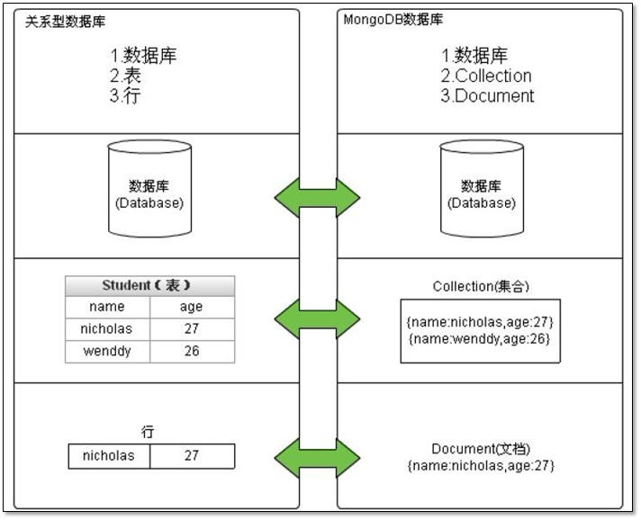

## 1.2 MongoDB 常见部署架构

**MongoDB和关系型数据库最大的不同:**

- 传统型数据库:结构化数据，定好了表结构后,每一行的内容必须符合表结构，就是说一列的个数和类型都一样
- MongoDB文档型数据库:表中的每个文档都可以有自己独特的结构，即json对象都可以有自己独特的属性和值

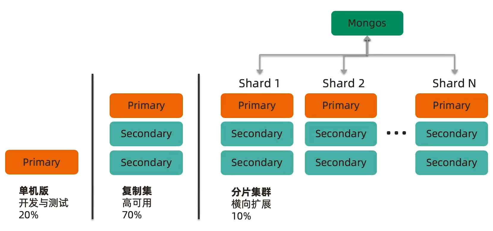

## 1.3 MongoDB **相关工具和应用**

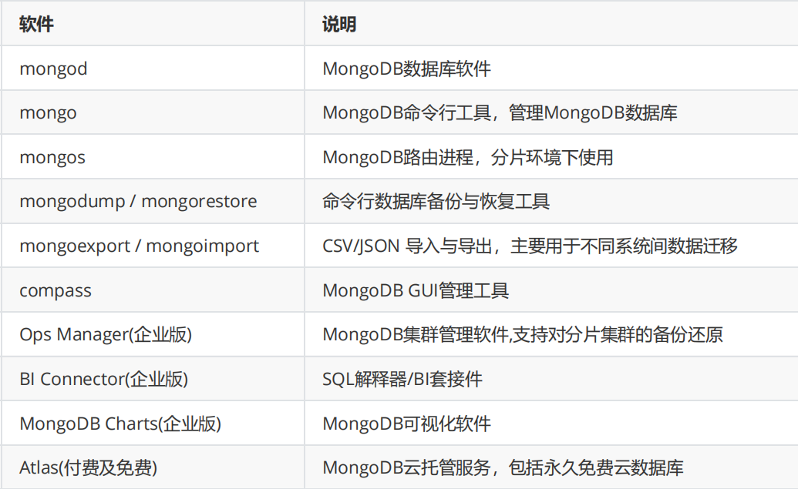

**参考资料**

```
http://docs.mongodb.com
http://university.mongodb.com
http://mongoing.com/
https://www.cnblogs.com/clsn/p/8214194.html
https://www.runoob.com/mongodb/mongodb-intro.html
```

# 2 MongoDB部署与访问

官方安装说明

```sh
https://docs.mongodb.com/manual/installation/
https://docs.mongodb.com/manual/administration/install-community/
https://docs.mongodb.com/manual/administration/install-on-linux/ 
```

MongoDB 支持在各种系统上安装，包括：

```
Linux
MacOS
Windows
```

## **2.1** **安装方法**

**MongoDB 提供多种安装方法**

- 基于rpm/deb包安装
- 基于二进制包安装
- 基于docker安装

## **2.2** **基于rpm/deb包安装**

```sh
#官方仓库路径
https://repo.mongodb.org/

#国内镜像
https://mirrors.tuna.tsinghua.edu.cn/mongodb/
https://mirrors.aliyun.com/mongodb/
```

### **2.2.1** **基于CentOS安装**

**官方说明**

```sh
https://www.mongodb.com/docs/manual/tutorial/install-mongodb-on-red-hat/
```

```sh
#添加yum源
[mongodb-org-7.0]
name=MongoDB Repository
baseurl=https://repo.mongodb.org/yum/redhat/8/mongodb-org/7.0/x86_64/
gpgcheck=1
enabled=1
gpgkey=https://pgp.mongodb.com/server-7.0.asc

sudo yum install -y mongodb-org
#安装特定版本
sudo yum install -y mongodb-org-7.0.7 mongodb-org-database-7.0.7 mongodb-org-server-7.0.7 mongodb-mongosh-7.0.7 mongodb-org-mongos-7.0.7 mongodb-org-tools-7.0.7
```

### 2.2.2 基于Ubuntu安装

```sh
https://www.mongodb.com/docs/manual/tutorial/install-mongodb-on-ubuntu/
```

```sh
#下载并导入GPG公钥
sudo apt-get install gnupg curl
curl -fsSL https://www.mongodb.org/static/pgp/server-7.0.asc | \
   sudo gpg -o /usr/share/keyrings/mongodb-server-7.0.gpg \
   --dearmor

#ubuntu20.04添加apt安装源
[root@ubuntu2004 ~]# echo "deb [ arch=amd64,arm64 signed-by=/usr/share/keyrings/mongodb-server-7.0.gpg ] https://repo.mongodb.org/apt/ubuntu focal/mongodb-org/7.0 multiverse" | sudo tee /etc/apt/sources.list.d/mongodb-org-7.0.list

[root@ubuntu2004 ~]# sudo apt install -y mongodb-org
```

## **2.3** **二进制包安装**

```sh
#二进制包下载链接
https://www.mongodb.com/try/download/community
```

### **2.3.1** **安装前准备**

- 关闭iptables防火墙
- 关闭 SELinux
- 安装相关包

```sh
#Red Hat/CentOS：
yum install libcurl openssl
#Ubuntu 18.04 LTS ("Bionic")/Debian 10 "Buster"：
sudo apt-get install libcurl4 openssl
#Ubuntu 16.04 LTS ("Xenial")/Debian 9 "Stretch"：
sudo apt-get install libcurl3 openssl
```

- 关闭大页内存机制,其他系统关闭参照官方文档:

```sh
https://docs.mongodb.com/manual/tutorial/transparent-huge-pages/
Transparent Huge Pages (THP) is a Linux memory management system that reduces the overhead of Translation Lookaside Buffer (TLB) lookups on machines with large amounts of memory by using larger memory pages.However, database workloads often perform poorly with THP enabled, because they tend to have sparse rather than contiguous memory access patterns. When running MongoDB on Linux, THP should be disabled for best performance.
```

- 内核参数ulimit

```
https://www.mongodb.com/docs/manual/reference/ulimit/
Starting in MongoDB 4.4, a startup error is generated if the `ulimit` value 
for number of open files is under `64000`.
```

范例: 内核优化

```sh
[root@ubuntu2004 ~]# cat >> /etc/rc.local <<EOF
echo never > /sys/kernel/mm/transparent_hugepage/enabled
EOF

[root@ubuntu2004 ~]# chmod +x /etc/rc.local
```


```
sudo yum install libcurl openssl xz-libs
tar -zxvf mongodb-linux-*-7.0.7.tgz
sudo cp /path/to/the/mongodb-directory/bin/* /usr/local/bin/、
sudo ln -s  /path/to/the/mongodb-directory/bin/* /usr/local/bin/
sudo mkdir -p /var/lib/mongo
sudo mkdir -p /var/log/mongodb
sudo chown -R mongod:mongod /var/lib/mongo
sudo chown -R mongod:mongod /var/log/mongodb
echo PATH=/usr/local/mongodb/bin/:'$PATH' > /etc/profile.d/mongodb.sh
. /etc/profile.d/mongodb.sh
```


```sh

```

### **2.3.2** **二进制安装** **MongoDB**

配置文件官方说明

```
https://www.mongodb.com/docs/manual/reference/configuration-options/
```

范例： 二进制安装MongoDB

```sh
#创建所需用户和组
useradd mongod

#创建mongodb所需目录结构
mkdir -p /apps/mongodb/{conf,data,log}

#创建YAML格式的配置文件,早期3.0版本以前是普通文本格式
cat > /apps/mongodb/conf/mongo.conf <<EOF

#日志相关
systemLog:
  destination: file
  path: "/apps/mongodb/log/mongodb.log"  #日志位置
  logAppend: true                   #追加日志
#数据存储有关
storage:
  dbPath: "/apps/mongodb/data/"            #数据路径的位置
  
#进程控制
processManagement:
  fork : true                         #后台守护进程
#网络配置有关
net:
  port: 27017                         #端口号,默认不配置端口号，是27017
  bindIp: 0.0.0.0                     #监听地址自MongoDB 3.6版本后默认监听在localhost
#安全验证有关配置
security:
  authorization: enabled            #是否打开用户名密码验证,默认此项为关掉
EOF

****************template**************
cat /mongodb/conf/mongo.conf
systemLog:
  destination: file
  path: "/apps/mongodb/log/mongodb.log"
  logAppend: true
storage:
  dbPath: "/apps/mongodb/data/"
processManagement:
  fork: true
net:
  port: 27017
  bindIp: 0.0.0.0
***************************************

chown -R mongod.mongod /apps/mongodb/
tar xf mongodb-linux-x86_64-ubuntu2004-5.0.3.tgz -C /usr/local
ln -s mongodb-linux-x86_64-ubuntu2004-5.0.3/ /usr/local/mongodb

#设置PATH变量
echo PATH=/usr/local/mongodb/bin/:'$PATH' > /etc/profile.d/mongodb.sh
. /etc/profile.d/mongodb.sh
    
#启动
su - mongod
mongod --dbpath /apps/mongodb/data --bind_ip_all --port 27017 --logpath /apps/mongodb/log/mongod.log --logappend --fork
mongod -f /apps/mongodb/conf/mongo.conf

#登录mongodb
mongo

#mongodb的关闭方式
mongod -f /apps/mongodb/conf/mongo.conf --shutdown

#mongodb使用systemd管理
cat > /lib/systemd/system/mongod.service <<EOF
[Unit]
Description=mongodb
After=network.target remote-fs.target nss-lookup.target

[Service]
Type=forking
User=mongod
Group=mongod
ExecStart=/usr/local/mongodb/bin/mongod --config /apps/mongodb/conf/mongo.conf
ExecReload=/bin/kill -s HUP \$MAINPID
ExecStop=/usr/local/mongodb/bin/mongod --config /apps/mongodb/conf/mongo.conf --shutdown
PrivateTmp=true
# file size
LimitFSIZE=infinity
# cpu time
LimitCPU=infinity
# virtual memory size
LimitAS=infinity
# open files
LimitNOFILE=64000
# processes/threads
LimitNPROC=64000
# locked memory
LimitMEMLOCK=infinity
# total threads (user+kernel)
TasksMax=infinity
TasksAccounting=false
# Recommended limits for mongod as specified in
# https://docs.mongodb.com/manual/reference/ulimit/#recommended-ulimit-settings

[Install]
WantedBy=multi-user.target

EOF

systemctl daemon-reload
systemctl enable --now mongod
```

## **2.4** **客户端连接**

### **2.4.1 MongoDB** **后台管理** **Shell**

#### **2.4.1.1 mongo**

如果需要进入 mongodb 后台管理，可以先打开 mongodb 装目录的下的 bin 目录，然后执行 mongo 命令文件。

MongoDB Shell 是 MongoDB 自带的交互式 Javascript shell，用来对 MongoDB 进行操作和管理的交互式环境。

mongo 是MongoDB早期版本使用的shell工具

当mongo进入 mongoDB 后台后，它默认会链接到 test 数据库

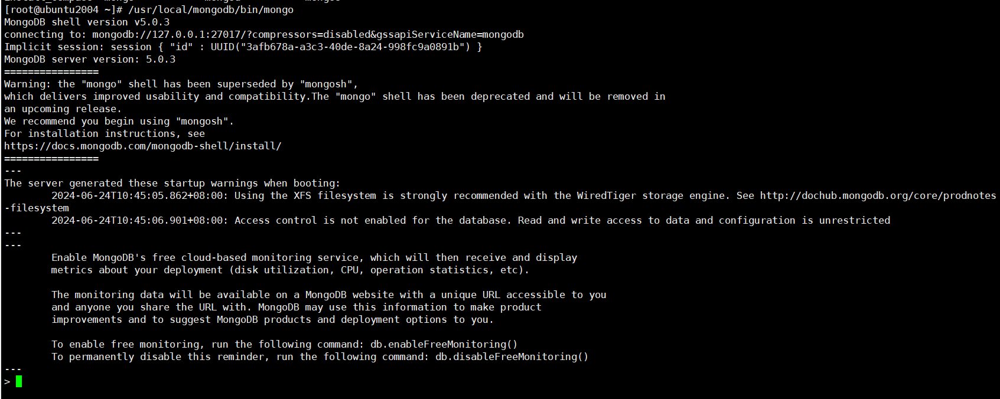


#### 2.4.1.2 安装部署mongosh

官方说明

```
https://docs.mongodb.com/mongodb-shell/install/
#下载路径
https://www.mongodb.com/try/download/shell
```


```sh
#ubuntu
[root@ubuntu2004 ~]# wget https://downloads.mongodb.com/compass/mongodb-mongosh_2.2.9_amd64.deb

#rhel
[root@rocky8.9 ~]# https://downloads.mongodb.com/compass/mongodb-mongosh-2.2.9.x86_64.rpm

##mongo提示将被mongosh代替
```

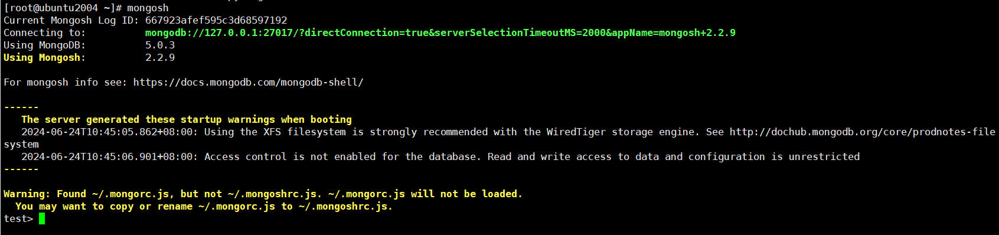

### **2.4.2** **使用** **MongoDB Compass** **连接**

MongoDB Compass是MongoDB官网提供的一个可视化管理工具,可以实现创建数据库、管理集合和文档、运行临时查询、评估和优化查询、性能图表、构建地理查询等功能

MongoDB Compass下载官方地址：

```
https://www.mongodb.com/download-center/compass
https://downloads.mongodb.com/compass/mongodb-compass-1.29.4-win32-x64.msi
https://downloads.mongodb.com/compass/mongodb-compass-1.29.4.x86_64.rpm
```


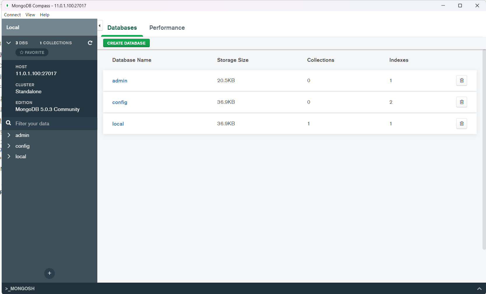

### **2.4.3 Python** **访问** **MongoDB**

```sh
[root@rocky8 ~]#yum -y install python3
[root@rocky8 ~]#pip3 install pymongo
[root@Rocky8 ~]# cat test_mongodb2.py 
#!/usr/bin/python3
from pymongo import MongoClient

# 客户端连接
client = MongoClient('mongodb://127.0.0.1:27017')

# 指定数据库 # Database类
db = client['test'] 

# 集合 # Collection类
students = db['students']

for i in range(10):
    student = {'id':i, 'name':'wang' + str(i), 'age':20}
    result = students.insert_one(student)
    print(result)
client.close()

[root@Rocky8 ~]# python3 test_mongodb2.py 
<pymongo.results.InsertOneResult object at 0x7f69a499c390>
<pymongo.results.InsertOneResult object at 0x7f69a499c400>
<pymongo.results.InsertOneResult object at 0x7f69a499c160>
<pymongo.results.InsertOneResult object at 0x7f69a499c358>
<pymongo.results.InsertOneResult object at 0x7f69a499c438>
<pymongo.results.InsertOneResult object at 0x7f69a499c2b0>
<pymongo.results.InsertOneResult object at 0x7f69a499c320>
<pymongo.results.InsertOneResult object at 0x7f69a499c518>
<pymongo.results.InsertOneResult object at 0x7f69a499c3c8>
<pymongo.results.InsertOneResult object at 0x7f69a499c390>
```


```
[root@Rocky8 ~]# mongosh 
Current Mongosh Log ID:	66794b2cd809aae4e3b2aef4
Connecting to:		mongodb://127.0.0.1:27017/?directConnection=true&serverSelectionTimeoutMS=2000
Using MongoDB:		7.0.11
Using Mongosh:		1.1.2

For mongosh info see: https://docs.mongodb.com/mongodb-shell/

------
   The server generated these startup warnings when booting:
   2024-06-24T16:01:50.923+08:00: Access control is not enabled for the database. Read and write access to data and configuration is unrestricted
   2024-06-24T16:01:50.923+08:00: You are running this process as the root user, which is not recommended
   2024-06-24T16:01:50.923+08:00: Soft rlimits for open file descriptors too low
------

test> show dbs
admin     41 kB
config  73.7 kB
local   73.7 kB
test      41 kB
test> use test
already on db test
test> show tables
students

test> db.students.find()
[
  {
    _id: ObjectId("667928765336e71c69e81c1e"),
    id: 0,
    name: 'wang0',
    age: 20
  },
  {
    _id: ObjectId("667928765336e71c69e81c1f"),
    id: 1,
    name: 'wang1',
    age: 20
  },
  {
    _id: ObjectId("667928765336e71c69e81c20"),
    id: 2,
    name: 'wang2',
    age: 20
  },
  {
    _id: ObjectId("667928765336e71c69e81c21"),
    id: 3,
    name: 'wang3',
    age: 20
  },
  {
    _id: ObjectId("667928765336e71c69e81c22"),
    id: 4,
    name: 'wang4',
    age: 20
  },
  {
    _id: ObjectId("667928765336e71c69e81c23"),
    id: 5,
    name: 'wang5',
    age: 20
  },
  {
    _id: ObjectId("667928765336e71c69e81c24"),
    id: 6,
    name: 'wang6',
    age: 20
  },
  {
    _id: ObjectId("667928765336e71c69e81c25"),
    id: 7,
    name: 'wang7',
    age: 20
  },
  {
    _id: ObjectId("667928765336e71c69e81c26"),
    id: 8,
    name: 'wang8',
    age: 20
  },
  {
    _id: ObjectId("667928765336e71c69e81c27"),
    id: 9,
    name: 'wang9',
    age: 20
  }
]
test> 
test> db.students.insert({id:1,name:"car",used:"open",years:'5'})
{
  acknowledged: true,
  insertedIds: { '0': ObjectId("66794cd55d118b36c867598d") }
}
```


# **3 MongoDB** **管理**

## **3.1 MongoDB** **操作数据库**

### **3.1.1 MongoDB** **默认数据库介绍**

MongoDB 默认存在的库

- admin库:系统预留库，MongoDB系统管理库
- local库:本地预留库，存储关键日志
- config库:MongoDB配置信息库
- test:登录时默认存在的测试库,生产中可以将之删除

### **3.1.2** **命令种类**

官方帮助

```
https://docs.mongodb.com/manual/
```

db对象相关命令

```
show dbs|show databases    #显示数据库,相当于MySQL中的show databases
use <库名>                  #切换数据库
use admin 
> db   #查看当前库相当于MySQL中的select database() 
> db.shutdownServer()  #关闭服务
show collections       #显示表列表,相当于MySQL中的show tables 
show tables
```

库级命令

```
db.[TAB][TAB]
db.help()
```

表和文档

```
db.<collection>.[TAB][TAB]
db.<collection>.help ()
```

rs 复制集有关(replication set) :

```
rs.[TAB][TAB]
rs.help ()
```

sh分片集群(sharding cluster)

```
sh.[TAB][TAB]
sh.help ()
```

### **3.1.3 mongodb** **对象操作**

```
mongo mysql
库 ----->库
集合----->表
文档----->数据行
```

官方帮助

```
https://docs.mongodb.com/manual/crud/
```

#### **3.1.3.1** **库的操作**

```sh
#use可以自动建库,如果库内没有数据,则不使用时会自动删除库
>use test

#删除当前所在库
>db.dropDatabase()
{ "dropped" : "test", "ok" : 1 }

#可以直接切换至不存在的库
>use testdb1
>db
testdb1
```

#### **3.1.3.2** **集合**(表)的操作

```
#建表方法1:直接创建表
app>db.createCollection ('student')
#建表方法2:当插入一个文档的时候，一个集合就会自动创建。
use magedu
db.test.insert ({name: " wang"})
db.student.insert({id:1, name : "wang" ,age:20, gender: "m" })
db.student.insert ({id:2, name: "zhao"})
db.student.insert([{id:3,name: "tom",age: 22},{id:4,name: "jerry",age: 23}])
db.student.insert ({a: "b",c: "d"})
db.student.insert ({a:1,c:2})
#查看库中的集合列表
show tables
show collections
#查看集合的信息
db.student.stats()
#删除集合
db.student.drop()
```

#### **3.1.3.3** **记录(文档)操作**

```sh
#数据录入:
for(i=0;i<10000;i++){db.student.insert({uid:i, name: "wang"+i , "age":18, "date": new Date()})}
for(i=0;i<10000;i++){db.users.insert({uid:i, name: "wang"+i , "age":i,address:"beijing"})}
for(i=0;i<10000;i++){db.random.insertOne({num: Math.random()* 100000})}

#查询数据行数:
db.student.count()

#全表查询,默认每页显示20行
db.student.find()
it  #继续显示下面行

#只显示前3个
db.student.find().limit(3)

#跳过前面10个显示后面的文档
db.student.find().skip(10)

#每页显示50条记录:
DBQuery.shellBatchsize=50

#按照条件查询
db.student.find({uid: 10})

#查询大于等于18并正序排序users集合
db.users.find({age: { $gte: 18 }}).sort({age: 1})

#查询users集合中的小于18的前5个文档中两个key:name和address
db.users.find({age: {$lt: 18 }},{ name: 1, address: 1}).limit(5)

#以标准的json格式显示数据
db.student.find({uid:10}).pretty()

#显示效果如下
{
 "id": objectId ( "8bc516e60d13144c89dead66"),
 "uid": 10,
 "name": "wang10",
 "age": 18,
 "date": ISODate ( "2018-01-12T02:38:57.113Z")
}

#修改文档,如果没有加multi: true.默认只修改第一个符合条件的文档
db.student.update({uid:1},{$set:{age: 20}},{multi: true})

#删除指定的文档
db.student.remove({uid: 10})

#删除集合中所有记录,但表还存在
db.student.remove({})

#查看集合存储信息,包括集合中索引和数据压缩存储后的大小
test> db.dinginx.storageSize()
36864
```

## **3.2** **用户及权限管理**

MongoDB数据库默认是没有用户名及密码的，即无权限访问限制。为了方便数据库的管理和安全，应启用认证和创建数据库用户

### **3.2.1** **关于用户验证库**

- 创建用户时,use所在的库就是此用户的验证库
- 登录时，必须明确指定验证库才能登录
- 一个数据库可以成为多个用户的验证库,但一个用户只能使用一个验证库
- 对于管理员用户，必须在admin下创建,即管理员用的验证库是admin
- 普通用户的验证库一般是所管理的库
- 如果直接登录到数据库,不进行use,默认的验证库是test
- 从3.6版本开始，配置文件中不添加bindIp参数，默认不允许远程登录，只能本地管理员登录。

#### **3.2.2** **用户管理**

**官方帮助**

```
https://docs.mongodb.com/manual/tutorial/create-users/
```

#### **3.2.2.1** **开启用户认证**

MongoDB数据库默认是无认证功能,可以直接登录做任务操作,为了安全需启用认证功能

```sh
#注意:启用认证后,仍然可以直接登录,但无权限做数据操作,但可以创建用户
#方法1:命令行方式通过“--auth”参数
mongod --auth --port 27017 --dbpath /data/db

#方法2,修改配置文件中，加入以下配置
cat >> /apps/mongodb/conf/mongo.conf <<EOF
security:
  authorization: enabled
EOF

systemctl restart mongod
```

#### **3.2.2.2** **用户管理说明**

用户的创建,需要基于指定数据库,即用户是存放于特定数据库的,即验证库

```bash
#创建用户
use <db> #切换至需要创建用户的验证库后,再创建用户
db.createUser (
   {
	 user: "<name>",
	 pwd: "<cleartext password>",
	 roles:[
	 { role: "<role>",
	 db : "<database>"}|"<role>",
	 .....
	   }]
   }
)

#基本语法说明:
user:用户名
pwd:密码
roles:
  role:角色名,比如:root, readWrite, read
  db:上面角色作用的数据库对象

#验证用户
use <验证库>
db.auth('用户名', '密码')

#用户保存在admin库的users集合中
use admin
db.system.users.find()

#登录验证
mongo -u用户名 -p密码 <验证库>                   #本地登录,如果验证库admin省略,登录后默认在test库
mongo -u用户名 -p密码 <MongoDB主机IP>/<验证库>    #远程登录,验证库不可以省略  

#修改密码
db.changeUserPassword("用户名", "新密码")

#删除用户
use <验证库>
db.dropUser("用户名")
```

**系统内置角色的说明**

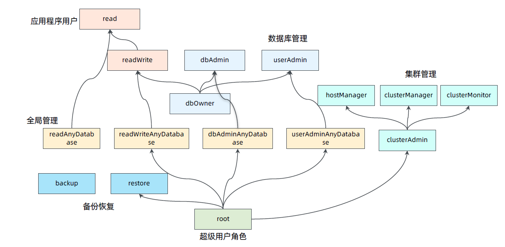


#### **3.2.2.3** **范例**

范例: 创建MongoDB的超级管理员

```sh
$mongo
#创建超级管理员root(也可以是任意用户名)管理所有数据库（必须use admin再去创建,因为超级用户是存放在admin库中的）
> use admin
switched to db admin

> db.createUser({user:"root",pwd:"123456",roles:[{role:"root",db:"admin"}]})

#验证用户
use admin
db.auth('root', '123456')

#修改配置文件中，加入以下配置
cat >> /mongodb/conf/mongo.conf <<EOF
security:
  authorization: enabled
EOF

#重启mongodb
systemctl restart mongod
#或者
mongod -f /mongodb/conf/mongo.conf --shutdown
mongod -f /mongodb/conf/mongo.conf

#登录验证
mongo -uroot -p123456 admin  #本地登录,如果验证库admin省略,登录后默认在test库而非admin

mongo -uroot -p123456  10.0.0.100/admin  #远程登录,验证库admin不可以省略  

#或者交互式验证
mongo
use admin
db.auth('root','123456')

#在admin库中system.users表中查看所有的用户列表
use admin
db.system.users.find().pretty()

#查看当前库中用户
admin> use test
test> db.getUsers()
```

**范例: 创建应用用户**

```sh
use dinginx
db.createUser (
 {
   user: "app01",
   pwd: "123456",
   roles: [{role: "readWrite", db: "dinginx"}]
 }
)

db.createUser (
 {
   user: "app02",
   pwd: "123456",
   roles: [{role: "readWrite", db: "magedu"}]
 }
)

#连接测试
mongo -uapp01 -p123456
mongo -uapp01 -p123456 dinginx
mongo -uapp01 -p123456 11.0.1.100/dinginx
mongo -uapp02 -p123456 10.0.0.100/magedu

#查询mongodb中的用户信息
mongo -uroot -p123456 11.0.1.100/admin
db.system.users.find().pretty()
```

**范例:删除用户**

```sh
#以管理员root身份登录，use到被删除用户的验证库才能删除用户
> use magedu
switched to db magedu
> db.createUser ( {user: "app02" , pwd: "app02", roles:[ { role: "readWrite" , db: 
... "magedu" }]})

[root@ubuntu2004 /mongodb]# mongo -uroot -p123456 11.0.1.100/admin

---
> use magedu
switched to db magedu
> db.dropUser ("app02")
true
> 

#查看用户信息
> db.system.users.find().pretty()
{
	"_id" : "admin.root",
	"userId" : UUID("6c0df538-b934-468f-840f-a0261c1e4d92"),
	"user" : "root",
	"db" : "admin",
	"credentials" : {
		"SCRAM-SHA-1" : {
			"iterationCount" : 10000,
			"salt" : "FtFapbMi3QpG9WRe6ZnMOQ==",
			"storedKey" : "JbZ4/FVGKQH/13eTyxcg1XeU3sc=",
			"serverKey" : "QQhNVstHvDbGWDkNNYyEW7FMnR4="
		},
		"SCRAM-SHA-256" : {
			"iterationCount" : 15000,
			"salt" : "c30qzFbqZgSgVUCUvJCHsO5AlK0JfOU11xDp3A==",
			"storedKey" : "k2baRbobepKVG0Wm7CZt4uMwTWR35mckDjPbridQuOg=",
			"serverKey" : "4YkyTXtXGEF24p9ZvBOxANU+NjSDimVQfwfFqEPKzoo="
		}
	},
	"roles" : [
		{
			"role" : "root",
			"db" : "admin"
		}
	]
}
{
	"_id" : "dinginx.app01",
	"userId" : UUID("499f838f-894d-476b-81b1-2f7cd7389052"),
	"user" : "app01",
	"db" : "dinginx",
	"credentials" : {
		"SCRAM-SHA-1" : {
			"iterationCount" : 10000,
			"salt" : "c6k/GpXsr9JLdOnm7kkMFA==",
			"storedKey" : "pXOxh5qNhNAC+XSXBCLHYK4Tz60=",
			"serverKey" : "lq3DBg25GpCHIn8cX2ImshChz4M="
		},
		"SCRAM-SHA-256" : {
			"iterationCount" : 15000,
			"salt" : "8+iDF8XR+lcSwacDTw07W+Nv1qO4ehq2d47NpQ==",
			"storedKey" : "TML4jO6RRSZQTefJEO+142OKPmS3sa2afIuqvKYddOc=",
			"serverKey" : "BDhRZC6WCCRl2ZqJz3J/IHsEtuMCucurASAzwKU+8PQ="
		}
	},
	"roles" : [
		{
			"role" : "readWrite",
			"db" : "dinginx"
		}
	]
}
```

# **4 MongoDB** **复制集**

## **4.1** **基本原理**

官方说明

```
https://www.mongodb.com/docs/manual/replication/
```

### **4.1.1** **什么是复制集** **Replica Set**

MongDB 像MySQL一样,支持类似的主从复制架构，但无法实现自动故障转移，所以官方推荐使用复制集

MongoDB复制集是将数据同步在多个服务器的过程

复制集提供了数据的冗余备份，并在多个服务器上存储数据副本，保证数据的安全性

复制集还允许从硬件故障和服务中断中恢复数据。当故障时,会自动选举新master节点,实现集群的高可用


**复制集功能**

- 数据高可用性
- 异地容灾，实现灾难恢复
- 无需停机维护（如备份，重建索引，压缩）
- 分布式读取数据，读操作的负载均衡

### **4.1.2** **复制集架构**

MongoDB复制结构图如下所示

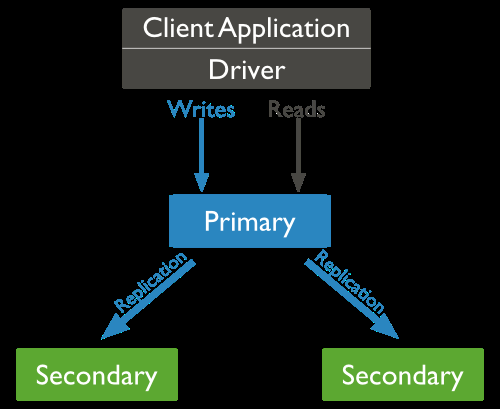

1. MongoDB的复制至少需要两个节点。其中一个是主节点，负责处理客户端请求，其余的都是从节点，负责复制主节点上的数据
2. MongoDB各个节点常见的搭配方式为：一主一从、一主两从此方式最多
3. 主节点记录在其上的所有操作oplog，从节点定期轮询主节点获取这些操作，然后对自己的数据副本执行这些操作，从而保证从节点的数据与主节点一致
4. 客户端写入数据到主节点时， 主节点与从节点进行数据交互保障数据的一致性

**复制集特征：**

- N 个奇数节点的集群
- 基于选举机制，任何节点可作为主节点
- 所有写入操作都在主节点上，所以增加节点不会提高系统写性能，可以提升读性能
- 主节点故障时，会自动选举出新节点代替，自动故障转移

**多个节点数据同步的实现**

- 当一个修改操作，无论是插入、更新或删除，到达主节点时，它对数据的操作将被记录下来（经过一些必要的转换)这些记录称为oplog
- 从节点通过在主节点上打开一个tailable游标不断获取新进入主节点的oplog，并在自己的数据上回放，以此保持跟主节点的数据一致

### **4.1.3** **复制集模式中主要角色和选举**

#### **4.1.3.1** **复制集的主要角色**

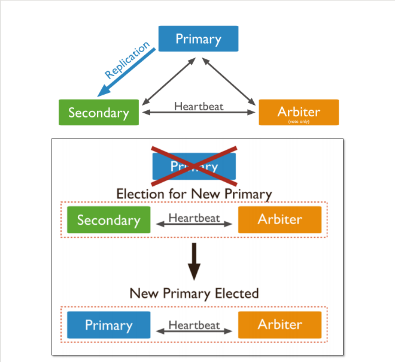

**主节点[Primary]**

接收所有的写请求，然后把修改同步到所有Secondary。一个Replica Set只能有一个Primary节点，当Primary挂掉后，其他Secondary或者Arbiter节点会重新选举出来一个主节点。默认读请求也是发到Primary节点处理的，如果需要转发到Secondary,需要在客户端修改一下连接配置。

**副本节点[Secondary]**

与主节点保持同样的数据集。当主节点挂掉的时候，可以参与选举出新主节点。

**仲裁者[Arbiter]**

不保存数据，不参与选主，只进行选主投票。使用Arbiter可以减轻数据存储的硬件需求，Arbiter跑起来几乎没什么大的硬件资源需求，在生产环境下它和其他数据节点不要部署在同一台机器上。实际生产环境当前不推存使用Arbiter节点类型

MongoDB 使用Raft选举机制,而MySQL MGR 用的是Paxos,而Raft本质是Paxos的变种

**注意，一个自动failover的Replica Set节点数必须为奇数，目的是选主投票的时候要有一个大多数才能进行选主决策。**

#### 4.1.3.2 Primary选举实现

复制集通过replSetInitiate命令（或mongo shell的rs.initiate()）进行初始化，初始化后各个成员间开始发送心跳消息，并发起Primary选举操作，获得大多数成员投票支持的节点，会成为Primary，其余节点成为Secondary。

**选举实现**

- 具有投票权的节点之间两两互相发送心跳
- 当5次心跳未收到时判断为节点失联
- 如果失联的是主节点，从节点会发起选举，选出新的主节点
- 如果失联的是从节点则不会产生新的选举
- 选举基于RAFT一致性算法实现，选举成功的必要条件是大多数投票节点存活
- 复制集中最多可以有50个节点，但具有投票权的节点最多7个，且为奇数个投票成员

**大多数的定义**

假设复制集内投票成员（后续介绍）数量为N，则大多数为 N/2 + 1，当复制集内存活成员数量不足大多数时，整个复制集将无法选举出Primary，复制集将无法提供写服务，处于只读状态。


通常建议将复制集成员数量设置为奇数，从上表可以看出3个节点和4个节点的复制集都只能容忍1个节点失效，从服务可用性的角度看，其效果是一样的。（但无疑4个节点能提供更可靠的数据存储）

**被选举为主节点的节点必须:**

- 能够与多数节点建立连接
- 具有较新的oplog
- 具有较高的优先级（如果有配置)

#### 4.1.3.3 复制集中其它角色和选项说明

##### 4.1.3.3.1 角色说明

|   **成员**    | **说明**                                                     |
| :-----------: | ------------------------------------------------------------ |
| **Secondary** | 正常情况下，复制集的Seconary会参与Primary选举（自身也可能会被选为Primary），并从Primary同步最新写入的数据，以保证与Primary存储相同的数据。Secondary可以提供读服务，增加Secondary节点可以提供复制集的读服务能力，同时提升复制集的可用性。另外，Mongodb支持对复制集的Secondary节点进行灵活的配置，以适应多种场景的需求。 |
|  **Arbiter**  | Arbiter节点只参与投票，不能被选为Primary，并且不从Primary同步数据。比如你部署了一个2个节点的复制集，1个Primary，1个Secondary，任意节点宕机，复制集将不能提供服务了（无法选出Primary），这时可以给复制集添加一个Arbiter节点，即使有节点宕机，仍能选出Primary。Arbiter本身不存储数据，是非常轻量级的服务，当复制集成员为偶数时，最好加入一个Arbiter节点，以提升复制集可用性。 |
| **Priority0** | 默认Priority为1，值最大优先级越高。设置Priority为0节点的选举优先级为0，不会被选举为Primary，但可以投票，比如:跨机房A、B部署了一个复制集，并且想指定Primary必须在A机房，这时可以将B机房的复制集成员Priority设置为0，这样Primary就一定会是A机房的成员。注意：如果这样部署，最好将大多数节点部署。 |
|   **Vote0**   | Mongodb 3.0里，复制集成员最多50个，参与Primary选举投票的成员最多7个，其他成员的vote属性必须设置为0，即不参与投票。 |
|  **Hidden**   | Hidden节点不能被选为主（Priority必须为0），并且对应用不可见。因Hidden节点不会接受Driver的请求，可使用Hidden节点做一些数据备份、离线计算的任务，不会影响复制集的服务。 |
|  **Delayed**  | Delayed节点必须是Hidden节点，并且其数据落后与Primary一段时间（可配置，比如1个小时）。因Delayed节点的数据比Primary落后一段时间，当错误或者无效的数据写入Primary时，可通过Delayed节点的数据来恢复到之前的时间点。 |

##### 4.1.3.3.2 Priority 0节点

作为一个辅助可以作为一个备用。在一些复制集中，可能无法在合理的时间内添加新成员的时候。备用成员保持数据的当前最新数据能够替换不可用的成员。

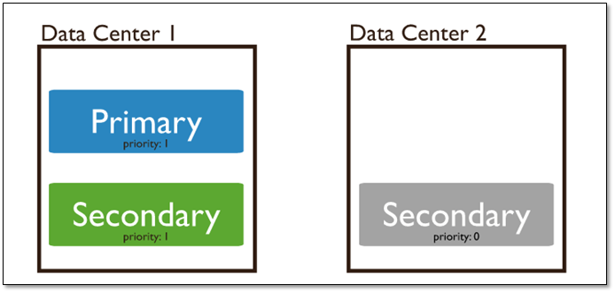

#### 4.1.3.3.3 Hidden 节点

客户端将不会把读请求分发到隐藏节点上，即使设定了复制集读选项 。

这些隐藏节点将不会收到来自应用程序的请求。可以将隐藏节点专用于报表节点或是备份节点。 延时节点也应该是一个隐藏节点。

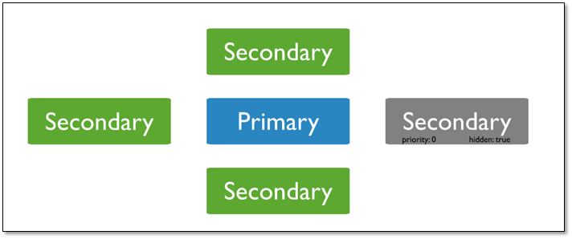

##### 4.1.3.3.4 Delayed 节点

延时节点的数据集是延时的，因此它可以帮助我们在人为误操作或是其他意外情况下恢复数据。举个例子，当应用升级失败，或是误操作删除了表和数据库时，可以通过延时节点进行数据恢复。

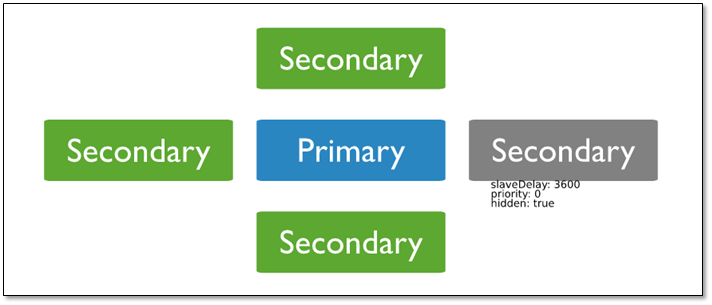

### **4.1.4 自动的故障恢复**


如果发生主库宕机，复制集内部会进行投票选举，选择一个新的主库替代原有主库对外提供服务。同时复制集会自动通知客户端程序，主库已经发生切换了。应用就会连接到新的主库

### **4.1.5 read preference** **模式**

默认情况下，应用程序将其读取操作指向复制集的主节点（即读取首选项模式"primary"）。但是，客户端可以通过read preference 模式指定将读取操作发送给到从节点

read preference 模式官方说明

```
https://www.mongodb.com/docs/manual/core/read-preference/
```

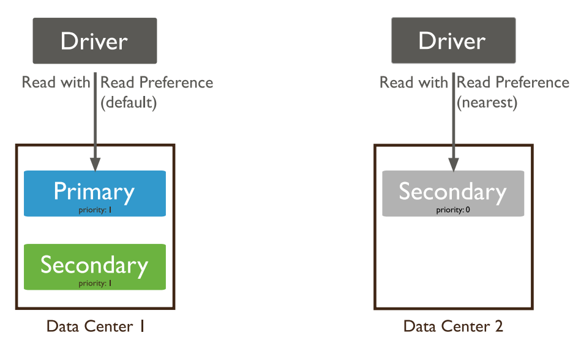

| Read Preference Mode |                       **Description**                        |
| :------------------: | :----------------------------------------------------------: |
|       primary        | 主节点，默认模式，读操作只在主节点，如果主节点不可用，报错或者抛出异常。 |
|   primaryPreferred   | 首选主节点，大多情况下读操作在主节点，如果主节点不可用，如故障转移，读操作在从节点。 |
|      secondary       | 从节点，读操作只在从节点， 如果从节点不可用，报错或者抛出异常。 |
|  secondaryPreferred  | 首选从节点，大多情况下读操作在从节点，特殊情况（如单主节点架构)读操作在主节点。 |
|       nearest        |  最邻近节点，读操作在最邻近的成员，可能是主节点或者从节点。  |

## 4.2 复制集实现

### 4.2.1 复制集环境规划

复制集要求三个以上的 MongoDB节点或者实例
下面案例以多实例,采用多个端口: 28017、28018、28019、28020实现

### 4.2.2 准备配置文件

```sh
su - mongod
mkdir -p /apps/mongodb/{28017,28018,28019,28020}/{conf,data,log}

#多套配置文件
/apps/mongodb/28017/conf/mongod.conf
/apps/mongodb/28018/conf/mongod.conf
/apps/mongodb/28019/conf/mongod.conf
/apps/mongodb/28020/conf/mongod.conf

#配置文件内容
cat > /apps/mongodb/28017/conf/mongod.conf <<EOF
systemLog:
  destination: file
  path: /apps/mongodb/28017/log/mongodb.log
  logAppend: true
storage:
  dbPath: /apps/mongodb/28017/data
processManagement:
  fork: true
net:
  bindIp: 0.0.0.0
  port: 28017
replication:
  replSetName: myrepl  #指定复制集名称,所有复制集成员此名称要一致
EOF

#说明:
3.x版本以上默认是wiredtiger引擎﹐类似于MySQL InnoDB支持事务，文档锁
2.x版本中，默认的是MMAPv1引擎，相当于MySQL MyISAM引擎

sed  's#28017#28018#g' /apps/mongodb/28017/conf/mongod.conf > /apps/mongodb/28018/conf/mongod.conf
sed  's#28017#28019#g' /apps/mongodb/28017/conf/mongod.conf > /apps/mongodb/28019/conf/mongod.conf
sed  's#28017#28020#g' /apps/mongodb/28017/conf/mongod.conf > /apps/mongodb/28020/conf/mongod.conf
```

### 4.2.3 配置复制集: 1主2从 

```sh
#只需在集群中任一节点操作
config = { _id: 'myrepl', members: [
 {_id: 0, host: '11.0.1.8:27017'},
 {_id: 1, host: '11.0.1.18:27017'} ,
 {_id: 2, host: '11.0.1.28:27017'}]
 }
 
#以json格式显示变量内容
printjson(config)

#初始化并启动复制集
rs.initiate(config)

#方法2
mongo --port 27017
>rs.initiate ( )
>rs.add("11.0.1.18:27017")
>rs.add("11.0.1.28:27017")

#查询复制集状态
rs.status()
rs.hello()
rs.isMaster()

#显示复制信息
myrepl [direct: primary] test>  db.printReplicationInfo()
actual oplog size
'4913.50341796875 MB'
---
configured oplog size
'4913.50341796875 MB'
---
log length start to end
'171367.00000023842 secs (47.6 hrs)'
---
oplog first event time
'Tue Jun 25 2024 23:20:20 GMT+0800 (China Standard Time)'
---
oplog last event time
'Thu Jun 27 2024 22:56:27 GMT+0800 (China Standard Time)'
---
now
'Wed Jun 26 2024 08:15:35 GMT+0800 (China Standard Time)'

```

### 4.2.4 配置复制集: 1主1从1Arbiter

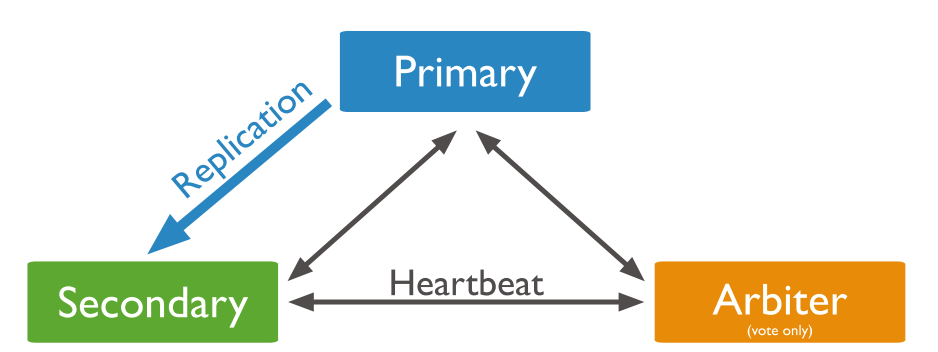

```sh
mongo -port 28017 admin
config = { _id: 'myrepl', members: [
         { _id: 0, host: '11.0.1.8:27017'},
         { _id: 1, host: '11.0.1.18:27017'},
         { _id: 2, host: '11.0.1.28:27017', "arbiterOnly": true}]
         }
         

rs.initiate (config)

#查询复制集状态
rs.status()
```

### 4.2.5 修改已有集群为1主1从1个Arbiter

```sh
[mongod@mongodb ~]$ mongosh --port 27017 admin
myrepl [direct: primary] test> rs.remove("11.0.1.38:27017")
myrepl [direct: primary] test> rs.addArb("11.0.1.38:27017")

#上述操作会关闭节点,所以需要重新启动指定节点的monogodb
[mongod@mongodb ~]$mongod -f /apps/mongodb/27017/conf/mongod.conf
```

## **4.3** **复制集管理操作**

官方帮助

```
https://docs.mongodb.com/manual/reference/replication/
```

### 4.3.1 查看复制集状态

```sh
#查看整体复制集状态
rs.status()

#查看当前是否是主节点
rs.isMaster()

#查看复制集配置信息
rs.conf()
```

### **4.3.2** **添加和删除节点**

```sh
#删除一个节点
rs.remove ("ip: port")

#新增从节点
rs.add ("ip: port")

#新增仲裁节点
rs.addArb ("ip: port")
```

范例:  增加和删除一个节点

```sh
#增加一个节点
myrepl [direct: primary] test> rs.add("11.0.1.8:28017")

#删除一个节点
myrepl [direct: primary] test> rs.remove("11.0.1.8:28017")

myrepl [direct: primary] test> rs.isMaster()
```

范例:  添加arbiter节点

```sh
#1、连接到主节点
[root@Rocky8 ~]# mongosh --port 27017 

#2、添加仲裁节点
myrepl [direct: primary] test> rs.addArb("11.0.1.18:28017")

#3、查看节点状态
myrepl [direct: primary] test> rs.isMaster()
```

### **4.3.3** **特殊从节点管理**

arbiter节点:主要负责选主过程中的投票，但是不存储任何数据，也不提供任何服务hidden节点:隐藏节点，不参与选主，也不对外提供服务。

delay节点:延时节点，数据落后于主库一段时间，因为数据是延时的，也不应该提供服务或参与选主，所以通常会配合hidden (隐藏),可用于防止逻辑删除,一股情况下会将delay+hidden一起配置使用,配置延时节点(一般延时节点也配置成hidden)

优先级为0的节点的特点

```bat
此节点丧失了当选Primary的机会。永远不会上位
此节点虽然不能当选Primary但是却可以投票
此节点正常参与Primary产生的oplog的读取，进行数据备份和命令执行
此节点正常参与客户端对于数据的读取，进行担当负载均衡的工作
```

**范例： 实现特殊节点功能**

```sh
#在主节点执行下面操作配置特殊节点并保存
config=rs.conf()                    #定义变量
config.members[3].hidden=true       #设置hidden,3表示第4个成员,从0开始表示第1个,是
rs.conf()显示的顺序,不是_id的值
config.members[3].priority=0        #优先级0表示不参选master，但可以投票,值越大优先级越高
config.members[3].arbiterOnly=true  #也可将延时节点配置为arbiter节点
config.members[3].slaveDelay=120    #延时时长,以秒为单位,生产可延时3-6小时
config.members[3].votes=0    		#持有票数为0
rs.reconfig(config)                 #加载配置

#取消以上配置
config=rs.conf()
config.members[3].priority=1
config.members[3].hidden=false
config.members[3].slaveDelay=0
config.members[3].votes=1
rs.reconfig(config)

#配置成功后,通过以下命令查询配置后的属性
rs.conf();
```

**范例：修改节点优先级**

```sh
[root@Rocky8 ~]# mongosh --port 27017

myrepl [direct: primary] test> config=rs.config()
myrepl [direct: primary] test> config.members[0].priority=3
myrepl [direct: primary] test> rs.reconfig(config)
myrepl [direct: primary] test> rs.config()
members: [
    {
      _id: 0,
      host: '11.0.1.8:27017',
      arbiterOnly: false,
      buildIndexes: true,
      hidden: false,
      priority: 3,			#查看修改priority成功
      tags: {},
      secondaryDelaySecs: Long("0"),
      votes: 1
    },
    
    
#验证，优先调度11.0.1.8:27017
```

### **4.3.4** **管理从节点**

注：在mongodb复制集当中，默认从库不允许读。在从库打开读配置

```sh
#打开从节点读支持
#新版命令
myrepl:SECONDARY> rs.secondaryOk()

#旧版命令已废弃
myrepl:SECONDARY> rs.slaveOk()
```

# 5 MongoDB 分片集群

## 5.1 MongoDB 分片集群说明

分片（sharding）是MongoDB用来将大型集合分割到不同服务器（或者说一个集群）上所采用的方法。尽管分片起源于关系型数据库分区，但MongoDB分片完全又是另一回事。

和MySQL分区方案相比，MongoDB Sharding Cluster (MSC) 的最大区别在于它几乎能自动完成所有事情，只要告诉MongoDB要分配数据，它就能自动维护数据在不同服务器之间的均衡。

### 5.1.1 MongoDB分片介绍

#### 5.1.1.1 分片的目的

高数据量和吞吐量的数据库应用会对单机的性能造成较大压力,大的查询量会将单机的CPU耗尽,大的数据量对单机的存储压力较大,最终会耗尽系统的内存而将压力转移到磁盘IO上。

为了解决这些问题,有两个基本的方法: 垂直扩展和水平扩展。

- 垂直扩展：增加更多的CPU和存储资源来扩展容量。
- 水平扩展：将数据集分布在多个服务器上。水平扩展即分片

**分片的缺点**

- 分片额外消耗较多,约相当于单机性能的70%左右
- 管理复杂，尽量不要分片

#### **5.1.1.2** **分片设计思想**

分片为应对高吞吐量与大数据量提供了方法。使用分片减少了每个分片需要处理的请求数，因此，通过水平扩展，集群可以提高自己的存储容量和吞吐量。举例来说，当插入一条数据时，应用只需要访问存储这条数据的分片.使用分片减少了每个分片存储的数据。

MongoDB 最多可以支持1024个分片节点

例如，如果数据库1tb的数据集，并有4个分片，然后每个分片可能仅持有256 GB的数据。如果有40个分片，那么每个切分可能只有25GB的数据。

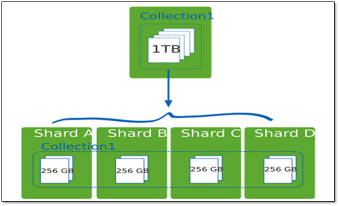

#### 5.1.1.3 分片机制提供了如下三种优势

**保证集群总是可读写**

MongoDB通过多种途径来确保集群的可用性和可靠性。将MongoDB的分片和复制功能结合使用，在确保数据分片到多台服务器的同时，也确保了每分数据都有相应的备份，这样就可以确保有服务器换掉时，其他的从库可以立即接替坏掉的部分继续工作。

**使集群易于扩展**

当系统需要更多的空间和资源的时候，MongoDB使我们可以按需方便的扩充系统容量。

**对集群进行抽象，让集群“不可见”**

MongoDB自带了一个叫做mongos的专有路由进程。mongos就是掌握统一路口的路由器，其会将客户端发来的请求准确无误的路由到集群中的一个或者一组服务器上，同时会把接收到的响应拼装起来发回到客户端。

#### 5.1.1.4 分片集群架构

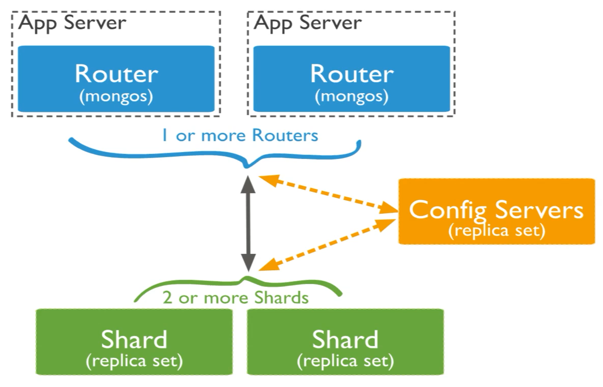

**分片集群的结构**

|       组件        | 说明                                                         |
| :---------------: | :----------------------------------------------------------- |
|    **Mongos**     | 提供集群统一的对外应用访问入口，转发应用请求,选择合适的数据节点进行读写,合并多个数据节点的返回数据,应用的所有操作均通过mongos执行。数据路由，和客户端打交道的模块。mongos本身没有任何数据，它也不知道该怎么处理数据，用于寻找config server,是无状态节点,一般至少有2个mongos节点。 |
| **Config Server** | 存储集群所有节点、分片数据路由信息。所有存、取数据的方式，所有shard节点的信息，分片功能的一些配置信息。可以理解为真实数据的元数据。默认需要配置3个Config Server节点。 |
|     **Shard**     | 真正的数据存储位置。以复制集为单位,横向扩展,最大1024个分片,分片之间数据不重复,所有分片在一起才能可以完整的工作,以chunk为单位存数据。 |

Mongos本身并不持久化数据，Sharded cluster所有的元数据都会存储到 Config Server，而用户的数据分散存储到各个shard。Mongos启动后，会从配置服务器加载元数据，开始提供服务，将用户的请求正确路由到对应的shard。

**Mongos 的路由功能**

当数据写入时，MongoDB Cluster根据分片键设计写入数据。
当外部语句发起数据查询时，MongoDB根据数据分布自动路由至指定节点返回数据

**三种角色的资源配置**

mongos 与 config通常消耗很少的资源,可以选择低规格虚拟机

资源的重点在于 shard 服务器:

- 需要足以容纳热数据索引的内存
- 正确创建索引后CPU通常不会成为瓶颈，除非涉及非常多的计算;
- 磁盘尽量选用SSD。

注意: 实际测试是最好的检验，来看你的资源配置是否完备。

即使项目初期已经具备了足够的资源，仍然需要考虑在合适的时候扩展。

建议监控各项资源使用情况，无论哪一项达到**60%**以上，基于以下原因则开始考虑扩展

- 扩展需要新的资源，申请新资源需要时间,数据量大的话,可能会长达几天时间
- 扩展后数据需要均衡，均衡需要时间。应保证新数据入库速度慢于均衡速度
- 均衡需要资源，如果资源即将或已经耗尽，均衡也是会很低效的。

#### 5.1.1.5 分片集群的相关概念

以下各种概念由小到大

- 片键shard key:文档中的一个字段
- 文档doc:包含shard key的一行数据
- 块Chunk :包含n个文档,默认64M
- 分片Shard:包含n个chunk,一个分片对应一个复制集
- 集群Cluster:包含n个分片

### 5.1.2 集群中数据分布

#### 5.1.2.1 Chunk 介绍

在一个shard server内部，MongoDB还是会把数据分为chunks，每个chunk代表这个shard server内部一部分数据。chunk的产生，会有以下两个用途：

**Splitting：**当一个chunk的大小超过配置中的chunk size时，MongoDB的后台进程会把这个chunk切分成更小的chunk，从而避免chunk过大的情况。

**Balancing**：在MongoDB中，balancer是一个后台进程，负责chunk的迁移，从而均衡各个shard server的负载，系统初始1个chunk，chunk size默认值64M,生产库上选择适合业务的chunk size是最好的。ongoDB会自动拆分和迁移chunks。

**分片集群的数据分布（shard节点）**

（1）使用chunk来存储数据

（2）进群搭建完成之后，默认开启一个chunk，大小是64M

（3）存储需求超过64M，chunk会进行分裂，如果单位时间存储需求很大，设置更大的chunk

（4）chunk会被自动均衡迁移

#### 5.1.2.2 chunksize 的设置

适合业务的chunksize是最好的

chunk的分裂和迁移非常消耗IO资源

chunk分裂的时机：在插入和更新，读数据不会分裂

**chunksize的大小设置：**

小的chunksize：数据均衡是迁移速度快，数据分布更均匀。数据分裂频繁，路由节点消耗更多资源。
大的chunksize：数据分裂少。数据块移动集中消耗IO资源。通常100-200M

#### 5.1.2.3 chunk 分裂及迁移

随着数据的增长，其中的数据大小超过了配置的 chunk size，默认是64M，则这个chunk就会分裂成两个。数据的增长会让chunk分裂得越来越多。

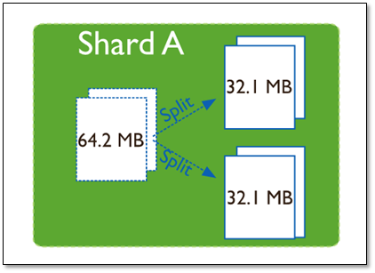

这时候，各个shard 上的chunk数量就会不平衡。mongos中的一个组件balancer 就会执行自动平衡。把chunk从chunk数量最多的shard节点挪动到数量最少的节点。

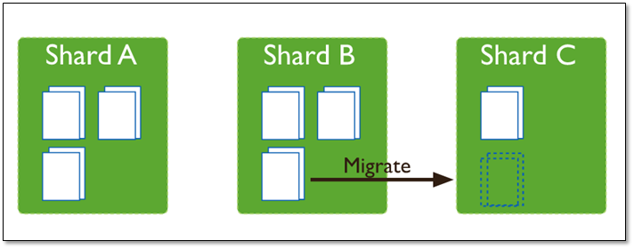

**chunkSize** **对分裂及迁移的影响**

MongoDB 默认的 chunksize 为64MB，如无特殊需求，建议保持默认值；chunksize 会直接影响到chunk 分裂、迁移的行为。

chunksize 越小，chunk 分裂及迁移越多，数据分布越均衡；反之，chunksize 越大，chunk 分裂及迁移会更少，但可能导致数据分布不均。

chunksize 太小，容易出现 jumbo chunk（即shardKey 的某个取值出现频率很高，这些文档只能放到一个 chunk 里，无法再分裂）而无法迁移

chunksize 越大，则可能出现 chunk 内文档数太多（chunk 内文档数不能超过 250000 ）而无法迁移。

chunk 自动分裂只会在数据写入时触发，所以如果将 chunksize 改小，系统需要一定的时间来将 chunk 分裂到指定的大小。

chunk 只会分裂，不会合并，所以即使将 chunksize 改大，现有的 chunk 数量不会减少，但 chunk 大小会随着写入不断增长，直到达到目标大小。

### 5.1.3 数据分片

#### 5.1.3.1 分片键 shard key

MongoDB中数据的分片是以集合为基本单位的，集合中的数据通过片键（Shard key）被分成多部分。其实片键就是在集合中选一个键，用该键的值作为数据拆分的依据。

所以一个好的片键对分片至关重要。片键必须是一个索引，通过sh.shardCollection加会自动创建索引（前提是此集合不存在的情况下）。一个自增的片键对写入和数据均匀分布就不是很好，因为自增的片键总会在一个分片上写入，后续达到某个阀值可能会写到别的分片。但是按照片键查询会非常高效。

随机片键对数据的均匀分布效果很好。注意尽量避免在多个分片上进行查询。在所有分片上查询，mongos会对结果进行归并排序。

对集合进行分片时，需要选择一个片键，片键是每条记录都必须包含的，且建立了索引的单个字段或复合字段，MongoDB按照片键将数据划分到不同的数据块中，并将数据块均衡地分布到所有分片中。

为了按照片键划分数据块，MongoDB使用基于范围的分片方式或者基于哈希的分片方式。

**注意：**

- 分片键是不可变。
- 分片键必须有索引。
- 分片键大小限制512bytes。
- 分片键用于路由查询。
- 不接受已进行collection级分片的collection上插入无分片键的文档,也不支持空值插入

#### 5.1.3.2 以范围为基础的分片Sharded Cluster

Sharded Cluster支持将单个集合的数据分散存储在多shard上，用户可以指定根据集合内文档的某个字段即shard key来进行范围分片（range sharding）

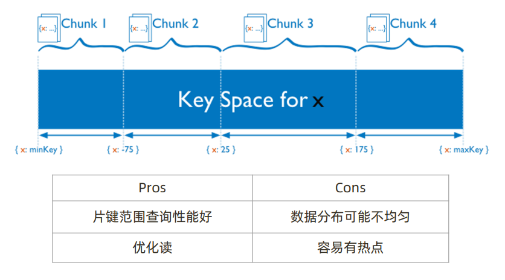

对于基于范围的分片，MongoDB按照片键的范围把数据分成不同部分。
假设有一个数字的片键:想象一个从负无穷到正无穷的直线，每一个片键的值都在直线上画了一个点。MongoDB把这条直线划分为更短的不重叠的片段，并称之为数据块，每个数据块包含了片键在一定范围内的数据。在使用片键做范围划分的系统中，拥有”相近”片键的文档很可能存储在同一个数据块中，因此也会存储在同一个分片中。

#### 5.1.3.3 基于哈希的分片

分片过程中利用哈希索引作为分片的单个键，且哈希分片的片键只能使用一个字段，而基于哈希片键最大的好处就是保证数据在各个节点分布基本均匀。

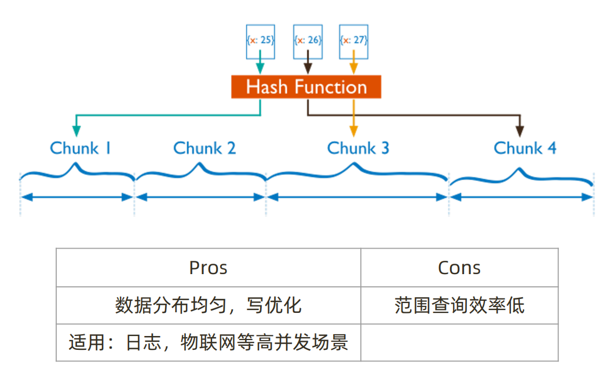

对于基于哈希的分片，MongoDB计算一个字段的哈希值，并用这个哈希值来创建数据块。在使用基于哈希分片的系统中，拥有”相近”片键的文档很可能不会存储在同一个数据块中，因此数据的分离性更好一些。Hash分片与范围分片互补，能将文档随机的分散到各个chunk，充分的扩展写能力，弥补了范围分片的不足，但不能高效的服务范围查询，所有的范围查询要分发到后端所有的Shard才能找出满足条件的文档。

#### 5.1.3.4 分片键选择建议

**1、递增的sharding key**

数据文件挪动小。（优势）
因为数据文件递增，所以会把insert的写IO永久放在最后一片上，造成最后一片的写热点。同时，随着最后一片的数据量增大，将不断的发生迁移至之前的片上。

**2、随机的sharding key**

数据分布均匀，insert的写IO均匀分布在多个片上。（优势）
大量的随机IO，磁盘不堪重荷。

**3、混合型key**

大方向随机递增，小范围随机分布。
为了防止出现大量的chunk均衡迁移，可能造成的IO压力。我们需要设置合理分片使用策略（片键的选择、分片算法（range、hash））

**选择合适的分片键建议**

- 选择基数大的片键,如:以年龄18-60作为片键,最多43个chunk

如果基数小的片键,因为备选值有限，那么块的总数量就有限

随着数据增多，块的大小会越来越大

太大的块，会导致水平扩展时移动块会非常困难

- 片键取值的分布应尽可能均匀,如果使用分布不均匀的片键,会导致以下

  造成某些块的数据量急剧增大

  这些块压力随之增大

  数据均衡以chunk为单位，所以系统无能为力

- 对主要查询使用片键做为条件查询,可以直接定位具体分片,而非所有分片响应,提高效率
- 主要从基数,写分布,定向查询三个方面考虑是否是合适的分片键

比如: 一个email系统中使用片键:{user_id:1,time:1}, 三个方面基数大,写分布,定向查询都不错

#### **5.1.3.5 合理的分片**

分片的基本标准:

- 关于数据:数据量不超过3TB，尽可能保持在2TB一个片
- 关于索引:常用索引必须容纳进内存

按照以上标准初步确定分片后，还需要考虑业务压力，随着压力增大，CPU、RAM、磁盘中的任何一项出现瓶颈时，都可以通过添加更多分片来解决。

**范例: 合理分片**

```sh
A=所需存储总量/单服务器可挂载容量
如:8TB/2TB = 4
B=工作集大小/(单服务器物理内存容量*0.6) #0.6表示mongodb默认使用内存的60%
如:400GB / (256G*0.6) = 3
C=并发量总数/（单服务器并发量*0.7) #0.7表示单机变成分片有额外开销
如:30000/(9000*0.7)= 6

#结果:
分片数量=max(A,B,C)=6
```

## 5.2 部署分片集群

官方说明

```CQL
https://www.mongodb.com/docs/manual/tutorial/deploy-shard-cluster/
```

### 5.2.1 分片集群环境规划

以下案例准备10个实例,使用端口号:38017-38026

```sh
(1)mongos节点:
38017

(2)config server节点: 38018-38020
3台构成的复制集（1主两从，不支持arbiter) 
38018-38020（复制集名字configsvr)

(3)shard节点:
sh1:38021-23 (1主两从，其中一个节点为arbiter，复制集名字sh1)
sh2:38024-26 (1主两从，其中一个节点为arbiter，复制集名字sh2)
```

### 5.2.2 shard 节点配置过程

#### 5.2.2.1 shard 节点的目录创建

```sh
#在shard节点创建三个目录
mkdir -p /apps/mongodb/{38021..38026}/{conf,data,log}
```

#### 5.2.2.2 shard 节点的配置文件


## 5.4 实战案例: 多服务器实现MongoDB分片集群

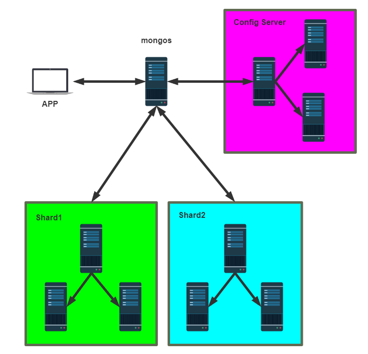

```sh
#准备十台主机,角色分配如下
shard1
11.0.1.8:27017
11.0.1.18:27017
11.0.1.28:27017
shard2
11.0.1.8:28017
11.0.1.18:28017
11.0.1.28:28017

config server
11.0.1.38:27017
11.0.1.48:27017
11.0.1.58:27017

mongos
11.0.1.48:28017
```

### 5.4.2 实现过程

#### 5.4.2.1 配置 shard1

```sh
#在shard1的三个节点上执行下面操作
[root@Rocky8 ~]# cat /apps/mongodb/conf/mongo.conf 
systemLog:
  destination: file
  path: "/apps/mongodb/log/mongodb.log"
  logAppend: true
storage:
  dbPath: "/apps/mongodb/data/"
processManagement:
  fork: true
net:
  port: 27017
  bindIp: 0.0.0.0
replication:
  replSetName: shard1
  oplogSizeMB: 2048
sharding:				#配置分片服务器角色
  clusterRole: shardsvr
#初始化shard1集群
[root@rocky8 ~]#mongosh --port 27017
use admin
config = { _id: 'shard1', members: [
 {_id: 0, host: '11.0.1.8:27017'},
 {_id: 1, host: '11.0.1.18:27017'} ,
 {_id: 2, host: '11.0.1.28:27017'}]
 }
rs.initiate (config)

************************************************************************************************************
```

#### 5.4.2.2 配置shard2

```sh
#在shard2的三个节点上执行下面操作
[root@Rocky8 ~]# cat /apps/mongodb/28017/conf/mongod.conf 
systemLog:
  destination: file
  path: /apps/mongodb/28017/log/mongodb.log
  logAppend: true
storage:
  dbPath: /apps/mongodb/28017/data
processManagement:
  fork: true
net:
  bindIp: 0.0.0.0
  port: 28017
replication:
  replSetName: shard2
  oplogSizeMB: 2048
sharding:					#配置分片服务器角色
  clusterRole: shardsvr
#初始化shard2集群
[root@rocky8 ~]#mongosh --port 28017
use admin
config = { _id: 'shard2', members: [
 {_id: 0, host: '11.0.1.8:28017'},
 {_id: 1, host: '11.0.1.18:28017'},
 {_id: 2, host: '11.0.1.28:28017'}]
 }
rs.initiate (config)
```

#### 5.4.2.3 配置 config server

```sh
#需初始化状态，清空data文件
[root@Rocky8 ~]# cat > /apps/mongodb/conf/mongo.conf <<EOF
systemLog:
  destination: file
  path: "/apps/mongodb/log/mongodb.log"                                                                                                                                   
  logAppend: true

storage:
  dbPath: "/apps/mongodb/data/"
 
processManagement:
  fork: true

net:
  #port: 27017			#config server默认为27019，无需此项
  bindIp: 0.0.0.0

replication:
  oplogSizeMB: 2048
  replSetName: config  
sharding:
  clusterRole: configsvr
EOF

config = { _id: 'config', members: [
 {_id: 0, host: '11.0.1.38:27019'},
 {_id: 1, host: '11.0.1.48:27019'},
 {_id: 2, host: '11.0.1.58:27019'}]
 }
 
 
use admin
config = { _id: 'config', members: [
                 {_id: 0, host: '11.0.1.38:27019' },
                 {_id: 1, host: '11.0.1.48:27019'} ,
                 {_id: 2, host: '11.0.1.58:27019'}]
         }
rs.initiate(config)
```

#### 5.4.2.4 配置 mongos

```sh
#配置mongs节点
#在mongos节点11.0.1.48
[root@Rocky8 ~]# cat /apps/mongodb/conf/mongo.conf 
systemLog:
  destination: file
  path: "/apps/mongodb/mongodb.log"
  logAppend: true
processManagement:
  fork: true
net:
  bindIp: 0.0.0.0
sharding:
  configDB: config/11.0.1.38:27019,11.0.1.48:27019,11.0.1.58:27019

#先停止原mongod服务
[root@Rocky8 ~]# systemctl stop mongod.service

#启动mongs,注意不是mongod
[root@Rocky8 ~]# mongos -f /apps/mongodb/conf/mongo.conf 

[root@Rocky8 ~]# ss -ntl
Active Internet connections (only servers)
Proto Recv-Q Send-Q Local Address           Foreign Address         State      
tcp        0      0 0.0.0.0:111             0.0.0.0:*               LISTEN     
tcp        0      0 0.0.0.0:22              0.0.0.0:*               LISTEN     
tcp        0      0 0.0.0.0:27017           0.0.0.0:*               LISTEN     
tcp        0      0 0.0.0.0:27019           0.0.0.0:*               LISTEN     
tcp6       0      0 :::111                  :::*                    LISTEN     
tcp6       0      0 :::22                   :::*                    LISTEN 


#添加分片
[root@rocky8 ~]#mongosh admin
[direct: mongos] admin> sh.addShard("shard1/11.0.1.8:27017")
[direct: mongos] admin> sh.addShard("shard2/11.0.1.8:28017")
#或者
mongos>sh.addShard("shard1/11.0.1.8:27017,11.0.1.18:27017,11.0.1.28:27017")
mongos>sh.addShard("shard1/11.0.1.8:28017,11.0.1.18:28017,11.0.1.28:28017")

#查看分片状态
[direct: mongos] admin> sh.status()
shardingVersion
{ _id: 1, clusterId: ObjectId("667e1a5cd96f8faac8274c99") }
---
shards
[
  {
    _id: 'shard1',
    host: 'shard1/11.0.1.18:27017,11.0.1.28:27017,11.0.1.8:27017',
    state: 1,
    topologyTime: Timestamp({ t: 1719594833, i: 3 })
  },
  {
    _id: 'shard2',
    host: 'shard2/11.0.1.18:28017,11.0.1.28:28017,11.0.1.8:28017',
    state: 1,
    topologyTime: Timestamp({ t: 1719594847, i: 4 })
  }
]
---
active mongoses
[ { '7.0.11': 1 } ]
---
autosplit
{ 'Currently enabled': 'yes' }
---
balancer
{ 'Currently enabled': 'yes', 'Currently running': 'no' }
---
databases
[
  {
    database: { _id: 'config', primary: 'config', partitioned: true },
    collections: {}
  }
]

[direct: mongos] admin> db.runCommand({listshards: 1})
{
  shards: [
    {
      _id: 'shard1',
      host: 'shard1/11.0.1.18:27017,11.0.1.28:27017,11.0.1.8:27017',
      state: 1,
      topologyTime: Timestamp({ t: 1719594833, i: 3 })
    },
    {
      _id: 'shard2',
      host: 'shard2/11.0.1.18:28017,11.0.1.28:28017,11.0.1.8:28017',
      state: 1,
      topologyTime: Timestamp({ t: 1719594847, i: 4 })
    }
  ],
  ok: 1,
  '$clusterTime': {
    clusterTime: Timestamp({ t: 1719595051, i: 1 }),
    signature: {
      hash: Binary(Buffer.from("0000000000000000000000000000000000000000", "hex"), 0),
      keyId: Long("0")
    }
  },
  operationTime: Timestamp({ t: 1719595051, i: 1 })
}
```

#### 5.4.2.5 配置分片规则

##### 5.4.2.5.1 启用 Range 分片规则

```sh
#启用数据库的分片
[direct: mongos] test>sh.enableSharding("test")
#创建索引
[direct: mongos] test>use test
[direct: mongos] test>db.vast.createIndex({id: 1}) #针对id字段从小到大创建索引

#开启range分片规则,指定分片范围，空闲时分片
[direct: mongos] test>sh.shardCollection("test.vast", {id: 1})
#或者
[direct: mongos] test>db.runCommand({shardcollection: "test.vast",key: {id: 1}})

#如果是对_id进行range分片,无需创建索引
[direct: mongos] test>sh.shardCollection("test.vast", {_id: 1}) 
#或者
[direct: mongos] test>db.runCommand({shardcollection: "test.vast",key: {_id: 1}})

#插入足够的大量数据才会分片
[direct: mongos] test>for (i=0;i<1000000 ;i++){ db.vast.insert ( { "id" :i, "name" : "dinginx","age": 25,"date":new Date()})}

#查看分片,空闲时自动分片
[direct: mongos] test> db.vast.count()
303840

shard2 [direct: primary] test> db.vast.count()
304108
shard1 [direct: primary] test> db.vast.count()
0
```

##### 5.4.2.5.2 启用 Hash 分片规则

```sh
#启用数据库的分片
[direct: mongos] dinginx>sh.enableSharding("dinginx")

#指定在magedu库的vast表的id列上创建hash索引
[direct: mongos] dinginx>use dinginx
[direct: mongos] dinginx>db.vast.createIndex({id: "hashed"} )

#指定表分片基于hash规则
[direct: mongos] dinginx>sh.shardCollection("dinginx.vast", {id: 'hashed'})

#插入足够的大量数据才会分片
[direct: mongos] dinginx>for(i=0;i<1000000;i++){db.vast.insert ({"id":i,"name":"dinginx","age":20,"date":new Date()})}

#查看分片
#查看分片
[direct: mongos] dinginx> db.adminCommand({listShards: 1})
[direct: mongos] dinginx> db.runCommand({listshards: 1})

[direct: mongos] test> use dinginx		#mongos服务器
switched to db dinginx
[direct: mongos] dinginx> show tables
vast
[direct: mongos] dinginx> db.vast.count()
DeprecationWarning: Collection.count() is deprecated. Use countDocuments or estimatedDocumentCount.
30816

shard1 [direct: primary] dinginx> db.vast.count()		#分片集群shard1
15571
shard2 [direct: primary] dinginx> db.vast.count()		#分片集群shard2
16170
```

## **5.5 balance** **操作**

### 5.5.1 介绍

mongos的一个重要功能balancer，自动巡查所有shard节点上的chunk的情况，自动做chunk迁移,即实现balance功能

balancer工作时机

- 自动运行，当检测系统不繁忙的时候做迁移
- 在做节点删除的时候，立即开始迁移工作
- balancer可以指定只在预设定的时间窗口内运行

有时候需要关闭和开启balancer

比如:备份的时候进行balance会导致数据不一致,所以需要错开备份时间段

**范例: 停止和开启balancer**

```sh
mongos> sh.stopBalancer()
mongos> sh.startBalancer()

db.status()
```


### 5.5.2 自定义自动平衡进行的时间段

```sh
#自定义自动平衡进行的时间段
https://docs.mongodb.com/manual/tutorial/manage-sharded-clusterbalancer/#schedule-the-balancing-window

#connect to mongos
mongo --port 27017 admin
[direct: mongos] test> use config
[direct: mongos] config> sh.setBalancerState(true)
[direct: mongos] config> sh.getBalancerState()
true

#设置3:00到5:00进行balance
[direct: mongos] config> db.settings.updateOne( { _id: "balancer" }, { $set: { activeWindow: { start: "3:00", stop: "5:00" } } }, { upsert: true })
或
db.settings.updateOne(
   { _id: "balancer" },
   { $set: { activeWindow : { start : "3:00", stop : "5:00" } } },
   { upsert: true }
)

#查看规则
[direct: mongos] config> db.settings.find()
[
  {
    _id: 'balancer',
    mode: 'full',
    stopped: false,
    activeWindow: { start: '3:00', stop: '5:00' }
  },
  { _id: 'automerge', enabled: true }
]


#关闭规则
[direct: mongos] test>use config
[direct: mongos] config>db.settings.updateOne( { _id : "balancer" }, { $unset : { activeWindow : true } } )
[direct: mongos] config> db.settings.find()
[
  { _id: 'balancer', mode: 'full', stopped: false },
  { _id: 'automerge', enabled: true }
]
```

### 5.5.3 集合的balance管理

```sh
#关闭某个集合的balancer
sh.disableBalancing("test.vast")
#打开某个集合的balancer
sh.enableBalancing ("test.vast")
#确定某个集合的balance是开启或者关闭
db.getSiblingDB("config").collections.findOne({_id : "magedu.vast"}).noBalance
```

# **6 MongoDB** **备份恢复**

虽然有复制集的高可用性保证，数据丢失的可能很低，但仍然需要备份

备份的目的:

- 防止硬件故障引起的数据丢失
- 防止人为错误误删数据
- 时间回溯
- 监管要求

## 6.1 备份恢复工具

### 6.1.1 mongoexport/mongoimport说明

mongoexport/mongoimport可以实现逻辑备份,类似于mysqldump,可以导出json或csv格式文件

应用场景总结

- 异构平台迁移,比如:MySQL和MongoDB
- 同平台跨大版本的MongoDB数据导出导入: 比如mongodb 2 ----> mongodb 3

### 6.1.2 mongodump/mongorestore说明

物理备份,日常备份恢复时使用．导出的二进制文件

mongodump能够在Mongodb运行时进行备份，它的工作原理是对运行的Mongodb做查询，然后将所有查到的文档写入磁盘,但是存在的问题时使用mongodump产生的备份不一定是数据库的实时快照，如果我们在备份时对数据库进行了写入操作,则备份出来的文件可能不完全和Mongodb实时数据相等。另外在备份时可能会对其它客户端性能产生不利的影响。

使用mongodump备份最灵活，但速度上也是最慢的
mongodump出来的数据不能表示某个时间点，只是某个时间段

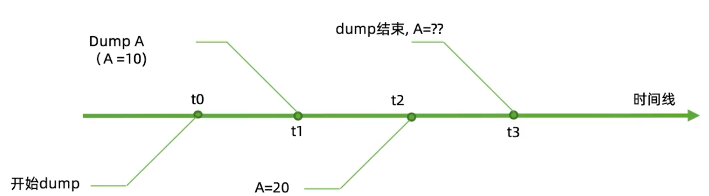

### 6.1.3 mongoexport/mongoimport与mongodump/mongorestore的对比

mongoexport/mongoimport导入/导出的是JSON格式
而mongodump/mongorestore导入/导出的是BSON格式。
JSON可读性强但体积较大，BSON则是二进制文件，体积小但对人类几乎没有可读性。
在一些mongodb版本之间，BSON格式可能会随版本不同而有所不同，所以不同版本之间用mongodump/mongorestore可能不会成功，具体要看版本之间的兼容性。
当无法使用BSON进行跨版本的数据迁移的时候，使用JSON格式即mongoexport/mongoimport是一个可选项。
跨版本的mongodump/mongorestore并不推荐，实在要做请先检查文档看两个版本是否兼容JSON虽然具有较好的跨版本通用性，但其只保留了数据部分，不保留索引，账户等其他基础信息。

### 6.1.4 备份工具安装

**版本说明**

```sh
https://www.mongodb.com/docs/database-tools/mongoexport/#mongodb-binary-bin.mongoexport
Versioning
Starting with MongoDB 4.4, mongoexport is now released separately from the MongoDB Server and uses its own versioning, with an initial version of 100.0.0. Previously, mongoexport was released alongside the MongoDB Server and used matching versioning.
For documentation on the MongoDB 4.2 or earlier versions of mongoexport, 
reference the MongoDB Server Documentation for that version of the tool:
```

**下载链接**

```
https://www.mongodb.com/try/download/shell
```

**范例：Rocky8安装MongoDB命令行数据库工具下载**

```sh
[root@Rocky8 ~]# wget https://fastdl.mongodb.org/tools/db/mongodb-database-tools-rhel80-x86_64-100.9.5.rpm
[root@Rocky8 ~]# yum -y install mongodb-database-tools-rhel80-x86_64-100.9.5.rpm
[root@Rocky8 ~]# rpm -ql mongodb-database-tools 
/usr/bin/bsondump
/usr/bin/mongodump
/usr/bin/mongoexport
/usr/bin/mongofiles
/usr/bin/mongoimport
/usr/bin/mongorestore
/usr/bin/mongostat
/usr/bin/mongotop
/usr/lib/.build-id
/usr/lib/.build-id/05
/usr/lib/.build-id/05/78112deaeb240e1b14357f42b3061b1ea0997e
/usr/lib/.build-id/33
/usr/lib/.build-id/33/269fedd87fe376fba5fa7ed434fbfa855d7637
/usr/lib/.build-id/9f
/usr/lib/.build-id/9f/ca8cf87cd990742de0f6c0c9fe40d51020ec67
/usr/lib/.build-id/b1
/usr/lib/.build-id/b1/0ae4e5a4cc3b6dc393a2d5fe91eaf530b9b43a
/usr/lib/.build-id/c1
/usr/lib/.build-id/c1/1b8051835a551313566577c3ebfbfd13e95145
/usr/lib/.build-id/c7
/usr/lib/.build-id/c7/c82df4efb34c1751dc8e650ffed8f66d9c238e
/usr/lib/.build-id/e1
/usr/lib/.build-id/e1/483f9bf44eed0d073367f1101289082bcda006
/usr/lib/.build-id/e2
/usr/lib/.build-id/e2/428e0c95138d5be91086d8163a89888034b25d
/usr/share/doc/mongodb-database-tools/LICENSE.md
/usr/share/doc/mongodb-database-tools/README.md
/usr/share/doc/mongodb-database-tools/THIRD-PARTY-NOTICES
```

## 6.2 mongoexport/mongoimport

### 6.2.1 导出工具mongoexport

**此工具只能针对单表,不支持整库的表导出**

官方帮助

```sh
https://www.mongodb.com/docs/database-tools/mongoexport/
```

mongoexport具体用法如下所示:

```sh
$mongoexport --help
参数说明:
-h  #指明数据库宿主机的IP
-u  #指明数据库的用户名
-p  #指明数据库的密码
-d  #指明数据库的名字
-c  #指明collection的名字
-f  #指明要导出那些列
-o  #指明到要导出的文件名
-q  #指明导出数据的过滤条件
--type=csv或 --csv  #指定导出为csv格式，默认json格式
--authenticationDatabase <验证库> #指定验证库
```

**范例:**

```sh
#单表备份至json格式
mongoexport -uroot -p123456 --port 27017 --authenticationDatabase admin -d
magedu -c vast -o /mongodb/vast.json
mongoexport -d test -c log -f uid,name -q='{"uid":3}' -o vast.json

#单表备份至csv格式，则需要使用--type=csv参数
mongoexport -uroot -p123456 --port 27017 --authenticationDatabase admin -d test -c vast --type=csv -f uid,name,age,date -o /mongodb/vast.csv
```

**导出test数据库vast表**

```sh
[root@Rocky8 ~]# mongoexport -d test -c vast -o /data/backup/vast.json
2024-06-29T12:20:09.686+0800	connected to: mongodb://localhost/
2024-06-29T12:20:10.688+0800	[###.....................]  test.vast  88000/572239  (15.4%)
2024-06-29T12:20:11.690+0800	[########................]  test.vast  208000/572239  (36.3%)
2024-06-29T12:20:12.688+0800	[#############...........]  test.vast  328000/572239  (57.3%)
2024-06-29T12:20:13.688+0800	[###################.....]  test.vast  456000/572239  (79.7%)
2024-06-29T12:20:14.440+0800	[########################]  test.vast  572239/572239  (100.0%)
2024-06-29T12:20:14.440+0800	exported 572239 records

[root@Rocky8 ~]# vim /data/backup/vast.json 

     1 {"_id":{"$oid":"667ef3cd8467a66237990681"},"id":0,"name":"dinginx","age":25,"date":{"$date":"2024-06-28T17:33:01.225Z"}}                                          
     2 {"_id":{"$oid":"667ef3cd8467a66237990682"},"id":1,"name":"dinginx","age":25,"date":{"$date":"2024-06-28T17:33:01.244Z"}}
     3 {"_id":{"$oid":"667ef3cd8467a66237990683"},"id":2,"name":"dinginx","age":25,"date":{"$date":"2024-06-28T17:33:01.253Z"}}
     4 {"_id":{"$oid":"667ef3cd8467a66237990684"},"id":3,"name":"dinginx","age":25,"date":{"$date":"2024-06-28T17:33:01.259Z"}}
     5 {"_id":{"$oid":"667ef3cd8467a66237990685"},"id":4,"name":"dinginx","age":25,"date":{"$date":"2024-06-28T17:33:01.266Z"}}
     6 {"_id":{"$oid":"667ef3cd8467a66237990686"},"id":5,"name":"dinginx","age":25,"date":{"$date":"2024-06-28T17:33:01.273Z"}}
     7 {"_id":{"$oid":"667ef3cd8467a66237990687"},"id":6,"name":"dinginx","age":25,"date":{"$date":"2024-06-28T17:33:01.28Z"}}
     8 {"_id":{"$oid":"667ef3cd8467a66237990688"},"id":7,"name":"dinginx","age":25,"date":{"$date":"2024-06-28T17:33:01.286Z"}}
     9 {"_id":{"$oid":"667ef3cd8467a66237990689"},"id":8,"name":"dinginx","age":25,"date":{"$date":"2024-06-28T17:33:01.293Z"}}
    10 {"_id":{"$oid":"667ef3cd8467a6623799068a"},"id":9,"name":"dinginx","age":25,"date":{"$date":"2024-06-28T17:33:01.3Z"}}
    11 {"_id":{"$oid":"667ef3cd8467a6623799068b"},"id":10,"name":"dinginx","age":25,"date":{"$date":"2024-06-28T17:33:01.306Z"}}
    12 {"_id":{"$oid":"667ef3cd8467a6623799068c"},"id":11,"name":"dinginx","age":25,"date":{"$date":"2024-06-28T17:33:01.313Z"}}

......

#单表备份至csv格式，则需要使用--type=csv参数，-f uid,name,age,date
[root@Rocky8 ~]# mongoexport -d test -c vast2 --type=csv -f uid,name,age,date -o /data/backup/vast2.csv
2024-06-29T12:33:27.281+0800	connected to: mongodb://localhost/
2024-06-29T12:33:28.282+0800	[#######.................]  test.vast2  184000/572239  (32.2%)
2024-06-29T12:33:29.283+0800	[################........]  test.vast2  384000/572239  (67.1%)
2024-06-29T12:33:30.093+0800	[########################]  test.vast2  572239/572239  (100.0%)
2024-06-29T12:33:30.093+0800	exported 572239 records

```

### 6.2.2 导入工具mongoimport

官方帮助

```html
https://www.mongodb.com/docs/database-tools/mongoimport/
```

```sh
mongoimport --help
#参数说明:
-h  #指明数据库宿主机的IP
-u  #指明数据库的用户名
-p  #指明数据库的密码
-d  #指明数据库的名字
-c  #指明collection的名字
-f  #指明要导入那些列
--type=csv #指定导入csv格式文件，默认json格式
-j，--numInsertionworkers=<number>  #同时插入的数量,默认为
--headerline  #指明第一行是列名，不需要导入
```

**范例: 数据恢复**

```sh
#导入json格式表数据到vast1表中
mongoimport -uroot -p123456 --port 27017 --authenticationDatabase admin -d magedu -c vast1 /mongodb/vast.json

#导入标准的csv格式(文件第一行有列名字)的文件到vast2表中
mongoimport-uroot -p123456 --port 27017 --authenticationDatabase admin -d magedu -c vast2 --type=csv --headerline --file /mongodb/vast.csv
#范例：
[root@Rocky8 ~]# mongoimport -d test -c vast3 --type=csv --headerline /data/backup/vast2.csv

#导入非标准的csv格式(第一行没有列名字)的文件到vast3表中
mongoimport -uroot -p123456 --port 27017 --authenticationDatabase admin -d magedu -c vast3 --type=csv -f id,name, age,date --file/mongodb/vast.csv
```

### 6.2.3 异构平台迁移案例

#### 6.2.3.1 将MySQL数据迁移至MongoDB

**范例：方法1**

```sh
#将hellodb数据库下students表进行导出，导入到mongodb
1) mysql开启安全路径
vim /etc/my.cnf
[mysqld]
secure-file-priv=/tmp
vim /lib/systemd/system/mysqld.service 

#PrivateTmp=true 将此行注释,否则会在/tmp/生成如下类似的临时的子目录
/tmp/systemd-private-4e55a87321e741b7b98959db343effa5-mysqld.service-JsMtwj/tmp/students_info.csv

#重启数据库生效
systemctl restart mysqld

2）导出mysql的zabbix.events表数据

#默认导出为Tab分隔的csv文件
mysql> select * from zabbix.events into outfile "/tmp/events.csv";


#指定导出分隔符为,的csv文件
mysql> select * from zabbix.events into outfile "/tmp/events.csv" fields terminated by ',';

3)导出列名

#如果列很多,可以使用infomation_schema.columns导出列名
select column_name from information_schema.columns where table_schema='zabbix' and table_name='events';

#group_concat函数可以多行合并成一行显示
select group_concat(column_name) from information_schema.columns where table_schema='zabbix' and table_name='events';

4)在mongodb中导入备份
#方法1
将第3步查出的列名加入到前面导出的文件events.csv的第一行
[root@Rocky8 ~]# mongoimport -d test -c events --type=csv --headerline --file events.csv 

#方法2:使用选项 -f 指定列名
[root@Rocky8 ~]# mongoimport -d test -c events --type=csv -f eventid,source,object,objectid,clock,value,acknowledged,ns,name,severity --file events1.csv
```

**范例：方法2**

```sh
1) mysql开启安全路径
vim /etc/my.cnf
[mysqld]
secure-file-priv=/data/mysql
vim /lib/systemd/system/mysqld.service 
#PrivateTmp=true 将此行注释,否则会在/tmp/生成临时的子目录
#重启数据库生效
systemctl restart mysqld
mkdir -p /data/mysql
chown mysql.mysql /data/mysql

2)导出students表到目录中，生成以Tab分割的文本文件
mysqldump hellodb students  -T /data/mysql
ls /data/mysql/
students.sql students.txt 

3)将tab替换为,
sed -i.bak 's/\t/,/g' /data/mysql/students.txt
4)导入mongodb
mongoimport -d test -c students -f stuid,name,age,gender,classid,teacherid --
type=csv /data/mysql/students.txt
```

#### 6.2.3.2 将MongoDB数据迁移至MySQL

```
[root@rocky8 ~]#head /tmp/students_info.csv
1,Shi Zhongyu,22,M,2,3
2,Shi Potian,22,M,1,7
3,Xie Yanke,53,M,2,16
4,Ding Dian,32,M,4,4
5,Yu Yutong,26,M,3,1
6,Shi Qing,46,M,5,\N
7,Xi Ren,19,F,3,\N
8,Lin Daiyu,17,F,7,\N
9,Ren Yingying,20,F,6,\N
10,Yue Lingshan,19,F,3,\N
mysql> use hellodb
Database changed
mysql> create table students_info like students;
mysql> load data infile '/tmp/students_info.csv' into table students_info fields 
terminated by ',' optionally enclosed by '"';
```

## 6.3 mongodump和mongorestore

分片集备份大致与复制集原理相同，不过存在以下差异:

- 应分别为每个片和config备份，如果有3个分片，即需要分别进行3个分片和config共4个备份。
- 分片集备份不仅要考虑一个分片内的一致性问题，还要考虑分片间的一致性问题，因此每个片要能够恢复到同一个时间点。
- 如果在备份期间发生均衡的数据迁移，会造成数据丢失，所以备份前需要停止balancer。

### 6.3.1 mongodump

官方帮助

```
https://www.mongodb.com/docs/database-tools/mongodump/
```

**mongodump用法如下:**

```
mongodump --help
参数说明:
-h   #指明数据库宿主机的IP
-u   #指明数据库的用户名
-p   #指明数据库的密码
-d   #指明数据库的名字
-c   #指明collection的名字
-o   #指明到要导出的文件名
-q   #指明导出数据的过滤条件
-j, --numParallelCollections= #并行导出的数量,默认为4
--oplog  #备份的同时备份oplog,此选项是replica set或者master/ slave模式专用
```

**规律:**

- 导出的文件放在以 database命名的目录下
- 每个表导出2个文件,分别是bson结构的数据文件和json格式的索引信息
- 如果不声明表名。导出所有的表

### 6.3.2 mongorestore

**官方帮助**

```
https://www.mongodb.com/docs/database-tools/mongorestore/
```

mongorestore与mongoimport参数类似
mongorestore用法如下:

```sh
mongorestore --help
-h  #指明数据库宿主机的IP
-u  #指明数据库的用户名
-p  #指明数据库的密码
-d  #指明数据库的名字
-c  #指明collection的名字
-o  #指明到要导出的文件名
-q  #指明导出数据的过滤条件
--authenticationDatabase  #验证数据的名称
--gzip  #备份时压缩
--oplogReplay  #恢复完数据文件后再重放oplog。默认重放dump/oplog.bson
--oplogFile=<filename>  #指定需要重放的oplog文件位置
--oplogLimit=<seconds>[:ordinal]   #重放oplog 时截止到指定时间点
--drop   #恢复的时候把之前的集合drop掉
```

### 6.3.3 备份和恢复范例

范例：mongodump

```sh
#全库备份
#注意:完全备份不会备份config和local库,但会备份admin库和test库及用户库
[root@Rocky8 ~]# mkdir -p /data/full

[root@Rocky8 ~]# mongodump -o /data/full/

[root@Rocky8 ~]# ls /data/full/
admin  config  dinginx  test

[root@Rocky8 ~]# ls /data/full/test/
events.bson  events.metadata.json  vast3.bson  vast3.metadata.json

#备份指定库dinginx
[root@Rocky8 ~]# mkdir -p /data/dinginx_backup
[root@Rocky8 ~]# mongodump -d dinginx -o  /data/dinginx_backup

#备份指定库test
mkdir -p /backup/test_backup
mongodump  -d test -o /backup/test_backup

#备份magedu库下的events集合
mkdir -p /backup/events
mongodump -d test -c events -o /backup/events

#完全备份并压缩备份
mkdir -p /backup/full_gzip
mongodump -o /backup/full_gzip --gzip
```

**范例: mongorestore**

```sh
#恢复完全备份
mongorestore -uroot -p123456 --port 27017 --authenticationDatabase admin /backup/full

#从完全备份的压缩备份中的test库恢复至test1库
mongorestore -uroot -p123456 --port 27017 --authenticationDatabase admin -d test1 /backup/full_gzip/test --gzip

#从完全备份中的vast表恢复到test库中的test库的表vast1中
mongorestore-uroot -p123456 --port 27017 --authenticationDatabase admin -d test -c vast1 --gzip /backup/full_gzip/test/vast.bson.gz

#默认不允许覆盖恢复会报错,可以使用选项--drop实现覆盖恢复,表示恢复的时候先之前的集合drop掉(危险),再恢复
mongorestore -uroot -p123456 --port 27017 --authenticationDatabase admin -dmagedu --drop /backup/magedu
```

### 6.3.4 利用 oplog 恢复数据

```sh
#关于oplog说明: 官方:https://docs.mongodb.com/manual/core/replica-set-oplog/类似于MySQL中的binlog,记录了MongoDB数据的更新,只支持复制集,不支持单节点在replica set中oplog是一个定容集合(capped collection,固定大小)，保存在local库的db.oplog.rs
它的默认大小是磁盘空间的5%（可以通过--oplogSizeMB参数修改).
其中记录的是整个mongod实例一段时间内数据库的所有变更(插入/更新/删除）操作。
当空间用完时新记录自动覆盖最老的记录。
其覆盖范围被称作oplog时间窗口。
需要注意的是，因为oplog是一个定容集合，所以时间窗口能覆盖的范围会因为单位时间内的更新次数不同而变化。
至少要预留MongoDB的1个全备的周期大小。
默认情况下，MongoDB 不设置最小 oplog 保留期，并自动从最旧的条目开始截断 oplog，以保持配置的最大 oplog 大小
oplog有一个非常重要的特性——幂等性（idempotent）。即对一个数据集合，使用oplog中记录的操作重放时，无论被重放多少次，其结果会是一样的。比如，如果oplog中记录的是一个插入操作，并不会因为你重放了两次，数据库中就得到两条相同的记录。这是一个很重要的特性.
```

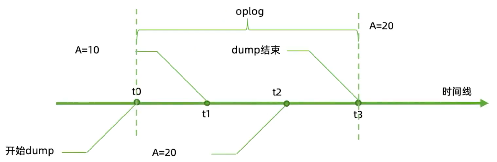


**范例： 利用oplog幂等性恢复数据的一致**

```sh
#注意：此操作不要在分片集群中执行
#单机默认没有oplog，需要实现复制集才能开启oplog

#插入大量数据，同时执行后面的备份操作
myrepl:PRIMARY> use test
myrepl:PRIMARY> for (i=1;i<1000000 ;i++){ db.magedu.insert ( { "id" :i, "name" : "ding+wang" , "age" : 20,"date" : new Date()})}

#oplog只支持完全备份
[root@Rocky8 ~]# mkdir  -pv /data/backup/full/

#使用--oplog选项可以备份同时也备份oplog实现热备份,会记录备份过程中的数据变化。并以oplog.bson保存下来
[root@Rocky8 ~]# mongodump --oplog -o /data/backup/full/
[root@Rocky8 ~]# ls /data/backup/full/
admin  config  dinginx  oplog.bson  test

#查看oplog日志
[root@Rocky8 ~]# bsondump /data/backup/oplog/local/oplog.rs.bson |head -n5
{"op":"n","ns":"","o":{"msg":"initiating set"},"ts":{"$timestamp":{"t":1719500187,"i":2150}},"v":{"$numberLong":"2"},"wall":{"$date":{"$numberLong":"1719372343730"}}}
{"op":"c","ns":"config.$cmd","ui":{"$binary":{"base64":"7TGg3F0mTDSOCytcuWqFLA==","subType":"04"}},"o":{"create":"transactions","idIndex":{"v":{"$numberInt":"2"},"key":{"_id":{"$numberInt":"1"}},"name":"_id_"}},"ts":{"$timestamp":{"t":1719500187,"i":2152}},"t":{"$numberLong":"1"},"v":{"$numberLong":"2"},"wall":{"$date":{"$numberLong":"1719372349394"}}}
{"op":"c","ns":"config.$cmd","ui":{"$binary":{"base64":"7TGg3F0mTDSOCytcuWqFLA==","subType":"04"}},"o":{"createIndexes":"transactions","v":{"$numberInt":"2"},"key":{"parentLsid":{"$numberInt":"1"},"_id.txnNumber":{"$numberInt":"1"},"_id":{"$numberInt":"1"}},"name":"parent_lsid","partialFilterExpression":{"parentLsid":{"$exists":true}}},"ts":{"$timestamp":{"t":1719500187,"i":2153}},"t":{"$numberLong":"1"},"v":{"$numberLong":"2"},"wall":{"$date":{"$numberLong":"1719372349394"}}}
{"op":"c","ns":"config.$cmd","ui":{"$binary":{"base64":"rGgNmyMdRuuUqmcgDCcdcw==","subType":"04"}},"o":{"create":"image_collection","idIndex":{"v":{"$numberInt":"2"},"key":{"_id":{"$numberInt":"1"}},"name":"_id_"}},"ts":{"$timestamp":{"t":1719500187,"i":2154}},"t":{"$numberLong":"1"},"v":{"$numberLong":"2"},"wall":{"$date":{"$numberLong":"1719372349403"}}}
{"op":"n","ns":"","o":{"msg":"new primary"},"ts":{"$timestamp":{"t":1719500187,"i":2155}},"t":{"$numberLong":"1"},"v":{"$numberLong":"2"},"wall":{"$date":{"$numberLong":"1719372349404"}}}
2024-07-10T18:46:23.076+0800	6 objects found
2024-07-10T18:46:23.076+0800	write /dev/stdout: broken pipe

#查看所有操作的oplog
myrepl:PRIMARY>use local
myrepl:PRIMARY>db.oplog.rs.find().pretty()

#查看创建操作的oplog,op的i表示insert,u表示update,d表示delete,c表示ddl,n表示note
myrepl:PRIMARY>db.oplog.rs.find({op: "c"}).pretty()

#备份完成后删除表magedu
[root@Rocky8 ~]# mongosh
myrepl:PRIMARY>use test
myrepl:PRIMARY>db.magedu.drop()

#不使用oplog恢复，查看数据数量
[root@ubuntu1804 ~]#mongorestore --drop /data/backup/oplog
[root@ubuntu1804 ~]#mongo
>my_repl:PRIMARY> db.magedu.count()

#使用oplog恢复，查看数据数量，和上面比较
[root@ubuntu1804 ~]#mongorestore --drop --oplogReplay /data/backup/oplog
[root@ubuntu1804 ~]#mongo
>myrepl:PRIMARY> db.magedu.count()
```

**范例: 利用oplog恢复误删除的表**

```basic
故障说明:
每天3点全备，oplog恢复窗口为48小时
上午10点test库的vast业务表被误删除。
恢复过程:
1、停应用
2、找测试库
3、恢复昨天晚上全备
4、截取全备之后到test.vast被误删除时间点的oplog
5、恢复到测试库
6、将误删除表导出，恢复到生产库
```

**故障还原过程**

```sh
1)完全备份
[root@Rocky8 ~]# mongosh
myrepl [direct: primary] dinginx> use dinginx
myrepl [direct: primary] dinginx> for (i=0;i<100 ;i++){ db.vast.insert ( { "id" :i, "name" : "dinginx" , "age" : 20,"date" : new Date()})}

#执行完全备份
[root@Rocky8 ~]# mkdir /data/backup/full -pv
[root@Rocky8 ~]# mongodump --oplog -o /data/backup/full/
[root@Rocky8 ~]# ls /data/backup/full/
admin  config  dinginx  oplog.bson

2)模拟数据变化
[root@Rocky8 ~]# mongosh
myrepl [direct: primary] dinginx> for (i=0;i<10 ;i++){ db.test.insert ( { "id" :i, "name" : "hang" , "age" : 18,"date" : new Date()})}
myrepl [direct: primary] dinginx> db.test2.insert({name:"wang"})
myrepl [direct: primary] dinginx> show tables
test
test2
vast

3)模拟10:00误删除test库中的vast表
myrepl [direct: primary] dinginx> db.vast.drop()
true
myrepl [direct: primary] dinginx> show tables
test
test2

#开始恢复,先停应用后,执行下面恢复过程
4)备份当前oplog.rs表即备份最新oplog
[root@Rocky8 ~]# mongodump -d local -c oplog.rs -o /data/backup/oplog
[root@Rocky8 ~]# tree /data/backup/oplog/
/backup/oplog/
└── local
   ├── oplog.rs.bson
   └── oplog.rs.metadata.json
1 directory, 2 files

5)将备份下来的oplog的bson文件,覆盖完全备份的oplog.bson文件,用来还原
[root@Rocky8 ~]# cp /data/backup/oplog/local/oplog.rs.bson /data/backup/full/oplog.bson 

6)查看local库的oplog.rs表获取误删除vast表的时间戳
myrepl:PRIMARY> use local
myrepl:PRIMARY> db.oplog.rs.find({op:"c"}).pretty()

#查看到误删除vast表的记录如下,记下ts信息
.....
  {
    op: 'c',
    ns: 'dinginx.$cmd',
    ui: UUID("ee0d8129-2db5-4de2-89a5-6c84c210b7aa"),
    o: { drop: 'vast' },
    o2: { numRecords: 110 },
    ts: Timestamp({ t: 1720706535, i: 1 }),  #此行需要记录下来
    t: Long("1"),
    v: Long("2"),
    wall: ISODate("2024-07-11T14:02:15.982Z")
  }

7)利用oplog恢复备份至误删除时间点
[root@Rocky8 ~]# mongorestore --oplogReplay --oplogLimit "1720706535:1" --drop /data/backup/full/

8)验证是否恢复
myrepl [direct: primary] local> use dinginx
myrepl [direct: primary] dinginx> show tables
test
test2
vast
myrepl [direct: primary] dinginx> db.test.countDocuments()
10
myrepl [direct: primary] dinginx> db.test2.countDocuments()
1
myrepl [direct: primary] dinginx> db.vast.countDocuments()
110

```


**ubuntu22.04安装部署zabbix 7.0 TLS**

```sh
#拉去二进制包
wget https://repo.zabbix.com/zabbix/7.0/ubuntu/pool/main/z/zabbix-release/zabbix-release_7.0-2+ubuntu22.04_all.deb
dpkg -i zabbix-release_7.0-2+ubuntu22.04_all.deb
apt update

#创建数据库
mysql -uroot -p
create database zabbix character set utf8mb4 collate utf8mb4_bin;
create user 'zabbix'@'%' identified by '123456';
grant all privileges on zabbix.* to 'zabbix'@'%';
SET GLOBAL log_bin_trust_function_creators = 1;
quit;

#导入数据
cd database/mysql
mysql -uzabbix -p123456 zabbix < schema.sql
# 如果您正在为 Zabbix proxy创建数据库，请在此处停止
mysql -uzabbix -p123456 zabbix < images.sql
mysql -uzabbix -p123456 zabbix < data.sql
或
zcat /usr/share/zabbix-sql-scripts/mysql/server.sql.gz | mysql --default-character-set=utf8mb4 -uzabbix -p zabbix

#编译安装选项
./configure --prefix=/apps/zabbix --enable-server --enable-agent --with-mysql --enable-ipv6 --with-net-snmp --with-libcurl --with-libxml2 --with-openipmi
```


```sh
for (i=0;i<100 ;i++){ db.vast.insert ( { "id" :i, "name" : "dinginx", "age" : 20,"date" : new Date()})
```

