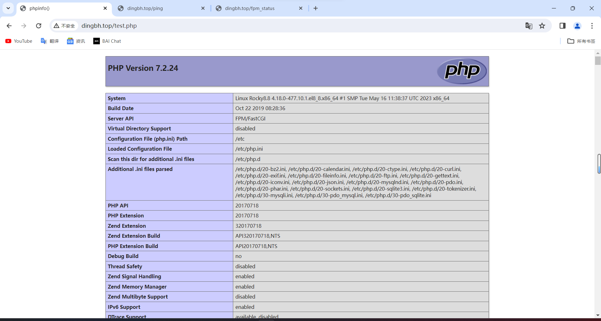

# Nginx服务及高可用

# 1、WEB和Nginx概述

# 2、web服务和http协议

## 2.1、**HTTP** **超文本传输协议**

## 2.2、**HTTP** **协议报文头部结构**

## 2.3、web工具

### 2.3.1、links

```
[root@Ubuntu1804 html]# links 192.168.188.200/session.php

kh8u0bvtkh0vj1bjdgkr2n36o5                                                                                                   
                              +------------ Exit Links -------------+                               
                              |                                     |                               
                              |  Do you really want to exit Links?  |                               
                              |                                     |                               
                              |           [ Yes ]  [ No ]           |                               
                              +-------------------------------------+     
OK
```

### 2.3.2、wget

```
[root@Ubuntu1804 html]# wget 192.168.188.200/session.php
--2023-10-17 18:01:39--  http://192.168.188.200/session.php
Connecting to 192.168.188.200:80... connected.
HTTP request sent, awaiting response... 200 OK
Length: 26 [text/html]
Saving to: ‘session.php.1’

session.php.1                             100%[=====================================================================================>]      26  --.-KB/s    in 0s      

2023-10-17 18:01:39 (4.24 MB/s) - ‘session.php.1’ saved [26/26]
```

### 2.3.3、httpie

```
[root@Ubuntu1804 html]# http 192.168.188.200/session.php
HTTP/1.1 200 OK
Cache-Control: no-store, no-cache, must-revalidate
Connection: Keep-Alive
Content-Length: 26
Content-Type: text/html; charset=UTF-8
Date: Tue, 17 Oct 2023 09:09:43 GMT
Expires: Thu, 19 Nov 1981 08:52:00 GMT
Keep-Alive: timeout=5, max=100
Pragma: no-cache
Server: Apache/2.4.29 (Ubuntu)
Set-Cookie: PHPSESSID=p8lig6htan0adm217eadi98do8; path=/

p8lig6htan0adm217eadi98do8
```

### 2.3.4、curl

```
[root@Ubuntu1804 html]# curl 192.168.188.200/session.php
tvf9i7db37lpnm9qdmm1s1j1h4
```

## 2.4、web服务介绍

### 2.4.1、**Apache prefork** **模型**

```
预派生模式，有一个主控制进程，然后生成多个子进程，每个子进程有一个独立的线程响应用户请求，相对比较占用内存，但是比较稳定，可以设置最大和最小进程数，是最古老的一种模式，也是最稳定的模式，适用于访问量不是很大的场景。

优点：稳定
缺点：每个用户请求需要对应开启一个进程,占用资源较多，并发性差,不适用于高并发场景
```

### 2.4.2、**Apache worker** **模型**

```nginx
一种多进程和多线程混合的模型，有一个控制进程，启动多个子进程，每个子进程里面包含固定的线程，使用线程程来处理请求，当线程不够使用的时候会再启动一个新的子进程，然后在进程里面再启动线程处理请求，由于其使用了线程处理请求，因此可以承受更高的并发。

优点：相比prefork 占用的内存较少，可以同时处理更多的请求
缺点：使用keepalive的长连接方式，某个线程会一直被占据，即使没有传输数据，也需要一直等待到超时才会被释放。如果过多的线程，被这样占据，也会导致在高并发场景下的无服务线程可用。（该问题在prefork模式下，同样会发生）
```

### 2.4.2、Nginx高性能的web服务器

```
Nginx是由俄罗斯国立莫斯科鲍曼科技大学在1994年毕业的学生为俄罗斯rambler.ru公司开发的，开发工作最早从2002年开始，第一次公开发布时间是2004年10月4日，版本号是0.1.02019年3月11日F5 与 NGINX达成协议,F5 将收购 NGINX 的所有已发行股票，总价值约为 6.7 亿美元。6.7亿美金约合44.97亿人民币,nginx核心模块代码长度198430（包括空格、注释），所以一行代码约为2.2万人民币官网地址www.nginx.org
Nginx历经十几年的迭代更新（https://nginx.org/en/CHANGES）， 目前功能已经非常完善且运行稳定，分为社区版本和商业版，另外Nginx的社区版本分为开发版（奇数）、最新稳定版（偶数）和过期版，nginx以功能丰富著称，它即可以作为http服务器，也可以作为反向代理服务器或者邮件服务器，能够快速的响应静态网页的请求，支持FastCGI/SSL/Virtual Host/URL Rwrite/Gzip/HTTP Basic Auth/http
或者TCP的负载均衡(1.9版本以上且开启stream模块)等功能，并且支持第三方的功能扩展。天猫 淘宝 京东 小米 163 新浪等一线互联网公司都在用Nginx或者进行二次开发
```

**Nginx服务**

```
[root@Ubuntu1804 html]# curl -I www.nginx.org
HTTP/1.1 301 Moved Permanently
Server: nginx/1.23.4   #测试版
Date: Tue, 17 Oct 2023 10:12:38 GMT
Content-Type: text/html
Content-Length: 169
Connection: keep-alive
Keep-Alive: timeout=15
Location: http://nginx.org/
```

#### 2.4.2.1、**用户访问体验和性能**

```
1、 用户访问体验统计

互联网存在用户速度体验的1-3-10原则，即1秒最优，1-3秒较优，3~10秒比较慢，10秒以上用户无法接受。用户放弃一个产品的代价很低，只是换一个URL而已。
全球最大搜索引擎 Google：慢500ms = 20% 将放弃访问。
全球最大的电商零售网站亚马逊：慢100ms = 1% 将放弃交易
有很多研究都表明，性能对用户的行为有很大的影响：
79%的用户表示不太可能再次打开一个缓慢的网站
47%的用户期望网页能在2秒钟以内加载
40%的用户表示如果加载时间超过三秒钟，就会放弃这个网站
页面加载时间延迟一秒可能导致转换损失7%，页面浏览量减少11%
8秒定律：用户访问一个网站时，如果等待网页打开的时间超过8秒，会有超过30%的用户放弃等待
请珍惜每一毫秒的时间 !

2、 影响用户体验的因素

据说马云在刚开始创业在给客户演示时，打开一个网站花了不到四个小时。
https://www.shuimiao.net/NjHaO/
影响用户体验的因素
#客户端
客户端硬件配置
客户端网络速率
客户端与服务端距离
#服务器
服务端网络速率
服务端硬件配置
服务端架构设计
服务端应用程序工作模式
服务端并发数量
服务端响应文件大小及数量 buffer cache
服务端I/O压力
```

## **2.5、服务端** **I/O** **流程**

### **2.5.1、** **网络** **I/O** **模型**

**阻塞型、非阻塞型、复用型、信号驱动型、异步**

参看:《UNIX网络编程 卷1：套接字联网API 》(美)W. Richard Stevens 著

```
apache：select

nginx：epoll
```

### **2.5.2、五种** **IO** **对比**

# 3、nginx架构与安装

## 3.1、编译安装

### 3.1.1、nginx部署

```
#ubuntu安装依赖
[root@ding ~/nginx-1.24.0]# apt install -y openssl zlib1g-dev libpcre3-dev

#centos系统安装相关依赖
[root@Rocky8 ~]# yum -y install gcc pcre-devel openssl-devel zlib-devel   #安装相关依赖
[root@Rocky8 ~]# useradd -r -s /sbin/nologin nginx    #创建nginx用户
[root@Rocky8 ~]# wget http://nginx.org/download/nginx-1.24.0.tar.gz
[root@Rocky8 ~]# tar xf nginx-1.24.0.tar.gz 
[root@Rocky8 ~]# cd nginx-1.24.0/
[root@Rocky8 ~/nginx-1.24.0]# ./configure --prefix=/apps/nginx \    #编译安装
> --user=nginx \
> --group=nginx \
> --with-http_ssl_module \
> --with-http_v2_module \
> --with-http_realip_module \
> --with-http_stub_status_module \
> --with-http_gzip_static_module \
> --with-pcre \
> --with-stream \
> --with-stream_ssl_module \
> --with-stream_realip_module

[root@Rocky8 ~/nginx-1.24.0]# make -j 2 && make install 

[root@Rocky8 ~/nginx-1.24.0]# chown -R nginx.nginx /apps/nginx   #设置用户权限
[root@Rocky8 ~/nginx-1.24.0]# ll /apps/nginx/
total 4
drwxr-xr-x 2 nginx nginx 4096 Oct 17 19:31 conf
drwxr-xr-x 2 nginx nginx   40 Oct 17 19:31 html
drwxr-xr-x 2 nginx nginx    6 Oct 17 19:31 logs
drwxr-xr-x 2 nginx nginx   19 Oct 17 19:31 sbin
[root@Rocky8 ~/nginx-1.24.0]# ls /apps/nginx/sbin/
nginx
[root@Rocky8 ~/nginx-1.24.0]# ln -s /apps/nginx/sbin/nginx /usr/sbin/   #设置软连接
[root@Rocky8 ~/nginx-1.24.0]# nginx -v   #nginx版本
nginx version: nginx/1.24.0
[root@Rocky8 ~/nginx-1.24.0]# nginx -V   #nginx编译包版本
nginx version: nginx/1.24.0
built by gcc 8.5.0 20210514 (Red Hat 8.5.0-18) (GCC) 
built with OpenSSL 1.1.1k  FIPS 25 Mar 2021
TLS SNI support enabled
configure arguments: --prefix=/apps/nginx --user=nginx --group=nginx --with-http_ssl_module --with-http_v2_module --with-http_realip_module --with-http_stub_status_module --with-http_gzip_static_module --with-pcre --with-stream --with-stream_ssl_module --with-stream_realip_module
[root@Rocky8 ~/nginx-1.24.0]# nginx    #启动nginx服务
[root@Rocky8 ~/nginx-1.24.0]# ss -ntl  #查看进程端口号
State               Recv-Q              Send-Q                           Local Address:Port                           Peer Address:Port             Process             
LISTEN              0                   128                                    0.0.0.0:111                                 0.0.0.0:*                                    
LISTEN              0                   511                                    0.0.0.0:80                                  0.0.0.0:*                                    
LISTEN              0                   128                                    0.0.0.0:22                                  0.0.0.0:*                                    
LISTEN              0                   128                                       [::]:111                                    [::]:*                                    
LISTEN              0                   128                                       [::]:22                                     [::]:*                                    
[root@Rocky8 ~/nginx-1.24.0]# nginx -s stop   #停止nginx服务
[root@Rocky8 ~/nginx-1.24.0]# ss -ntl
State               Recv-Q              Send-Q                           Local Address:Port                           Peer Address:Port             Process             
LISTEN              0                   128                                    0.0.0.0:111                                 0.0.0.0:*                                    
LISTEN              0                   128                                    0.0.0.0:22                                  0.0.0.0:*                                    
LISTEN              0                   128                                       [::]:111                                    [::]:*                                    
LISTEN              0                   128                                       [::]:22                                     [::]:*       
```

**验证功能**


### **3.1.2、创建** **Nginx** **自启动文件**

```
[root@Rocky8 ~]# cat /usr/lib/systemd/system/nginx.service 
[Unit]
Description=nginx - high performance web server
Documentation=http://nginx.org/en/docs/
After=network-online.target remote-fs.target nss-lookup.target
Wants=network-online.target

[Service]
Type=forking
PIDFile=/apps/nginx/run/nginx.pid
ExecStart=/apps/nginx/sbin/nginx -c /apps/nginx/conf/nginx.conf
ExecReload=/bin/kill -s HUP $MAINPID
ExecStop=/bin/kill -s TERM $MAINPID
LimitNOFILE=100000

[Install]
WantedBy=multi-user.target
```

### 3.1.3、**启动测试**

```
[root@Rocky8 ~]# systemctl enable --now nginx.service
[root@Rocky8 ~]# ss -ntl
State               Recv-Q              Send-Q                           Local Address:Port                           Peer Address:Port             Process             
LISTEN              0                   128                                    0.0.0.0:111                                 0.0.0.0:*                                    
LISTEN              0                   511                                    0.0.0.0:80                                  0.0.0.0:*                                    
LISTEN              0                   128                                    0.0.0.0:22                                  0.0.0.0:*                                    
LISTEN              0                   128                                       [::]:111                                    [::]:*                                    
LISTEN              0                   128                                       [::]:22                                     [::]:*          
```

## 3.2、平滑回滚及升级

### 3.2.1、**平滑升级流程**

```
将旧Nginx二进制文件换成新Nginx程序文件（注意先备份)
向master进程发送USR2信号
master进程修改pid文件名加上后缀.oldbin,成为nginx.pid.oldbin
master进程用新Nginx文件启动新master进程成为旧master的子进程,系统中将有新旧两个Nginx
主进程共同提供Web服务,当前新的请求仍然由旧Nginx的worker进程进行处理,将新生成的master
进程的PID存放至新生成的pid文件nginx.pid
向旧的Nginx服务进程发送WINCH信号，使旧的Nginx worker进程平滑停止
向旧master进程发送QUIT信号，关闭老master，并删除Nginx.pid.oldbin文件
如果发现升级有问题,可以回滚∶向老master发送HUP，向新master发送QUIT
```

### **3.2.2、实现平滑回滚与升级**

```
#下载最新稳定版
[root@centos8 ~]#wget http://nginx.org/download/nginx-1.20.1.tar.gz
[root@centos8 ~]#tar xvf nginx-1.20.1.tar.gz
[root@centos8 ~]#cd nginx-1.20.1
#查看当前使用的版本及编译选项。结果如下：
[root@centos8 nginx-1.20.1]#/apps/nginx/sbin/nginx -V
nginx version: nginx/1.18.0
built by gcc 8.3.1 20191121 (Red Hat 8.3.1-5) (GCC)
built with OpenSSL 1.1.1g FIPS 21 Apr 2020
TLS SNI support enabled
configure arguments: --prefix=/apps/nginx --user=nginx --group=nginx --withhttp_ssl_module --with-http_v2_module --with-http_realip_module --withhttp_stub_status_module --with-http_gzip_static_module --with-pcre --with-stream
--with-stream_ssl_module --with-stream_realip_module
#configure arguments后面是以前编译时的参数。现在编译使用一样的参数
#开始编译新版本
[root@centos8 nginx-1.20.1]#./configure --prefix=/apps/nginx --user=nginx --
group=nginx --with-http_ssl_module --with-http_v2_module --withhttp_realip_module --with-http_stub_status_module --with-http_gzip_static_module
--with-pcre --with-stream --with-stream_ssl_module --with-stream_realip_module
#只要make无需要make install
[root@centos8 nginx-1.20.1]#make
[root@centos8 nginx-1.20.1]#objs/nginx -v
nginx version: nginx/1.20.1
#查看两个版本
[root@centos8 nginx-1.20.1]#ll objs/nginx /apps/nginx/sbin/nginx
-rwxr-xr-x 1 nginx nginx 7591096 Jun 7 16:28 /apps/nginx/sbin/nginx
-rwxr-xr-x 1 root root 7723272 Jun 7 17:27 objs/nginx
#把之前的旧版的nginx命令备份
[root@centos8 nginx-1.20.1]#cp /apps/nginx/sbin/nginx
/usr/local/nginx/sbin/nginx.old
#把新版本的nginx命令复制过去,注意:在ubuntu18.04上需要加 -f 选项强制覆盖,否则会提示busy
[root@centos8 nginx-1.20.1]#cp -f ./objs/nginx /apps/nginx/sbin/
#检测一下有没有问题
[root@centos8 nginx-1.20.1]#/apps/nginx/sbin/nginx -t
#发送信号USR2 平滑升级可执行程序,将存储有旧版本主进程PID的文件重命名为nginx.pid.oldbin，并启动新的nginx
#此时两个master的进程都在运行,只是旧的master不在监听,由新的master监听80
#此时Nginx开启一个新的master进程，这个master进程会生成新的worker进程，这就是升级后的Nginx进程，此时老的进程不会自动退出，但是当接收到新的请求不作处理而是交给新的进程处理。
[root@centos8 nginx-1.20.1]#kill -USR2 `cat /apps/nginx/logs/nginx.pid`
#可以看到两个master,新的master是旧版master的子进程,并生成新版的worker进程
[root@centos8 nginx-1.20.1]#ps auxf|grep nginx
root 12018 0.0 0.0 12112 1092 pts/0 S+ 17:32 0:00 |
\_ grep --color=auto nginx
root 8814 0.0 0.2 42460 3760 ? Ss 16:58 0:00 nginx: master
process /apps/nginx/sbin/nginx -c /apps/nginx/conf/nginx.conf
nginx 8957 0.0 0.2 77172 4724 ? S 17:23 0:00 \_ nginx:
worker process
nginx 8958 0.0 0.2 77172 4724 ? S 17:23 0:00 \_ nginx:
worker process
root 12014 0.0 0.3 42448 5512 ? S 17:32 0:00 \_ nginx:
master process /apps/nginx/sbin/nginx -c /apps/nginx/conf/nginx.conf
nginx 12015 0.0 0.2 77192 4904 ? S 17:32 0:00 \_
nginx: worker process
nginx 12016 0.0 0.2 77192 4908 ? S 17:32 0:00 \_
nginx: worker process
[root@centos8 nginx-1.20.1]#lsof -i :80
COMMAND PID USER FD TYPE DEVICE SIZE/OFF NODE NAME
nginx 8814 root 8u IPv4 40843 0t0 TCP *:http (LISTEN)
nginx 8957 nginx 8u IPv4 40843 0t0 TCP *:http (LISTEN)
nginx 8958 nginx 8u IPv4 40843 0t0 TCP *:http (LISTEN)
nginx 12014 root 8u IPv4 40843 0t0 TCP *:http (LISTEN)
nginx 12015 nginx 8u IPv4 40843 0t0 TCP *:http (LISTEN)
nginx 12016 nginx 8u IPv4 40843 0t0 TCP *:http (LISTEN)
#先关闭旧nginx的worker进程,而不关闭nginx主进程方便回滚
#向原Nginx主进程发送WINCH信号，它会逐步关闭旗下的工作进程（主进程不退出），这时所有请求都会由新版Nginx处理
[root@centos8 nginx-1.20.1]#kill -WINCH `cat /apps/nginx/logs/nginx.pid.oldbin`
#如果旧版worker进程有用户的请求,会一直等待处理完后才会关闭
[root@centos8 nginx-1.20.1]#ps auxf|grep nginx
root 12066 0.0 0.0 12112 1112 pts/0 S+ 17:38 0:00 |
\_ grep --color=auto nginx
root 8814 0.0 0.1 42460 2656 ? Ss 16:58 0:00 nginx: master
process /apps/nginx/sbin/nginx -c /apps/nginx/conf/nginx.conf
nginx 8957 0.0 0.1 77172 3484 ? S 17:23 0:00 \_ nginx:
worker process is shutting down
root 12014 0.0 0.2 42448 3664 ? S 17:32 0:00 \_ nginx:
master process /apps/nginx/sbin/nginx -c /apps/nginx/conf/nginx.conf
nginx 12015 0.0 0.1 77192 3284 ? S 17:32 0:00 \_
nginx: worker process
nginx 12016 0.0 0.1 77192 3280 ? S 17:32 0:00 \_
nginx: worker process
[root@centos8 nginx-1.20.1]#pstree -p|grep nginx
|-nginx(8814)---nginx(12014)-+-nginx(12015)
| `-nginx(12016)
#经过一段时间测试，新版本服务没问题，最后发送QUIT信号,退出老的master
[root@centos8 nginx-1.20.1]#kill -QUIT `cat /apps/nginx/logs/nginx.pid.oldbin`
#查看版本是不是已经是新版了
[root@centos8 nginx-1.20.1]#nginx -v
nginx version: nginx/1.20.1
[root@centos8 nginx-1.20.1]#curl -I 127.0.0.1
HTTP/1.1 200 OK
Server: nginx/1.20.1
Date: Mon, 07 Jun 2021 09:48:48 GMT
Content-Type: text/html
Content-Length: 612
Last-Modified: Mon, 07 Jun 2021 08:28:12 GMT
Connection: keep-alive
ETag: "60bdd89c-264"
Accept-Ranges: bytes
#回滚
#如果升级的版本发现问题需要回滚,可以发送HUP信号,重新拉起旧版本的worker
[root@centos8 nginx-1.20.1]#kill -HUP `cat /apps/nginx/logs/nginx.pid.oldbin`
[root@centos8 nginx-1.20.1]#pstree -p |grep nginx
|-nginx(8814)-+-nginx(12014)-+-nginx(12015)
| | `-nginx(12016)
| |-nginx(12090)
| `-nginx(12091)
#最后关闭新版的master
[root@centos8 nginx-1.20.1]#kill -QUIT `cat /apps/nginx/logs/nginx.pid`
```

## 3.3、全局配置

```
user nginx nginx; #启动Nginx工作进程的用户和组worker_processes [number | auto]; #启动Nginx工作进程的数量,一般设为和CPU核心数相同
worker_cpu_affinity 00000001 00000010 00000100 00001000 | auto ; #将Nginx工作进程绑定到指定的CPU核心，默认Nginx是不进行进程绑定的，绑定并不是意味着当前nginx进程独占以一核心CPU，但是可以保证此进程不会运行在其他核心上，这就极大减少了nginx的工作进程在不同的cpu核心上的来回跳转，减少了CPU对进程的资源分配与回收以及内存管理等，因此可以有效的提升nginx服务器的性能。
CPU MASK: 00000001：0号CPU
00000010：1号CPU
10000000：7号CPU
#示例:
worker_cpu_affinity 0001 0010 0100 1000;第0号---第3号CPU
worker_cpu_affinity 0101 1010;
#示例
worker_processes 4;    #4个cpu
worker_cpu_affinity 1000 0100 0010 0001;
[root@Rocky8 ~]# ps axo pid,cmd,psr |grep nginx
    909 nginx: master process /apps   0
    910 nginx: worker process         3
    912 nginx: worker process         2
    913 nginx: worker process         1
    914 nginx: worker process         0
   1637 vim /apps/nginx/conf/nginx.   1
   1708 grep --color=auto nginx       2

#auto 绑定CPU
#The special value auto (1.9.10) allows binding worker processes automatically to available CPUs:
worker_processes auto;
worker_cpu_affinity auto;
#The optional mask parameter can be used to limit the CPUs available for
automatic binding:
worker_cpu_affinity auto 01010101;
#错误日志记录配置，语法：error_log file [debug | info | notice | warn | error | crit| alert | emerg]
#error_log logs/error.log;
#error_log logs/error.log notice;
error_log /apps/nginx/logs/error.log error;
#pid文件保存路径
pid /apps/nginx/logs/nginx.pid;
worker_priority 0; #工作进程优先级，-20~20(19)
worker_rlimit_nofile 65536; #所有worker进程能打开的文件数量上限,包括:Nginx的所有连接（例如与代理服务器的连接等），而不仅仅是与客户端的连接,另一个考虑因素是实际的并发连接数不能超过系统级别的最大打开文件数的限制.最好与ulimit -n 或者limits.conf的值保持一致,daemon off; #前台运行Nginx服务用于测试、docker等环境。
master_process off|on; #是否开启Nginx的master-worker工作模式，仅用于开发调试场景,默认为on
```


**实例**

```
[root@Rocky8 ~]# grep -E '{|}' /apps/nginx/conf/nginx.conf    #配置模块层级
events {
}
http {
    server {
        location / {
        }
        location = /50x.html {
        }
        #location ~ \.php$ {
        #}
        #location ~ \.php$ {
        #}
        #location ~ /\.ht {
        #}
    }
    #server {
    #    location / {
    #    }
    #}
    #server {
    #    location / {
    #    }
    #}
}
```

## 3.4、events模块

```
events {
	worker_connections 65536;  #设置单个工作进程的最大并发连接数
	use epoll;                 #使用epoll事件驱动，Nginx支持众多的事件驱动，比如:select、poll、epoll，只能设置在events模块中设置。
	accept_mutex on;           #on为同一时刻一个请求轮流由work进程处理,而防止被同时唤醒所有worker,避免多个睡眠进程被唤醒的设置，默认off，新请求会唤醒所有worker进程,此过程也称为"惊群"，因此nginx刚安装完以后要进行适当的优化。建议设置为on  		multi_accept on;           #on时Nginx服务器的每个工作进程可以同时接受多个新的网络连接，此指令默认为off，即默认为一个工作进程只能一次接受一个新的网络连接，打开后几个同时接受多个。建议设置为on
}
```

## 3.5、http配置语句块

### 3.5.1、MIME类型

```
[root@Rocky8 ~]# cat /apps/nginx/html/test.php   #创建测试文件
<?php>
phpinfo();
?>

[root@Rocky8 ~]# vim /apps/nginx/conf/nginx.conf  #查看http语句块默认配置
types {
		text/html html;
		image/gif gif;
		image/jpeg jpg;
}

[root@Rocky8 /apps/nginx/html]# curl -I http://192.168.188.88/test.php   #测试
HTTP/1.1 200 OK
Server: nginx/1.25.2
Date: Sat, 21 Oct 2023 09:21:55 GMT
Content-Type: application/octet-stream  #默认配置
Content-Length: 21
Last-Modified: Sat, 21 Oct 2023 09:20:36 GMT
Connection: keep-alive
ETag: "653397e4-15"
Accept-Ranges: bytes

[root@Rocky8 ~]# vim /apps/nginx/conf/nginx.conf  #查看http语句块默认配置
http {
    include       mime.types;
    default_type  application/octet-stream;
    types {
        text/plain php;  #设置mine类型
}
    charset utf-8;     #显示字符集
    server_tokens on;    #隐藏版本号

[root@Rocky8 ~]# nginx -s reload   #加载配置

[root@Rocky8 ~]# curl -I http://192.168.188.88/test.php
HTTP/1.1 200 OK
Server: nginx   #隐藏版本号
Date: Sat, 21 Oct 2023 09:45:27 GMT
Content-Type: text/plain; charset=utf-8   #显示字符集
Content-Length: 21
Last-Modified: Sat, 21 Oct 2023 09:20:36 GMT
Connection: keep-alive
ETag: "653397e4-15"
Accept-Ranges: bytes
```

### 3.5.2、自定义 Server 头部信息

```nginx
[root@Rocky8 ~]# vim nginx-1.25.2/src/http/ngx_http_header_filter_module.c

static u_char ngx_http_server_string[] = "Server: dinginx" CRLF;        #修改要显示的字符名称                                                                                                     
static u_char ngx_http_server_full_string[] = "Server: " NGINX_VER CRLF;
static u_char ngx_http_server_build_string[] = "Server: " NGINX_VER_BUILD CRLF;

[root@Rocky8 ~]# vim nginx-1.25.2/src/core/nginx.h
/*
 * Copyright (C) Igor Sysoev
 * Copyright (C) Nginx, Inc.
 */

#ifndef _NGINX_H_INCLUDED_
#define _NGINX_H_INCLUDED_

#define nginx_version      1025002
#define NGINX_VERSION      "6.6.6"          #修改版本号                                                                                                                               
#define NGINX_VER          "dinginx/" NGINX_VERSION   #定义版本名称

#ifdef NGX_BUILD
#define NGINX_VER_BUILD    NGINX_VER " (" NGX_BUILD ")"
#else
#define NGINX_VER_BUILD    NGINX_VER
#endif

#define NGINX_VAR          "NGINX"
#define NGX_OLDPID_EXT     ".oldbin"

#endif /* _NGINX_H_INCLUDED_ */

#重新编译
[root@Rocky8 ~]# ./configure --prefix=/apps/nginx --user=nginx --group=nginx --with-http_ssl_module --with-http_v2_module --with-http_realip_module --with-http_stub_status_module --with-http_gzip_static_module --with-pcre --with-stream --with-stream_ssl_module --with-stream_realip_module;make -j 4 && make install

[root@Rocky8 ~]# systemctl restart nginx.service   #重启服务

[root@Rocky8 ~]# curl -I http://192.168.188.88/test.php  #测试
HTTP/1.1 200 OK
Server: dinginx/6.6.6   #修改 Server 头部信息
Date: Sat, 21 Oct 2023 10:20:41 GMT
Content-Type: text/plain; charset=utf-8
Content-Length: 21
Last-Modified: Sat, 21 Oct 2023 09:20:36 GMT
Connection: keep-alive
ETag: "653397e4-15"
Accept-Ranges: bytes
```

### 3.5.3、root与alias区别

root：指定web的家目录，在定义location的时候，文件的绝对路径等于 root+location

范例：

```
[root@Rocky8 ~]# cat /apps/nginx/conf.d/pc.conf 
server {
    server_name www.dingbh.top;
    root /data/nginx/html/pc;
    location /about {
        root /opt/pc/aboutdir/;
    }
}

[root@Rocky8 ~]# mkdir /opt/pc/aboutdir/about/
[root@Rocky8 ~]# echo /opt/pc/aboutdir/about/index.html > /opt/pc/aboutdir/about/index.html
[root@Rocky8 ~]# nginx -s reload
[root@Rocky8 ~]# nginx -t
nginx: the configuration file /apps/nginx/conf/nginx.conf syntax is ok
nginx: configuration file /apps/nginx/conf/nginx.conf test is successful


注意：location中使用root指令和alias指令的意义不同
root 给定的路径对应于location中的/uri 左侧的/
alias 给定的路径对应于location中的/uri 的完整路径
```

### 3.5.4、location的详细使用

```
#语法规则：
location [ = | ~ | ~* | ^~ ] uri { ... }
= #用于标准uri前，需要请求字串与uri精确匹配，大小敏感,如果匹配成功就停止向下匹配并立即处理请求
^~ #用于标准uri前，表示包含正则表达式,并且匹配以指定的正则表达式开头,对uri的最左边部分做匹配检查，不区分字符大小写
~ #用于标准uri前，表示包含正则表达式,并且区分大小写
~* #用于标准uri前，表示包含正则表达式,并且不区分大写不带符号 #匹配起始于此uri的所有的uri
\ #用于标准uri前，表示包含正则表达式并且转义字符。可以将 . * ?等转义为普通符号


#匹配优先级从高到低：
=, ^~, ~/~*, 不带符号
```

**实例：**

```
1、精准匹配 logo
2、匹配案例-文件名后缀
[root@Rocky8 ~]# vim /apps/nginx/conf.d/pc.conf 
server {
    server_name www.dingbh.top;
    root /data/nginx/html/pc;
    location ~* \.(gif|jpg|jpeg|bmp|png|tiff|tif|ico|wmf|js|css)$ {
        root /opt/pc/static/;
    }   
    location ~* \.(php|jsp)$ {
        root /opt/pc/app;
    }   
}

3、设置访问拒绝功能
[root@Rocky8 ~]# vim /apps/nginx/conf.d/mobile.conf 


 1 server {
  2     server_name m.dingbh.top;
  3     root /data/nginx/html/mobile;
  4  #   deny all;
  5     deny 192.168.188.200;                                                                                                                                           
  6 }
[root@Rocky8 ~]# nginx -s reload

4、nginx账户认证功能
[root@Rocky8 ~]# cat /apps/nginx/conf.d/pc.conf 
server {
    server_name www.dingbh.top;
    root /data/nginx/html/pc;
    location /admin {
        auth_basic "EBI WARNING!";
        auth_basic_user_file /apps/nginx/conf.d/.nginx-user;
    }
}

4、keepaliive长连接配置

keepalive_timeout timeout [header_timeout]; #设定保持连接超时时长，0表示禁止长连接，默认为75s，通常配置在http字段作为站点全局配置
keepalive_requests number; #在一次长连接上所允许请求的资源的最大数量，默认为100次,建议适当调大,比如:500

keepalive_requests 3;
keepalive_timeout 65 60;
#开启长连接后，返回客户端的会话保持时间为60s，单次长连接累计请求达到指定次数请求或65秒就会被断
开，第二个数字60为发送给客户端应答报文头部中显示的超时时间设置为60s：如不设置客户端将不显示超时时间。
Keep-Alive:timeout=60 #浏览器收到的服务器返回的报文
#如果设置为0表示关闭会话保持功能，将如下显示：
Connection:close #浏览器收到的服务器返回的报文
#使用命令测试：
[root@centos8 ~]# telnet www.dingbh.top 80
Trying 10.0.0.8...
Connected to www.dingbh.top.
Escape character is '^]'.
GET / HTTP/1.1
HOST: www.dingbh.top
#Response Headers(响应头信息)：
HTTP/1.1 200 OK
Server: nginx/1.18.0
Date: Thu, 24 Sep 2020 04:35:35 GMT
Content-Type: text/html
Content-Length: 7
Last-Modified: Wed, 23 Sep 2020 14:39:21 GMT
Connection: keep-alive
Keep-Alive: timeout=60
ETag: "5c8a6b3a-7"
Accept-Ranges: bytes
#页面内容
pc web

5、 作为下载服务器配置

相关指令
autoindex on | off;#自动文件索引功能，默为off
autoindex_exact_size on | off; #计算文件确切大小（单位bytes），off 显示大概大小（单位K、M)，默认on
autoindex_localtime on | off ; #显示本机时间而非GMT(格林威治)时间，默认off
autoindex_format html | xml | json | jsonp; #显示索引的页面文件风格，默认html
limit_rate rate; #限制响应客户端传输速率(除GET和HEAD以外的所有方法)，单位B/s,即bytes/second，默认值0,表示无限制,此指令由ngx_http_core_module提供
set $limit_rate 4k; #也可以通变量限速,单位B/s,同时设置,此项优级高.Rate limit can also be set in the $limit_rate variable, however, since version 1.17.0, this method isnot recommended:

范例: 实现下载站点
[root@Rocky8 ~]# mkdir -p /data/nginx/html/pc/repo/
[root@Rocky8 ~]# dnf reposync --repoid=EPEL --download-metadata -p /data/nginx/html/pc/repo/
[root@Rocky8 ~]# ls /data/nginx/html/pc/repo/
BaseOS

[root@Rocky8 ~]# vim /apps/nginx/conf.d/pc.conf 

server {
    server_name www.dingbh.top;
    root /data/nginx/html/pc;
    location /repo {
        autoindex on; 
        autoindex_exact_size off;
        autoindex_format html;
        autoindex_localtime on; 
        limit_rate 102400;                         
    }   
}
[root@Rocky8 ~]# nginx -s reload
访问测试
http://www.dingbh.top/repo/BaseOS/repodata/
```

```
server {
    server_name www.dingbh.top;
    root /data/nginx/html/pc;
    location /nginx_status {
        stub_status;
        auth_basic "auth login";
        auth_basic_user_file /app/nginx/conf/.htpasswd;
    }
#    location /repo {
#        autoindex on; 
#        autoindex_exact_size off;
#        autoindex_format html;
#        autoindex_localtime on; 
#        limit_rate 102400;
#
#    }                                                                                                                                                                  
#    try_files $uri $uri.html $uri/index.html /index.html;
#    keepalive_requests 3;
#    keepalive_timeout 30; 
#    location /admin {
#        auth_basic "EBI WARNING!";
#        auth_basic_user_file /apps/nginx/conf.d/.nginx-user;
#    }   
#    location ~* \.(gif|jpg|jpeg|bmp|png|tiff|tif|ico|wmf|js|css)$ {
#        root /opt/pc/static/;
#    }   
#    location ~* \.(php|jsp)$ {
#        root /opt/pc/app;
#    }   
}
```

### 3.5.5、**Nginx** **自定义访问日志**

```
#修改nginx配置文件
[root@Rocky8 ~]# cat /apps/nginx/conf/nginx.conf
#user  nobody;
worker_processes  auto;
worker_cpu_affinity 1000 0100 0010 0001;
#error_log  logs/error.log;
worker_priority 19;
worker_rlimit_core 65536;
#error_log  logs/error.log  notice;
#error_log  logs/error.log  info;

pid        /apps/nginx/run/nginx.pid;


events {
    worker_connections  1024;
}


http {
    include       mime.types;
    default_type  application/octet-stream;
    types {
        text/plain php;
}
    charset utf-8;
    server_tokens on; 
    log_format  main  '$remote_addr - $remote_user [$time_local] "$request" ';  #自定义日志格式
    log_format access_json '{"@timestamp":"$time_iso8601",'                     #修改日志类型为json格式
        '"host":"$server_addr",'
        '"clientip":"$remote_addr",'
        '"size":$body_bytes_sent,'
        '"responsetime":$request_time,'
        '"upstreamtime":"$upstream_response_time",'
        '"upstreamhost":"$upstream_addr",'
        '"http_host":"$host",'
        '"uri":"$uri",'
        '"xff":"$http_x_forwarded_for",'
        '"referer":"$http_referer",'
        '"tcp_xff":"$proxy_protocol_addr",'
        '"http_user_agent":"$http_user_agent",'
        '"status":"$status"}';
    #log_format  main  '$remote_addr - $remote_user [$time_local] "$request" '
    #                  '$status $body_bytes_sent "$http_referer" '
    #                  '"$http_user_agent" "$http_x_forwarded_for"';

    #access_log  logs/access.log  main;


#添加日志相关配置
[root@Rocky8 ~]# cat /apps/nginx/conf.d/pc.conf 
vhost_traffic_status_zone;    #第三方模块
server {
    listen 80;
    server_name www.dingbh.top;
    root /data/nginx/html/pc;
    access_log /apps/nginx/logs/www.dingbh.top-access.log combined;
    access_log /apps/nginx/logs/access_json.log access_json;    #server模块配置json日志路径
    location /status {
        vhost_traffic_status_display;       #第三方模块设置
        vhost_traffic_status_display_format html;
    }
    location /nginx_status {        
        stub_status;              #nginx服务状态
    }
    location /echo {
        set $name dingbaohang;          #添加echo模块
        echo "hello shipanpan";
        echo $remote_addr;
        echo $uri;
        echo $request_method;
        echo "姓名:$name";
    }
#    location /nginx_status {
#        stub_status;              #添加模块认证
#        auth_basic "auth login";
#        auth_basic_user_file /apps/nginx/conf/.htpasswd;
#        allow 192.168.0.0/16;      #限制访问
#        allow 127.0.0.1;
#        deny all;
#    }
}

[root@Rocky8 ~]# nginx -t  #语法检查
nginx: the configuration file /apps/nginx/conf/nginx.conf syntax is ok
nginx: configuration file /apps/nginx/conf/nginx.conf test is successful
[root@Rocky8 ~]# nginx -s reload   #加载配置

#测试
#安装json日志格式文件查看工具
[root@Rocky8 ~]# yum -y install jq

[root@Rocky8 ~]# cat /apps/nginx/logs/access_json.log |jq
{
  "@timestamp": "2023-10-30T01:24:01+08:00",
  "host": "192.168.188.88",
  "clientip": "192.168.188.99",
  "size": 1152,
  "responsetime": 0,
  "upstreamtime": "-",
  "upstreamhost": "-",
  "http_host": "www.dingbh.top",
  "uri": "/status/format/json",
  "xff": "-",
  "referer": "http://www.dingbh.top/status",
  "tcp_xff": "-",
  "http_user_agent": "Mozilla/5.0 (Windows NT 10.0; Win64; x64) AppleWebKit/537.36 (KHTML, like Gecko) Chrome/118.0.0.0 Safari/537.36 Edg/118.0.2088.76",
  "status": "200"
}
{
  "@timestamp": "2023-10-30T01:24:02+08:00",
  "host": "192.168.188.88",
  "clientip": "192.168.188.99",
  "size": 2018,
  "responsetime": 0,
  "upstreamtime": "-",
  "upstreamhost": "-",
  "http_host": "www.dingbh.top",
  "uri": "/status/format/json",
  "xff": "-",
  "referer": "http://www.dingbh.top/status",
  "tcp_xff": "-",
  "http_user_agent": "Mozilla/5.0 (Windows NT 10.0; Win64; x64) AppleWebKit/537.36 (KHTML, like Gecko) Chrome/118.0.0.0 Safari/537.36 Edg/118.0.2088.76",
  "status": "200"
}
..............................................
```

**json格式日志访问统计**

```
#安装python3环境
[root@Rocky8 ~]# vim log.py

#!/usr/bin/env python3
#coding:utf-8

status_200= []
status_404= []
with open("/apps/nginx/logs/access_json.log") as f:                                                                                                                     
    for line in f.readlines():
        line = eval(line)
        if line.get("status") == "200":
            status_200.append(line.get)
        elif line.get("status") == "404":
            status_404.append(line.get)
        else:
            print("状态码 ERROR")
        print((line.get("clientip")))
f.close()

print("状态码200的有--:",len(status_200))
print("状态码404的有--:",len(status_404))

[root@Rocky8 ~]# ./log.py
...
192.168.188.99
192.168.188.99
192.168.188.99
192.168.188.99
192.168.188.99
192.168.188.99
192.168.188.99
192.168.188.99
192.168.188.99
192.168.188.99
192.168.188.99
192.168.188.99
192.168.188.99
192.168.188.99
状态码200的有--: 650
状态码404的有--: 2
```

## 3.6、nginx压缩功能

```
openssl req -newkey rsa:4096 -nodes -sha256 -keyout ca.key -x509 -days 3650 -out ca.crt

vhost_traffic_status_zone;
server {
    listen 80; 
    server_name www.dingbh.top;
    root /data/nginx/html/pc;
    access_log /apps/nginx/logs/www.dingbh.top-access.log combined;
    access_log /apps/nginx/logs/access_json.log access_json;
    gzip on;                                                                                                                                                            
    gzip_comp_level 5;
    gzip_min_length 1k; 
    gzip_types text/plain application/javascript application/x-javascript text/css application/xml text/javascript application/x-httpd-php image/gif image/png;
    gzip_vary on; 
    location ~* \.(gif|jpg|jpeg|bmp|png|tiff|tif|ico|wmf|js|css)$ {
    root /apps/nginx/html/;
    }   
    location /status {
        vhost_traffic_status_display;
        vhost_traffic_status_display_format html;
    }   
    location /nginx_status {
        stub_status;
    }   
}
```

## 3.7、升级openssl版本

```
#准备OpenSSL源码包：
[root@centos8 ~]#cd /usr/local/src
[root@centos8 src]#wget https://www.openssl.org/source/openssl-1.1.1h.tar.gz
[root@centos8 src]#tar xvf openssl-1.1.1h.tar.gz
#编译安装Nginx并制定新版本OpenSSL路径：
[root@centos8 ~]#cd /usr/local/src/nginx-1.18.0/
[root@centos8 nginx-1.18.0]#./configure --prefix=/apps/nginx --user=nginx --
group=nginx --with-http_ssl_module --with-http_v2_module --withhttp_realip_module --with-http_stub_status_module --with-http_gzip_static_module
--with-pcre --with-stream --with-stream_ssl_module --with-stream_realip_module --
add-module=/usr/local/src/echo-nginx-module --with-openssl=/usr/local/src/openssl-1.1.1h
[root@centos8 nginx-1.18.0]#make -j 2 && make install
#验证并启动Nginx：
[root@centos8 ~]#nginx -t
nginx: the configuration file /apps/nginx/conf/nginx.conf syntax is ok
nginx: configuration file /apps/nginx/conf/nginx.conf test is successful
[root@centos8 ~]#systemctl restart nginx
[root@centos8 ~]#nginx -V
nginx version: wanginx/1.68.9
built by gcc 8.3.1 20191121 (Red Hat 8.3.1-5) (GCC)
built with OpenSSL 1.1.1w 22 Sep 2020
TLS SNI support enabled
configure arguments: --prefix=/apps/nginx --user=nginx --group=nginx --withhttp_ssl_module --with-http_v2_module --with-http_realip_module --withhttp_stub_status_module --with-http_gzip_static_module --with-pcre --with-stream --with-stream_ssl_module --with-stream_realip_module --addmodule=/usr/local/src/echo-nginx-module --with-openssl=/usr/local/src/openssl-
1.1.1h

```

## 3.9、实现HTTPS

### 3.9.1、阿里云申请证书

```
准备ssl文件，阿里云申请
[root@proxy ~]#tree /etc/nginx/ssl/
/etc/nginx/ssl/
├── www.dingbh.top.key
└── www.dingbh.top.pem

0 directories, 2 files

#修改nginx配置
[root@proxy ~]#vim /etc/nginx/conf.d/pc.conf 

server {
    listen 80; 
    listen 443 ssl;
    ssl on;   #1.15版本之后已移除此项；
    ssl_certificate /etc/nginx/ssl/www.dingbh.top.pem;
    ssl_certificate_key /etc/nginx/ssl/www.dingbh.top.key;
    ssl_session_cache shared:sslcache:20m;
    ssl_session_timeout 10m;
    server_name www.dingbh.top;
    root /usr/share/nginx/html/;
    location /nginx_status {
        stub_status;
    }   
}

#访问测试
https://www.dingbh.top/test/
```

### 3.9.2、授权自签名证书

```
#自签名CA证书
[root@centos8 ~]# cd /apps/nginx/
[root@centos8 nginx]# mkdir certs
[root@centos8 nginx]# cd certs/
[root@centos8 nginx]# openssl req -newkey rsa:4096 -nodes -sha256 -keyout ca.key -x509 -days 3650 -out ca.crt #自签名CA证书
Generating a 4096 bit RSA private key
.................++
.....
Country Name (2 letter code) [XX]:CN #国家代码
State or Province Name (full name) []:BeiJing #省份
Locality Name (eg, city) [Default City]:Beijing #城市名称
Organization Name (eg, company) [Default Company Ltd]:magedu.Ltd #公司名称
Organizational Unit Name (eg, section) []:magedu #部门
Common Name (eg, your name or your server's hostname) []:ca.dingbh.top #通用名称
Email Address []: #邮箱
[root@centos8 certs]# ll ca.crt
-rw-r--r-- 1 root root 2118 Feb 22 12:10 ca.crt
#自制key和csr文件
[root@centos8 certs]# openssl req -newkey rsa:4096 -nodes -sha256 -keyout
www.dingbh.top.key -out www.dingbh.top.csr
Generating a 4096 bit RSA private key
........................................................................++
......
Country Name (2 letter code) [XX]:CN
State or Province Name (full name) []:BeiJing
Locality Name (eg, city) [Default City]:BeiJing
Organization Name (eg, company) [Default Company Ltd]:dingbh.top
Organizational Unit Name (eg, section) []:dingbh.top
Common Name (eg, your name or your server's hostname) []:www.dingbh.top
Email Address []:2973707860@qq.com
Please enter the following 'extra' attributes
to be sent with your certificate request
A challenge password []:
An optional company name []:
[root@centos8 certs]# ll
total 16
-rw-r--r-- 1 root root 2118 Feb 22 12:10 ca.crt
-rw-r--r-- 1 root root 3272 Feb 22 12:10 ca.key
-rw-r--r-- 1 root root 1760 Feb 22 12:18 www.dingbh.top.csr
-rw-r--r-- 1 root root 3272 Feb 22 12:18 www.dingbh.top.key
#签发证书
[root@centos8 certs]# openssl x509 -req -days 3650 -in www.dingbh.top.csr -CA
ca.crt -CAkey ca.key -CAcreateserial -out www.dingbh.top.crt
#验证证书内容
[root@centos8 certs]# openssl x509 -in www.dingbh.top.crt -noout -text
Certificate:
Data:
Version: 1 (0x0)
Serial Number:
bb:76:ea:fe:f4:04:ac:06
Signature Algorithm: sha256WithRSAEncryption
Issuer: C=CN, ST=BeiJing, L=Beijing, O=magedu.Ltd, OU=magedu,
CN=magedu.ca/emailAddress=2973707860@qq.com
Validity
Not Before: Feb 22 06:14:03 2019 GMT
Not After : Feb 22 06:14:03 2020 GMT
Subject: C=CN, ST=BeiJing, L=BeiJing, O=dingbh.top, OU=dingbh.top,
CN=www.dingbh.top/emailAddress=2973707860@qq.com
Subject Public Key Info:
Public Key Algorithm: rsaEncryption
Public-Key: (4096 bit)
#合并CA和服务器证书成一个文件,注意服务器证书在前
[root@centos8 certs]#cat www.dingbh.top.crt ca.crt > www.dingbh.top.pem

server {
	listen 80;
	listen 443 ssl;
	ssl_certificate /apps/nginx/certs/www.dingbh.top.pem;
	ssl_certificate_key /apps/nginx/certs/www.dingbh.top.key;
	ssl_session_cache shared:sslcache:20m;
	ssl_session_timeout 10m;
	root /data/nginx/html;
}
#重启Nginx并访问验证
```


# 4、**Nginx Rewrite相关功能**

## 4.1、if

```
用于条件匹配判断，并根据条件判断结果选择不同的Nginx配置，可以配置在server或location块中进行
配置，Nginx的if语法仅能使用if做单次判断，不支持使用if else或者if elif这样的多重判断，用法如下：

if （条件匹配） {
	action
}

= #比较变量和字符串是否相等，相等时if指令认为该条件为true，反之为false
!= #比较变量和字符串是否不相等，不相等时if指令认为条件为true，反之为false
~ #区分大小写字符，可以通过正则表达式匹配，满足匹配条件为真，不满足匹配条件为假
!~ #区分大小写字符,判断是否匹配，不满足匹配条件为真，满足匹配条件为假
~* #不区分大小写字符，可以通过正则表达式匹配，满足匹配条件为真，不满足匹配条件为假
!~* #不区分大小字符,判断是否匹配，满足匹配条件为假，不满足匹配条件为真
-f 和 !-f #判断请求的文件是否存在和是否不存在
-d 和 !-d #判断请求的目录是否存在和是否不存在
-x 和 !-x #判断文件是否可执行和是否不可执行
-e 和 !-e #判断请求的文件或目录是否存在和是否不存在(包括文件，目录，软链接)
#注意：
#如果$变量的值为空字符串或0，则if指令认为该条件为false，其他条件为true。
#nginx 1.0.1之前$变量的值如果以0开头的任意字符串会返回false
```

```
[root@Rocky8 ~]# vim /apps/nginx/conf.d/mobile.conf 

server {
    listen 443 ssl;
    server_name m.dingbh.top;
    ssl_certificate /apps/nginx/conf.d/m.dingbh.top.crt;
    ssl_certificate_key /apps/nginx/conf.d/m.dingbh.top.key;
    ssl_session_cache shared:sslcache:20m;
    ssl_session_timeout 10m;
    root /data/nginx/html/mobile;
    location /main {
        index index.html;
        default_type text/html;
        if ( $scheme = http ){        #if语法配置
        echo "if-----> $scheme";
        }   
        if ( $scheme = https ){
        echo "if ----> $scheme";
        }   
    }   
}                 
```


## 4.2、set

```
[root@Rocky8 ~]# vim /apps/nginx/conf.d/mobile.conf 

server {
    listen 443 ssl;
    server_name m.dingbh.top;
    ssl_certificate /apps/nginx/conf.d/m.dingbh.top.crt;
    ssl_certificate_key /apps/nginx/conf.d/m.dingbh.top.key;
    ssl_session_cache shared:sslcache:20m;
    ssl_session_timeout 10m;
    root /data/nginx/html/mobile;
    location /main {
        root /data/nginx/html/mobile;
        index index.html;
        default_type text/html;
        set $name dingbh;
        echo $name;                                                                                                                                                     
        set $my_port $server_port;
        echo $my_port;
        }   
}
```


## 4.3、break

```
[root@Rocky8 ~]# vim /apps/nginx/conf.d/mobile.conf 

server {
    listen 443 ssl;
    server_name m.dingbh.top;
    ssl_certificate /apps/nginx/conf.d/m.dingbh.top.crt;
    ssl_certificate_key /apps/nginx/conf.d/m.dingbh.top.key;
    ssl_session_cache shared:sslcache:20m;
    ssl_session_timeout 10m;
    root /data/nginx/html/mobile;
    location /break {
        rewrite ^/break/(.*)$ /test/$1 break;                                                                                                                           
    }   
}
```


## 4.4、**return**

```
return用于完成对请求的处理，并直接向客户端返回响应状态码，比如:可以指定重定向URL(对于特殊重
定向状态码，301/302等) 或者是指定提示文本内容(对于特殊状态码403/500等)，处于此指令后的所有
配置都将不被执行，return可以在server、if 和 location块进行配置
语法格式：

return code; #返回给客户端指定的HTTP状态码
return code [text]; #返回给客户端的状态码及响应报文的实体内容，可以调用变量,其中text如果有空
格,需要用单或双引号
return code URL; #返回给客户端的URL地址,需使用www.dingbh.top/test全域名
```

### **4.4.1、实例**

```
[root@Rocky8 ~]# vim /apps/nginx/conf.d/pc.conf 

vhost_traffic_status_zone;
server {
    listen 80; 
    listen 443 ssl;
    ssl_certificate /apps/nginx/ssl/www.dingbh.top.pem;
    ssl_certificate_key /apps/nginx/ssl/www.dingbh.top.key;
    ssl_session_cache shared:sslcache:20m;
    ssl_session_timeout 10m;
    server_name www.dingbh.top;
    root /data/nginx/html/pc;
    location /nginx_status {
        stub_status;
    }   
    location /break {
        rewrite ^/break/(.*)$ /test/$1 break;
    }   
    location /last {
        rewrite ^/last/(.*) /test/$1 last;
    }   

    location /test {                                                                                                                                                    
      default_type text/plain;  #默认文本
      return 999 "new test";

#        default_type text/html;
#        return http://www.dingbh.top/;
    }   
}

#测试网站访问https://www.dingbh.top/test/

[root@Ubuntu1804 ~]# curl https://www.dingbh.top/test

new test
```

### 4.4.2、**范例：http跳转https**

```
[root@Rocky8 ~]# vim /apps/nginx/conf.d/pc.conf 

vhost_traffic_status_zone;
server {
    listen 80; 
    listen 443 ssl;
    ssl_certificate /apps/nginx/ssl/www.dingbh.top.pem;
    ssl_certificate_key /apps/nginx/ssl/www.dingbh.top.key;
    ssl_session_cache shared:sslcache:20m;
    ssl_session_timeout 10m;
    server_name www.dingbh.top;
    root /data/nginx/html/pc;
    if ( $scheme = http ) { 
        return https://www.dingbh.top/;
    }   

[root@Rocky8 ~]# nginx -t
nginx: the configuration file /apps/nginx/conf/nginx.conf syntax is ok
nginx: configuration file /apps/nginx/conf/nginx.conf test is successful
[root@Rocky8 ~]# nginx -s reload

#测试
[root@Ubuntu1804 ~]# curl -IL http://www.dingbh.top/
HTTP/1.1 302 Moved Temporarily    #状态码302跳转
Server: dinginx/6.6.6
Date: Sun, 05 Nov 2023 16:54:31 GMT
Content-Type: text/html
Content-Length: 146
Connection: keep-alive
Location: https://www.dingbh.top/

HTTP/1.1 200 OK
Server: dinginx/6.6.6
Date: Sun, 05 Nov 2023 16:54:31 GMT
Content-Type: text/html; charset=utf-8
Content-Length: 24
Last-Modified: Sat, 28 Oct 2023 05:14:03 GMT
Connection: keep-alive
ETag: "653c989b-18"
Accept-Ranges: bytes

```

## 4.5、rewrite

```
通过正则表达式的匹配来改变URI，可以同时存在一个或多个指令，按照顺序依次对URI进行匹配，rewrite主要是针对用户请求的URL或者是URI做具体处理
rewrite可以配置在 server、location、if

redirect;
#临时重定向，重写完成后以临时重定向方式直接返回重写后生成的新URL给客户端，由客户端重新发起请求;
使用相对路径,或者http://或https://开头，状态码：302
permanent;
#重写完成后以永久重定向方式直接返回重写后生成的新URL给客户端，由客户端重新发起请求，状态码：301
break;
#重写完成后,停止对当前URL在当前location中后续的其它重写操作，而后直接跳转至重写规则配置块之后
的其它配置;结束循环，建议在location中使用
#适用于一个URL一次重写
last;
#重写完成后,停止对当前URI在当前location中后续的其它重写操作，而后对新的URL启动新一轮重写检查，
不建议在location中使用
#适用于一个URL多次重写，要注意避免出现超过十次以及URL重写后返回错误的给用户
```

### 4.5.1、rewrite实现域名永久及历史重定向

```

[root@Rocky8 /apps/nginx/conf.d]# vim pc.conf 

vhost_traffic_status_zone;
server {
    listen 80; 
    listen 443 ssl;
    ssl_certificate /apps/nginx/ssl/www.dingbh.top.pem;
    ssl_certificate_key /apps/nginx/ssl/www.dingbh.top.key;
    ssl_session_cache shared:sslcache:20m;
    ssl_session_timeout 10m;
    server_name www.dingbh.top;
    root /data/nginx/html/pc;
#    if ( $scheme = http ) { 
#        return https://www.dingbh.top/;
#    }   
    location /nginx_status {
        stub_status;
    }   
    location /test {
        rewrite .* /about redirect;    #跳转302https：//www.dingbh.top/about  
    }   
}


#测试
[root@Ubuntu1804 ~]# curl -IL https://www.dingbh.top/test
HTTP/1.1 302 Moved Temporarily
Server: dinginx/6.6.6
Date: Sun, 05 Nov 2023 17:59:32 GMT
Content-Type: text/html
Content-Length: 146
Location: https://www.dingbh.top/about
Connection: keep-alive

HTTP/1.1 301 Moved Permanently
Server: dinginx/6.6.6
Date: Sun, 05 Nov 2023 17:59:32 GMT
Content-Type: text/html
Content-Length: 170
Location: https://www.dingbh.top/about/
Connection: keep-alive

HTTP/1.1 200 OK
Server: dinginx/6.6.6
Date: Sun, 05 Nov 2023 17:59:32 GMT
Content-Type: text/html; charset=utf-8
Content-Length: 30
Last-Modified: Sun, 22 Oct 2023 13:24:49 GMT
Connection: keep-alive
ETag: "653522a1-1e"
Accept-Ranges: bytes

```

实例：

```
#实现bj跳转beijing
[root@Ubuntu1804 ~]# curl https://www.dingbh.top/bj/
/data/nginx/html/pc/bj
[root@Ubuntu1804 ~]# curl https://www.dingbh.top/beijing/
/data/nginx/html/pc/beijing

#修改配置文件
[root@Rocky8 /apps/nginx/conf.d]# vim pc.conf 

vhost_traffic_status_zone;
server {
    listen 80; 
    listen 443 ssl;
    ssl_certificate /apps/nginx/ssl/www.dingbh.top.pem;
    ssl_certificate_key /apps/nginx/ssl/www.dingbh.top.key;
    ssl_session_cache shared:sslcache:20m;
    ssl_session_timeout 10m;
    server_name www.dingbh.top;
    root /data/nginx/html/pc;   
    location /nginx_status {
        stub_status;
    }   
    location /bj {
        rewrite ^/bj/(.*)$ /beijing/$1 permanent;        #实现永久跳转                                                                                                               
    }   
}
[root@Rocky8 /apps/nginx/conf.d]# nginx -s relaod


#测试
[root@Ubuntu1804 ~]# curl -IL www.dingbh.top/bj/
HTTP/1.1 301 Moved Permanently
Server: dinginx/6.6.6
Date: Sun, 05 Nov 2023 18:20:40 GMT
Content-Type: text/html
Content-Length: 170
Location: http://www.dingbh.top/beijing/
Connection: keep-alive

HTTP/1.1 200 OK
Server: dinginx/6.6.6
Date: Sun, 05 Nov 2023 18:20:40 GMT
Content-Type: text/html; charset=utf-8
Content-Length: 28
Last-Modified: Tue, 31 Oct 2023 01:33:48 GMT
Connection: keep-alive
ETag: "6540597c-1c"
Accept-Ranges: bytes
```

### 4.5.2、break和last区别

#### 4.5.2.1、break

```
#break匹配后不再跳转
[root@Rocky8 /apps/nginx/conf.d]# vim pc.conf 

vhost_traffic_status_zone;
server {
    listen 80; 
    listen 443 ssl;
    ssl_certificate /apps/nginx/ssl/www.dingbh.top.pem;
    ssl_certificate_key /apps/nginx/ssl/www.dingbh.top.key;
    ssl_session_cache shared:sslcache:20m;
    ssl_session_timeout 10m;
    server_name www.dingbh.top;
    root /data/nginx/html/pc;
    location /nginx_status {
        stub_status;
    }   
    location /break {
        rewrite ^/break/(.*) /test/$1 break; 
    }
    location /test {
    	default_type text/plain;
    	return 999 "dingbaohang";
    }
}
[root@Rocky8 /apps/nginx/conf.d]# nginx -t
nginx: the configuration file /apps/nginx/conf/nginx.conf syntax is ok
nginx: configuration file /apps/nginx/conf/nginx.conf test is successful
[root@Rocky8 /apps/nginx/conf.d]# nginx -s reload


#测试
[root@Ubuntu1804 ~]# curl www.dingbh.top/break/index.html
/data/nginx/html/pc/test
[root@Ubuntu1804 ~]# curl www.dingbh.top/break/
dingbaohang
```

#### 4.5.2.2、last

```
#last会再次匹配
[root@Rocky8 /apps/nginx/conf.d]# vim pc.conf 

vhost_traffic_status_zone;
server {
    listen 80; 
    listen 443 ssl;
    ssl_certificate /apps/nginx/ssl/www.dingbh.top.pem;
    ssl_certificate_key /apps/nginx/ssl/www.dingbh.top.key;
    ssl_session_cache shared:sslcache:20m;
    ssl_session_timeout 10m;
    server_name www.dingbh.top;
    root /data/nginx/html/pc;
#    if ( $scheme = http ) { 
#        return https://www.dingbh.top/;
#    }   
    location /nginx_status {
        stub_status;
    }  
    location /last {
        rewrite ^/last/(.*)$ /test/$1 last;
    }                                                                                                                                                                   
    location /test {
        default_type text/plain;
        return 999 "dingbaohang";
    }   
}

[root@Ubuntu1804 ~]# curl www.dingbh.top/last/index.html
dingbaohang
[root@Ubuntu1804 ~]# curl www.dingbh.top/last/
dingbaohang
```

#### 4.5.2.3、自动跳转https

```
#修改配置
方法一：
[root@Rocky8 /apps/nginx/conf.d]# vim pc.conf 

vhost_traffic_status_zone;
server {
    listen 80; 
    listen 443 ssl;
    ssl_certificate /apps/nginx/ssl/www.dingbh.top.pem;
    ssl_certificate_key /apps/nginx/ssl/www.dingbh.top.key;
    ssl_session_cache shared:sslcache:20m;
    ssl_session_timeout 10m;
    server_name www.dingbh.top;
    root /data/nginx/html/pc;
    location / { 
        if ($scheme = http ) { 
        rewrite ^/(.*)$ https://$host/$1 redirect;                                                      
        }   
    }   
}
方法二：
[root@Rocky8 /apps/nginx/conf.d]# vim pc.conf 

vhost_traffic_status_zone;
server {
    listen 443 ssl;
    ssl_certificate /apps/nginx/ssl/www.dingbh.top.pem;
    ssl_certificate_key /apps/nginx/ssl/www.dingbh.top.key;
    ssl_session_cache shared:sslcache:20m;
    ssl_session_timeout 10m;
    server_name www.dingbh.top;
    root /data/nginx/html/pc;
}
server {
    listen 80; 
    root /data/nginx/html/pc;
    server_name www.dingbh.top;
    location / { 
        rewrite ^(.*)$ https://$host/$1 break;
    }                                                                                                                                                                   
}

#网络访问测试
[root@Ubuntu1804 ~]# curl http://www.dingbh.top/  -IL
HTTP/1.1 302 Moved Temporarily
Server: dinginx/6.6.6
Date: Sun, 05 Nov 2023 19:29:36 GMT
Content-Type: text/html
Content-Length: 146
Connection: keep-alive
Location: https://www.dingbh.top/  #跳转结果

HTTP/1.1 200 OK
Server: dinginx/6.6.6
Date: Sun, 05 Nov 2023 19:29:36 GMT
Content-Type: text/html; charset=utf-8
Content-Length: 24
Last-Modified: Sat, 28 Oct 2023 05:14:03 GMT
Connection: keep-alive
ETag: "653c989b-18"
Accept-Ranges: bytes

```

#### 4.5.2.4、**rewrite** **案例: **判断文件是否存在

```
#修改配置文件
[root@Rocky8 /apps/nginx/conf.d]# vim pc.conf 

vhost_traffic_status_zone;
server {
    listen 443 ssl;
    ssl_certificate /apps/nginx/ssl/www.dingbh.top.pem;
    ssl_certificate_key /apps/nginx/ssl/www.dingbh.top.key;
    ssl_session_cache shared:sslcache:20m;
    ssl_session_timeout 10m;
    server_name www.dingbh.top;
    root /data/nginx/html/pc;
}
server {
    listen 80; 
    root /data/nginx/html/pc;
    server_name www.dingbh.top;
    location / { 
        if ( !-e $request_filename ) {                                        
            return 301 /index.html;
        }   
        rewrite ^(.*)$ https://$host/$1 break;
    }   
}

#curl测试访问不存在页面自动跳转首页
[root@Ubuntu1804 ~]# curl -L www.dingbh.top/xxx
<h1>www.dingbh.top</h1>

[root@Ubuntu1804 ~]# curl -IL www.dingbh.top/xxx   #经历两次跳转
HTTP/1.1 301 Moved Permanently   #跳转301
Server: dinginx/6.6.6
Date: Sun, 05 Nov 2023 19:41:48 GMT
Content-Type: text/html
Content-Length: 170
Location: http://www.dingbh.top/index.html
Connection: keep-alive

HTTP/1.1 302 Moved Temporarily    #跳转https页面
Server: dinginx/6.6.6
Date: Sun, 05 Nov 2023 19:41:48 GMT
Content-Type: text/html
Content-Length: 146
Connection: keep-alive
Location: https://www.dingbh.top//index.html

HTTP/1.1 200 OK
Server: dinginx/6.6.6
Date: Sun, 05 Nov 2023 19:41:48 GMT
Content-Type: text/html; charset=utf-8
Content-Length: 24
Last-Modified: Sat, 28 Oct 2023 05:14:03 GMT
Connection: keep-alive
ETag: "653c989b-18"
Accept-Ranges: bytes
```

#### 4.5.2.5、防盗链

```
防盗链基于客户端携带的referer实现，referer是记录打开一个页面之前记录是从哪个页面跳转过来的标记信息，如果别人只链接了自己网站图片或某个单独的资源，而不是打开了网站的整个页面，这就是盗链，referer就是之前的那个网站域名，正常的referer信息有以下几种：
none：#请求报文首部没有referer首部，比如用户直接在浏览器输入域名访问web网站，就没有referer信息。
blocked：#请求报文有referer首部，但无有效值，比如为空。
server_names：#referer首部中包含本主机名及即nginx 监听的server_name。
arbitrary_string：#自定义指定字符串，但可使用*作通配符。示例: *.dingbh.top www.magedu.*regular expression：#被指定的正则表达式模式匹配到的字符串,要使用~开头，例如：
~.*\.magedu\.com
```


# 5、Nginx反向代理

## 5.1、http状态码502、504

```
#代理服务器nginx配置
[root@Rocky8 ~]# vim /apps/nginx/conf.d/pc.conf 

vhost_traffic_status_zone;
server {
    listen 443 ssl;
    ssl_certificate /apps/nginx/ssl/www.dingbh.top.pem;
    ssl_certificate_key /apps/nginx/ssl/www.dingbh.top.key;
    ssl_session_cache shared:sslcache:20m;
    ssl_session_timeout 10m;
    server_name www.dingbh.top;
    access_log /apps/nginx/logs/www.dingbh.top-access.log main;

    root /data/nginx/html/pc;
}
server {
    listen 80; 
    root /data/nginx/html/pc;
    server_name www.dingbh.top;
    location / { 
        proxy_pass http://192.168.188.8;             #代理功能开启                                                                                                                   
        proxy_connect_timeout 10s;
    }   
}

#查看后端服务器端口状态
[root@Rocky8 ~]#ss -ntl
State               Recv-Q              Send-Q                           Local Address:Port                           Peer Address:Port             Process             
LISTEN              0                   128                                    0.0.0.0:80                              0.0.0.0:*                                    
LISTEN              0                   128                                    0.0.0.0:22                                  0.0.0.0:*                                    
LISTEN              0                   128                                       [::]:80                                     [::]:*                                    
LISTEN              0                   128                                       [::]:22                                     [::]:*     
#测试代理正常
[root@Ubuntu1804 ~]# curl www.dingbh.top
192.168.188.8 


#后端nginx服务器修改默认端口8080
[root@Rocky8 ~]#ss -ntl
State               Recv-Q              Send-Q                           Local Address:Port                           Peer Address:Port             Process             
LISTEN              0                   128                                    0.0.0.0:8080                                0.0.0.0:*                                    
LISTEN              0                   128                                    0.0.0.0:22                                  0.0.0.0:*                                    
LISTEN              0                   128                                       [::]:80                                     [::]:*                                    
LISTEN              0                   128                                       [::]:22                                     [::]:*     

#测试结果502
[root@Ubuntu1804 ~]# curl www.dingbh.top
<html>
<head><title>502 Bad Gateway</title></head>
<body>
<center><h1>502 Bad Gateway</h1></center>
<hr><center>dinginx/6.6.6</center>
</body>
</html>


#nginx代理配置后可正常访问
location / { 
        proxy_pass http://192.168.188.8:8080;             #代理功能开启                                                                                                                   
        proxy_connect_timeout 10s;
    }   
[root@Ubuntu1804 ~]# curl www.dingbh.top
192.168.188.8 


#关闭后端nginx服务，测试访问仍为502
[root@Rocky8 ~]#systemctl stop nginx.service 
[root@Ubuntu1804 ~]# curl www.dingbh.top
<html>
<head><title>502 Bad Gateway</title></head>
<body>
<center><h1>502 Bad Gateway</h1></center>
<hr><center>dinginx/6.6.6</center>
</body>
</html>

#iptables  reject 188.88访问，出现502错误，彻底连不上
[root@Rocky8 ~]#iptables -A INPUT  -s 192.168.188.88 -j REJECT
[root@Ubuntu1804 ~]# curl www.dingbh.top
<html>
<head><title>502 Bad Gateway</title></head>
<body>
<center><h1>502 Bad Gateway</h1></center>
<hr><center>dinginx/6.6.6</center>
</body>
</html>

#iptables  drop丢弃包 188.88访问，有回应出现504错误，
[root@Rocky8 ~]#iptables -A INPUT  -s 192.168.188.88 -j DROP 
[root@Ubuntu1804 ~]# curl www.dingbh.top
<html>
<head><title>504 Gateway Time-out</title></head>
<body>
<center><h1>504 Gateway Time-out</h1></center>
<hr><center>dinginx/6.6.6</center>
</body>
</html>

```

```
http状态码502、504错误
如果后端服务器无法连接((比如:iptables -AINPUT -s nginx_ip -j REJECT或者systemctl stop httpd)，关机（有后端服务器arp缓存）), 会出现下面提示502

默认在1分钟内后端服务器无法响应(比如:iptables -AINPUT -s nginx_ip -j DROP),会显示下面的504超时提示
```

## 5.2、**实现** **http** **反向代理**

### 5.2.1、功能介绍

```
反向代理：reverse proxy，指的是代理外网用户的请求到内部的指定的服务器，并将数据返回给用户的
一种方式，这是用的比较多的一种方式。
Nginx 除了可以在企业提供高性能的web服务之外，另外还可以将 nginx 本身不具备的请求通过某种预定义的协议转发至其它服务器处理，不同的协议就是Nginx服务器与其他服务器进行通信的一种规范，
主要在不同的场景使用以下模块实现不同的功能
ngx_http_proxy_module： #将客户端的请求以http协议转发至指定服务器进行处理
ngx_http_upstream_module #用于定义为proxy_pass,fastcgi_pass,uwsgi_pass等指令引用的后
端服务器分组
ngx_stream_proxy_module：#将客户端的请求以tcp协议转发至指定服务器处理
ngx_http_fastcgi_module：#将客户端对php的请求以fastcgi协议转发至指定服务器助理
ngx_http_uwsgi_module： #将客户端对Python的请求以uwsgi协议转发至指定服务器处理
```

### 5.2.2、 **http** **协议反向代理**

```
#官方文档：https://nginx.org/en/docs/http/ngx_http_proxy_module.html#proxy_pass
proxy_pass;
#用来设置将客户端请求转发给的后端服务器的主机，可以是主机名(将转发至后端服务做为主机头首部)、IP
地址：端口的方式
#也可以代理到预先设置的主机群组，需要模块ngx_http_upstream_module支持
#示例:
location /web {
	index index.html;
	proxy_pass http://10.0.0.18:8080; #8080后面无uri,即无 / 符号,需要将location后面url 附加到proxy_pass指定的url后面,此行为类似于root
#proxy_pass指定的uri不带斜线将访问的/web,等于访问后端服务器
http://10.0.0.18:8080/web/index.html，即后端服务器配置的站点根目录要有web目录才可以被访问
# http://nginx/web/index.html ==> http://10.0.0.18:8080/web/index.html
proxy_pass http://10.0.0.18:8080/; #8080后面有uri,即有 / 符号,相当于置换,即访
问/web时实际返回proxy_pass后面uri内容.此行为类似于alias
#proxy_pass指定的uri带斜线，等于访问后端服务器的http://10.0.0.18:8080/index.html 内
容返回给客户端
} # http://nginx/web/index.html ==> http://10.0.0.18:8080
#重启Nginx测试访问效果：
#curl -L http://www.dingbh.top/web
#如果location定义其uri时使用了正则表达式模式(包括~,~*,但不包括^~)，则proxy_pass之后必须不能
使用uri; 即不能有/ ,用户请求时传递的uri将直接附加至后端服务器之后
server {
```

**#实现动静分离**

```
[root@nginx1 html]#vim /etc/nginx/conf.d/pc.conf

server {
    listen 80 ;
    root /data/nginx/html/pc;
    server_name blog.dingbh.top;
    access_log /apps/nginx/logs/blog.dingbh.top-access.log main;
    location ~ \.(jpe?g|png|bmp|gif)$ {
        proxy_pass http://192.168.188.88;
        proxy_connect_timeout 10s;
    }   
    location /api {
        proxy_pass http://192.168.188.81/;
        proxy_connect_timeout 10s;
    }   
}    


后端nginx8、88
#访问测试图片类似文件访问.88，api文件访问81
```

## 5.3、**缓存功能**

### 5.3.1、实现缓存功能 

```
#设置缓存前测试
[root@proxy ~]# ab -n 2000 -c 200 blog.dingbh.top/poweredby.png
This is ApacheBench, Version 2.3 <$Revision: 1843412 $>
Copyright 1996 Adam Twiss, Zeus Technology Ltd, http://www.zeustech.net/
Licensed to The Apache Software Foundation, http://www.apache.org/

Benchmarking blog.dingbh.top (be patient)
Completed 200 requests
Completed 400 requests
Completed 600 requests
Completed 800 requests
Completed 1000 requests
Completed 1200 requests
Completed 1400 requests
Completed 1600 requests
Completed 1800 requests
Completed 2000 requests
Finished 2000 requests


Server Software:        nginx/1.14.1
Server Hostname:        blog.dingbh.top
Server Port:            80

Document Path:          /poweredby.png
Document Length:        4148 bytes

Concurrency Level:      200
Time taken for tests:   2.101 seconds
Complete requests:      2000
Failed requests:        0
Total transferred:      8766000 bytes
HTML transferred:       8296000 bytes
Requests per second:    951.99 [#/sec] (mean)
Time per request:       210.086 [ms] (mean)
Time per request:       1.050 [ms] (mean, across all concurrent requests)
Transfer rate:          4074.79 [Kbytes/sec] received

Connection Times (ms)
              min  mean[+/-sd] median   max
Connect:        2   69 228.9     13    1116
Processing:     3   37  71.7     17     529
Waiting:        3   35  71.4     16     510
Total:          6  106 239.9     31    1139

Percentage of the requests served within a certain time (ms)
  50%     31
  66%     41
  75%     49
  80%     58
  90%    272
  95%   1022
  98%   1076
  99%   1096
 100%   1139 (longest request)


#修改nginx缓存配置

[root@proxy ~]#vim /etc/nginx/conf.d/pc.conf 

server {
    listen 80 ;
    root /data/nginx/html/pc;
    server_name blog.dingbh.top;
    location / { 
        proxy_pass http://192.168.188.81;
        proxy_connect_timeout 10s;
        proxy_cache proxycache;
        proxy_cache_key $request_uri;
        proxy_cache_valid 200 302 301 10m;
        proxy_cache_valid any 5m;    
    }   
} 

#压力测试
[root@proxy ~]# ab -n 2000 -c 200 blog.dingbh.top/poweredby.png
This is ApacheBench, Version 2.3 <$Revision: 1843412 $>
Copyright 1996 Adam Twiss, Zeus Technology Ltd, http://www.zeustech.net/
Licensed to The Apache Software Foundation, http://www.apache.org/

Benchmarking blog.dingbh.top (be patient)
Completed 200 requests
Completed 400 requests
Completed 600 requests
Completed 800 requests
Completed 1000 requests
Completed 1200 requests
Completed 1400 requests
Completed 1600 requests
Completed 1800 requests
Completed 2000 requests
Finished 2000 requests


Server Software:        nginx/1.14.1
Server Hostname:        blog.dingbh.top
Server Port:            80

Document Path:          /poweredby.png
Document Length:        4148 bytes

Concurrency Level:      200
Time taken for tests:   1.395 seconds
Complete requests:      2000
Failed requests:        0
Total transferred:      8766000 bytes
HTML transferred:       8296000 bytes
Requests per second:    1433.36 [#/sec] (mean)    #响应速度优化三分之一
Time per request:       139.533 [ms] (mean)
Time per request:       0.698 [ms] (mean, across all concurrent requests)
Transfer rate:          6135.16 [Kbytes/sec] received

Connection Times (ms)
              min  mean[+/-sd] median   max
Connect:        0   81 266.3      6    1077
Processing:     1   27  42.1     15     504
Waiting:        0   26  41.7     14     503
Total:          1  109 276.2     24    1268

Percentage of the requests served within a certain time (ms)
  50%     24
  66%     41
  75%     52
  80%     58
  90%     88
  95%   1070
  98%   1127
  99%   1139
 100%   1268 (longest request)


#查看缓存文件
[root@proxy ~]#tree /data/
/data/
└── nginx
    └── proxycache
        ├── 0
        │   └── f
        │       └── 6
        │           └── 997c7e0b27516646c548f15f4ce436f0
        ├── 3
        │   └── 9
        │       └── 0
        │           └── 944da21c517df0c48dfbef7af28f3093
        ├── 4
        │   └── a
        │       └── d
        │           └── 880e10635371e8065a004e01fd401da4
        ├── 5
        │   └── a
        │       └── 0
        │           └── 6c5511c27a0a511d9df22be837bf00a5
        ├── 6
        │   └── b
        │       └── c
        │           └── b29f6af9b0217d0b8dd94bf9d6902cb6
        └── 9
            └── d
                └── 7
                    └── 6666cd76f96956469e7be39d750cc7d9

20 directories, 6 files


#清理缓存
方法1: rm -rf 缓存目录
方法2: 第三方扩展模块ngx_cache_purge
```

### 5.3.2、添加报文头

```
[root@nginx1 ~]#vim /etc/nginx/conf.d/pc.conf 

server {
    listen 80 ;
    root /data/nginx/html/pc;
    server_name blog.dingbh.top;
    location / { 
        proxy_pass http://192.168.188.81;
        proxy_connect_timeout 10s;
        proxy_cache proxycache;
        proxy_cache_key $request_uri;
        proxy_cache_valid 200 302 301 10m;
        proxy_cache_valid any 5m;    
        add_header name dingbh;   #添加报文头设置
    }   
} 

[root@proxy ~]# curl blog.dingbh.top/2.img -I 
HTTP/1.1 200 OK
Server: nginx/1.14.1
Date: Tue, 07 Nov 2023 00:07:36 GMT
Content-Type: application/octet-stream
Content-Length: 104857600
Connection: keep-alive
Last-Modified: Mon, 06 Nov 2023 23:54:13 GMT
ETag: "65497ca5-6400000"
name: dingbh   #测试显示所添加报文头
Accept-Ranges: bytes

[root@proxy ~]# curl blog.dingbh.top/2.img -I 
HTTP/1.1 200 OK
Server: nginx/1.14.1
Date: Tue, 07 Nov 2023 00:11:20 GMT
Content-Type: application/octet-stream
Content-Length: 104857600
Connection: keep-alive
Last-Modified: Mon, 06 Nov 2023 23:54:13 GMT
ETag: "65497ca5-6400000"
name: dingbh
X-Cache: MISS
Accept-Ranges: bytes

[root@proxy ~]# curl blog.dingbh.top/2.img -I 
HTTP/1.1 200 OK
Server: nginx/1.14.1
Date: Tue, 07 Nov 2023 00:11:30 GMT
Content-Type: application/octet-stream
Content-Length: 104857600
Connection: keep-alive
Last-Modified: Mon, 06 Nov 2023 23:54:13 GMT
ETag: "65497ca5-6400000"
name: dingbh
X-Cache: HIT   #是否命中缓存，命中hit，无缓存miss
Accept-Ranges: bytes
```

### 5.3.3、**实现反向代理客户端** **IP** **透传**

#### 5.3.3.1、proxy服务器配置

```
#proxy服务器配置
[root@proxy ssl]#vim /etc/nginx/conf.d/pc.conf 

server {
    listen 80; 
    listen 443 ssl;
    ssl on; 
    ssl_certificate /etc/nginx/ssl/www.dingbh.top.pem;
    ssl_certificate_key /etc/nginx/ssl/www.dingbh.top.key;
    ssl_session_cache shared:sslcache:20m;
    ssl_session_timeout 10m;
    server_name www.dingbh.top;
    root /usr/share/nginx/html/;
    location /nginx_status {
        stub_status;
    }   
    location /test {
        root /usr/share/nginx/html/;
        proxy_pass http://192.168.188.81;
        proxy_connect_timeout 10s;
        proxy_cache off;
        proxy_cache_key $request_uri;
        proxy_cache_valid 200 302 301 1h; 
        proxy_cache_valid any 5m; 
        add_header X-Via $server_addr;
        add_header X-Cache $upstream_cache_status;
        add_header X-Accel $server_name;
        proxy_set_header clientip $remote_addr;   ##可更改或添加客户端的请求头部信息内容并转发至后端服务器，比如在后端服务器想要获取客户端的真实IP的时候，就要更改每一个报文的头部
    }   
}

#加载配置
[root@proxy ssl]#nginx -s reload

```

#### 5.3.3.2、后端web服务器配置

```
#准备web界面
[root@web01 ~]#tree /usr/share/nginx/html/test/
/usr/share/nginx/html/test/
└── index.html

0 directories, 1 file

[root@web01 ~]#cat /usr/share/nginx/html/test/index.html 
test 192.168.188.81

#修改日志格式，添加IP内容
[root@web01 ~]#vim /etc/nginx/nginx.conf 
 
 
 16 
 17 http {
 18     log_format  main  '$remote_addr - $remote_user [$time_local] "$request" '
 19                       '$status $body_bytes_sent "$http_referer" '
 20                       '"$http_user_agent" "$http_x_forwarded_for" "$http_clientip"';
 21 
 22     access_log  /var/log/nginx/access.log  main;

```

#### 5.3.3.3、client测试并开启web01日志

```
[root@client~]# curl www.dingbh.top/test/
test 192.168.188.81

[root@web01 ~]#tail -f /var/log/nginx/access.log 
192.168.188.8 - - [12/Sep/2023:15:26:16 +0800] "GET /test/ HTTP/1.0" 200 20 "-" "curl/7.58.0" "-"
192.168.188.8 - - [12/Sep/2023:15:32:20 +0800] "GET /test/ HTTP/1.0" 200 20 "-" "curl/7.58.0" "-" "192.168.188.200"  #查看显示.200、.99地址
192.168.188.8 - - [12/Sep/2023:15:37:50 +0800] "GET /test/ HTTP/1.0" 200 20 "-" "curl/7.58.0" "-" "192.168.188.200"
192.168.188.8 - - [12/Sep/2023:15:46:39 +0800] "GET /test/ HTTP/1.0" 200 20 "-" "curl/7.58.0" "-" "192.168.188.200"
192.168.188.8 - - [12/Sep/2023:15:47:12 +0800] "GET /test/ HTTP/1.0" 200 20 "-" "Mozilla/5.0 (Windows NT 10.0; Win64; x64) AppleWebKit/537.36 (KHTML, like Gecko) Chrome/119.0.0.0 Safari/537.36 Edg/119.0.0.0" "-" "192.168.188.99"
```

## 5.4、Nginx负载均衡

### 5.4.1、实现nginx负载均衡功能

```
#proxy服务器配置
[root@proxy ~]#vim /etc/nginx/conf.d/pc.conf 

upstream webserver {   #添加后端web服务器
    server 192.168.188.81;
#   server 192.168.188.81 weight=3; #设置权重weight 3
    server 192.168.188.82;
#   server 127.0.0.1:80 backup; #proxy服务器自身承担访问并响应

}
server {
    listen 80; 
    listen 443 ssl;
    ssl on; 
    ssl_certificate /etc/nginx/ssl/www.dingbh.top.pem;
    ssl_certificate_key /etc/nginx/ssl/www.dingbh.top.key;
    ssl_session_cache shared:sslcache:20m;
    ssl_session_timeout 10m;
    server_name www.dingbh.top;
    root /usr/share/nginx/html/;
    location /nginx_status {
        stub_status;
    }   
    location / { 
        root /usr/share/nginx/html/;
        proxy_pass http://webserver;  #实现负载均衡功能
    }   
}
[root@proxy ~]#nginx -t
nginx: the configuration file /etc/nginx/nginx.conf syntax is ok
nginx: configuration file /etc/nginx/nginx.conf test is successful
[root@proxy ~]#nginx -s reload


#测试proxy与后端服务器的连通性
[root@proxy ~]#curl 192.168.188.81
192.168.188.81
[root@proxy ~]#curl 192.168.188.82
192.168.188.82


#client测试
[root@client~]# curl www.dingbh.top
192.168.188.81
[root@client~]# curl www.dingbh.top
192.168.188.82
[root@client~]# curl www.dingbh.top
192.168.188.81
[root@client~]# curl www.dingbh.top
192.168.188.82
```

**web01、web02都down掉proxy做备用服务器响应**


### 5.4.2、实现web服务器平滑维护

```
1、proxy服务器开启webserver down功能
[root@proxy ~]#vim /etc/nginx/conf.d/pc.conf 

upstream webserver {
    server 192.168.188.81 down;    #添加down选项
    server 192.168.188.82;
    server 127.0.0.1:80 backup;
}
server {
    listen 80; 
    listen 443 ssl;
    ssl on; 
    ssl_certificate /etc/nginx/ssl/www.dingbh.top.pem;
    ssl_certificate_key /etc/nginx/ssl/www.dingbh.top.key;
    ssl_session_cache shared:sslcache:20m;
    ssl_session_timeout 10m;
    server_name www.dingbh.top;
    root /usr/share/nginx/html/pc/;
    location = /basic_status {
        stub_status;
    }   
    location / { 
        root /usr/share/nginx/html/;
        proxy_pass http://webserver;
        proxy_connect_timeout 10s;
#        proxy_cache off;
#        proxy_cache_key $request_uri;
#        proxy_cache_valid 200 302 301 1h;
#        proxy_cache_valid any 5m;
#        add_header X-Via $server_addr;
#        add_header X-Cache $upstream_cache_status;
#        add_header X-Accel $server_name;
#        proxy_set_header clientip $remote_addr;
    }   
}


2、后端web01添加测试资源
[root@web01 ]#dd if=/dev/zero of=/usr/share/nginx/html/1.img bs=1M count=1000 
1000+0 records in
1000+0 records out
1048576000 bytes (1.0 GB, 1000 MiB) copied, 4.75933 s, 220 MB/s


3、client进行限速下载

[root@client~]# wget --limit-rate=10  https://www.dingbh.top/1.img
--2023-11-14 09:20:56--  https://www.dingbh.top/1.img
Resolving www.dingbh.top (www.dingbh.top)... 192.168.188.8
Connecting to www.dingbh.top (www.dingbh.top)|192.168.188.8|:443... connected.
HTTP request sent, awaiting response... 200 OK
Length: 1048576000 (1000M) [application/octet-stream]
Saving to: '1.img'


4、重新加载proxy服务器down配置
[root@proxy ~]#nginx -s relod


5、查看client下载资源状态并测试访问代理服务
[root@client~]# wget --limit-rate=10  https://www.dingbh.top/1.img
--2023-11-14 09:20:56--  https://www.dingbh.top/1.img
Resolving www.dingbh.top (www.dingbh.top)... 192.168.188.8
Connecting to www.dingbh.top (www.dingbh.top)|192.168.188.8|:443... connected.
HTTP request sent, awaiting response... 200 OK
Length: 1048576000 (1000M) [application/octet-stream]
Saving to: '1.img'

1.img                                        0%[                      ]  15.74K  10.0 B/s    in 26m 52s ^

2023-11-14 09:47:48 (10.0 B/s) - Read error at byte 16119/1048576000 (Connection reset by peer). Retrying.


6、测试新连接全部调度到web02
[root@client~]# curl www.dingbh.top
192.168.188.82
[root@client~]# curl www.dingbh.top
192.168.188.82
[root@client~]# curl www.dingbh.top
192.168.188.82
[root@client~]# curl www.dingbh.top
192.168.188.82
[root@client~]# curl www.dingbh.top
192.168.188.82
```

### 5.4.3、**基于**Cookie实现会话绑定

```
[root@proxy ~]#vim /etc/nginx/conf.d/pc.conf 

upstream webserver {
    #hash $remote_addr;
    hash $http_cookie;   #添加cookie报文头
    server 192.168.188.81;
    server 192.168.188.82;
    #server 127.0.0.1:80 backup;
}
server {
    listen 80; 
    listen 443 ssl;
    ssl on; 
    ssl_certificate /etc/nginx/ssl/www.dingbh.top.pem;
    ssl_certificate_key /etc/nginx/ssl/www.dingbh.top.key;
    ssl_session_cache shared:sslcache:20m;
    ssl_session_timeout 10m;
    server_name www.dingbh.top;
    root /usr/share/nginx/html/pc/;
    location = /basic_status {
        stub_status;
    }   
    location / { 
        root /usr/share/nginx/html/;
        proxy_pass http://webserver;
        proxy_connect_timeout 10s;
    }   
}

[root@proxy ~]#nginx -s reload

#访问测试curl -b 可以添加报文头信息
[root@client~]# curl -b 'name=ding' www.dingbh.top 
192.168.188.81
[root@client~]# curl -b 'name=hang' www.dingbh.top
192.168.188.82
[root@client~]# curl -b 'name=hang' www.dingbh.top
192.168.188.82
[root@client~]# curl -b 'name=ding' www.dingbh.top
192.168.188.81
[root@client~]# curl -b 'name=dingbh' www.dingbh.top
192.168.188.82
[root@client~]# curl -b 'name=hang' www.dingbh.top
192.168.188.82
```

#### 多种种类cookie绑定实现

```
[root@proxy ~]#vim /etc/nginx/conf.d/pc.conf 

upstream webserver {
    least_conn;
    #ip_hash;
    #hash $remote_addr;
    #hash $http_cookie;
    #hash $http_host;
    #hash $cookie_name;    #hello是cookie的key的名称
    #hash #request_uri;
    server 192.168.188.81;
    server 192.168.188.82;
    #server 127.0.0.1:80 backup;
}
server {
    listen 80; 
    listen 443 ssl;
    ssl on; 
    ssl_certificate /etc/nginx/ssl/www.dingbh.top.pem;
    ssl_certificate_key /etc/nginx/ssl/www.dingbh.top.key;
    ssl_session_cache shared:sslcache:20m;
    ssl_session_timeout 10m;
    server_name www.dingbh.top;
    root /usr/share/nginx/html/pc/;
    location = /basic_status {
        stub_status;
    }   
    location / { 
        root /usr/share/nginx/html/;
        proxy_pass http://webserver;
        proxy_connect_timeout 10s;

```

## 5.5、**Nginx** **四层负载均衡**

```
1、后端数据库配置

[root@web01 ~]#yum -y install redis && sed -i '/^bind/c bind 0.0.0.0' /etc/redis.conf ;systemctl enable --now redis &
[root@web02 ~]#yum -y install redis && sed -i '/^bind/c bind 0.0.0.0' /etc/redis.conf ;systemctl enable --now redis &

#查看端口6379开启状态
[root@web01 ~]#ss -ntl
State               Recv-Q              Send-Q                           Local Address:Port                           Peer Address:Port             Process              
LISTEN              0                   128                                    0.0.0.0:80                                  0.0.0.0:*                                     
LISTEN              0                   128                                    0.0.0.0:22                                  0.0.0.0:*                                     
LISTEN              0                   128                                    0.0.0.0:6379                                0.0.0.0:*                                     
LISTEN              0                   128                                       [::]:80                                     [::]:*                                     
LISTEN              0                   128                                       [::]:22                                     [::]:*    

2、proxy服务器的配置，main模块下添加以下内容

[root@proxy ~]#vim /etc/nginx/nginx.conf
stream {
    upstream redis-server {
        server 192.168.188.82:6379;
        server 192.168.188.81:6379;
    }   
    server {
        listen 6379;
        proxy_pass redis-server;
    }   
}

[root@proxy ~]#nginx -s reload
[root@proxy ~]#ss -ntl   #查看端口6379已被监听
State               Recv-Q              Send-Q                           Local Address:Port                           Peer Address:Port             Process              
LISTEN              0                   128                                    0.0.0.0:6379                                0.0.0.0:*                                     
LISTEN              0                   128                                    0.0.0.0:80                                  0.0.0.0:*                                     
LISTEN              0                   128                                    0.0.0.0:22                                  0.0.0.0:*                                     
LISTEN              0                   128                                    0.0.0.0:443                                 0.0.0.0:*                                     
LISTEN              0                   128                                       [::]:80                                     [::]:*                                     
LISTEN              0                   128                                       [::]:22                                     [::]:*   

3、client端测试访问

[root@client~]# redis-cli -h 192.168.188.8
192.168.188.8:6379> set class N75
OK
192.168.188.8:6379> set  teacher wangxiaochun
OK
192.168.188.8:6379> set students dingbaohang
OK


[root@client~]# redis-cli -h 192.168.188.8 get class
"N75"
[root@client~]# redis-cli -h 192.168.188.8 get class
(nil)
[root@client~]# redis-cli -h 192.168.188.8 get class
"N75"
```

## 5.6、**udp** **负载均衡实例**: DNS

```
stream { 
 upstream dns_servers { 
 server 192.168.188.7:53; 
 server 192.168.188.17:53; 
   } 
   server { 
   listen 53 udp; 
   proxy_pass dns_servers; 
   } 
}
```

## 5.7、实现FastCGI（关闭SElinux）

### 5.7.1、fastCGI功能介绍

```
fastcgi_pass address;
#转发请求到后端服务器，address为后端的fastcgi server的地址，可用位置：location, if in 
location
#示例
fastcgi_pass localhost:9000;
fastcgi_pass unix:/tmp/fastcgi.socket;
fastcgi_index name;
#fastcgi默认的主页资源，示例：fastcgi_index index.php;
fastcgi_param parameter value [if_not_empty];
#设置传递给FastCGI服务器的参数值，可以是文本，变量或组合，可用于将Nginx的内置变量赋值给自定义
key
fastcgi_param REMOTE_ADDR        $remote_addr; #客户端源IP
fastcgi_param REMOTE_PORT        $remote_port; #客户端源端口
fastcgi_param SERVER_ADDR        $server_addr; #请求的服务器IP地址
fastcgi_param SERVER_PORT        $server_port; #请求的服务器端口
fastcgi_param SERVER_NAME        $server_name; #请求的server name
Nginx默认配置示例：
   location ~ \.php$ {
     root           /scripts;
     fastcgi_pass   127.0.0.1:9000;
     fastcgi_index index.php;
     fastcgi_param SCRIPT_FILENAME  $document_root$fastcgi_script_name; #默认脚
本路径
      #fastcgi_param SCRIPT_FILENAME /scripts$fastcgi_script_name; #此行写法不再
需要上面的 root 指令
     include       fastcgi_params;    #此文件默认系统已提供,存放的相对路径为
prefix/conf
   }
```

fastcgi 缓存定义指令：注意使用fastcgi缓存, 可能会导致源代码更新失败,生产慎用

```
fastcgi_cache_path path [levels=levels] [use_temp_path=on|off] 
keys_zone=name:size [inactive=time] [max_size=size] [manager_files=number] 
[manager_sleep=time] [manager_threshold=time] [loader_files=number] 
[loader_sleep=time] [loader_threshold=time] [purger=on|off] 
[purger_files=number] [purger_sleep=time] [purger_threshold=time];
#定义fastcgi的缓存;
 path   #缓存位置为磁盘上的文件系统路径
 max_size=size #磁盘path路径中用于缓存数据的缓存空间上限
 levels=levels：缓存目录的层级数量，以及每一级的目录数量，levels=ONE:TWO:THREE，示例：
leves=1:2:2
 keys_zone=name:size #设置缓存名称及k/v映射的内存空间的名称及大小
 inactive=time #缓存有效时间，默认10分钟，需要在指定时间满足fastcgi_cache_min_uses 次
数被视为活动缓存。
```

缓存调用指令：

```
fastcgi_cache zone | off;
#调用指定的缓存空间来缓存数据，可用位置：http, server, location
fastcgi_cache_key string; 
#定义用作缓存项的key的字符串，示例：fastcgi_cache_key $request_uri;
fastcgi_cache_methods GET | HEAD | POST ...; 
#为哪些请求方法使用缓存 
fastcgi_cache_min_uses number; 
#缓存空间中的缓存项在inactive定义的非活动时间内至少要被访问到此处所指定的次数方可被认作活动项
fastcgi_keep_conn on | off;  
#收到后端服务器响应后，fastcgi服务器是否关闭连接，建议启用长连接
fastcgi_cache_valid [code ...] time; 
#不同的响应码各自的缓存时长
fastcgi_hide_header field; #隐藏响应头指定信息
fastcgi_pass_header field; #返回响应头指定信息，默认不会将Status、X-Accel-...返回
```

### 5.7.2、FastCGI实战案例 **: Nginx与php-fpm在同一服务器**

#### 1、php环境准备

```
#yum安装默认版本php和相关APP依赖的包
[root@centos8 ~]# yum -y install php-fpm php-mysqlnd php-json #默认版本
#或者安装清华的php源
[root@centos7 ~]# yum -y install 
https://mirrors.tuna.tsinghua.edu.cn/remi/enterprise/remi-release-7.rpm
[root@centos8 ~]# systemctl enable --now php-fpm
[root@centos8 ~]# ps -ef | grep php-fpm
root       4925      1  0 17:13 ?        00:00:00 php-fpm: master process 
(/etc/php-fpm.conf)
apache     4927   4925  0 17:13 ?        00:00:00 php-fpm: pool www
apache     4928   4925  0 17:13 ?        00:00:00 php-fpm: pool www
apache     4929   4925  0 17:13 ?        00:00:00 php-fpm: pool www
apache     4930   4925  0 17:13 ?        00:00:00 php-fpm: pool www
apache     4931   4925  0 17:13 ?        00:00:00 php-fpm: pool www
root       4933   3235  0 17:13 pts/0    00:00:00 grep --color=auto php-fpm

#php环境优化
[root@centos8 ~]# grep "^[a-Z]" /etc/php-fpm.conf 
include=/etc/php-fpm.d/*.conf
pid = /run/php-fpm/php-fpm.pid
error_log = /var/log/php-fpm/error.log
daemonize = yes #是否后台启动
[root@centos8 ~]#grep -Ev '^;.*$|^ *$' /etc/php-fpm.d/www.conf 
[www]
user = nginx
group = nginx
listen = /run/php-fpm/www.sock  		 #指定使用UDS,或者使用下面形式
;listen = 127.0.0.1:9000 				 #监听地址及IP
listen.acl_users = apache,nginx
listen.allowed_clients = 127.0.0.1
pm = dynamic
pm.max_children = 50
pm.start_servers = 5
pm.min_spare_servers = 5
pm.max_spare_servers = 35
pm.status_path = /pm_status  				#修改此行
ping.path = /ping           				#修改此行
ping.response = ping-pong    				#修改此行
;listen.allowed_clients = 127.0.0.1			#需注释，释放权限
slowlog = /var/log/php-fpm/www-slow.log  	#慢日志路径
php_admin_value[error_log] = /var/log/php-fpm/www-error.log 	#错误日志
php_admin_flag[log_errors] = on
php_value[session.save_handler] = files  						#phpsession保存方式及路径
php_value[session.save_path]    = /var/lib/php/session  		#当时使用file保存session的文
件路径
php_value[soap.wsdl_cache_dir]  = /var/lib/php/wsdlcache
php_value[upload_max_filesize] = 20m
php_value[post_max_size]  = 20m
php_value[date.timezone]  = Asia/Shanghai

#修改配置文件后记得重启php-fpm
[root@centos8 ~]# systemctl restart php-fpm
```

#### 2、准备测试页面

```
Nginx安装完成之后默认生成了与fastcgi的相关配置文件，一般保存在nginx的安装路径的conf目录当
中，比如/apps/nginx/conf/fastcgi.conf、/apps/nginx/conf/fastcgi_params。
[root@centos8 ~]# vim /apps/nginx/conf/conf.d/pc.conf #在指定文件配置fastcgi
server {
 listen 80;
 server_name www.dingbh.top;
  index index.php index.html;
 location ~ \.php$|pm_status|ping {
   root           /data/php; #下面的$document_root调用此行的root指令指定的目录
   fastcgi_pass   unix:/run/php-fpm/www.sock;
    #fastcgi_pass   127.0.0.1:9000;
   fastcgi_index index.php;
    #fastcgi_param SCRIPT_FILENAME /data/php$fastcgi_script_name;
    #如果SCRIPT_FILENAME是上面的绝对路径则可以省略root /data/php;
   fastcgi_param SCRIPT_FILENAME  $document_root$fastcgi_script_name;
   include       fastcgi_params;
   fastcgi_param HTTPS $https if_not_empty; #有些应用支持https需要此项
  }
}
#重启Nginx并访问web测试  
[root@centos8 ~]# systemctl restart nginx
```

#### 3、访问测试

```
[root@client~]# curl -I  www.dingbh.top
HTTP/1.1 200 OK
Server: nginx/1.14.1
Date: Sat, 11 Nov 2023 19:25:21 GMT
Content-Type: text/html; charset=UTF-8
Connection: keep-alive
X-Powered-By: PHP/7.2.24
Link: <https://www.dingbh.top/index.php?rest_route=/>; rel="https://api.w.org/"
```

#### 4、**php-fpm** 的运行状态页面

访问配置文件里面指定的路径，会返回php-fpm的当前运行状态。

Nginx配置：

```
location ~ ^/(ping|pm_status)$ {
	root /data/nginx/wordpress;
    fastcgi_pass unix:/run/php-fpm/www.sock;
    fastcgi_pass 127.0.0.1:9000;
    fastcgi_param PATH_TRANSLATED $document_root$fastcgi_script_name;
    include fastcgi_params;
}


#重启Nginx并测试：

[root@client~]# curl  www.dingbh.top/ping
bigpong
[root@client~]# curl  www.dingbh.top/fpm_status
pool:                 www
process manager:      dynamic
start time:           12/Nov/2023:00:47:40 +0800
start since:          9539
accepted conn:        135
listen queue:         0
max listen queue:     1
listen queue len:     128
idle processes:       8
active processes:     1
total processes:      9
max active processes: 7
max children reached: 0
slow requests:        0

#支持多种格式
[root@centos8 ~]# curl http://www.dingbh.top/pm_status?full
[root@centos8 ~]# curl http://www.dingbh.top/pm_status?html
[root@centos8 ~]# curl http://www.dingbh.top/pm_status?json
```




### 5.7.3、LNMP搭建wordpress平台

#### 5.7.3.1、环境准备

```
client：		192.168.188.200、192.168.188.99
proxy+php：	192.168.188.8
mysql：		192.168.188.81

下载wordpress中文包：https://cn.wordpress.org/
```

#### 5.7.3.2、proxy服务器配置

```
#nginx.conf服务器配置
[root@proxy pc]#vim /etc/nginx/conf.d/pc.conf 
server {
    listen 80; 
    listen 443 ssl;
    server_name www.dingbh.top;
    root /usr/share/nginx/html/pc/;
    client_max_body_size 20m;  			#最大文件上传size
    ssl on; 
    ssl_certificate /etc/nginx/ssl/www.dingbh.top.pem;
    ssl_certificate_key /etc/nginx/ssl/www.dingbh.top.key;
    ssl_session_cache shared:sslcache:20m;
    ssl_session_timeout 10m;
    location = /basic_status {
        stub_status;
    }   
    location / { 
        root /usr/share/nginx/html/pc/;
        client_max_body_size 20M;
        index index.php;
            }
    location ~ \.php$ {
         root /usr/share/nginx/html/pc/;
         fastcgi_pass 127.0.0.1:9000;
         fastcgi_index index.php;
         fastcgi_param SCRIPT_FILENAME $document_root$fastcgi_script_name;
         include fastcgi_params;
         include fastcgi.conf;
    }
    location ~ ^/(ping|fpm_status)$ {
         fastcgi_pass 127.0.0.1:9000;
         fastcgi_param SCRIPT_FILENAME $document_root$fastcgi_script_name;
         include fastcgi_params;
    }
}
```

#### 5.7.3.3、安装部署php环境（proxy与php同一机器）

```
[root@proxy ~]# yum -y install php-fpm php-mysqlnd php-json
[root@proxy ~]#vim /etc/php-fpm.d/www.conf 

user = nginx
group = nginx
listen = 9000
listen.acl_users = apache,nginx
listen.allowed_clients = 127.0.0.1
pm = dynamic
pm.max_children = 50
pm.start_servers = 5
pm.min_spare_servers = 5
pm.max_spare_servers = 35
pm.status_path = /fpm_status
ping.path = /ping
ping.response = bigpong
access.log = /var/log/$pool.access.log
slowlog = /var/log/php-fpm/www-slow.log
php_admin_value[error_log] = /var/log/php-fpm/www-error.log
php_admin_flag[log_errors] = on

php_value[session.save_handler] = files
php_value[session.save_path]    = /var/lib/php/session
php_value[soap.wsdl_cache_dir]  = /var/lib/php/wsdlcache

[root@proxy ~]#systemctl restart php-fpm.service 
```

#### 5.7.3.4、mysql数据库服务器准备

```
[root@basename ~]#yum -y install mysql-server
[root@basename ~]#systemctl enable --now mysqld
[root@basename ~]#mysql
Welcome to the MySQL monitor.  Commands end with ; or \g.
Your MySQL connection id is 630
Server version: 8.0.26 Source distribution

Copyright (c) 2000, 2021, Oracle and/or its affiliates.

Oracle is a registered trademark of Oracle Corporation and/or its
affiliates. Other names may be trademarks of their respective
owners.

Type 'help;' or '\h' for help. Type '\c' to clear the current input statement.

mysql> create database wordpress;
mysql> create user wordpress@'192.168.188.%' identified by '123456';
mysql> grant all on wordpress.* to wordpress@'192.168.188.%';
mysql> quit
```

#### 5.7.3.5、下载部署wordpress包

```
#访问中文官网：https://cn.wordpress.org/

[root@proxy ~]#wget https://cn.wordpress.org/latest-zh_CN.zip
[root@proxy ~]#unzip wordpress-6.4.1-zh_CN.zip
[root@proxy ~]#mv wordpress/* /usr/share/nginx/html/pc/
[root@proxy ~]#chown -R nginx.nginx /usr/share/nginx/html/pc/
[root@proxy ~]#ls -l /usr/share/nginx/html/pc/
total 236
-rw-r--r--  1 nginx nginx  2008 Nov  2 12:58 favicon.ico
-rw-r--r--  1 nginx nginx   405 Feb  6  2020 index.php
-rw-r--r--  1 nginx nginx 19915 Jan  1  2023 license.txt
-rw-r--r--  1 nginx nginx  7399 Jul  6 01:41 readme.html
drwxr-xr-x  2 nginx nginx     6 Nov 10 14:22 wordpress
-rw-r--r--  1 nginx nginx  7211 May 13 05:35 wp-activate.php
drwxr-xr-x  9 nginx nginx  4096 Nov 11  2023 wp-admin
-rw-r--r--  1 nginx nginx   351 Feb  6  2020 wp-blog-header.php
-rw-r--r--  1 nginx nginx  2323 Jun 14 22:11 wp-comments-post.php
-rw-rw-rw-  1 nginx nginx  3297 Nov 10 14:23 wp-config.php
-rw-r--r--  1 nginx nginx  3013 Feb 23  2023 wp-config-sample.php
drwxr-xr-x  6 nginx nginx    84 Nov 10 15:53 wp-content
-rw-r--r--  1 nginx nginx  5638 May 31 02:48 wp-cron.php
drwxr-xr-x 27 nginx nginx 12288 Nov 11  2023 wp-includes
-rw-r--r--  1 nginx nginx  2502 Nov 27  2022 wp-links-opml.php
-rw-r--r--  1 nginx nginx  3927 Jul 16 20:16 wp-load.php
-rw-r--r--  1 nginx nginx 50924 Sep 30 06:01 wp-login.php
-rw-r--r--  1 nginx nginx  8525 Sep 16 14:50 wp-mail.php
-rw-r--r--  1 nginx nginx 26409 Oct 10 22:05 wp-settings.php
-rw-r--r--  1 nginx nginx 34385 Jun 20 02:27 wp-signup.php
-rw-r--r--  1 nginx nginx  4885 Jun 22 22:36 wp-trackback.php
-rw-r--r--  1 nginx nginx  3154 Sep 30 15:39 xmlrpc.php
```

#### **5.7.3.6、** **初始化**web页面

```
打开浏览器访问下面链接：https://www.dingbh.top/fpm_status


#创建blog并上传图片

#服务器存储位置
[root@proxy ~]#tree /usr/share/nginx/html/pc/wp-content/uploads/
/usr/share/nginx/html/pc/wp-content/uploads/
└── 2023
    └── 11
        ├── favicon.png
        ├── zabbix监控流程.png
        ├── 培训.jpg
        └── 处理流程及耗时照片.png

2 directories, 4 files

```

#### 5.7.3.7、配置允许上传大文件

```
#注意:默认只支持1M以下文件上传,要利用php程序上传大图片,还需要修改下面三项配置,最大上传由三项值
的最小值决定
#直接上传大于1M文件,会出现下面413错误
[root@proxy ~]#tail -f /var/log/nginx/access.log
10.0.0.1 - - [27/Nov/2020:12:21:16 +0800] "POST /wp-admin/async-upload.php 
HTTP/1.1" 413 585 "http://10.0.0.7/wp-admin/upload.php" "Mozilla/5.0 (Windows NT 
10.0; Win64; x64) AppleWebKit/537.36 (KHTML, like Gecko) Chrome/87.0.4280.67 
Safari/537.36 Edg/87.0.664.47"
#nginx上传文件大小限制
[root@proxy ~]#vim /etc/nginx/nginx.conf
server {
       client_max_body_size 200m; #默认值为1M，需添加此项
.....
#php上传文件大小限制
[root@proxy ~]#vim /etc/php.ini
post_max_size = 200M   #默认值为8M
upload_max_filesize = 200M  #默认值为2M

[root@proxy ~]#systemctl restart nginx php-fpm

## 配置 php 开启 opcache 加速配置
#编辑php.ini配置文件
[root@proxy ~]#vim /etc/php.ini
[opcache]
; Determines if Zend OPCache is enabled
zend_extension=opcache.so                                                       
                            opcache.enable=1
.....
[root@proxy ~]#systemctl restart php-fpm
#访问测试页确认开启opcache加速
```

### 5.7.4、**利用**LNMP实现可道云私有云

#### 5.7.4.1、**环境说明**

```
client：192.168.188.200、192.168.188.99
proxy+php：192.168.188.8
mysql+缓存redis：192.168.188.81

下载kodcloud中文包：http://kodcloud.com/download/
```

#### 5.7.4.2、 proxy配置

```
[root@proxy ~]#vim /etc/nginx/conf.d/kodcloud.conf 

server {
    listen 80; 
#    listen 443 ssl;
    server_name kodbox.dingbh.top;
    root /usr/share/nginx/html/kodcloud/;
    index index.php;
#    ssl on; 
#    ssl_certificate /etc/nginx/ssl/kodbox.dingbh.top.pem;
#    ssl_certificate_key /etc/nginx/ssl/kodbox.dingbh.top.key;
#    ssl_session_cache shared:sslcache:20m;
#    ssl_session_timeout 10m;
    client_max_body_size 200M;
    location ~ \.php$ {
         root /usr/share/nginx/html/kodcloud/;
         fastcgi_pass 127.0.0.1:9000;
         fastcgi_index index.php;
         fastcgi_param SCRIPT_FILENAME $document_root$fastcgi_script_name;
         include fastcgi_params;
         include fastcgi.conf;
    }   
    location ~ ^/(ping|fpm_status)$ {
         fastcgi_pass 127.0.0.1:9000;
         fastcgi_param SCRIPT_FILENAME $document_root$fastcgi_script_name;
         include fastcgi_params;
    }   
}

#创建页面目录
[root@proxy ~]#mkdir /usr/share/nginx/html/kodcloud/
[root@proxy ~]#wget https://static.kodcloud.com/update/download/kodbox.1.46.zip
[root@proxy ~]#cd /usr/share/nginx/html/kodcloud/; unzip kodbox.1.46.zip
[root@proxy ~]#chown -R nginx.nginx /usr/share/nginx/html/kodcloud/
[root@proxy kodcloud]#ll
total 34736
drwxr-xr-x  8 nginx nginx      110 Nov  9 21:44 app
-rw-r--r--  1 nginx nginx   204481 Nov  9 21:43 Changelog.md
drwxr-xr-x  3 nginx nginx       91 Nov  9 21:44 config
drwxr-xr-x  3 nginx nginx       20 Nov  9 21:44 data
-rw-r--r--  1 nginx nginx      157 Nov  9 21:43 index.php
-rw-r--r--  1 nginx nginx 35352671 Nov 15  2023 kodbox.1.46.zip
drwxr-xr-x 18 nginx nginx     4096 Nov  9 21:43 plugins
drwxr-xr-x  6 nginx nginx       58 Nov  9 21:43 static
```

#### 5.7.4.3、redis、mysql数据库部署

```
[root@basename ~]#yum -y install mysql-server redis
[root@basename ~]#systemctl enable --now  mysqld redis
[root@basename ~]#ss -ntl
State               Recv-Q              Send-Q                           Local Address:Port                            Peer Address:Port             Process              
LISTEN              0                   128                                    0.0.0.0:22                                   0.0.0.0:*                                     
LISTEN              0                   128                                    0.0.0.0:6379                                 0.0.0.0:*                                     
LISTEN              0                   128                                       [::]:22                                      [::]:*                                     
LISTEN              0                   70                                           *:33060                                      *:*                                     
LISTEN              0                   128                                          *:3306                                       *:*     
```

#### 5.7.4.4、编译**安装和配置** **php** **支持** **redis**

```
#安装php相关包
[root@proxy ~]#yum -y install php-fpm php-mbstring php-json php-xml php-gd php-mysqlnd
[root@proxy ~]#vim /etc/php-fpm.d/www.conf
user = nginx
group = nginx
listen = 127.0.0.1:9000

#安装编译相关包
[root@proxy ~]#yum -y install php-cli php-devel  #php-redis编译安装所需依赖包
#编译redis模块
[root@proxy ~]#wget https://pecl.php.net/get/redis-5.3.7.tgz
[root@proxy ~]#tar xf redis-5.3.7.tgz
[root@proxy ~]#cd redis-5.3.7/
[root@proxy redis-5.3.7]#cat INSTALL
[root@proxy redis-5.3.7]#phpize
[root@proxy redis-5.3.7]#./configure
[root@proxy redis-5.3.7]#make -j 2 && make install

[root@proxy ~]#systemctl restart php-fpm.service 
......
----------------------------------------------------------------------
Build complete.
Don't forget to run 'make test'.
Installing shared extensions:     /usr/lib64/php/modules/

[root@proxy ~]#cat /etc/php.d/20-redis.ini
extension=redis

[root@proxy ~]#systemctl restart php-fpm

#测试连接
#测试连接
[root@proxy ~]#vim /data/html/redis.php 
<?php
   //连接本地的 Redis 服务
   $redis = new Redis();
   $redis->connect('127.0.0.1', 6379);
   //$redis->auth('123456');
   echo "Connection to Redis sucessfully! ";
   //查看服务是否运行
   echo "Server is running: " . $redis->ping();
```

#### 5.7.4.5、**初始化和登录可道云**

访问https://kodbox.dingh.top进行可道云初始化安装


数据库及redis缓存连接

****

登陆访问


#### 5.7.4.6、验证redis和 session信息

```
[root@basename ~]#redis-cli 
127.0.0.1:6379> KEYS *
 1) "d15440819dfa17f75d0e061e0fcff10a"
 2) "cea5a8f3461a64ba53feac87f78b6781"
 3) "da58924f835c3d0481a24561265b6265"
 4) "f9f64f6b30772363339620b63e47a000"
 5) "a12c51c99329c7959fa5a5bcacfdeca1"
 6) "65e1a8040f2d9b939cf2f9004f01dad1"
 7) "2694464445e080e6842eef95854d8f74"
 8) "0c746d05b58176b860d72bf5971688ee"
 9) "f794cd14e95750e639064bbd313003ad"
10) "896089f6a1d5cbeb0051a613dbffd24e"
11) "c875b80650a688d62e8e94b0840f6aa2"
12) "0c74b9b14a8aa6463a72389d98c23770"
13) "4f5660b83b683b0cf0c6f35b4001d3c0"
14) "2cb4a2db4bd30830c04c84a00b152f6d"
15) "fcf30781c95741b8132215b8a6f67af7"
16) "b06d16b2da3f07b6221b2f8df7bccf5c"
17) "6f1ad4082824715a2c3d71626a054d93"
18) "017ebdb423a0cff56ec1f6afa9d3570b"
19) "69fde0445d2afc8df19da1429ebef439"
20) "70c99d4307e3e3a165e412626a31f49d"
21) "2723197d0c7568c281089fb339e4f041"
22) "7c30c53269f4bc4c4709bb8d0e6137c4"
23) "07b246dcb2fdcd8b2ea93a92d852838b"
24) "d9875376211f52c0aac9d15da024acf1"
25) "d32b226ea4c2538363baeb6840ab0455"
26) "c91e347083a8f1aa0172490cd26f388d"
27) "5ef5705cdb6cbf45ac8abc933755b333"
28) "be20b1df201e2c9f3071930f79f090a6"
29) "c0fefe067157fb71fdb058481be666de"
30) "56cdaa974a646ea9c93a45064bae65a0"
31) "d8d5c2c9f76aed774afea3dde2a2173b"
32) "33630e6cd0732373a492416cf9f2428a"
33) "0a9c140fb869c623e2e40c488b64ad68"
34) "423e5527fb60ccf5426c0988ece518b6"
35) "d57888037db880ad1f9e7e3e6b459f40"
36) "66ed0ea04ae780e6e46a32a648a56292"
37) "27b0bef31557bbef50ad19c48b110575"
38) "a82271bda057cc2d55249f8d4860b502"
39) "9951d902fdf0e6edc34cb9d9480309f7"
127.0.0.1:6379> 


mysql> show tables;
+--------------------+
| Tables_in_kodcloud |
+--------------------+
| comment            |
| comment_meta       |
| comment_praise     |
| group              |
| group_meta         |
| io_file            |
| io_file_contents   |
| io_file_meta       |
| io_source          |
| io_source_auth     |
| io_source_event    |
| io_source_history  |
| io_source_meta     |
| io_source_recycle  |
| share              |
| share_report       |
| share_to           |
| system_log         |
| system_option      |
| system_session     |
| user               |
| user_fav           |
| user_group         |
| user_meta          |
| user_option        |
+--------------------+
25 rows in set (0.00 sec)
```

### 5.7.5、**系统参数优化**

默认的Linux内核参数考虑的是最通用场景，不符合用于支持高并发访问的Web服务器的定义，根据业

务特点来进行调整，当Nginx作为静态web内容服务器、反向代理或者提供压缩服务器的服务器时，内

核参数的调整都是不同的，此处针对最通用的、使Nginx支持更多并发请求的TCP网络参数做简单的配置

#### 5.7.5.1、优化内核参数

```
#优化内核参数：修改/etc/sysctl.conf
fs.file-max = 1000000
#表示单个进程较大可以打开的句柄数
net.ipv4.tcp_tw_reuse = 1
#参数设置为 1 ，表示允许将TIME_WAIT状态的socket重新用于新的TCP链接，这对于服务器来说意义重大，因为总有大量TIME_WAIT状态的链接存在
net.ipv4.tcp_keepalive_time = 600
#当keepalive启动时，TCP发送keepalive消息的频度;默认是2小时，将其设置为10分钟，可更快的清理无效链接
net.ipv4.tcp_fin_timeout = 30
#当服务器主动关闭链接时，socket保持在FIN_WAIT_2状态的较大时间
net.ipv4.tcp_max_tw_buckets = 5000
#表示操作系统允许TIME_WAIT套接字数量的较大值，如超过此值，TIME_WAIT套接字将立刻被清除并打印警告信息,默认为8000，过多的TIME_WAIT套接字会使Web服务器变慢
net.ipv4.ip_local_port_range = 1024 65000
#定义UDP和TCP链接的本地端口的取值范围
net.ipv4.tcp_rmem = 10240 87380 12582912
#定义了TCP接受缓存的最小值、默认值、较大值
net.ipv4.tcp_wmem = 10240 87380 12582912
#定义TCP发送缓存的最小值、默认值、较大值
net.core.netdev_max_backlog = 8096
#当网卡接收数据包的速度大于内核处理速度时，会有一个列队保存这些数据包。这个参数表示该列队的较大值
net.core.rmem_default = 6291456
#表示内核套接字接受缓存区默认大小
net.core.wmem_default = 6291456
#表示内核套接字发送缓存区默认大小
net.core.rmem_max = 12582912
#表示内核套接字接受缓存区较大大小
net.core.wmem_max = 12582912
#表示内核套接字发送缓存区较大大小
注意：以上的四个参数，需要根据业务逻辑和实际的硬件成本来综合考虑
net.ipv4.tcp_syncookies = 1
#与性能无关。用于解决TCP的SYN攻击
net.ipv4.tcp_max_syn_backlog = 8192
#这个参数表示TCP三次握手建立阶段接受SYN请求列队的较大长度，默认1024，将其设置的大一些可使出现Nginx繁忙来不及accept新连接时，Linux不至于丢失客户端发起的链接请求
net.ipv4.tcp_tw_recycle = 1
#这个参数用于设置启用timewait快速回收
net.core.somaxconn=262114
#选项默认值是128，这个参数用于调节系统同时发起的TCP连接数，在高并发的请求中，默认的值可能会导致链接超时或者重传，因此需要结合高并发请求数来调节此值。
net.ipv4.tcp_max_orphans=262114
#选项用于设定系统中最多有多少个TCP套接字不被关联到任何一个用户文件句柄上。如果超过这个数字，孤立链接将立即被复位并输出警告信息。这个限制指示为了防止简单的DOS攻击，不用过分依靠这个限制甚至认为的减小这个值，更多的情况是增加这个值
```

#### 5.7.5.2、**PAM** **资源限制优化**

```
在/etc/security/limits.conf 最后增加：
* soft nofile 65535
* hard nofile 65535
* soft nproc 65535
* hard nproc 65535
```

# END

面试题

```
http 协议的各个版本和区别
比较nginx 和 apache 的特性
nginx 的功能
常见的nginx 性能优化方法
location的优先级
rewrite 中 redirect,permanent, break和last区别
如何获取客户端真实IP
nginx的常见模块
nginx的反向代理的调度算法
比较nginx，haprorxy和LVS的区别
http的常见的响应码
访问web页面时出现502和504错误，请简述—下排查思路
有同事反应，网站访问速度很慢，有时候会出现打不开网站的情况，刷新等待好长时间后又正常打
开，请分析并说一说故障排查思路?
上家公司的服务各做了哪些优化，NGINX做了哪些优化
```

