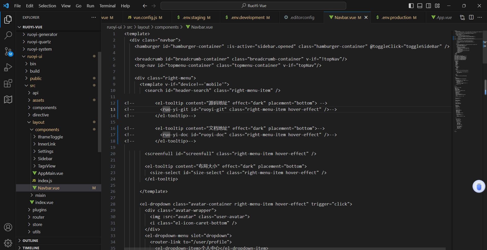

# Tomcat

# 1、orcale JDK程序安装

```
[root@Rocky8 ~]#ll
total 143424
-rw-------. 1 root  root       1464 Mar 29  2023 anaconda-ks.cfg
-rw-r--r--. 1 root  root         60 Apr  2  2023 date.txt.bak
-rw-r--r--  1 root  root        415 Nov 18 01:13 hello.class
-rw-r--r--  1 root  root        113 Nov 18 01:12 hello.java
-rwxr-xr-x  1 root  root       3065 Nov 17 22:39 install_dns.sh
-rwxr-xr-x  1 root  root       4288 May 11  2022 install_docker.sh
drwxr-xr-x  8 10143 10143      4096 Dec 16  2021 jdk1.8.0_321
-rw-r--r--  1 root  root  146815279 May 11  2022 jdk-8u321-linux-x64.tar.gz
-rwxr-xr-x  1 root  root        460 Nov 16 11:52 key.sh
-rw-r--r--  1 root  root       1452 May 11  2023 reset2.sh
-rw-r--r--  1 root  root       4213 May 11  2023 reset.sh
[root@Rocky8 ~]#tar xvf jdk-8u321-linux-x64.tar.gz -C /usr/local/
[root@Rocky8 ~]#cd /usr/local/
[root@Rocky8 local]#ln -s jdk1.8.0_241/ jdk
[root@Rocky8 local]#cat >> /etc/profile.d/jdk.sh <<EOF
> export JAVA_HOME=/usr/local/jdk
> export PATH=$PATH:$JAVA_HOME/bin
> EOF


******************************
cat >> /etc/profile.d/jdk.sh <<EOF
export JAVA_HOME=/usr/local/jdk
export PATH=$PATH:$JAVA_HOME/bin
EOF
*******************************

#注意:JAVA_HOME变量必须设置,否则tomcat启动时会出下面错误


cat > /lib/systemd/system/tomcat.service  <<EOF
[Unit]
Description=Tomcat
#After=syslog.target network.target remote-fs.target nss-lookup.target
After=syslog.target network.target

[Service]
Type=forking
Environment=JAVA_HOME=/usr/local/jdk
ExecStart=/usr/local/tomcat/bin/startup.sh
ExecStop=/usr/local/tomcat/bin/shutdown.sh
PrivateTmp=true
User=tomcat
Group=tomcat

[Install]
WantedBy=multi-user.target
EOF
```

## linux实现图形化界面访问

```
#安装firefox浏览器
[root@test ~]#yum -y install firefox

#windos主备xmanage工具包
[root@test ~]#export DISPLAY=192.168.188.99:0.0

[root@test ~]#firefox 127.0.0.1:8080   #缺少依赖
Running without a11y support!
Couldn't open libGL.so.1: libGL.so.1: cannot open shared object file: No such file or directory
Redirecting call to abort() to mozalloc_abort

Segmentation fault (core dumped)
[root@test ~]#yum provides libGL.so.1   #查找依赖所依赖的包
Last metadata expiration check: 4:20:41 ago on Sat 18 Nov 2023 01:41:31 PM CST.
libglvnd-glx-1:1.3.2-1.el8.i686 : GLX support for libglvnd
Repo        : AppStream
Matched from:
Provide    : libGL.so.1
  
[root@test ~]#yum -y install libglvnd-glx-1:1.3.2-1.el8.i686     #安装相关依赖包
Last metadata expiration check: 4:20:54 ago on Sat 18 Nov 2023 01:41:31 PM CST.
Error: 
 Problem: package glibc-2.28-164.el8.i686 requires glibc-common = 2.28-164.el8, but none of the providers can be installed
  - cannot install both glibc-common-2.28-164.el8.x86_64 and glibc-common-2.28-211.el8.x86_64
  - package libglvnd-glx-1:1.3.2-1.el8.i686 requires libpthread.so.0, but none of the providers can be installed
  - package libglvnd-glx-1:1.3.2-1.el8.i686 requires libc.so.6(GLIBC_2.4), but none of the providers can be installed
  - package libglvnd-glx-1:1.3.2-1.el8.i686 requires libdl.so.2, but none of the providers can be installed
  - package libglvnd-glx-1:1.3.2-1.el8.i686 requires libdl.so.2(GLIBC_2.0), but none of the providers can be installed
  - package libglvnd-glx-1:1.3.2-1.el8.i686 requires libdl.so.2(GLIBC_2.1), but none of the providers can be installed
  - package glibc-gconv-extra-2.28-211.el8.x86_64 requires glibc-common = 2.28-211.el8, but none of the providers can be installed
  - conflicting requests
  - problem with installed package glibc-gconv-extra-2.28-211.el8.x86_64
(try to add '--allowerasing' to command line to replace conflicting packages or '--skip-broken' to skip uninstallable packages or '--nobest' to use not only best candidate packages)

[root@test ~]#yum -y install libglvnd-glx-1:1.3.2-1.el8.i686 --allowerasing  #自动安装依赖包
[root@test ~]#firefox 127.0.0.1:8080
#成功访问界面
```

## tomcat管理后台界面访问授权

```
[root@test ~]#vim /usr/local/tomcat/webapps/manager/META-INF/context.xml 

<?xml version="1.0" encoding="UTF-8"?>
<!--
  Licensed to the Apache Software Foundation (ASF) under one or more
  contributor license agreements.  See the NOTICE file distributed with
  this work for additional information regarding copyright ownership.
  The ASF licenses this file to You under the Apache License, Version 2.0
  (the "License"); you may not use this file except in compliance with
  the License.  You may obtain a copy of the License at

      http://www.apache.org/licenses/LICENSE-2.0

  Unless required by applicable law or agreed to in writing, software
  distributed under the License is distributed on an "AS IS" BASIS,
  WITHOUT WARRANTIES OR CONDITIONS OF ANY KIND, either express or implied.
  See the License for the specific language governing permissions and
  limitations under the License.
-->
<Context antiResourceLocking="false" privileged="true" >
  <CookieProcessor className="org.apache.tomcat.util.http.Rfc6265CookieProcessor"
                   sameSiteCookies="strict" />
  <Valve className="org.apache.catalina.valves.RemoteAddrValve"
         allow="127\.\d+\.\d+\.\d+|::1|0:0:0:0:0:0:0:1|192\.168\.188\.\d+" />
  <Manager sessionAttributeValueClassNameFilter="java\.lang\.(?:Boolean|Integer|Long|Number|String)|org\.apache\.catalina\.filters\.CsrfPreventionFilter\$LruCache(?:\$1)?|java\.util\.(?:Linked)?HashMap"/>
</Context>

```


# 3、Tomcat

## **3.4、** **常见配置详解**

### **3.4.1、** **端口**8005/tcp安全配置管理

在conf/server.xml 有以下内容

```
[root@Rocky8 ~]#vim /usr/local/tomcat/conf/server.xml 

<Server port="-1" shutdown="SHUTDOWN">
  <Listener className="org.apache.catalina.startup.VersionLoggerListener" />
  <!-- Security listener. Documentation at /docs/config/listeners.html
  <Listener className="org.apache.catalina.security.SecurityListener" />
  -->
  <!-- APR library loader. Documentation at /docs/apr.html -->
  <Listener className="org.apache.catalina.core.AprLifecycleListener" SSLEngine="on" />
  <!-- Prevent memory leaks due to use of particular java/javax APIs-->
  <Listener className="org.apache.catalina.core.JreMemoryLeakPreventionListener" />
  <Listener className="org.apache.catalina.mbeans.GlobalResourcesLifecycleListener" />
  <Listener className="org.apache.catalina.core.ThreadLocalLeakPreventionListener" />


注：8005是Tomcat的管理端口，默认监听在127.0.0.1上。无需验证就可发送SHUTDOWN (大小写敏感)这个字符串，tomcat接收到后就会关闭此Server。
此管理功能建议禁用，可将SHUTDOWN改为一串猜不出的字符串实现或者port修改成 0, 会使用随机端口,如:36913
port设为-1等无效端口,将关闭此功能，注意：-2等不支持
此行不能被注释,否则无法启动tomcat服务
```

#### 范例：修改8005/tcp端口管理命令

```
[root@Rocky8 ~]#ss -ntl
State              Recv-Q             Send-Q                              Local Address:Port                          Peer Address:Port             Process             
LISTEN             0                  128                                       0.0.0.0:80                                 0.0.0.0:*                                    
LISTEN             0                  10                                     172.17.0.1:53                                 0.0.0.0:*                                    
LISTEN             0                  10                                      127.0.0.1:53                                 0.0.0.0:*                                    
LISTEN             0                  128                                       0.0.0.0:22                                 0.0.0.0:*                                    
LISTEN             0                  128                                     127.0.0.1:953                                0.0.0.0:*                                    
LISTEN             0                  128                                       0.0.0.0:3306                               0.0.0.0:*                                    
LISTEN             0                  128                                       0.0.0.0:6379                               0.0.0.0:*                                    
LISTEN             0                  128                                       0.0.0.0:2222                               0.0.0.0:*                                    
LISTEN             0                  100                                             *:8080                                     *:*                                    
LISTEN             0                  128                                          [::]:80                                    [::]:*                                    
LISTEN             0                  10                                          [::1]:53                                    [::]:*                                    
LISTEN             0                  128                                          [::]:22                                    [::]:*                                    
LISTEN             0                  128                                         [::1]:953                                   [::]:*                                    
LISTEN             0                  1                              [::ffff:127.0.0.1]:8005     #远程管理端口                              *:*                                    
LISTEN             0                  128                                          [::]:3306                                  [::]:*                                    
LISTEN             0                  128                                          [::]:6379                                  [::]:*                                    
LISTEN             0                  128                                          [::]:2222                                  [::]:*     

[root@Rocky8 ~]#telnet 127.0.0.1 8005
Trying 127.0.0.1...
Connected to 127.0.0.1.
Escape character is '^]'.
SHUTDOWN   							 #执行命令关闭tomcat
Connection closed by foreign host.

[root@Rocky8 ~]#ss -ntl
State               Recv-Q              Send-Q                           Local Address:Port                           Peer Address:Port             Process             
LISTEN              0                   128                                    0.0.0.0:80                                  0.0.0.0:*                                    
LISTEN              0                   10                                  172.17.0.1:53                                  0.0.0.0:*                                    
LISTEN              0                   10                                   127.0.0.1:53                                  0.0.0.0:*                                    
LISTEN              0                   128                                    0.0.0.0:22                                  0.0.0.0:*                                    
LISTEN              0                   128                                  127.0.0.1:953                                 0.0.0.0:*                                    
LISTEN              0                   128                                    0.0.0.0:3306                                0.0.0.0:*                                    
LISTEN              0                   128                                    0.0.0.0:6379                                0.0.0.0:*                                    
LISTEN              0                   128                                    0.0.0.0:2222                                0.0.0.0:*                                    
LISTEN              0                   128                                       [::]:80                                     [::]:*                                    
LISTEN              0                   10                                       [::1]:53                                     [::]:*                                    
LISTEN              0                   128                                       [::]:22                                     [::]:*                                    
LISTEN              0                   128                                      [::1]:953                                    [::]:*                                    
LISTEN              0                   128                                       [::]:3306                                   [::]:*                                    
LISTEN              0                   128                                       [::]:6379                                   [::]:*                                    
LISTEN              0                   128                                       [::]:2222                                   [::]:*                  
[root@rocky8 tomcat]#vim conf/server.xml
<Server port="-1" shutdown="dingbhcat">    #端口设置-1，永久关闭8005管理端口
```

### **3.4.2** **显示指定的**http服务器版本信息

```
#默认不显示tomcat的http的Server头信息, 可以指定tomcat的http的Server头信息为相应的值
[root@Rocky8 ~]#vim /usr/local/tomcat/conf/server.xml 

68     -->
 69     <Connector port="8080" protocol="HTTP/1.1"
 70                connectionTimeout="20000"
 71                redirectPort="8443"  Server="dingbhcat"/>   #添加内容Server="dingbhcat"并重启tomcat服务

[root@Rocky8 ~]#systemctl restart tomcat.service 

#修改配置,指定想显示的tomcat版本
[root@test ~]#curl jpress.dingbh.top:8080 -I
HTTP/1.1 200 
Set-Cookie: csrf_token=12c234d837ce47fbb4b032c1e7e49fa2; Path=/
Content-Type: text/html;charset=UTF-8
Transfer-Encoding: chunked
Date: Sat, 18 Nov 2023 00:54:18 GMT
Server: dingbhcat
```

### **3.4.3、 Context** **配置**

```
Context作用：
路径映射：将url映射至指定路径，而非使用appBase下的物理目录，实现虚拟目录功能
应用独立配置，例如单独配置应用日志、单独配置应用访问控制
#映射指定路径
<Context path="/test" docBase="/data/test" reloadable="true" />
#映射站点的根目录
<Context path="/" docBase="/data/website" reloadable="true" />
#还可以添加日志等独立的配置
<Context path="/test" docBase="/data/test" reloadable="true" >
<Valve className="org.apache.catalina.valves.AccessLogValve" directory="logs"
prefix="localhost_test_log" suffix=".txt"
pattern="%h %l %u %t &quot;%r&quot; %s %b" />
</Context>

说明：
path：指的是访问的URL路径，如果path与appBase下面的子目录同名，context的docBase路径
优先级更高
docBase：可以是磁盘文件的绝对路径，也可以是相对路径（相对于Host的appBase）
reloadable：true表示如果WEB-INF/classes或META-INF/lib目录下.class文件有改动，就会将WEB
应用重新加载。生产环境中，建议使用false来禁用。

将~/projects/myapp/下面的项目文件复制到/data/下，可以修改一下index.jsp 区别一下
# cp -r ~/projects/myapp /data/myapp-v1
# vim /data/myappv1/index.jsp
# cd /data
# ln -sv myapp-v1 test

注意：这里特别使用了软链接，原因方便后期版升级或回滚，如是是版本升级，需要将软链接指向
myappv2，重新启动。如果新版上线后，出现问题，重新修改软链接到上一个版本的目录，并重启，就
可以实现回滚
修改conf/server.xml设置context
Tomcat的配置文件server.xml中修改如下，重启Tomcat生效
<Host name="node1.magedu.com" appBase="/data/webapps"
unpackWARs="true" autoDeploy="true" >
<Context path="/test" docBase="/data/test" reloadable="true" />
</Host>
```

#### 实战：

```
[root@test ~]#vim /usr/local/tomcat/conf/server.xml 

<Host name="localhost"  appBase="webapps"
            unpackWARs="true" autoDeploy="true">

        <!-- SingleSignOn valve, share authentication between web applications
             Documentation at: /docs/config/valve.html -->
        <!--
        <Valve className="org.apache.catalina.authenticator.SingleSignOn" />
        -->

        <!-- Access log processes all example.
             Documentation at: /docs/config/valve.html
             Note: The pattern used is equivalent to using pattern="common" -->
        <Context path="/test" docBase="/data/test" reloadable="true" />     #映射指定路径
        <Valve className="org.apache.catalina.valves.AccessLogValve" directory="logs"
               prefix="localhost_access_log" suffix=".txt"
               pattern="%h %l %u %t &quot;%r&quot; %s %b" />
      </Host>

[root@test ~]#systemctl restart tomcat.service 

实现访问：http://www.dingbh.top:8080/test
[root@test ~]#mkdir /data/test -p
[root@test ~]#echo "http://www.dingbh.top:8080/test" > /data/test/index.html
[root@test ~]#tree /data/
/data/
└── test
    └── index.html

2 directories, 1 file
[root@test ~]#systemctl restart tomcat.service 

```

#### 访问测试：


#### **Valve**组件

日志格式说明:http://tomcat:8080/docs/config/valve.html#Access_Logging

**valve(阀门)组件可以定义日志**

```
<Valve className="org.apache.catalina.valves.AccessLogValve" directory="logs"
prefix="localhost_access_log" suffix=".txt"
pattern="%h %l %u %t "%r" %s %b" />
```

##### 实战：tomcat实现json日志访问

```
[root@test ~]#vim /usr/local/tomcat/conf/server.xml 

      <Host name="localhost"  appBase="webapps"
            unpackWARs="true" autoDeploy="true">

        <!-- SingleSignOn valve, share authentication between web applications
             Documentation at: /docs/config/valve.html -->
        <!--
        <Valve className="org.apache.catalina.authenticator.SingleSignOn" />
        -->

        <!-- Access log processes all example.
             Documentation at: /docs/config/valve.html
             Note: The pattern used is equivalent to using pattern="common" -->
        <Context path="/test" docBase="/data/test" reloadable="true" />
        <Valve className="org.apache.catalina.valves.AccessLogValve" directory="logs"
               prefix="localhost_access_log" suffix=".txt"
               pattern="  #添加json格式日志配置 {&quot;clientip&quot;:&quot;%h&quot;,&quot;ClientUser&quot;:&quot;%l&quot;,&quot;authenticated&quot;:&quot;%u&quot;,&quot;AccessTime&quot;:&quot;%t&quot;,&quot;method&quot;:&quot;%r&quot;,&quot;status&quot;:&quot;%s&quot;,&quot;SendBytes&quot;:&quot;%b&quot;,&quot;Querystring&quot;:&quot;%q&quot;,&quot;partner&quot;:&quot;%{Referer}i&quot;,&quot;AgentVersion&quot;:&quot;%{User-Agent}i&quot;}"/>
      </Host>

[root@test ~]#systemctl restart tomcat.service 

[root@test ~]#tail -f /usr/local/tomcat/logs/localhost_access_log.2023-11-18.txt 
192.168.188.99 - tomcat [18/Nov/2023:18:22:03 +0800] "GET /manager/status?org.apache.catalina.filters.CSRF_NONCE=FB51033BEA344E8FC963903B50995CE9 HTTP/1.1" 200 4696
192.168.188.99 - tomcat [18/Nov/2023:18:23:46 +0800] "GET /manager/status?org.apache.catalina.filters.CSRF_NONCE=FB51033BEA344E8FC963903B50995CE9 HTTP/1.1" 200 4503
192.168.188.99 - - [18/Nov/2023:18:23:51 +0800] "GET / HTTP/1.1" 200 11156
192.168.188.99 - - [18/Nov/2023:18:23:53 +0800] "GET /host-manager/html HTTP/1.1" 403 3022
192.168.188.99 - - [18/Nov/2023:21:59:11 +0800] "GET /test HTTP/1.1" 302 -
192.168.188.99 - - [18/Nov/2023:21:59:11 +0800] "GET /test/ HTTP/1.1" 200 32
192.168.188.99 - - [18/Nov/2023:21:59:11 +0800] "GET /favicon.ico HTTP/1.1" 200 21630
                {"clientip":"192.168.188.99","ClientUser":"-","authenticated":"-","AccessTime":"[18/Nov/2023:22:14:17 +0800]","method":"GET /test/ HTTP/1.1","status":"304","SendBytes":"-","Querystring":"","partner":"-","AgentVersion":"Mozilla/5.0 (Windows NT 10.0; Win64; x64) AppleWebKit/537.36 (KHTML, like Gecko) Chrome/119.0.0.0 Safari/537.36"}
                {"clientip":"192.168.188.99","ClientUser":"-","authenticated":"-","AccessTime":"[18/Nov/2023:22:14:18 +0800]","method":"GET /test/ HTTP/1.1","status":"304","SendBytes":"-","Querystring":"","partner":"-","AgentVersion":"Mozilla/5.0 (Windows NT 10.0; Win64; x64) AppleWebKit/537.36 (KHTML, like Gecko) Chrome/119.0.0.0 Safari/537.36"}
                {"clientip":"192.168.188.99","ClientUser":"-","authenticated":"-","AccessTime":"[18/Nov/2023:22:14:18 +0800]","method":"GET /test/ HTTP/1.1","status":"304","SendBytes":"-","Querystring":"","partner":"-","AgentVersion":"Mozilla/5.0 (Windows NT 10.0; Win64; x64) AppleWebKit/537.36 (KHTML, like Gecko) Chrome/119.0.0.0 Safari/537.36"}
                
                
#使用jq工具解析json格式日志
[root@test ~]#yum -y install jq
[root@test ~]#echo '{"clientip":"192.168.188.99","ClientUser":"-","authenticated":"-","AccessTime":"[18/Nov/2023:22:15:20 +0800]","method":"GET /test/ HTTP/1.1","status":"304","SendBytes":"-","Querystring":"","partner":"-","AgentVersion":"Mozilla/5.0 (Windows NT 10.0; Win64; x64) AppleWebKit/537.36 (KHTML, like Gecko) Chrome/119.0.0.0 Safari/537.36"}'|jq
{
  "clientip": "192.168.188.99",
  "ClientUser": "-",
  "authenticated": "-",
  "AccessTime": "[18/Nov/2023:22:15:20 +0800]",
  "method": "GET /test/ HTTP/1.1",
  "status": "304",
  "SendBytes": "-",
  "Querystring": "",
  "partner": "-",
  "AgentVersion": "Mozilla/5.0 (Windows NT 10.0; Win64; x64) AppleWebKit/537.36 (KHTML, like Gecko) Chrome/119.0.0.0 Safari/537.36"
}
```

## 3.5、**结合反向代理实现**tomcat部署

### 3.5.1、实现一台nginx+tomcat反向代理

```
#实现tomcat多虚拟主机

[root@test ~]#vim /usr/local/tomcat/conf/server.xml 

	  <Host name="t1.dingbh.top"  appBase="/data/t1/"
            unpackWARs="true" autoDeploy="true">
      </Host>

      <Host name="t2.dingbh.top"  appBase="/data/t2/"
            unpackWARs="true" autoDeploy="true">
      </Host>

[root@test ~]#systemctl restart tomcat.service 

[root@test ~]#mkdir -pv /data/t{1,2}/ROOT/
mkdir: created directory '/data/t1/ROOT/'
mkdir: created directory '/data/t2/ROOT/'

[root@test ~]#echo 't1.dingbh.top' > /data/t1/ROOT/index.html
[root@test ~]#echo 't2.dingbh.top' > /data/t2/ROOT/index.html
[root@test ~]#tree /data/
/data/
├── t1
│   └── ROOT
│       └── index.html
├── t2
│   └── ROOT
│       └── index.html
└── test
    └── index.html

6 directories, 3 files


[root@test ~]#curl t1.dingbh.top:8080
t1.dingbh.top
[root@test ~]#curl t2.dingbh.top:8080
t2.dingbh.top

#修改nginx_proxy代理配置
[root@test ~]#vim /etc/nginx/nginx.conf

            location / {    
            root html;
            index index.html;
            proxy_pass http://127.0.0.1:8080;
            proxy_set_header Host $http_host;   ##转发主机头至后端服务器
        }
[root@test ~]#nginx -t
nginx: the configuration file /etc/nginx/nginx.conf syntax is ok
nginx: configuration file /etc/nginx/nginx.conf test is successful
[root@test ~]#nginx -s reload

#测试访问，实现不带端口号访问后端虚拟主机
[root@test ~]#curl t1.dingbh.top
t1.dingbh.top
[root@test ~]#curl t2.dingbh.top
t2.dingbh.top
```

### 3.5.2、**实现** **tomcat** **负载均衡**

#### 3.5.2.1、tomcat实例主备

```
#服务器规划
nginx_proxy:192.168.188.200
web-t1:192.168.188.83
web-t2:192.168.188.84
dns:192.168.188.7
```

```
#修改node1配置
[root@t1 ~]#vim /usr/local/tomcat/conf/server.xml 

	  </Host>
      <Host name="t1.dingbh.top"  appBase="/data/tomcat/node1/"
            unpackWARs="true" autoDeploy="true">
      </Host>

[root@t1 ~]#tree /data/tomcat/
/data/tomcat/
└── node1
    └── ROOT
        └── index.jsp

2 directories, 1 file

#主备web界面
[root@t1 ~]#cat /data/tomcat/node1/ROOT/index.jsp 
<%@ page import="java.util.*" %>
<!DOCTYPE html>
<html lang="en">
<head>
    <meta charset="UTF-8">
    <title>tomcat test</title>
</head>
<body>
<h1> Tomcat Website t1</h1>
<div>On  <%=request.getServerName() %></div>
<div><%=request.getLocalAddr() + ":" + request.getLocalPort() %></div>
<div>SessionID = <span style="color:blue"><%=session.getId() %></span></div>
<%=new Date()%>
</body>
</html>


#修改node2配置
[root@t1 ~]#vim /usr/local/tomcat/conf/server.xml 

	  </Host>
      <Host name="t2.dingbh.top"  appBase="/data/tomcat/node2/"
            unpackWARs="true" autoDeploy="true">
      </Host>

[root@t2 ~]#tree /data/tomcat/
/data/tomcat/
└── node2
    └── ROOT
        └── index.jsp

2 directories, 1 file

#准备web界面
[root@t2 ~]#cat /data/tomcat/node2/ROOT/index.jsp 
<%@ page import="java.util.*" %>
<!DOCTYPE html>
<html lang="en">
<head>
    <meta charset="UTF-8">
    <title>tomcat test</title>
</head>
<body>
<h1> Tomcat Website t2 </h1>
<div>On  <%=request.getServerName() %></div>
<div><%=request.getLocalAddr() + ":" + request.getLocalPort() %></div>
<div>SessionID = <span style="color:blue"><%=session.getId() %></span></div>
<%=new Date()%>
</body>
</html>
```

#### 3.5.2.2、nginx_proxy代理服务器配置

```
[root@nginx_proxy~]# ls
install_nginx.sh
[root@nginx_proxy~]# vim install_nginx.sh
#!/bin/bash

***********************************
SRC_DIR=/usr/local/src
NGINX_URL=http://nginx.org/download/
NGINX_FILE=nginx-1.20.2
#NGINX_FILE=nginx-1.18.0
TAR=.tar.gz
NGINX_INSTALL_DIR=/apps/nginx
CPUS=`lscpu |awk '/^CPU\(s\)/{print $2}'`
. /etc/os-release

color () {
    RES_COL=60
    MOVE_TO_COL="echo -en \\033[${RES_COL}G"
    SETCOLOR_SUCCESS="echo -en \\033[1;32m"
    SETCOLOR_FAILURE="echo -en \\033[1;31m"
    SETCOLOR_WARNING="echo -en \\033[1;33m"
    SETCOLOR_NORMAL="echo -en \E[0m"
    echo -n "$1" && $MOVE_TO_COL
    echo -n "["
    if [ $2 = "success" -o $2 = "0" ] ;then
        ${SETCOLOR_SUCCESS}
        echo -n $"  OK  "    
    elif [ $2 = "failure" -o $2 = "1"  ] ;then 
        ${SETCOLOR_FAILURE}
        echo -n $"FAILED"
    else
        ${SETCOLOR_WARNING}
        echo -n $"WARNING"
    fi
    ${SETCOLOR_NORMAL}
    echo -n "]"
    echo 
}

os_type () {
   awk -F'[ "]' '/^NAME/{print $2}' /etc/os-release
}

os_version () {
   awk -F'"' '/^VERSION_ID/{print $2}' /etc/os-release
}

check () {
    [ -e ${NGINX_INSTALL_DIR} ] && { color "nginx 已安装,请卸载后再安装" 1; exit; }
    cd  ${SRC_DIR}
    if [  -e ${NGINX_FILE}${TAR} ];then
        color "相关文件已准备好" 0
    else
        color '开始下载 nginx 源码包' 0
        wget ${NGINX_URL}${NGINX_FILE}${TAR} 
        [ $? -ne 0 ] && { color "下载 ${NGINX_FILE}${TAR}文件失败" 1; exit; } 
    fi
} 

install () {
    color "开始安装 nginx" 0
    if id nginx  &> /dev/null;then
        color "nginx 用户已存在" 1 
    else
        useradd -s /sbin/nologin -r  nginx
        color "创建 nginx 用户" 0 
    fi
    color "开始安装 nginx 依赖包" 0
    if [ $ID == "centos" ] ;then
	    if [[ $VERSION_ID =~ ^7 ]];then
            yum -y -q  install make gcc pcre-devel openssl-devel zlib-devel perl-ExtUtils-Embed
		elif [[ $VERSION_ID =~ ^8 ]];then
            yum -y -q install make gcc-c++ libtool pcre pcre-devel zlib zlib-devel openssl openssl-devel perl-ExtUtils-Embed 
		else 
            color '不支持此系统!'  1
            exit
        fi
    elif [ $ID == "rocky"  ];then
	    yum -y -q install make gcc-c++ libtool pcre pcre-devel zlib zlib-devel openssl openssl-devel perl-ExtUtils-Embed 
	else
        apt update &> /dev/null
        apt -y install make gcc libpcre3 libpcre3-dev openssl libssl-dev zlib1g-dev &> /dev/null
    fi
    cd $SRC_DIR
    tar xf ${NGINX_FILE}${TAR}
    NGINX_DIR=`echo ${NGINX_FILE}${TAR}| sed -nr 's/^(.*[0-9]).*/\1/p'`
    cd ${NGINX_DIR}
    ./configure --prefix=${NGINX_INSTALL_DIR} --user=nginx --group=nginx --with-http_ssl_module --with-http_v2_module --with-http_realip_module --with-http_stub_status_module --with-http_gzip_static_module --with-pcre --with-stream --with-stream_ssl_module --with-stream_realip_module 
    make -j $CPUS && make install 
    [ $? -eq 0 ] && color "nginx 编译安装成功" 0 ||  { color "nginx 编译安装失败,退出!" 1 ;exit; }
    echo "PATH=${NGINX_INSTALL_DIR}/sbin:${PATH}" > /etc/profile.d/nginx.sh
    cat > /lib/systemd/system/nginx.service <<EOF
[Unit]
Description=The nginx HTTP and reverse proxy server
After=network.target remote-fs.target nss-lookup.target

[Service]
Type=forking
PIDFile=${NGINX_INSTALL_DIR}/logs/nginx.pid
ExecStartPre=/bin/rm -f ${NGINX_INSTALL_DIR}/logs/nginx.pid
ExecStartPre=${NGINX_INSTALL_DIR}/sbin/nginx -t
ExecStart=${NGINX_INSTALL_DIR}/sbin/nginx
ExecReload=/bin/kill -s HUP \$MAINPID
KillSignal=SIGQUIT
TimeoutStopSec=5
KillMode=process
PrivateTmp=true
LimitNOFILE=100000

[Install]
WantedBy=multi-user.target
EOF
    systemctl daemon-reload
    systemctl enable --now nginx &> /dev/null 
    systemctl is-active nginx &> /dev/null ||  { color "nginx 启动失败,退出!" 1 ; exit; }
    color "nginx 安装完成" 0
}

check
install

[root@nginx_proxy~]# bash install_nginx.sh  #执行自动化脚本

[root@nginx_proxy~]# vim /apps/nginx/conf/nginx.conf
http {
    upstream tomcat {    #需配置在http语句块
    	ip_hash;	#启动源地址hash
    	hash $cookie_JSESSIONID;   ##启动基于cookie的hash
        server 192.168.188.83:8080;
        server 192.168.188.84:8080;
    }


	  server {
        listen       80;
        server_name  localhost;

        #charset koi8-r;

        #access_log  logs/host.access.log  main;

        location / {
            root   html;
            index  index.html index.htm;
            proxy_pass http://tomcat;   #添加代理server
            proxy_set_header Host $http_host;
         }
      }
}
```


#### 3.5.2.3、**实现** **https** **的负载均衡**

```
[root@nginx_proxy~]# vim /apps/nginx/conf/nginx.conf

	upstream tomcat {
#       ip_hash;
        hash $cookie_JSESSIONID;
        server 192.168.188.83:8080;
        server 192.168.188.84:8080;
    }
        server {
                listen 80;
                server_name www.dingbh.top;
                return 302 https://$server_name$request_uri;
	}

	 server {
        listen  443 ssl;
        server_name www.dingbh.top;
        ssl_certificate /apps/nginx/ssl/www.dingbh.top.pem;
        ssl_certificate_key /apps/nginx/ssl/www.dingbh.top.key;
        ssl_session_cache shared:sslcache:20m;
        ssl_session_timeout 10m;

		location / {
            root   html;
            index  index.html index.htm;
            proxy_pass http://tomcat;
            proxy_set_header Host $http_host;
            proxy_set_header X-Forwarded-For $proxy_add_x_forwarded_for;
        }

[root@nginx_proxy~]# nginx -s reload
```

访问测试http://www.dingbh.top


```
[root@nginx_proxy~]# curl www.dingbh.top -I  
HTTP/1.1 302 Moved Temporarily
Server: nginx/1.20.2
Date: Tue, 21 Nov 2023 03:19:57 GMT
Content-Type: text/html
Content-Length: 145
Connection: keep-alive
Location: https://www.dingbh.top/
```

## 3.6、**Tomcat Session Replication Cluster**负载均衡

Tomcat 官方实现了 Session 的复制集群,将每个Tomcat的Session进行相互的复制同步,从而保证所有Tomcat都有相同的Session信息.


### 3.6.1、配置说明

```
官方文档：
https://tomcat.apache.org/tomcat-10.0-doc/cluster-howto.html
https://tomcat.apache.org/tomcat-9.0-doc/cluster-howto.html
https://tomcat.apache.org/tomcat-8.5-doc/cluster-howto.html


说明：
    <Cluster className="org.apache.catalina.ha.tcp.SimpleTcpCluster"
                 channelSendOptions="8">

          <Manager className="org.apache.catalina.ha.session.DeltaManager"
                   expireSessionsOnShutdown="false"
                   notifyListenersOnReplication="true"/>

          <Channel className="org.apache.catalina.tribes.group.GroupChannel">
            <Membership className="org.apache.catalina.tribes.membership.McastService"
                        address="228.0.0.4"     #指定的多播地址
                        port="45564"			#45564/UDP
                        frequency="500"			#间隔500ms发送
                        dropTime="3000"/>			#故障阈值3s
            <Receiver className="org.apache.catalina.tribes.transport.nio.NioReceiver"
                      address="auto"			#监听地址,此项建议修改为当前主机的IP
                      port="4000"			#监听端口
                      autoBind="100"	#如果端口冲突,自动绑定其它端口,范围是4000-4100
                      selectorTimeout="5000"		#自动绑定超时时长5s
                      maxThreads="6"/>

            <Sender className="org.apache.catalina.tribes.transport.ReplicationTransmitter">
              <Transport className="org.apache.catalina.tribes.transport.nio.PooledParallelSender"/>
            </Sender>
            <Interceptor className="org.apache.catalina.tribes.group.interceptors.TcpFailureDetector"/>
            <Interceptor className="org.apache.catalina.tribes.group.interceptors.MessageDispatchInterceptor"/>
          </Channel>

          <Valve className="org.apache.catalina.ha.tcp.ReplicationValve"
                 filter=""/>
          <Valve className="org.apache.catalina.ha.session.JvmRouteBinderValve"/>

          <Deployer className="org.apache.catalina.ha.deploy.FarmWarDeployer"
                    tempDir="/tmp/war-temp/"
                    deployDir="/tmp/war-deploy/"
                    watchDir="/tmp/war-listen/"
                    watchEnabled="false"/>

          <ClusterListener className="org.apache.catalina.ha.session.ClusterSessionListener"/>
        </Cluster>
        
        
        
        
#注意:tomcat7的官方文档此处有错误
http://tomcat.apache.org/tomcat-7.0-doc/cluster-howto.html
......
<ClusterListener
className="org.apache.catalina.ha.session.JvmRouteSessionIDBinderListener">
<ClusterListener
className="org.apache.catalina.ha.session.ClusterSessionListener">
</Cluster>
```

### 3.6.2、实现SessionID绑定

#### 3.6.2.1、实验准备

```
nginx_proxy主机:192.168.188.200  (www.dingbh.top)
node1:192.168.188.83
node2:192.168.188.84
```

#### 3.6.2.2、nginx_proxy主机配置

```
[root@nginx_proxy ~]# vim /apps/nginx/conf/nginx.conf  #nginx配置

	upstream tomcat {
#       ip_hash;
#       hash $cookie_JSESSIONID;
        server 192.168.188.83:8080;
        server 192.168.188.84:8080;
    }
    server {
                listen 80;
                server_name www.dingbh.top;
                return 302 https://$server_name$request_uri;
}
    server {
        listen  443 ssl;
        server_name www.dingbh.top;
        ssl_certificate /apps/nginx/ssl/www.dingbh.top.pem;
        ssl_certificate_key /apps/nginx/ssl/www.dingbh.top.key;
        ssl_session_cache shared:sslcache:20m;
        ssl_session_timeout 10m;
        #access_log  logs/host.access.log  main;

        location / {
            root   html;
            index  index.html index.htm;
            proxy_pass http://tomcat;
            proxy_set_header Host $http_host;
            proxy_set_header X-Forwarded-For $proxy_add_x_forwarded_for;
        }
```

#### 3.6.2.3、node1、2服务器准备

```
#node1主机tomcat配置
[root@t1 ~]#vim /usr/local/tomcat/conf/server.xml 
      <Host name="www.dingbh.top"  appBase="/data/tomcat/node1/"
            unpackWARs="true" autoDeploy="true">
        <Cluster className="org.apache.catalina.ha.tcp.SimpleTcpCluster"
                 channelSendOptions="8">

          <Manager className="org.apache.catalina.ha.session.DeltaManager"
                   expireSessionsOnShutdown="false"
                   notifyListenersOnReplication="true"/>

          <Channel className="org.apache.catalina.tribes.group.GroupChannel">
            <Membership className="org.apache.catalina.tribes.membership.McastService"
                        address="228.0.0.4"
                        port="45564"
                        frequency="500"
                        dropTime="3000"/>
            <Receiver className="org.apache.catalina.tribes.transport.nio.NioReceiver"
                      address="192.168.188.83"
                      port="4000"
                      autoBind="100"
                      selectorTimeout="5000"
                      maxThreads="6"/>

            <Sender className="org.apache.catalina.tribes.transport.ReplicationTransmitter">
              <Transport className="org.apache.catalina.tribes.transport.nio.PooledParallelSender"/>
            </Sender>
            <Interceptor className="org.apache.catalina.tribes.group.interceptors.TcpFailureDetector"/>
            <Interceptor className="org.apache.catalina.tribes.group.interceptors.MessageDispatchInterceptor"/>
          </Channel>

          <Valve className="org.apache.catalina.ha.tcp.ReplicationValve"
                 filter=""/>
          <Valve className="org.apache.catalina.ha.session.JvmRouteBinderValve"/>

          <Deployer className="org.apache.catalina.ha.deploy.FarmWarDeployer"
                    tempDir="/tmp/war-temp/"
                    deployDir="/tmp/war-deploy/"
                    watchDir="/tmp/war-listen/"
                    watchEnabled="false"/>

          <ClusterListener className="org.apache.catalina.ha.session.ClusterSessionListener"/>
        </Cluster>
      </Host>
[root@t1 ~]#systemctl restart tomcat.service 
#node2主机tomcat配置
[root@t2 ~]#vim /usr/local/tomcat/conf/server.xml 
      <Host name="www.dingbh.top"  appBase="/data/tomcat/node2/"
            unpackWARs="true" autoDeploy="true">
        <Cluster className="org.apache.catalina.ha.tcp.SimpleTcpCluster"
                 channelSendOptions="8">

          <Manager className="org.apache.catalina.ha.session.DeltaManager"
                   expireSessionsOnShutdown="false"
                   notifyListenersOnReplication="true"/>

          <Channel className="org.apache.catalina.tribes.group.GroupChannel">
            <Membership className="org.apache.catalina.tribes.membership.McastService"
                        address="228.0.0.4"
                        port="45564"
                        frequency="500"
                        dropTime="3000"/>
            <Receiver className="org.apache.catalina.tribes.transport.nio.NioReceiver"
                      address="192.168.188.84"
                      port="4000"
                      autoBind="100"
                      selectorTimeout="5000"
                      maxThreads="6"/>

            <Sender className="org.apache.catalina.tribes.transport.ReplicationTransmitter">
              <Transport className="org.apache.catalina.tribes.transport.nio.PooledParallelSender"/>
            </Sender>
            <Interceptor className="org.apache.catalina.tribes.group.interceptors.TcpFailureDetector"/>
            <Interceptor className="org.apache.catalina.tribes.group.interceptors.MessageDispatchInterceptor"/>
          </Channel>

          <Valve className="org.apache.catalina.ha.tcp.ReplicationValve"
                 filter=""/>
          <Valve className="org.apache.catalina.ha.session.JvmRouteBinderValve"/>

          <Deployer className="org.apache.catalina.ha.deploy.FarmWarDeployer"
                    tempDir="/tmp/war-temp/"
                    deployDir="/tmp/war-deploy/"
                    watchDir="/tmp/war-listen/"
                    watchEnabled="false"/>

          <ClusterListener className="org.apache.catalina.ha.session.ClusterSessionListener"/>
        </Cluster>
      </Host>
[root@t2 ~]#systemctl restart tomcat.service 

#添加并创建WEB-INF及web.xml配置
[root@t1 ~]#tree /data/tomcat/node1/
/data/tomcat/node1/
└── ROOT
    ├── index.jsp
    └── WEB-INF
        └── web.xml

2 directories, 2 files

[root@t2 ~]#tree /data/tomcat/node2/
/data/tomcat/node2/
└── ROOT
    ├── index.jsp
    └── WEB-INF
        └── web.xml

2 directories, 2 files


#修改web.xml文件配置，添加此行内容 <distributable/>   “分布式的意思”
[root@t1 ~]#cat /data/tomcat/node1/ROOT/WEB-INF/web.xml 
<?xml version="1.0" encoding="UTF-8"?>
<!--
 Licensed to the Apache Software Foundation (ASF) under one or more
  contributor license agreements.  See the NOTICE file distributed with
  this work for additional information regarding copyright ownership.
  The ASF licenses this file to You under the Apache License, Version 2.0
  (the "License"); you may not use this file except in compliance with
  the License.  You may obtain a copy of the License at

      http://www.apache.org/licenses/LICENSE-2.0

  Unless required by applicable law or agreed to in writing, software
  distributed under the License is distributed on an "AS IS" BASIS,
  WITHOUT WARRANTIES OR CONDITIONS OF ANY KIND, either express or implied.
  See the License for the specific language governing permissions and
  limitations under the License.
-->
<web-app xmlns="http://xmlns.jcp.org/xml/ns/javaee"
  xmlns:xsi="http://www.w3.org/2001/XMLSchema-instance"
  xsi:schemaLocation="http://xmlns.jcp.org/xml/ns/javaee
                      http://xmlns.jcp.org/xml/ns/javaee/web-app_4_0.xsd"
  version="4.0"
  metadata-complete="true">

  <display-name>Welcome to Tomcat</display-name>
  <description>
     Welcome to Tomcat
  </description>
<distributable/>   #添加此行
</web-app>

systemctl restart tomcat.service #重启服务

```

#### 3.6.2.4、测试SessionID实现了绑定


## 3.7、Memcached介绍

### 3.7.1、yum安装及配置文件说明

```
[root@memcached ~]# yum -y install memcached
[root@memcached ~]# rpm -qi memcached 
Name        : memcached
Epoch       : 0
Version     : 1.5.22
Release     : 2.el8
Architecture: x86_64
Install Date: Thu 23 Nov 2023 10:13:45 PM CST
Group       : System Environment/Daemons
Size        : 414767
License     : BSD
Signature   : RSA/SHA256, Thu 18 Jun 2020 01:57:20 AM CST, Key ID 05b555b38483c65d
Source RPM  : memcached-1.5.22-2.el8.src.rpm
Build Date  : Thu 18 Jun 2020 01:19:21 AM CST
Build Host  : x86-02.mbox.centos.org
Relocations : (not relocatable)
Packager    : CentOS Buildsys <bugs@centos.org>
Vendor      : CentOS
URL         : https://www.memcached.org/
Summary     : High Performance, Distributed Memory Object Cache
Description :
memcached is a high-performance, distributed memory object caching
system, generic in nature, but intended for use in speeding up dynamic
web applications by alleviating database load.
[root@memcached ~]# rpm -ql memcached 
/etc/sysconfig/memcached
/usr/bin/memcached
/usr/bin/memcached-tool
/usr/lib/.build-id
/usr/lib/.build-id/25
/usr/lib/.build-id/25/9ffe16926831a542c5c1a8fbdfdf063429439e
/usr/lib/systemd/system/memcached.service
/usr/share/doc/memcached
/usr/share/doc/memcached/AUTHORS
/usr/share/doc/memcached/CONTRIBUTORS
/usr/share/doc/memcached/COPYING
/usr/share/doc/memcached/ChangeLog
/usr/share/doc/memcached/NEWS
/usr/share/doc/memcached/README.md
/usr/share/doc/memcached/new_lru.txt
/usr/share/doc/memcached/protocol-binary-range.txt
/usr/share/doc/memcached/protocol-binary.txt
/usr/share/doc/memcached/protocol.txt
/usr/share/doc/memcached/readme.txt
/usr/share/doc/memcached/storage.txt
/usr/share/doc/memcached/threads.txt
/usr/share/doc/memcached/tls.txt
/usr/share/man/man1/memcached-tool.1.gz
/usr/share/man/man1/memcached.1.gz

[root@memcached ~]# grep -v '^#' /usr/lib/systemd/system/memcached.service
[Unit]
Description=memcached daemon
Before=httpd.service
After=network.target

[Service]
EnvironmentFile=/etc/sysconfig/memcached
ExecStart=/usr/bin/memcached -p ${PORT} -u ${USER} -m ${CACHESIZE} -c ${MAXCONN} $OPTIONS
PrivateTmp=true
ProtectSystem=full
NoNewPrivileges=true
PrivateDevices=true
CapabilityBoundingSet=CAP_SETGID CAP_SETUID CAP_SYS_RESOURCE
RestrictAddressFamilies=AF_INET AF_INET6 AF_UNIX

[Install]
WantedBy=multi-user.target

[root@memcached ~]# systemctl enable --now memcached.service 

[root@memcached ~]# cat /etc/sysconfig/memcached 
PORT="11211"
USER="memcached"
MAXCONN="1024"
CACHESIZE="64"
OPTIONS="-l 127.0.0.1,::1"   #默认监听本机端口11211
[root@memcached ~]# ss -ntl
State              Recv-Q             Send-Q                         Local Address:Port                           Peer Address:Port             Process             
LISTEN             0                  1024                               127.0.0.1:11211                               0.0.0.0:*                                    
LISTEN             0                  128                                  0.0.0.0:111                                 0.0.0.0:*                                    
LISTEN             0                  128                                  0.0.0.0:22                                  0.0.0.0:*                                    
LISTEN             0                  1024                                   [::1]:11211                                  [::]:*                                    
LISTEN             0                  128                                     [::]:111                                    [::]:*                                    
LISTEN             0                  128                                     [::]:22                                     [::]:*                                    

[root@memcached ~]# cat /etc/sysconfig/memcached 
PORT="11211"
USER="memcached"
MAXCONN="1024"
CACHESIZE="64"
#OPTIONS="-l 127.0.0.1,::1"

[root@memcached ~]# systemctl restart memcached.service 
```

### 3.7.2、tomcat实现MSM集群

```
官方安装地址(当前msm不支持tomcat 10)
https://github.com/memcached/memcached/wiki/Install
```

```
#node1节点tomecat配置
[root@t1 ~]#vim /usr/local/tomcat/conf/context.xml
<Context>

    <!-- Default set of monitored resources. If one of these changes, the    -->
    <!-- web application will be reloaded.                                   -->
    <WatchedResource>WEB-INF/web.xml</WatchedResource>
    <WatchedResource>WEB-INF/tomcat-web.xml</WatchedResource>
    <WatchedResource>${catalina.base}/conf/web.xml</WatchedResource>

    <!-- Uncomment this to disable session persistence across Tomcat restarts -->
    <!--
    <Manager pathname="" />
    -->
    <Manager className="de.javakaffee.web.msm.MemcachedBackupSessionManager"
        memcachedNodes="n1:192.168.188.83:11211,n2:192.168.188.84:11211"
        failoverNodes="n1"    #故障导向节点
        requestUriIgnorePattern=".*\.(ico|png|gif|jpg|css|js)$"
        transcoderFactoryClass="de.javakaffee.web.msm.serializer.kryo.KryoTranscoderFactory"
    />
</Context>

#node2节点tomecat配置
[root@t2 ~]#vim /usr/local/tomcat/conf/context.xml
<Context>

    <!-- Default set of monitored resources. If one of these changes, the    -->
    <!-- web application will be reloaded.                                   -->
    <WatchedResource>WEB-INF/web.xml</WatchedResource>
    <WatchedResource>WEB-INF/tomcat-web.xml</WatchedResource>
    <WatchedResource>${catalina.base}/conf/web.xml</WatchedResource>

    <!-- Uncomment this to disable session persistence across Tomcat restarts -->
    <!--
    <Manager pathname="" />
    -->
    <Manager className="de.javakaffee.web.msm.MemcachedBackupSessionManager"
        memcachedNodes="n1:192.168.188.83:11211,n2:192.168.188.84:11211"
        failoverNodes="n2"    #故障导向节点
        requestUriIgnorePattern=".*\.(ico|png|gif|jpg|css|js)$"
        transcoderFactoryClass="de.javakaffee.web.msm.serializer.kryo.KryoTranscoderFactory"
    />
</Context>


#安装memcached包
[root@t1 ~]#yum -y install memcached
[root@t1 ~]#cat /etc/sysconfig/memcached 
PORT="11211"
USER="memcached"
MAXCONN="1024"
CACHESIZE="64"     #优化配置：设置缓存大小，建议调大1024；
#OPTIONS="-l 127.0.0.1,::1"   #注释仅本机端口访问

[root@t2 ~]#yum -y install memcached
[root@t2 ~]#cat /etc/sysconfig/memcached 
PORT="11211"
USER="memcached"
MAXCONN="1024"
CACHESIZE="64"
#OPTIONS="-l 127.0.0.1,::1"  #注释掉


#node1、node2添加模块文件： /usr/local/tomcat/lib/*
***导入modul模块文件或官网下载：https://github.com/magro/memcached-session-manager/wiki/SetupAndConfiguration***
[root@t2 ~]#chown -R tomcat.tomcat /usr/local/tomcat/lib
[root@t2 ~]#ls /usr/local/tomcat/lib/ -l
total 11652
-rw-r----- 1 tomcat tomcat   13197 Feb 22  2022 annotations-api.jar
-rw-r--r-- 1 tomcat tomcat   53259 May 11  2022 asm-5.2.jar
-rw-r----- 1 tomcat tomcat   54061 Feb 22  2022 catalina-ant.jar
-rw-r----- 1 tomcat tomcat  123877 Feb 22  2022 catalina-ha.jar
-rw-r----- 1 tomcat tomcat 1722370 Feb 22  2022 catalina.jar
-rw-r----- 1 tomcat tomcat   62797 Feb 22  2022 catalina-ssi.jar
-rw-r----- 1 tomcat tomcat   78048 Feb 22  2022 catalina-storeconfig.jar
-rw-r----- 1 tomcat tomcat  336956 Feb 22  2022 catalina-tribes.jar
-rw-r----- 1 tomcat tomcat 3133846 Feb 22  2022 ecj-4.20.jar
-rw-r----- 1 tomcat tomcat   88794 Feb 22  2022 el-api.jar
-rw-r----- 1 tomcat tomcat  171484 Feb 22  2022 jasper-el.jar
-rw-r----- 1 tomcat tomcat  567088 Feb 22  2022 jasper.jar
-rw-r----- 1 tomcat tomcat   27125 Feb 22  2022 jaspic-api.jar
-rw-r--r-- 1 tomcat tomcat  586620 May 11  2022 jedis-3.0.0.jar
-rw-r----- 1 tomcat tomcat   63554 Feb 22  2022 jsp-api.jar
-rw-r--r-- 1 tomcat tomcat  285211 May 11  2022 kryo-3.0.3.jar
-rw-r--r-- 1 tomcat tomcat  126366 May 11  2022 kryo-serializers-0.45.jar
-rw-r--r-- 1 tomcat tomcat  167294 May 11  2022 memcached-session-manager-2.3.2.jar
-rw-r--r-- 1 tomcat tomcat   10967 May 11  2022 memcached-session-manager-tc9-2.3.2.jar
-rw-r--r-- 1 tomcat tomcat    5923 May 11  2022 minlog-1.3.1.jar
-rw-r--r-- 1 tomcat tomcat   38372 May 11  2022 msm-kryo-serializer-2.3.2.jar
-rw-r--r-- 1 tomcat tomcat   55684 May 11  2022 objenesis-2.6.jar
-rw-r--r-- 1 tomcat tomcat   72265 May 11  2022 reflectasm-1.11.9.jar
-rw-r----- 1 tomcat tomcat  284303 Feb 22  2022 servlet-api.jar
-rw-r--r-- 1 tomcat tomcat  473774 May 11  2022 spymemcached-2.12.3.jar
-rw-r----- 1 tomcat tomcat   11514 Feb 22  2022 tomcat-api.jar
-rw-r----- 1 tomcat tomcat  919335 Feb 22  2022 tomcat-coyote.jar
-rw-r----- 1 tomcat tomcat  342430 Feb 22  2022 tomcat-dbcp.jar
-rw-r----- 1 tomcat tomcat   68919 Feb 22  2022 tomcat-i18n-cs.jar
-rw-r----- 1 tomcat tomcat   74710 Feb 22  2022 tomcat-i18n-de.jar
-rw-r----- 1 tomcat tomcat  103661 Feb 22  2022 tomcat-i18n-es.jar
-rw-r----- 1 tomcat tomcat  166537 Feb 22  2022 tomcat-i18n-fr.jar
-rw-r----- 1 tomcat tomcat  189199 Feb 22  2022 tomcat-i18n-ja.jar
-rw-r----- 1 tomcat tomcat  190009 Feb 22  2022 tomcat-i18n-ko.jar
-rw-r----- 1 tomcat tomcat   52281 Feb 22  2022 tomcat-i18n-pt-BR.jar
-rw-r----- 1 tomcat tomcat   48294 Feb 22  2022 tomcat-i18n-ru.jar
-rw-r----- 1 tomcat tomcat  173530 Feb 22  2022 tomcat-i18n-zh-CN.jar
-rw-r----- 1 tomcat tomcat  149543 Feb 22  2022 tomcat-jdbc.jar
-rw-r----- 1 tomcat tomcat   36339 Feb 22  2022 tomcat-jni.jar
-rw-r----- 1 tomcat tomcat  212751 Feb 22  2022 tomcat-util.jar
-rw-r----- 1 tomcat tomcat  222924 Feb 22  2022 tomcat-util-scan.jar
-rw-r----- 1 tomcat tomcat  241496 Feb 22  2022 tomcat-websocket.jar
-rw-r----- 1 tomcat tomcat   39976 Feb 22  2022 websocket-api.jar


#重启服务加载配置
systemctl restart tomecat.service
```


#测试访问www.dingbh.top,SessionID保持不变


### 3.7.3、**sticky** **模式**

#### 3.7.3.1、 sticky **模式工作原理**

```
sticky 模式即前端tomcat和后端memcached有关联(粘性)关系
参考文档:https://github.com/magro/memcached-session-manager/wiki/SetupAndConfiguration

t1和m1部署可以在一台主机上，t2和m2部署也可以在同一台。
当新用户发请求到Tomcat1时, Tomcat1生成session返回给用户的同时,也会同时发给memcached2备份。即Tomcat1 session为session，memcached2 session为备用session，使用memcached相当于备份了一份Session，如果Tomcat1发现memcached2 失败,无法备份Session到memcached2,则将Sessoin备份存放在memcached1中
```

```
<Manager className="de.javakaffee.web.msm.MemcachedBackupSessionManager"
	memcachedNodes="n1:192.168.188.83:11211,n2:192.168.188.84:11211"
	failoverNodes="n1"
	requestUriIgnorePattern=".*\.(ico|png|gif|jpg|css|js)$"
transcoderFactoryClass="de.javakaffee.web.msm.serializer.kryo.KryoTranscoderFactory"
/>
```

#### 3.7.3.2、下载相关jar包

```
下载相关jar包,参考下面官方说明的下载链接
https://github.com/magro/memcached-session-manager/wiki/SetupAndConfiguration

[root@t1 ~]#ls -l /usr/local/tomcat/lib/
total 11652
-rw-r----- 1 tomcat tomcat   13197 Feb 22  2022 annotations-api.jar
-rw-r--r-- 1 tomcat tomcat   53259 May 11  2022 asm-5.2.jar
-rw-r----- 1 tomcat tomcat   54061 Feb 22  2022 catalina-ant.jar
-rw-r----- 1 tomcat tomcat  123877 Feb 22  2022 catalina-ha.jar
-rw-r----- 1 tomcat tomcat 1722370 Feb 22  2022 catalina.jar
-rw-r----- 1 tomcat tomcat   62797 Feb 22  2022 catalina-ssi.jar
-rw-r----- 1 tomcat tomcat   78048 Feb 22  2022 catalina-storeconfig.jar
-rw-r----- 1 tomcat tomcat  336956 Feb 22  2022 catalina-tribes.jar
-rw-r----- 1 tomcat tomcat 3133846 Feb 22  2022 ecj-4.20.jar
-rw-r----- 1 tomcat tomcat   88794 Feb 22  2022 el-api.jar
-rw-r----- 1 tomcat tomcat  171484 Feb 22  2022 jasper-el.jar
-rw-r----- 1 tomcat tomcat  567088 Feb 22  2022 jasper.jar
-rw-r----- 1 tomcat tomcat   27125 Feb 22  2022 jaspic-api.jar
-rw-r--r-- 1 tomcat tomcat  586620 May 11  2022 jedis-3.0.0.jar           #redis模块包
-rw-r----- 1 tomcat tomcat   63554 Feb 22  2022 jsp-api.jar
-rw-r--r-- 1 tomcat tomcat  285211 May 11  2022 kryo-3.0.3.jar
-rw-r--r-- 1 tomcat tomcat  126366 May 11  2022 kryo-serializers-0.45.jar
-rw-r--r-- 1 tomcat tomcat  167294 May 11  2022 memcached-session-manager-2.3.2.jar
-rw-r--r-- 1 tomcat tomcat   10967 May 11  2022 memcached-session-manager-tc9-2.3.2.jar
-rw-r--r-- 1 tomcat tomcat    5923 May 11  2022 minlog-1.3.1.jar
-rw-r--r-- 1 tomcat tomcat   38372 May 11  2022 msm-kryo-serializer-2.3.2.jar
-rw-r--r-- 1 tomcat tomcat   55684 May 11  2022 objenesis-2.6.jar
-rw-r--r-- 1 tomcat tomcat   72265 May 11  2022 reflectasm-1.11.9.jar
-rw-r----- 1 tomcat tomcat  284303 Feb 22  2022 servlet-api.jar
-rw-r--r-- 1 tomcat tomcat  473774 May 11  2022 spymemcached-2.12.3.jar
-rw-r----- 1 tomcat tomcat   11514 Feb 22  2022 tomcat-api.jar
-rw-r----- 1 tomcat tomcat  919335 Feb 22  2022 tomcat-coyote.jar
-rw-r----- 1 tomcat tomcat  342430 Feb 22  2022 tomcat-dbcp.jar
-rw-r----- 1 tomcat tomcat   68919 Feb 22  2022 tomcat-i18n-cs.jar
-rw-r----- 1 tomcat tomcat   74710 Feb 22  2022 tomcat-i18n-de.jar
-rw-r----- 1 tomcat tomcat  103661 Feb 22  2022 tomcat-i18n-es.jar
-rw-r----- 1 tomcat tomcat  166537 Feb 22  2022 tomcat-i18n-fr.jar
-rw-r----- 1 tomcat tomcat  189199 Feb 22  2022 tomcat-i18n-ja.jar
-rw-r----- 1 tomcat tomcat  190009 Feb 22  2022 tomcat-i18n-ko.jar
-rw-r----- 1 tomcat tomcat   52281 Feb 22  2022 tomcat-i18n-pt-BR.jar
-rw-r----- 1 tomcat tomcat   48294 Feb 22  2022 tomcat-i18n-ru.jar
-rw-r----- 1 tomcat tomcat  173530 Feb 22  2022 tomcat-i18n-zh-CN.jar
-rw-r----- 1 tomcat tomcat  149543 Feb 22  2022 tomcat-jdbc.jar
-rw-r----- 1 tomcat tomcat   36339 Feb 22  2022 tomcat-jni.jar
-rw-r----- 1 tomcat tomcat  212751 Feb 22  2022 tomcat-util.jar
-rw-r----- 1 tomcat tomcat  222924 Feb 22  2022 tomcat-util-scan.jar
-rw-r----- 1 tomcat tomcat  241496 Feb 22  2022 tomcat-websocket.jar
-rw-r----- 1 tomcat tomcat   39976 Feb 22  2022 websocket-api.jar
```

#### 3.7.3.3、redis安装并配置

```
[root@t1 ~]#yum -y install redis
[root@t1 ~]#sed -i '/^bind/c bind 0.0.0.0' /etc/redis.conf && systemctl enable --now redis.service
[root@t1 ~]#ss -ntl
State             Recv-Q             Send-Q                              Local Address:Port                         Peer Address:Port            Process            
LISTEN            0                  128                                       0.0.0.0:22                                0.0.0.0:*                                  
LISTEN            0                  128                                       0.0.0.0:6379                              0.0.0.0:*                                  
LISTEN            0                  128                                          [::]:22                                   [::]:*                                  
LISTEN            0                  1                              [::ffff:127.0.0.1]:8005                                    *:*                                  
LISTEN            0                  100                                             *:8080                                    *:*                    
```

#### 3.7.3.4、修改tomcat配置

```
修改 $CATALINA_HOME/conf/context.xml
特别注意，t1配置中为failoverNodes="n1"， t2配置为failoverNodes="n2"


#以下是sticky的配置

<Context>
				............
				
<Manager className="de.javakaffee.web.msm.MemcachedBackupSessionManager"
    memcachedNodes="n1:192.168.188.83:11211,n2:192.168.188.84:11211"
    failoverNodes="n1"
    requestUriIgnorePattern=".*\.(ico|png|gif|jpg|css|js)$"
transcoderFactoryClass="de.javakaffee.web.msm.serializer.kryo.KryoTranscoderFactory"
/>
</Context>


配置说明
memcachedNodes="n1:host1.yourdomain.com:11211,n2:host2.yourdomain.com:11211"
memcached的节点: n1、n2只是别名，可以重新命名。
failoverNodes 为故障转移节点，n1是备用节点，n2是主存储节点。另一台Tomcat将此处的n1改为n2，
其主节点是n1，备用节点是n2。
```

node1服务器tomcat 1配置

```
[root@t1 ~]#vim /usr/local/tomcat/conf/context.xml 

<Context>

    <!-- Default set of monitored resources. If one of these changes, the    -->
    <!-- web application will be reloaded.                                   -->
    <WatchedResource>WEB-INF/web.xml</WatchedResource>
    <WatchedResource>WEB-INF/tomcat-web.xml</WatchedResource>
    <WatchedResource>${catalina.base}/conf/web.xml</WatchedResource>

    <!-- Uncomment this to disable session persistence across Tomcat restarts -->
    <!--
    <Manager pathname="" />
    -->
<Manager className="de.javakaffee.web.msm.MemcachedBackupSessionManager"
    memcachedNodes="n1:192.168.188.83:11211,n2:192.168.188.84:11211"
    failoverNodes="n1"
    requestUriIgnorePattern=".*\.(ico|png|gif|jpg|css|js)$"
transcoderFactoryClass="de.javakaffee.web.msm.serializer.kryo.KryoTranscoderFactory"
/>
</Context>

[root@t1 ~]#systemctl restart tomcat.service 
```

node2服务器tomcat 2配置

```
[root@t2 ~]#vim /usr/local/tomcat/conf/context.xml 
<Context>

    <!-- Default set of monitored resources. If one of these changes, the    -->
    <!-- web application will be reloaded.                                   -->
    <WatchedResource>WEB-INF/web.xml</WatchedResource>
    <WatchedResource>WEB-INF/tomcat-web.xml</WatchedResource>
    <WatchedResource>${catalina.base}/conf/web.xml</WatchedResource>

    <!-- Uncomment this to disable session persistence across Tomcat restarts -->
    <!--
    <Manager pathname="" />
    -->
<Manager className="de.javakaffee.web.msm.MemcachedBackupSessionManager"
    memcachedNodes="n1:192.168.188.83:11211,n2:192.168.188.84:11211"
    failoverNodes="n2"
    requestUriIgnorePattern=".*\.(ico|png|gif|jpg|css|js)$"
transcoderFactoryClass="de.javakaffee.web.msm.serializer.kryo.KryoTranscoderFactory"
/>
</Context>

[root@t2 ~]#systemctl restart tomcat.service 
```

#### 3.7.2.5、查看日志,配置是否成功

```
#如果配置成功，可以在logs/catalina.out中看到下面的内容

[root@t1 ~]#tail -f /usr/local/tomcat/logs/catalina.out

22-Nov-2023 18:21:29.585 INFO [main] de.javakaffee.web.msm.MemcachedSessionService.startInternal --------
-  finished initialization:
- sticky: true
- operation timeout: 1000
- node ids: [n2]
- failover node ids: [n1]
- storage key prefix: null
- locking mode: null (expiration: 5s)
--------
```


```
<Manager className="de.javakaffee.web.msm.MemcachedBackupSessionManager"
	memcachedNodes="redis://192.168.188.83:6379"
	sticky="false"
	sessionBackupAsync="false"
	lockingMode="uriPattern:/path1|/path2"
	requestUriIgnorePattern=".*\.(ico|png|gif|jpg|css|js)$"
	transcoderFactoryClass="de.javakaffee.web.msm.serializer.kryo.KryoTranscoderFactory"
/>


[root@t1 ~]#tail -f /usr/local/tomcat/logs/catalina.out
22-Nov-2023 18:34:52.309 INFO [main] de.javakaffee.web.msm.MemcachedSessionService.startInternal --------
-  finished initialization:
- sticky: false
- operation timeout: 1000
- node ids: []
- failover node ids: []
- storage key prefix: null
- locking mode: uriPattern:/path1|/path2 (expiration: 5s)
--------


[root@t2 ~]#tail -f /usr/local/tomcat/logs/catalina.out
22-Nov-2023 18:36:30.323 INFO [Catalina-utility-2] de.javakaffee.web.msm.MemcachedSessionService.startInternal --------
-  finished initialization:
- sticky: false
- operation timeout: 1000
- node ids: []
- failover node ids: []
- storage key prefix: null
- locking mode: uriPattern:/path1|/path2 (expiration: 5s)
--------

```

# 4、JVM（java应用性能优化）

## 4.1、**GC (Garbage Collection)** **垃圾收集器**

```
哪些是垃圾要回收?
怎么回收垃圾?
什么时候回收垃圾?

找垃圾：
引入计数
根可达算法

清理垃圾：
```

### 4.1.1、**Garbage** **垃圾确定方法**

**垃圾确认：**哪些是垃圾要回收?

**1、引入计数：** 每一个堆内对象上都与一个私有引用计数器，记录着被引用的次数，引用计数清零，该对象所占用堆内存就可以被回收。循环引用的对象都无法将引用计数归零，就无法清除。Python中即使用此种方式

**2、根搜索(可达)算法** Root Searching

### 4.1.2、垃圾回收基本算法

**怎么回收垃圾?**

#### 4.1.2.1、**标记**-清除 **Mark-Sweep**

```
1、分垃圾标记阶段和内存释放两个阶段。
	标记阶段，找到所有可访问对象打个标记。清理阶段，遍历整个堆
	对未标记对象(即不再使用的对象)逐一进行清理。

2、特点：
优点：算法简单
缺点：标记-清除最大的问题会造成内存碎片,但是不浪费空间,效率较高(如果对象较多时,逐一删除效率也
会受到影响)
```

#### 4.1.2.2、 标记-压缩 (压实)Mark-Compact

```
1、分垃圾标记阶段和内存整理两个阶段。
	标记阶段，找到所有可访问对象打个标记。
	内存清理阶段时，整理时将对象向内存一端移动，整理后存活对象连续的集中在内存一端。
	
2、特点：
标记-压缩算法好处是整理后内存空间连续分配，有大段的连续内存可分配，没有内存碎片。
缺点是内存整理过程有消耗,效率相对低下
```

#### **4.1.2.3、复制** **Copying**

```
1、先将可用内存分为大小相同两块区域A和B，每次只用其中一块，比如A。当A用完后，则将A中存活的对象复制到B。复制到B的时候连续的使用内存，最后将A一次性清除干净。

2、特点
好处是没有碎片，复制过程中保证对象使用连续空间,且一次性清除所有垃圾,所以即使对象很多，收回效率也很高
缺点是比较浪费内存，只能使用原来一半内存，因为内存对半划分了，复制过程毕竟也是有代价。
```

#### **4.1.2.4、多种算法总结**

```
没有最好的算法,在不同场景选择最合适的算法

	效率: 复制算法>标记清除算法> 标记压缩算法
	内存整齐度: 复制算法=标记压缩算法> 标记清除算法
	内存利用率: 标记压缩算法=标记清除算法>复制算法
```

#### **4.1.2.5、STW**

```
对于大多数垃圾回收算法而言，GC线程工作时，停止所有工作的线程，称为Stop The World。GC 完成时，恢复其他工作线程运行。这也是JVM运行中最头疼的问题。
```

### 4.1.3、**分代堆内存**GC策略

**什么时候回收垃圾?**

上述垃圾回收算法都有优缺点，能不能对不同数据进行区分管理，不同分区对数据实施不同回收策略，分而治之。

#### 4.1.3.1、堆内存分代

**将heap内存空间分为三个不同类别: 年轻代、老年代、持久代**


```
Heap堆内存分为

1、年轻代Young：Young Generation
		伊甸园区eden: 只有一个,刚刚创建的对象
		幸存(存活)区Servivor Space：有2个幸存区，一个是from区，一个是to区。大小相等、地位相同、可互换。
			from 指的是本次复制数据的源区
			to 指的是本次复制数据的目标区

2、老年代Tenured：Old Generation, 长时间存活的对象
```


```
#指定tomcat内存空间
[root@halo ~]#vim /usr/local/tomcat/bin/catalina.sh

JAVA_OPTS="-Xms1g -Xms1g"   #添加此行内容

[root@halo ~]#systemctl restart tomcat.service
[root@halo ~]#ps aux|grep Xms1g
tomcat      3174  5.5  9.8 4477044 179816 ?      Sl   18:44   0:02 /usr/local/jdk/bin/java -Djava.util.logging.config.file=/usr/local/tomcat/conf/logging.properties -Djava.util.logging.manager=org.apache.juli.ClassLoaderLogManager -Xms1g -Xms1g -Djdk.tls.ephemeralDHKeySize=2048 -Djava.protocol.handler.pkgs=org.apache.catalina.webresources -Dorg.apache.catalina.security.SecurityListener.UMASK=0027 -Dignore.endorsed.dirs= -classpath /usr/local/tomcat/bin/bootstrap.jar:/usr/local/tomcat/bin/tomcat-juli.jar -Dcatalina.base=/usr/local/tomcat -Dcatalina.home=/usr/local/tomcat -Djava.io.tmpdir=/usr/local/tomcat/temp org.apache.catalina.startup.Bootstrap start
root        3207  0.0  0.0 221940  1200 pts/0    S+   18:45   0:00 grep --color=auto Xms1g

```

**垃圾回收器**


### 4.1.4、JMX实现远程监控

```
#为Java程序开启JMX很简单，只要在运行Java程序的命令后面指定如下命令即可
java \
-Dcom.sun.management.jmxremote \ #启用远程监控JMX
-Djava.rmi.server.hostname=10.0.0.100 \ #指定自已监听的IP
-Dcom.sun.management.jmxremote.port=12345 \ #指定监听的PORT
-Dcom.sun.management.jmxremote.authenticate=false \
-Dcom.sun.management.jmxremote.ssl=false \
-jar app.jar|app.war

在 tomcat 开启远程 JMX 支持 Zabbix 监控，如下配置

vim /usr/local/tomcat/bin/catalina.sh
CATALINA_OPTS="$CATALINA_OPTS
-Dcom.sun.management.jmxremote #启用远程监控JMX
-Dcom.sun.management.jmxremote.port=XXXXX #默认启动的JMX端口号，要和
zabbix添加主机时候的端口一致即可
-Dcom.sun.management.jmxremote.authenticate=false #不使用用户名密码
-Dcom.sun.management.jmxremote.ss1=false #不使用ssl认证
-Djava.rmi.server.hostname=<JAVA主机IP>" #tomcat主机自己的IP地址,不要写
zabbix服务器的地址
```

# 5、**Java** **程序编译**

## 5.1、源代码克隆与编译过程说明

以github 上 java 开源项目dubbo-admin 为例：https://github.com/apache/dubbo-admin/


## 5.2、maven部署

### 5.2.1、maven介绍

```
Maven 翻译为"专家"、"内行"，是 Apache 基金会旗下的一个纯 Java 开发的开源项目，Maven 是一个项目管理工具，可以对 Java项目进行构建、解决打包依赖等。它为开发者提供了一套完整的构建生命周期框架,开发团队稍微投入一些时间就能够自动完成工程的基础构建配置;在有多个开发团队环境的情况下，Maven 能够在很短的时间内使得每项工作都按照标准进行;那是因为大部分的工程配置操作都非常简单并且可复用;Maven基干项目对象模型(POM project object model)，它可以通过一小段描述信息（配置)来管理项目的构建;因而,每个maven项目都有一个pom.xml文件POM( Project Object Model，项目对象模型 ) 是 Maven 工程的基本工作单元，是一个 XML 文件，包含了项目的基本信息，用于描述项目如何构建，声明项目依赖等，在执行任务或目标时，Maven 会在当前目录中查找 pom 文件，通过读取pom文件获取所需的配置信息，然后执行目标。

pom.xml 文件中可以指定以下配置：
项目依赖
插件
执行目标
项目构建 profile
项目版本
项目开发者列表 相关邮件列表信息
用<packaging> 指定项目打包形式，jar或者war

```

```
maven 官网：https://maven.apache.org/
maven 官方仓库 ：http://repo.maven.apache.org
```

maven 下载

```
#官方
https://maven.apache.org/download.cgi

#清华镜像源
http://mirrors.tuna.tsinghua.edu.cn/apache/maven

#官方各版本下载地址，推荐使用次新版本
https://archive.apache.org/dist/maven/maven-3


注：
安装maven前必须安装java 环境：
Maven 3.3 要求 JDK 1.7 或以上
Maven 3.2 要求 JDK 1.6 或以上
Maven 3.0/3.1 要求 JDK 1.5 或以上
```

### 5.2.2、maven打包命令说明

```
1、Maven工程构建的各个环节
clean: 以前编译得到的旧文件class字节码文件删除
compile:将java源程序编译成class字节码文件
test:自动测试,例如，自动调用junit程序
report:报告测试程序执行的结果
package:应用打包,动态Web工程打成war包,java工程打成jar包
install: 是指将打包得到的文件复制到仓库中指定的位置
deploy:将动态Web工程生成的war包复制到Servlet容器下，使其可以运行


2、进入到包含有“pom.xml”的路径，执行：
mvn clean install package

3、有的时候受到测试的干扰，导致无法正在进行编译，这时候可以选择跳过测试：
mvn clean install package -Dmaven.test.skip=true
选项"-Dmaven.test.skip=true"：跳过测试，并且不编译测试下的源代码
选项"-DskipTests"：不执行测试，但是会进行测试代码的编译

4、如果需要编译的代码很庞大，需要考虑对编译环境做一些处理，提成编译效率：
启动多线程编译：mvn -T 4 clean install package -Dmaven.test.skip=true
分配编译的CPU 个数：mvn -T 2C clean install package -Dmaven.test.skip=true
启用多线程编译：mvn clean install package -Dmaven.test.skip=true -
Dmaven.compile.fork=true

5、所有的 Maven 都是建立在 JVM 上的，所以进行编译的时候还需要考虑JVM 参数优化：
如果是windows 找到“maven/bin/mvn.cmd”，如果 linux 找到“maven/bin/mvn”，配置参数
是：“MAVEN_OPTS”
打开属性配置文件：vim /etc/profile
指定内存配置：export MAVEN_OPTS="-Xmx6g -Xms6g" 注意不要超过物理内存一半
使配置立即生效：source /etc/profile


```


### 5.2.3、maven安装部署

```
#！/usr/bin/bash
MVN_VERSION=apache-maven-3.8.8-src.tar.gz

wget https://mirrors.tuna.tsinghua.edu.cn/apache/maven/maven-3/3.8.8/source/$MVN_VERSION
tar xf apache-maven-3.8.8-src.tar.gz -C /usr/local/
ln -s /usr/local/$MVN_VERSION/ /usr/local/maven

cat > /etc/profile.d/maven.sh <<EOF
export MAVEN_HOME=/usr/local/maven
export PATH=/usr/local/maven/bin:、$PATH
EOF

. /etc/profile.d/maven.sh

mvn -v
```

```
#maven安装部署
[root@maven ~]#wget https://mirrors.tuna.tsinghua.edu.cn/apache/maven/maven-3/3.8.8/binaries/apache-maven-3.8.8-bin.tar.gz
[root@maven ~]#tar xf apache-maven-3.8.8-src.tar.gz -C /usr/local/
[root@maven ~]#ln -s /usr/local/$MVN_VERSION/ /usr/local/maven
[root@maven ~]#cat > /etc/profile.d/maven.sh <<EOF
export MAVEN_HOME=/usr/local/maven
export PATH=/usr/local/maven/bin:\$PATH   #特殊字符需转译\$PATH
EOF

[root@maven ~]#cat mvn.txt 
export MAVEN_HOME=/usr/local/maven
export PATH=/usr/local/maven/bin:$PATH

[root@maven ~]#. /etc/profile.d/maven.sh
[root@maven ~]#mvn -v
Apache Maven 3.8.8 (4c87b05d9aedce574290d1acc98575ed5eb6cd39)
Maven home: /usr/local/maven
Java version: 11.0.2, vendor: Oracle Corporation, runtime: /usr/local/jdk-11.0.2
Default locale: en_US, platform encoding: UTF-8
OS name: "linux", version: "4.18.0-425.3.1.el8.x86_64", arch: "amd64", family: "unix"

```

## 5.4、源码编译部署jpress

### 5.4.1、下载Jpress源码

```
[root@maven ~]#yum -y install git
[root@maven ~]#git clone https://gitee.com/JPressProjects/jpress.git
[root@maven ~]#ll

........

drwxr-xr-x  19 root root      4096 Nov 28 14:26 jpress

.......

[root@maven ~]#cd jpress/
[root@maven jpress]#
```

### 5.4.2、安装java+tomcat环境

```
[root@Jpress ~]#ll
total 337824

......

-rw-r--r--   1 root root  11543067 Nov 28 21:30 apache-tomcat-9.0.59.tar.gz
-rw-r--r--   1 root root       946 Nov 28 11:14 install_maven.sh
-rw-r--r--   1 root root      3109 Nov 26 18:21 install_tomcat.sh
-rw-r--r--   1 root root 146815279 Nov 28 21:29 jdk-8u321-linux-x64.tar.gz
drwxr-xr-x  19 root root      4096 Nov 28 14:26 jpress
-rw-r--r--   1 root root 187513052 Nov 28 09:39 openjdk-11.0.2_linux-x64_bin.tar.gz
drwxr-xr-x   6 root root       159 Nov 26 19:47 spring-boot-helloworld

......

[root@Jpress ~]#vim install_tomcat.sh 


#!/bin/bash 

DIR=`pwd` 
JDK_FILE="jdk-8u321-linux-x64.tar.gz" 
TOMCAT_FILE="apache-tomcat-9.0.59.tar.gz" 
JDK_DIR="/usr/local" 
TOMCAT_DIR="/usr/local" 
 
color () { 
    RES_COL=60 
    MOVE_TO_COL="echo -en \\033[${RES_COL}G" 
    SETCOLOR_SUCCESS="echo -en \\033[1;32m" 
    SETCOLOR_FAILURE="echo -en \\033[1;31m" 
    SETCOLOR_WARNING="echo -en \\033[1;33m" 
    SETCOLOR_NORMAL="echo -en \E[0m" 
    echo -n "$2" && $MOVE_TO_COL 
    echo -n "[" 
    if [ $1 = "success" -o $1 = "0" ] ;then 
        ${SETCOLOR_SUCCESS} 
        echo -n $"  OK  "     
    elif [ $1 = "failure" -o $1 = "1"  ] ;then 
        ${SETCOLOR_FAILURE} 
        echo -n $"FAILED" 
    else 
        ${SETCOLOR_WARNING} 
        echo -n $"WARNING" 
    fi 
    ${SETCOLOR_NORMAL} 
    echo -n "]" 
    echo                                                                                                                               
} 
 
 
 
install_jdk(){ 
if !  [  -f "$DIR/$JDK_FILE" ];then 
    color 1 "$JDK_FILE 文件不存在"  
    exit;  
elif [ -d $JDK_DIR/jdk ];then 
    color 1  "JDK 已经安装"  
    exit 
else  
    [ -d "$JDK_DIR" ] || mkdir -pv $JDK_DIR 
fi 
tar xvf $DIR/$JDK_FILE  -C $JDK_DIR 
cd  $JDK_DIR && ln -s jdk* jdk  
 
cat >  /etc/profile.d/jdk.sh <<EOF 
export JAVA_HOME=$JDK_DIR/jdk 
#export JRE_HOME=\$JAVA_HOME/jre 
#export CLASSPATH=.:\$JAVA_HOME/lib/:\$JRE_HOME/lib/ 
export PATH=\$PATH:\$JAVA_HOME/bin 
EOF 
.  /etc/profile.d/jdk.sh 
java -version && color 0 "JDK 安装完成" || { color 1  "JDK 安装失败" ; exit; } 
 
} 
 
install_tomcat(){ 
if ! [ -f "$DIR/$TOMCAT_FILE" ];then 
    color 1 "$TOMCAT_FILE 文件不存在"  
    exit;  
elif [ -d $TOMCAT_DIR/tomcat ];then 
    color 1 "TOMCAT 已经安装"  
    exit 
else  
    [ -d "$TOMCAT_DIR" ] || mkdir -pv $TOMCAT_DIR 
fi 
tar xf $DIR/$TOMCAT_FILE -C $TOMCAT_DIR 
cd  $TOMCAT_DIR && ln -s apache-tomcat-*/  tomcat 
echo "PATH=$TOMCAT_DIR/tomcat/bin:"'$PATH' > /etc/profile.d/tomcat.sh 
id tomcat &> /dev/null || useradd -r -s /sbin/nologin tomcat 
 
cat > $TOMCAT_DIR/tomcat/conf/tomcat.conf <<EOF
JAVA_HOME=$JDK_DIR/jdk
EOF

chown -R tomcat.tomcat $TOMCAT_DIR/tomcat/

cat > /lib/systemd/system/tomcat.service  <<EOF
[Unit]
Description=Tomcat
#After=syslog.target network.target remote-fs.target nss-lookup.target
After=syslog.target network.target 

[Service]
Type=forking
EnvironmentFile=$TOMCAT_DIR/tomcat/conf/tomcat.conf
ExecStart=$TOMCAT_DIR/tomcat/bin/startup.sh
ExecStop=$TOMCAT_DIR/tomcat/bin/shutdown.sh
RestartSec=3
PrivateTmp=true
User=tomcat
Group=tomcat

[Install]
WantedBy=multi-user.target
EOF
systemctl daemon-reload
systemctl enable --now tomcat.service &> /dev/null
systemctl is-active tomcat.service &> /dev/null &&  color 0 "TOMCAT 安装完成" || { color 1 "TOMCAT 安装失败" ; exit; }
}

main () {
install_jdk 
install_tomcat
}
main

[root@Jpress ~]#bash install_tomcat.sh 
#等待ok即安装完成。。。

#安装maven编译器环境

[root@Jpress ~]#bash install_maven.sh 

#!/bin/bash
#
#********************************************************************
#Author:            www.dingbaohang.com
#Date:              2023-03-11
#FileName:          install_maven.sh
#Description:       The test script
#Copyright (C):     2023 All rights reserved
#********************************************************************
#apt update

#apt install openjdk-8-jdk -y

#wget https://mirrors.tuna.tsinghua.edu.cn/apache/maven/maven-3/3.6.3/binaries/apache-maven-3.6.8-bin.tar.gz
install_mnv(){
wget https://mirrors.tuna.tsinghua.edu.cn/apache/maven/maven-3/3.8.4/binaries/apache-maven-3.8.8-bin.tar.gz
tar xf apache-maven-3.8.4-bin.tar.gz  -C /usr/local/
ln -s /usr/local/apache-maven-*/ /usr/local/maven

echo 'PATH=/usr/local/maven/bin:$PATH' > /etc/profile.d/maven.sh
echo 'export MAVEN_HOME=/usr/local/maven' >> /etc/profile.d/maven.sh

. /etc/profile.d/maven.sh
mvn -v
}
main(){
install_mnv
}
main

[root@Jpress ~]#java -version
java version "1.8.0_321"
Java(TM) SE Runtime Environment (build 1.8.0_321-b07)
Java HotSpot(TM) 64-Bit Server VM (build 25.321-b07, mixed mode)

[root@Jpress ~]#catalina.sh version
Using CATALINA_BASE:   /usr/local/tomcat
Using CATALINA_HOME:   /usr/local/tomcat
Using CATALINA_TMPDIR: /usr/local/tomcat/temp
Using JRE_HOME:        /usr/local/jdk
Using CLASSPATH:       /usr/local/tomcat/bin/bootstrap.jar:/usr/local/tomcat/bin/tomcat-juli.jar
Using CATALINA_OPTS:   
Server version: Apache Tomcat/9.0.59
Server built:   Feb 21 2022 21:01:10 UTC
Server number:  9.0.59.0
OS Name:        Linux
OS Version:     4.18.0-425.3.1.el8.x86_64
Architecture:   amd64
JVM Version:    1.8.0_321-b07
JVM Vendor:     Oracle Corporation

[root@Jpress ~]#mvn -v  #测试是否安装成功
Apache Maven 3.8.8 (4c87b05d9aedce574290d1acc98575ed5eb6cd39)
Maven home: /usr/local/maven
Java version: 1.8.0_321, vendor: Oracle Corporation, runtime: /usr/local/jdk1.8.0_321/jre
Default locale: en_US, platform encoding: UTF-8
OS name: "linux", version: "4.18.0-425.3.1.el8.x86_64", arch: "amd64", family: "unix"

#使用maven编译器编译jpress源码
[root@Jpress jpress]#mvn clean package -Dmaven.test.skip=true
.......
等待编译完成
.....

[root@Jpress jpress]#ll
total 72
-rw-r--r--  1 root root  5867 Nov 28 14:26 changes.txt
drwxr-xr-x  4 root root    46 Nov 28 14:46 codegen
drwxr-xr-x  6 root root   124 Nov 28 14:26 doc
drwxr-xr-x  4 root root   158 Nov 28 14:26 docker
-rwxr-xr-x  1 root root   808 Nov 28 14:26 docker-build.sh
-rw-r--r--  1 root root  1063 Nov 28 14:26 docker-compose.yml
-rw-r--r--  1 root root   150 Nov 28 14:26 Dockerfile
-rw-r--r--  1 root root   501 Nov 28 14:26 Dockerfile.build
-rwxr-xr-x  1 root root  2755 Nov 28 14:26 install.sh
drwxr-xr-x  4 root root    80 Nov 28 14:26 jpress-addons
drwxr-xr-x  4 root root    46 Nov 28 14:48 jpress-commons
drwxr-xr-x  4 root root    46 Nov 28 14:48 jpress-core
drwxr-xr-x  4 root root    46 Nov 28 14:48 jpress-model
drwxr-xr-x  4 root root    46 Nov 28 14:48 jpress-service
drwxr-xr-x  4 root root    46 Nov 28 14:49 jpress-service-provider
drwxr-xr-x  4 root root    46 Nov 28 14:49 jpress-template
drwxr-xr-x  4 root root    46 Nov 28 14:49 jpress-web
-rw-r--r--  1 root root  7640 Nov 28 14:26 LICENSE
drwxr-xr-x 10 root root  4096 Nov 28 14:26 module-article
drwxr-xr-x  6 root root   132 Nov 28 14:26 module-form
drwxr-xr-x  6 root root   132 Nov 28 14:26 module-page
-rw-r--r--  1 root root 16729 Nov 28 14:26 pom.xml
-rw-r--r--  1 root root  6206 Nov 28 14:26 README.md
drwxr-xr-x  4 root root   147 Nov 28 14:51 starter
drwxr-xr-x  4 root root    46 Nov 28 14:58 starter-tomcat
-rwxr-xr-x  1 root root  1586 Nov 28 14:26 upgrade.sh

[root@Jpress jpress]#cp starter-tomcat/target/starter-tomcat-5.0.war /usr/local/tomcat/webapps/jpress.war

[root@Jpress jpress]#ll /usr/local/tomcat/webapps/
total 117312
drwxr-x--- 15 tomcat tomcat      4096 Nov 26 18:21 docs
drwxr-x---  7 tomcat tomcat        99 Nov 26 18:21 examples
drwxr-x---  6 tomcat tomcat        79 Nov 26 18:21 host-manager
drwxr-x---  7 tomcat tomcat       104 Nov 28 22:15 jpress
-rw-r--r--  1 root   root   120118777 Nov 28 20:36 jpress.war   #.war包自动解压
drwxr-x---  6 tomcat tomcat       114 Nov 26 18:21 manager
drwxr-x---  3 tomcat tomcat      4096 Nov 26 18:21 ROOT


[root@Jpress jpress]#ll /usr/local/tomcat/webapps/jpress
total 4
drwxr-x--- 3 tomcat tomcat  22 Nov 28 22:15 attachment
drwxr-x--- 3 tomcat tomcat  57 Nov 28 21:32 META-INF
-rw-r----- 1 tomcat tomcat 134 Nov 28 14:27 robots.txt
drwxr-x--- 7 tomcat tomcat  81 Nov 28 21:32 static
drwxr-x--- 6 tomcat tomcat  74 Nov 28 21:32 templates
drwxr-x--- 7 tomcat tomcat  88 Nov 28 21:32 WEB-INF


#浏览器访问http://192.168.188.82:8080/jpress
```


### 5.4.3、准备数据库

```
[root@Jpress ~]#yum -y install mysql-server^C
[root@Jpress ~]#mysql
Welcome to the MySQL monitor.  Commands end with ; or \g.
Your MySQL connection id is 17
Server version: 8.0.26 Source distribution

Copyright (c) 2000, 2021, Oracle and/or its affiliates.

Oracle is a registered trademark of Oracle Corporation and/or its
affiliates. Other names may be trademarks of their respective
owners.

Type 'help;' or '\h' for help. Type '\c' to clear the current input statement.

mysql> create database jpress;
mysql> create user jpress@'192.168.188.%' identified by '123456';
mysql> grant all on jpress.* to jpress@'192.168.188.%';
mysql> quit
```


### 5.4.4、浏览器访问http://192.168.188.82:8080/jpress,主页如下


# JMX

```
CATALINA_OPTS="$CATALINA__OPTS -Dcom.sun.management.jmxremote-Dcom.sun.management.jmxremote -Djava.rmi.server.hostname=192.168.188.200 -Dcom.sun.management.jmxremote.port=12345 -Dcom.sun.management.jmxremote.authenticate=false -Dcom.sun.management.jmxremote.ssl=false
```

```
#二进制安装tomcat
vim /usr/local/tomcat/bin/catalina.sh

CATALINA_OPTS="$CATALINA__OPTS
-Dcom.sun.management.jmxremote                   #启用远程监控JMX 
-Djava.rmi.server.hostname=<JAVA主机IP>             #是tomcat主机的IP地址,不是zabbix
服务器地址
-Dcom.sun.management.jmxremote.port=XXXXX          #默认启动的JMX端口号
-Dcom.sun.management.jmxremote.authenticate=false  #不使用用户名密码
-Dcom.sun.management.jmxremote.ssl=false"         #不使用ssl认证
```

```
<!--        <el-tooltip content="源码地址" effect="dark" placement="bottom">
<!--          <ruo-yi-git id="ruoyi-git" class="right-menu-item hover-effect" />
<!--       </el-tooltip>
<!--
<!--        <el-tooltip content="文档地址" effect="dark" placement="bottom">
<!--          <ruo-yi-doc id="ruoyi-doc" class="right-menu-item hover-effect" />
<!--        </el-tooltip>
```

取消首页右上角源码地址&文档地址




代码自动生成

```
CREATE TABLE equipment (
    id INT PRIMARY KEY AUTO_INCREMENT,
    line VARCHAR(255),
    major VARCHAR(255),
    jigui_number VARCHAR(50),
    jigui_name VARCHAR(255),
    shebei_number VARCHAR(50),
    pinbai VARCHAR(50),
    shebei_type VARCHAR(50),
    name_english VARCHAR(255),
    name_chinese VARCHAR(255),
    shebeixinghao VARCHAR(50),
    start_u INT,
    end_u INT,
    security_password VARCHAR(255),
    security_level TEXT,
    os_version VARCHAR(255),
    os_serial_number VARCHAR(255),
    antivirus_software_version VARCHAR(255),
    other_software_version_1 VARCHAR(255),
    other_software_version_2 VARCHAR(255),
    other_software_version_3 VARCHAR(255),
    upgrade_records TEXT,
    maintenance_data TEXT,
    repair_data TEXT,
    related_backup TEXT,
    other_notes TEXT
);

创建表头
```

