# Zookeeper

# 微服务和消列队列

- **微服务架构**
- **ZooKeeper**

- **Kafka**
- **Dubbo**
- **Nacos** 

# 1 微服务

## 1.1 服务架构演变


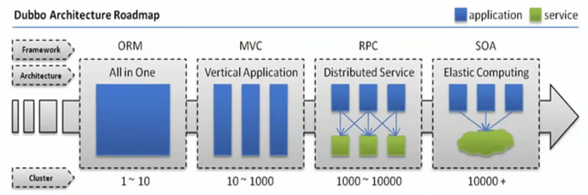

## 1.2 单体架构、SOA、微服务

单体架构（一个项目一个工程）→SOA（多个服务组成的分布式系统）→微服务（将单个应用程序开发为一套小型服务的方法）

```html
微服务：https://www.martinfowler.com/microservices/
```

**单体架构和微服务比较**

| 服务架构 | 优点                                                         |                             缺点                             |
| :------: | :----------------------------------------------------------- | :----------------------------------------------------------: |
| 单体架构 | 1、简单易于开发和部署，适合小型项目和团队。<br/>2、服务之间的独立性，提高了系统的鲁棒性 | 1、随着应用规模增长，代码难以管理，系统维护和扩展变得复杂；<br/>2、单个模块的更改可能影响整个系统 |
|  微服务  | 1、每个服务足够内聚，足够小，代码容易理解。这样能聚焦一个简单唯一的业务功能或业务需求。<br/>2、开发简单、开发效率提高，一个服务可能就是专业的只干一件事，微服务能够被小团队单独开发，这个小团队可以是2到5人的开发人员组成<br/>3、微服务是松耦合的，是有功能意义的服务，无论是在开发阶段或部署阶段都是独立的。<br/>4、微服务能使用不同的语言开发<br/>4、易于和第三方集成，微服务运行容易且灵活的方式集成自动部署，通过持续集成工具，如: Jenkins、Hudson、Bamboo<br/>5、微服务易于被一个开发人员理解、修改和维护，这样小团队能够更关注自己的工作成果，无需通过合作才能体现价值<br/>6、微服务允许你利用融合最新技术。微服务只是业务逻辑的代码，不会和HTML/CSS或其他界面组件混合，即前后端分离<br/>7、每个微服务都有自己的存储能力，一般都有自己的独立的数据库，也可以有统一数据库 | 1、系统复杂性增加，需要处理分布式系统的挑战，如网络延迟、数据一致性等；<br/>2、管理和监控多个服务也变得更加复杂 |

**单体是优先选择**

# 2 ZooKeeper

## 2.1 介绍

```html
官网：https://zookeeper.apache.org/
官方文档：https://zookeeper.apache.org/doc/
```

## 2.2 工作原理

### 2.2.1 zookeeper功能

ZooKeeper 是一个分布式服务框架，它主要是用来解决分布式应用中经常遇到的一些数据管理问题，如：命名服务、状态同步、配置中心、集群管理等。

**命名服务**

```
命名服务是分布式系统中比较常见的一类场景。命名服务是分布式系统最基本的公共服务之一。在分布式系统中，被命名的实体通常可以是集群中的机器、提供的服务地址或远程对象等——这些我们都可以统称它们为名字（Name），其中较为常见的就是一些分布式服务框架（如RPC、RMI）中的服务地址列表，通过使用命名服务，客户端应用能够根据指定名字来获取资源的实体、服务地址和提供者的信息等。
```

```sh
#Zookeeper 数据模型
在 Zookeeper 中，节点分为两类
第一类是指构成Zookeeper集群的主机，称之为主机节点
第二类则是指内存中zookeeper数据模型中的数据单元，用来存储各种数据内容，称之为数据节点 ZNode。
Zookeeper内部维护了一个层次关系(树状结构)的数据模型，它的表现形式类似于Linux的文件系统，甚至操作的种类都一致。
Zookeeper数据模型中有自己的根目录(/)，根目录下有多个子目录，每个子目录后面有若干个文件,由斜杠(/)进行分割的路径，就是一个ZNode,每个 ZNode上都会保存自己的数据内容和一系列属性信息.
```

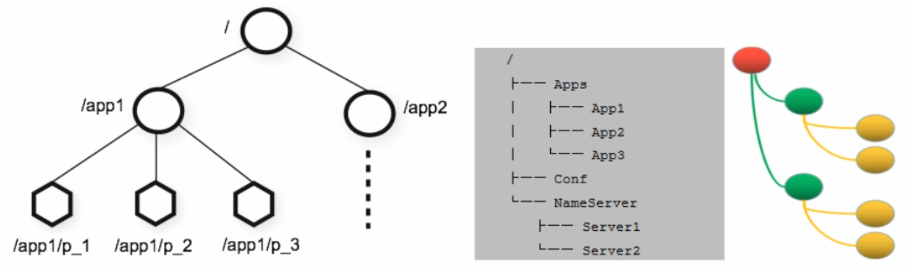

**状态同步**(强一致性)

```
每个节点除了存储数据内容和 node 节点状态信息之外，还存储了已经注册的APP 的状态信息，当有些节点或APP 不可用，就将当前状态同
步给其他服务。
```

**配置中心**

```sh
现在我们大多数应用都是采用的是分布式开发的应用，搭建到不同的服务器上，我们的配置文件，同一个应用程序的配置文件一样，还有就是多个程序存在相同的配置，当我们配置文件中有个配置属性需要改变，需要改变每个程序的配置属性，这样会很麻烦的去修改配置，那么可用使用ZooKeeper 来实现配置中心

ZooKeeper 采用的是推拉相结合的方式：客户端向服务端注册自己需要关注的节点，一旦该节点的数据发生变更，那么服务端就会向相应的客户端发送Watcher事件通知，客户端接收到这个消息通知后，需要主动到服务端获取最新的数据。

Apollo（阿波罗）是携程框架部门研发的开源配置管理中心,此应用比较流行
```

**集群管理**

所谓集群管理，包括集群监控与集群控制两大块，前者侧重对集群运行时状态的收集，后者则是对集群进行操作与控制，在日常开发和运维过程中，我们经常会有类似于如下的需求：

- 希望知道当前集群中究竟有多少机器在工作。
- 对集群中每台机器的运行时状态进行数据收集。对集群中机器进行上下线操作。


ZooKeeper 具有以下两大特性:

- 客户端如果对ZooKeeper 的一个数据节点注册 Watcher监听，那么当该数据节点的内容或是其子节点列表发生变更时，ZooKeeper 服务器就会向已注册订阅的客户端发送变更通知。
- 对在ZooKeeper上创建的临时节点，一旦客户端与服务器之间的会话失效，那么该临时节点也就被自动清除。


Watcher（事件监听器）是 Zookeeper 中的一个很重要的特性。Zookeeper 允许用户在指定节点上注册一些 Watcher，并且在一些特定事件触发的时候， ZooKeeper 服务端会将事件通知到感兴趣的客户端上去，该机制是 Zookeeper 实现分布式协调服务的重要特性。

### 2.2.2 ZooKeeper 服务流程

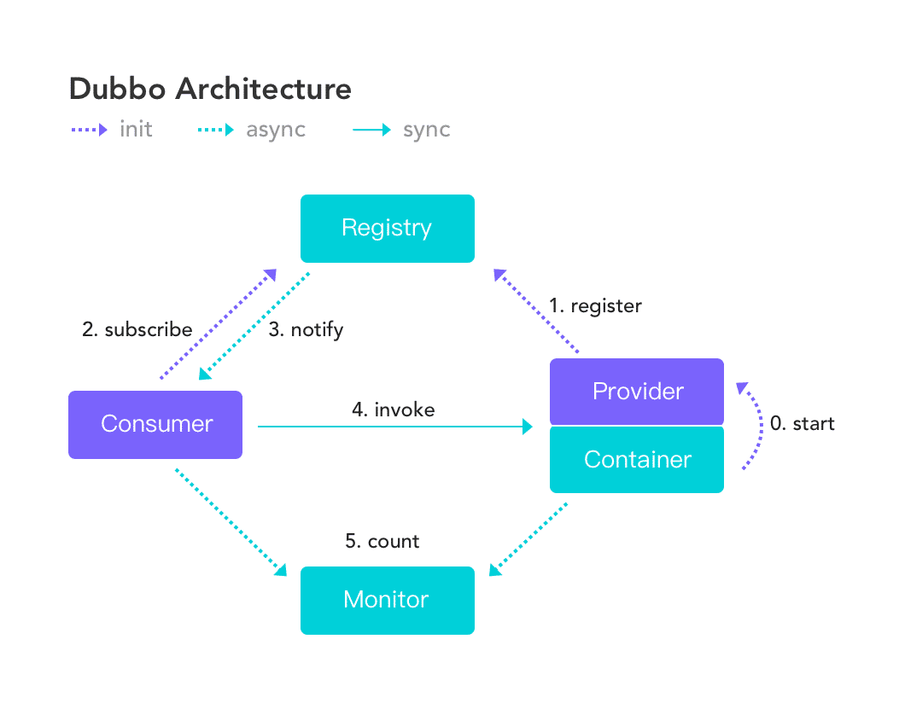

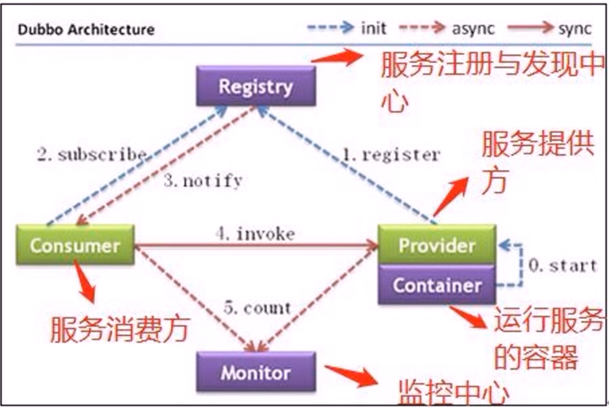

### 2.2.3 安装方法和容器安装

Zookeeper 支持容器安装或包,二进制等方式安装

```
https://hub.docker.com/_/zookeeper
```

范例: 单实例

```
docker run --name some-zookeeper --restart always -d zookeeper
```

## 2.3 ZooKeeper 单机部署

单机版的 ZooKeeper 安装

```
官方文档:https://zookeeper.apache.org/doc/r3.6.2/zookeeperStarted.html#sc_InstallingSingleMode
```

### 2.3.1 配置 Java 环境

官方依赖介绍

```
https://zookeeper.apache.org/doc/r3.8.0/zookeeperAdmin.html#sc_systemReq
https://zookeeper.apache.org/doc/r3.6.2/zookeeperAdmin.html#sc_requiredSoftware
```

范例：安装java环境 JDK-11

```sh
[root@ubuntu2004 ~]#apt update && apt -y install openjdk-11-jdk
[root@ubuntu2204 ~]#java -version
openjdk version "11.0.18" 2023-01-17
OpenJDK Runtime Environment (build 11.0.18+10-post-Ubuntu-0ubuntu122.04)
OpenJDK 64-Bit Server VM (build 11.0.18+10-post-Ubuntu-0ubuntu122.04, mixed mode, sharing)

[root@ubuntu2004 ~]#apt update && apt -y install openjdk-11-jdk 
[root@ubuntu2004 ~]#java -version
openjdk version "11.0.9.1" 2020-11-04
OpenJDK Runtime Environment (build 11.0.9.1+1-Ubuntu-0ubuntu1.20.04)
OpenJDK 64-Bit Server VM (build 11.0.9.1+1-Ubuntu-0ubuntu1.20.04, mixed mode, sharing)

#安装openjdk8
[root@ubuntu1804 ~]#apt update && apt -y install openjdk-8-jdk 
[root@ubuntu1804 ~]#Java -version
openjdk version "1.8.0_282"
OpenJDK Runtime Environment (build 1.8.0_282-8u282-b08-0ubuntu1~18.04-b08)
OpenJDK 64-Bit Server VM (build 25.282-b08, mixed mode)
```

### 2.3.2 部署 ZooKeeper

#### 2.3.2.1 包安装

```sh
[root@ubuntu2204 ~]#apt list zookeeper
正在列表... 完成
zookeeper/jammy 3.4.13-6ubuntu4 all
[root@ubuntu2204 ~]#apt -y install zookeeper
[root@ubuntu2204 ~]#grep -Ev "#|^$" /etc/zookeeper/conf/zoo.cfg
tickTime=2000  #服务器与服务器之间的单次心跳检测时间间隔，单位为毫秒
initLimit=10    #集群中leader 服务器与follower服务器初始连接心跳次数，即多少个 2000 毫秒
syncLimit=5    #leader 与follower之间检测发送和应答的心跳次数，如果该follower在时间段5*2000不能与leader进行通信，此
follower将不可用
dataDir=/var/lib/zookeeper  #自定义的zookeeper保存数据的目录
clientPort=2181   #客户端连接 Zookeeper 服务器的端口，Zookeeper会监听这个端口，接受客户端的访问请求
[root@ubuntu2204 ~]#ls /usr/share/zookeeper/bin/
zkCleanup.sh zkCli.sh zkEnv.sh zkServer.sh
[root@ubuntu2204 ~]#/usr/share/zookeeper/bin/zkServer.sh start
ZooKeeper JMX enabled by default
Using config: /etc/zookeeper/conf/zoo.cfg
Starting zookeeper ... STARTED
[root@ubuntu2204 ~]#/usr/share/zookeeper/bin/zkServer.sh status
ZooKeeper JMX enabled by default
Using config: /etc/zookeeper/conf/zoo.cfg
Mode: standalone
```


#### 2.3.2.2 二进制安装

官网：[Apache ZooKeeper](https://zookeeper.apache.org/releases.html)

**范例: 安装单机 zookeeper**

```sh
#下载二进制包
root@ubuntu2204:~# wget -P /usr/local/ https://dlcdn.apache.org/zookeeper/zookeeper-3.8.4/apache-zookeeper-3.8.4-bin.tar.gz

#解压包
root@ubuntu2204:~# cd /usr/local/
root@ubuntu2204:/usr/local# tar zxf apache-zookeeper-3.8.4-bin.tar.gz
root@ubuntu2204:/usr/local# ln -s /usr/local/apache-zookeeper-3.8.4-bin zookeeper
root@ubuntu2204:/usr/local# ls zookeeper
LICENSE.txt  NOTICE.txt  README.md  README_packaging.md  bin  conf  docs  lib


root@ubuntu2204:/usr/local# echo 'PATH=/usr/local/zookeeper/bin:$PATH' > /etc/profile.d/zookeeper.sh"
root@ubuntu2204:/usr/local# . /etc/profile.d/zookeeper.sh

root@ubuntu2204:/usr/local# ll zookeeper/
total 48
drwxr-xr-x  6 root root  4096 Sep  8 04:47 ./
drwxr-xr-x 11 root root  4096 Sep  8 04:53 ../
-rw-r--r--  1 ding ding 11358 Feb 12  2024 LICENSE.txt
-rw-r--r--  1 ding ding  2084 Feb 12  2024 NOTICE.txt
-rw-r--r--  1 ding ding  2335 Feb 12  2024 README.md
-rw-r--r--  1 ding ding  3570 Feb 12  2024 README_packaging.md
drwxr-xr-x  2 ding ding  4096 Feb 12  2024 bin/
drwxr-xr-x  2 ding ding  4096 Feb 12  2024 conf/
drwxr-xr-x  5 ding ding  4096 Feb 12  2024 docs/
drwxr-xr-x  2 root root  4096 Sep  8 04:47 lib/
root@ubuntu2204:/usr/local# ll zookeeper/bin/
total 80
drwxr-xr-x 2 ding ding  4096 Feb 12  2024 ./
drwxr-xr-x 6 root root  4096 Sep  8 04:47 ../
-rwxr-xr-x 1 ding ding   232 Feb 12  2024 README.txt*
-rwxr-xr-x 1 ding ding  1978 Feb 12  2024 zkCleanup.sh*
-rwxr-xr-x 1 ding ding  1115 Feb 12  2024 zkCli.cmd*
-rwxr-xr-x 1 ding ding  1576 Feb 12  2024 zkCli.sh*
-rwxr-xr-x 1 ding ding  1810 Feb 12  2024 zkEnv.cmd*
-rwxr-xr-x 1 ding ding  3613 Feb 12  2024 zkEnv.sh*
-rwxr-xr-x 1 ding ding  4559 Feb 12  2024 zkServer-initialize.sh*
-rwxr-xr-x 1 ding ding  1243 Feb 12  2024 zkServer.cmd*
-rwxr-xr-x 1 ding ding 11616 Feb 12  2024 zkServer.sh*
-rwxr-xr-x 1 ding ding   988 Feb 12  2024 zkSnapShotToolkit.cmd*
-rwxr-xr-x 1 ding ding  1377 Feb 12  2024 zkSnapShotToolkit.sh*
-rwxr-xr-x 1 ding ding   987 Feb 12  2024 zkSnapshotComparer.cmd*
-rwxr-xr-x 1 ding ding  1374 Feb 12  2024 zkSnapshotComparer.sh*
-rwxr-xr-x 1 ding ding   996 Feb 12  2024 zkTxnLogToolkit.cmd*
-rwxr-xr-x 1 ding ding  1385 Feb 12  2024 zkTxnLogToolkit.sh*

#查看配置文件
root@ubuntu2204:/usr/local# ll zookeeper/conf/zoo_sample.cfg 
-rw-r--r-- 1 ding ding 1183 Feb 12  2024 zookeeper/conf/zoo_sample.cfg
#创建配置文件
root@ubuntu2204:/usr/local# cp zookeeper/conf/zoo_sample.cfg zookeeper/conf/zoo.cfg
#默认配置可不做修改
[root@ubuntu1804 ~]#grep -v "#" /usr/local/zookeeper/conf/zoo.cfg
tickTime=2000  #"滴答时间"，用于配置Zookeeper中最小的时间单元长度，单位毫秒，是其它时间配置的基础
initLimit=10   #初始化时间，包含启动和数据同步，其值是tickTime的倍数
syncLimit=5    #正常工作，心跳监测的时间间隔，其值是tickTime的倍数
dataDir=/tmp/zookeeper #配置Zookeeper服务存储数据快照的目录,基于安全,可以修改为 dataDir=/usr/local/zookeeper/data 
dataLogDir=/usr/local/zookeeper/logs  #指定日志路径，默认与 dataDir 一致,事务日志对性能影响非常大，强烈建议事务日志目录和数据目录分开，如果后续修改路径，需要先删除中dataDir中旧的事务日志，否则可能无法启动
clientPort=2181 #配置当前Zookeeper服务对外暴露的端口，用户客户端和服务端建立连接会话

preAllocSize：#为事务日志预先开辟磁盘空间。默认是64M，意味着每个事务日志初始大小64M。如果ZooKeeper产生快照频率较大，可以考虑减小这个参数，因为每次快照后都会切换到新的事务日志，即使前面的64M没有写满。

snapCount：#该配置项指定ZooKeeper在将内存数据库保存为快照之前，需要先写多少次事务日志，即，每写几次事务日志就快照一次。默认值为100000。为了防止所有的ZooKeeper服务器节点同时生成快照(一般情况下，所有集群的实例的配置文件是完全相同的)，当某节点的先写事务数量在(snapCount/2+1,snapCount)范围内时挑选一个随机值做为该节点拍快照的时机。

autopurge.snapRetainCount=3 #3.4.0中的新增功能：启用后，ZooKeeper 自动清除功能,会将只保留此最新3个快照和相应的事务日志,并分别保留在dataDir 和dataLogDir中，删除其余部分，默认值为3,最小值为3
autopurge.purgeInterval=24  #3.4.0及之后版本，ZK提供了自动清理日志和快照文件的功能，这个参数指定了清理频率，单位是小时，需要配置一个1或更大的整数，默认是 0，表示不开启自动清理功能
```

### 2.3.3 启动 ZooKeeper

```shell
#查看启动选项
root@ubuntu2204:/usr/local# zkServer.sh --help
/usr/bin/java
ZooKeeper JMX enabled by default
Using config: /usr/local/zookeeper/bin/../conf/zoo.cfg
Usage: /usr/local/zookeeper/bin/zkServer.sh [--config <conf-dir>] {start|start-foreground|stop|version|restart|status|print-cmd}

#前台启动观察启动过程
root@ubuntu2204:/usr/local# zkServer.sh start-foreground

#后台启动
root@ubuntu2204:/usr/local# zkServer.sh start
/usr/bin/java
ZooKeeper JMX enabled by default
Using config: /usr/local/zookeeper/bin/../conf/zoo.cfg
Starting zookeeper ... STARTED

#注意:如果配置service,zkServer.sh和systemctl不要混用,否则无法启动
```

### 2.3.4 验证 ZooKeeper

```sh
root@ubuntu2204:/usr/local# zkServer.sh status
/usr/bin/java
ZooKeeper JMX enabled by default
Using config: /usr/local/zookeeper/bin/../conf/zoo.cfg
Client port found: 2181. Client address: localhost. Client SSL: false.
Mode: standalone

root@ubuntu2204:/usr/local# ps aux|grep java
[root@Rocky8 /usr/local/zookeeper/conf]# ss -antlp|grep 2181
tcp6       0      0 :::2181                 :::*                    LISTEN      31789/java 
root@ubuntu2204 /usr/local/zookeeper/conf# pstree -p 31789
java(31789)─┬─{java}(31792)
            ├─{java}(31793)
            ├─{java}(31794)
            ├─{java}(31795)
            ├─{java}(31796)
            ├─{java}(31797)
            ├─{java}(31798)
            ├─{java}(31799)
            ├─{java}(31800)
            ├─{java}(31801)
            ├─{java}(31802)
            ├─{java}(31803)
            ├─{java}(31804)
            ├─{java}(31805)
            ├─{java}(31806)
            ├─{java}(31807)
            ├─{java}(31808)
            ├─{java}(31809)
            ├─{java}(31810)
            ├─{java}(31811)
            ├─{java}(31812)
            ├─{java}(31813)
            ├─{java}(31814)
            ├─{java}(31815)
            ├─{java}(31816)
            ├─{java}(31817)
            ├─{java}(31818)
            ├─{java}(31857)
            └─{java}(31896)
```

## 2.4 ZooKeeper 集群部署

### 2.4.1 ZooKeeper 集群介绍

ZooKeeper集群用于解决单点和单机性能及数据高可用等问题。

#### 2.4.1.1 集群结构

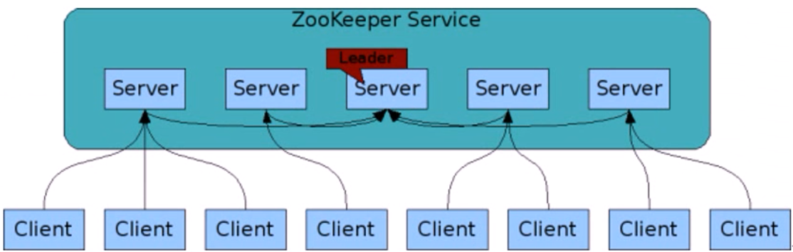

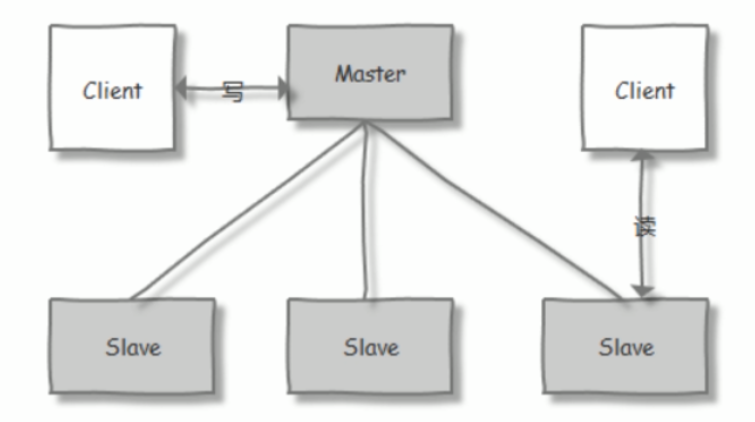

Zookeeper集群基于Master/Slave的模型

处于主要地位负责处理写操作)的主机称为Leader节点，处于次要地位主要负责处理读操作的主机称为 follower 节点

当进行写操作时,由Master(leader)完成,再同步到其它Slave(follower)节点,而且要求在保证写操作在所有节点的总数过半后,才会认为写操作成功

生产中读取的方式一般是以异步复制方式来实现的。

对于n台server,每个server都知道彼此的存在。只要有>n/2台server节点可用，整个zookeeper系统保持可用。因此zookeeper集群通常由奇数台Server节点组成

**官方链接: 下图表示读的比例越高,性能越好**

```
http://zookeeper.apache.org/doc/r3.7.0/zookeeperOver.html
```

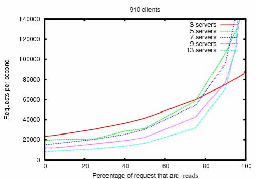

#### 2.4.1.2 集群角色

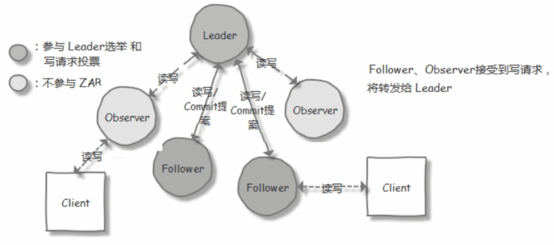

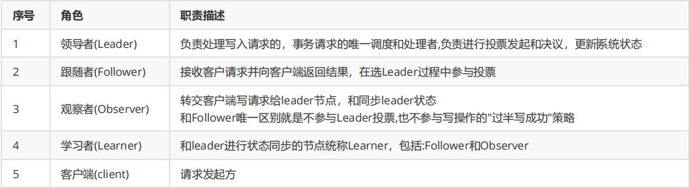

#### 2.4.1.3 选举过程

**节点角色状态：**

- LOOKING：寻找 Leader 状态，处于该状态需要进入选举流程
- LEADING：领导者状态，处于该状态的节点说明是角色已经是Leader 
- FOLLOWING：跟随者状态，表示 Leader已经选举出来，当前节点角色是follower 
- OBSERVER：观察者状态，表明当前节点角色是 observer

**选举 ID：**

- ZXID（zookeeper transaction id）：每个改变 Zookeeper状态的操作都会自动生成一个对应的zxid。ZXID最大的节点优先选为Leader
- myid：服务器的唯一标识(SID)，通过配置 myid 文件指定，集群中唯一,当ZXID一样时,myid大的节点优先选为Leader

**ZooKeeper 集群选举过程：**

当集群中的 zookeeper 节点启动以后，会根据配置文件中指定的 zookeeper节点地址进行leader 选择操作，过程如下：

- 每个zookeeper 都会发出投票，由于是第一次选举leader，因此每个节点都会把自己当做leader 角色进行选举，每个zookeeper 的投票中都会包含自己的myid和zxid，此时zookeeper 1 的投票为myid 为 1，初始zxid有一个初始值0x0，后期会随着数据更新而自动变化，zookeeper 2 的投票为myid 为2，初始zxid 为初始生成的值。
- 每个节点接受并检查对方的投票信息，比如投票时间、是否状态为LOOKING状态的投票。
- 对比投票，优先检查zxid，如果zxid 不一样则 zxid 大的为leader，如果zxid相同则继续对比myid，myid 大的一方为 leader成为 Leader 的必要条件： Leader 要具有最高的zxid；当集群的规模是 n 时，集群中大多数的机器（至少n/2+1）得到响应并从follower 中选出的 Leader。


心跳机制：Leader 与 Follower 利用 PING 来感知对方的是否存活，当 Leader无法响应PING 时，将重新发起 Leader 选举。


当 Leader 服务器出现网络中断、崩溃退出与重启等异常情况时，ZAB(Zookeeper Atomic Broadcast) 协议就会进入恢复模式并选举产生新的Leader服务器。这个过程大致如下：

- Leader Election（选举阶段）：节点在一开始都处于选举阶段，只要有一个节点得到超半数节点的票数，它就可以当选准 leader。
- Discovery（发现阶段）：在这个阶段，followers 跟准 leader 进行通信，同步 followers 最近接收的事务提议。
- Synchronization（同步阶段）:同步阶段主要是利用 leader 前一阶段获得的最新提议历史，同步集群中所有的副本。同步完成之后 准leader 才会成为真正的 leader。
- Broadcast（广播阶段） ：到了这个阶段，Zookeeper 集群才能正式对外提供事务服务，并且 leader 可以进行消息广播。同时如果有新的节点加入，还需要对新节点进行同步

**ZAB 协议介绍**

```
ZAB（ZooKeeper Atomic Broadcast 原子广播） 协议是为分布式协调服务 ZooKeeper 专门设计的一种支持崩溃恢复的原子广播协议。 在
ZooKeeper 中，主要依赖 ZAB 协议来实现分布式数据一致性，基于该协议，ZooKeeper 实现了一种主备模式的系统架构来保持集群中各个副本之间的数据一致性。
```

#### 2.4.1.4 ZooKeeper 集群特性

整个集群中只要有超过集群数量一半的 zookeeper工作是正常的，那么整个集群对外就是可用的

```
假如有 2 台服务器做了一个 Zookeeper 集群，只要有任何一台故障或宕机，那么这个 ZooKeeper集群就不可用了，因为剩下的一台没有超
过集群一半的数量，但是假如有三台zookeeper 组成一个集群， 那么损坏一台就还剩两台，大于 3台的一半，所以损坏一台还是可以正常运
行的，但是再损坏一台就只剩一台集群就不可用了。那么要是 4 台组成一个zookeeper集群，损坏一台集群肯定是正常的，那么损坏两台就
还剩两台，那么2台不大于集群数量的一半，所以 3 台的 zookeeper 集群和 4 台的 zookeeper集群损坏两台的结果都是集群不可用，以此类
推 5 台和 6 台以及 7 台和 8台都是同理
```

#### 2.4.1.5 Zookeeper 事务日志和快照

```
ZooKeeper集群中的每个服务器节点每次接收到写操作请求时，都会先将这次请求发送给leader，leader将这次写操作转换为带有状态的事
务，然后leader会对这次写操作广播出去以便进行协调。当协调通过(大多数节点允许这次写)后，leader通知所有的服务器节点，让它们将这
次写操作应用到内存数据库中，并将其记录到事务日志中。
当事务日志记录的次数达到一定数量后(默认10W次)，就会将内存数据库序列化一次，使其持久化保存到磁盘上，序列化后的文件称为"快照
文件"。每次拍快照都会生成新的事务日志。
```

### 2.4.2 ZooKeeper 集群部署

官方文档：

```
https://zookeeper.apache.org/doc/r3.6.2/zookeeperAdmin.html#sc_zkMulitServerSetup
```

#### 2.4.2.1 环境准备

```sh
#ubuntu2204三台：11.0.1.10、11.0.1.11、11.0.1.12
root@zookeeper-node01:~# apt update && apt -y install openjdk-11-jdk
root@zookeeper-node02:~# apt update && apt -y install openjdk-11-jdk
root@zookeeper-node03:~# apt update && apt -y install openjdk-11-jdk
```

#### 2.4.2.2 在所有节点下载并解压缩 ZooKeeper 包文件

```sh
[root@zookeeper-node01 ~]#wget -P /usr/local/src https://downloads.apache.org/zookeeper/stable/apachezookeeper-3.8.4-bin.tar.gz
[root@zookeeper-node01 ~]#tar xf /usr/local/src/apache-zookeeper-3.8.4-bin.tar.gz -C /usr/local/
[root@zookeeper-node01 ~]#ln -s /usr/local/apache-zookeeper-3.8.4-bin /usr/local/zookeeper
[root@zookeeper-node01 ~]#echo 'PATH=/usr/local/zookeeper/bin:$PATH' > /etc/profile.d/zookeeper.sh
[root@zookeeper-node01 ~]#. /etc/profile.d/zookeeper.sh
```

#### 2.4.2.3 准备配置文件

```sh
#三个节点都要创建数据目录
[root@zookeeper-node01 ~]#mkdir /usr/local/zookeeper/data 

#基于模板配置文件生成配置文件
[root@zookeeper-node01 ~]#cp /usr/local/zookeeper/conf/zoo_sample.cfg /usr/local/zookeeper/conf/zoo.cfg

#修改配置文件
[root@zookeeper-node01 ~]#vim /usr/local/zookeeper/conf/zoo.cfg
tickTime=2000  #服务器与服务器之间的单次心跳检测时间间隔，单位为毫秒
initLimit=10  #集群中leader 服务器与follower服务器初始连接心跳次数，即多少个 2000 毫秒
syncLimit=5  #leader 与follower之间连接完成之后，后期检测发送和应答的心跳次数，如果该follower在设置的时间内(5*2000)不能与
leader 进行通信，那么此 follower将被视为不可用。
dataDir=/usr/local/zookeeper/data #自定义的zookeeper保存数据的目录
clientPort=2181 #客户端连接 Zookeeper 服务器的端口，Zookeeper会监听这个端口，接受客户端的访问请求
maxClientCnxns=128 #单个客户端IP 可以和zookeeper保持的连接数
autopurge.snapRetainCount=3 #3.4.0中的新增功能：启用后，ZooKeeper 自动清除功能,会将只保留此最新3个快照和相应的事务日志,并分别保留在dataDir 和dataLogDir中，删除其余部分，默认值为3,最小值为3
autopurge.purgeInterval=24  #3.4.0及之后版本，ZK提供了自动清理日志和快照文件的功能，这个参数指定了清理频率，单位是小时，需要配置一个1或更大的整数，默认是 0，表示不开启自动清理功能
#格式: server.MyID服务器唯一编号=服务器IP:Leader和Follower的数据同步端口(只有leader才会打开):Leader和Follower选举端口(L和F都有)
server.1=11.0.1.10:2888:3888
server.2=11.0.1.11:2888:3888
server.3=11.0.1.12:2888:38888
#如果添加节点,只需要在所有节点上添加新节点的上面形式的配置行,在新节点创建myid文件,并重启所有节点服务即可

#最终配置文件
root@zookeeper-node01:~# grep  -Ev "^#" /usr/local/zookeeper/conf/zoo.cfg 
tickTime=2000
initLimit=10
syncLimit=5
dataDir=/usr/local/zookeeper/data/  #与myid路径保持一致
clientPort=2181

#集群需添加以下内容
server.1=11.0.1.10:2888:3888
server.2=11.0.1.11:2888:3888
server.3=11.0.1.12:2888:3888

#如果添加节点,只需要在所有节点上添加新节点的上面形式的配置行,在新节点创建myid文件,并重启所有节点服务即可
[root@zookeeper-node01 ~]#scp /usr/local/zookeeper/conf/zoo.cfg 11.0.1.11:/usr/local/zookeeper/conf/
[root@zookeeper-node01 ~]#scp /usr/local/zookeeper/conf/zoo.cfg 11.0.1.12:/usr/local/zookeeper/conf/
```

#### 2.4.2.4 在各个节点生成ID文件

注意: 各个myid文件的内容要和zoo.cfg文件相匹配

```sh
[root@zookeeper-node01 ~]#echo 1 > /usr/local/zookeeper/data/myid
[root@zookeeper-node02 ~]#echo 2 > /usr/local/zookeeper/data/myid
[root@zookeeper-node03 ~]#echo 3 > /usr/local/zookeeper/data/myid
```

#### 2.4.2.5 各服务器启动 Zookeeper

```sh
#注意:在所有三个节点快速启动服务,否则会造成集群失败
[root@zookeeper-node01 ~]#zkServer.sh start
[root@zookeeper-node02 ~]#zkServer.sh start
[root@zookeeper-node03 ~]#zkServer.sh start

#注意:如果无法启动查看日志
[root@zookeeper-node01 ~]#cat /usr/local/zookeeper/logs/zookeeper-root-server-zookeeper-node1.wang.org.out
```

#### 2.4.5.6 查看集群状态

```sh
#只有leader监听2888/tcp端口，follower会监听3888/tcp端口
root@zookeeper-node01:~# zkServer.sh  status
/usr/bin/java
ZooKeeper JMX enabled by default
Using config: /usr/local/zookeeper/bin/../conf/zoo.cfg
Client port found: 2181. Client address: localhost. Client SSL: false.
Mode: leader
root@zookeeper-node01:~# ss -ntlp|grep 2181
LISTEN 0      50                      *:2181             *:*    users:(("java",pid=41868,fd=48))         
root@zookeeper-node01:~# ss -ntlp|grep -E '2888|3888'
LISTEN 0      50     [::ffff:11.0.1.10]:3888             *:*    users:(("java",pid=41868,fd=57))         
LISTEN 0      50     [::ffff:11.0.1.10]:2888             *:*    users:(("java",pid=41868,fd=59)) 

#follower会监听3888/tcp端口
root@zookeeper-node02:~# zkServer.sh  status
/usr/bin/java
ZooKeeper JMX enabled by default
Using config: /usr/local/zookeeper/bin/../conf/zoo.cfg
Client port found: 2181. Client address: localhost. Client SSL: false.
Mode: follower
root@zookeeper-node02:~# ss -ntlp|grep 2181
LISTEN 0      50                      *:2181             *:*    users:(("java",pid=4334,fd=48))          
root@zookeeper-node02:~# ss -ntlp|grep -E '2888|3888'
LISTEN 0      50     [::ffff:11.0.1.11]:3888             *:*    users:(("java",pid=4334,fd=57)) 

#follower会监听3888/tcp端口
root@zookeeper-node03:~# zkServer.sh  status
/usr/bin/java
ZooKeeper JMX enabled by default
Using config: /usr/local/zookeeper/bin/../conf/zoo.cfg
Client port found: 2181. Client address: localhost. Client SSL: false.
Mode: follower
root@zookeeper-node03:~# ss -ntlp|grep 2181
LISTEN 0      50                      *:2181             *:*    users:(("java",pid=42314,fd=48))         
root@zookeeper-node03:~# ss -ntlp|grep -E '2888|3888'
LISTEN 0      50     [::ffff:11.0.1.12]:3888             *:*    users:(("java",pid=42314,fd=57))   
```

## 2.5 客户端访问

### 2.5.1 命令行客户端访问 ZooKeeper

```sh
#可连接至zookeeper 集群中的任意一台zookeeper 节点进行以下操作,zkCli.sh 默认连接本机
root@zookeeper-node02:~# zkCli.sh  -server 11.0.1.12:2181
[zk: 11.0.1.12:2181(CONNECTED) 0]ls /
[app1, app2, app3, zookeeper]

[zk: 11.0.1.12:2181(CONNECTED) 1] 
addWatch               addauth                close                  config                 connect                create                 delete                 deleteall              
delquota               get                    getAcl                 getAllChildrenNumber   getEphemerals          history                listquota              ls                     
printwatches           quit                   reconfig               redo                   removewatches          set                    setAcl                 setquota               
stat                   sync                   version                whoami                 
[zk: 11.0.1.12:2181(CONNECTED) 20] version
ZooKeeper CLI version: 3.8.4-9316c2a7a97e1666d8f4593f34dd6fc36ecc436c, built on 2024-02-12 22:16 UTC

#默认创建持久节点,即退出不丢失,create -e 可以创建临时节点(退出就丢失)
#持久节点才支持创建子节点,临时节点不支持,如: create /app1/config "hello,zookeeper" ，不能递归创建
[zk: localhost:2181(CONNECTED) 1] create /app1/config "hello,hello"
[zk: localhost:2181(CONNECTED) 4] ls /app1
[config]

#get -s /app1可以查看更详细的信息
[zk: localhost:2181(CONNECTED) 0] get /app1/config 
hello,hello

#修改已有节点的值
[zk: localhost:2181(CONNECTED) 5]  set /app1 "hello,linux"
[zk: localhost:2181(CONNECTED) 6] get /app1 
hello,linux

#删除不包含子节点的节点(相当于rmdir),如果想删除所有节点内的数据,使用deleteall /path(相当于rm -rf)
[zk: localhost:2181(CONNECTED) 7] delete /app3 
[zk: localhost:2181(CONNECTED) 8] ls /
[app1, app2, zookeeper]

#查看已知节点元数据
[zk: 10.0.0.103:2181(CONNECTED) 9] stat /zookeeper
zxid = Ox0 #节点创建时的zxid
ctime = Thu Jan 01 08:00:00 CST 1970    #节点创建时间
mzxid = Ox0 #节点最近一次更新时的zxid
mtime = Thu Jan 01 08:00:00 cST 1970    #节点最近一次更新的时间
pzxid = Ox0                             #父节点创建时的zxid
cversion = -1                           #子节点数据更新次数
dataversion = 0                         #本节点数据更新次数
aclversion = o                          #节点ACL(授权信息)的更新次数
ephemera10wner = Ox0                    #持久节点值为0，临时节点值为sessionid
dataLength = 0                          #节点数据长度
numchi1dren = 1                         #子节点个数
[zk: localhost:2181(CONNECTED) 10] get /zookeeper/config
server.1=10.0.0.201:2888:3888:participant
server.2=10.0.0.202:2888:3888:participant
server.3=10.0.0.203:2888:3888:participant
version=0
[zk: 10.0.0.103:2181(CONNECTED) 10] quit #退出
```

### 2.5.2 nc 访问 ZooKeeper(默认 🈲)

ZooKeeper支持某些特定的四字命令字母与其的交互。它们大多是查询命令，用来获取 ZooKeeper服务的当前状态及相关信息。
用户在客户端可以通过 netcat 或telnet向zookeeper发送下面命令

**常见命令列表**

```sh
conf #输出相关服务配置的详细信息
cons #列出所有连接到服务器的客户端的完全的连接/会话的详细信息
envi #输出关于服务环境的详细信息
dump #列出未经处理的会话和临时节点
stat #查看哪个节点被选择作为Follower或者Leader
ruok #测试是否启动了该Server，若回复imok表示已经启动
mntr #输出一些运行时信息
reqs #列出未经处理的请求
wchs #列出服务器watch的简要信息
wchc #通过session列出服务器watch的详细信息
wchp #通过路径列出服务器watch的详细信息
srvr #输出服务的所有信息
srst #重置服务器统计信息
kill #关掉Server
isro #查看该服务的节点权限信息
```

**命令的安全限制**

```sh
#默认情况下，这些4字命令有可能会被拒绝，提示如下报错
xxxx is not executed because it is not in the whitelist.
#解决办法:在 zoo.cfg文件中添加如下配置,如果是集群需要在所有节点上添加下面配置
# vim conf/zoo.cfg
4lw.commands.whitelist=*
#在服务状态查看命令中有很多存在隐患的命令，为了避免生产中的安全隐患，要对这些"危险"命令进行一些安全限制，只需要编辑服务的zoo.cfg文件即可

# vim conf/zoo.cfg
4lw.commands.whitelist=conf,stat,ruok,isro
```

范例：

```sh
ubuntu2204安装netcat
apt update && apt -y install netcat-traditional 或者 netcat-openbsd

#查看节点服务状态
echo stat | nc 127.0.0.1 2181
#如果不显式写入白名单，默认提示stat is not executed because it is not in the whitelist.

#查看节点服务配置
echo conf | nc 127.0.0.1 2181
#查看节点服务环境
echo envi | nc 127.0.0.1 2181
#查看节点服务会话
echo cons | nc 127.0.0.1 2181
echo dump | nc 127.0.0.1 2181

##也支持 telnet,但不能用 | telnet 形式
root@zookeeper-node01:~# telnet 127.0.0.1 2181
Trying 127.0.0.1...
Connected to 127.0.0.1.
Escape character is '^]'.
stat
Zookeeper version: 3.8.4-9316c2a7a97e1666d8f4593f34dd6fc36ecc436c, built on 2024-02-12 22:16 UTC
Clients:
 /127.0.0.1:41220[0](queued=0,recved=1,sent=0)

Latency min/avg/max: 0/0.0/0
Received: 7
Sent: 6
Connections: 1
Outstanding: 0
Zxid: 0x40000001c
Mode: follower
Node count: 10
Connection closed by foreign host.
```

### 2.5.3 图形化客户端 ZooInspector

github链接

```
https://github.com/zzhang5/zooinspector
https://gitee.com/lbtooth/zooinspector.git
```

#### 2.5.3.1 Linux 客户端

##### 2.5.3.1.1 编译 zooinspector

**注意：此软件因年代久远不再更新，当前只支持在Ubuntu18.04和Rocky8编译安装,不支持更高版本，如Ubuntu20.04等**

```sh
#https://github.com/zzhang5/zooinspector
Build

$git clone https://github.com/zzhang5/zooinspector.git
$cd zooinspector/
$mvn clean package -Dmaven.test.skip=true

Run
$chmod +x target/zooinspector-pkg/bin/zooinspector.sh
$target/zooinspector-pkg/bin/zooinspector.sh
```

**范例: 编译 zooinspector**

```sh
#注意：只支持JDK8，不支持JDK11
#github
[root@zookeeper-node1 ~]#git clone https://github.com/zzhang5/zooinspector.git
#国内镜像
[root@zookeeper-node1 ~]#git clone https://gitee.com/lbtooth/zooinspector.git
[root@zookeeper-node1 ~]#cd zooinspector/
[root@zookeeper-node1 zooinspector]#apt install maven -y
#镜像加速
[root@zookeeper-node1 zooinspector]#vim /etc/maven/settings.xml
 <mirrors>
   <!--阿里云镜像-->
   <mirror>
       <id>nexus-aliyun</id>
       <mirrorOf>*</mirrorOf>
       <name>Nexus aliyun</name>
       <url>http://maven.aliyun.com/nexus/content/groups/public</url>
   </mirror>                                                                                               
 </mirrors>
#编译,此步骤需要较长时间下载,可能数分钟
[root@zookeeper-node1 zooinspector]#mvn clean package -Dmaven.test.skip=true  
```

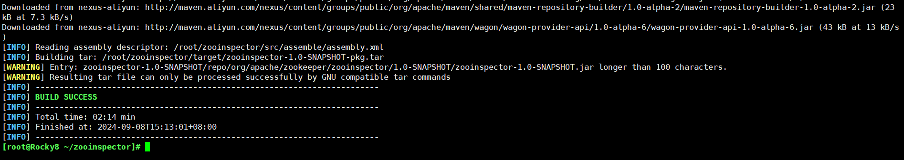

##### 2.5.3.1.2 客户端使用

```sh
[root@zookeeper-node01 zooinspector]#chmod +x target/zooinspector-pkg/bin/zooinspector.sh

#如果是Rocky，需要提前在windows打开Xmanager类似的软件，并执行下面命令
[root@zookeeper-node1 zooinspector]#export DISPLAY=11.0.1.99:0.0
#启动zooinspector
[root@zookeeper-node1 zooinspector]#target/zooinspector-pkg/bin/zooinspector.sh
#自动打开下面图形界面
```

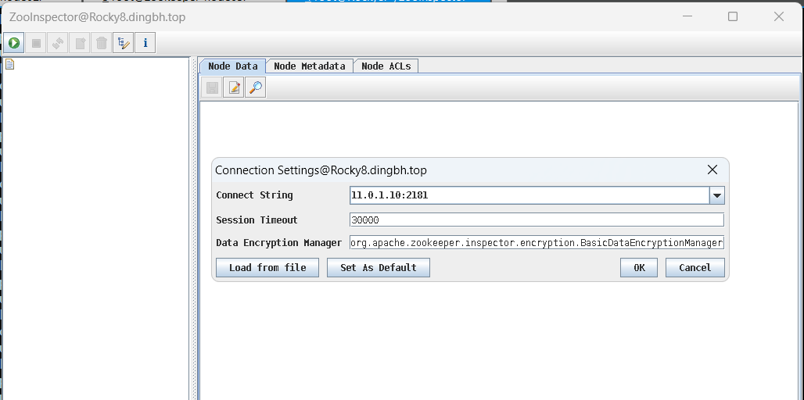

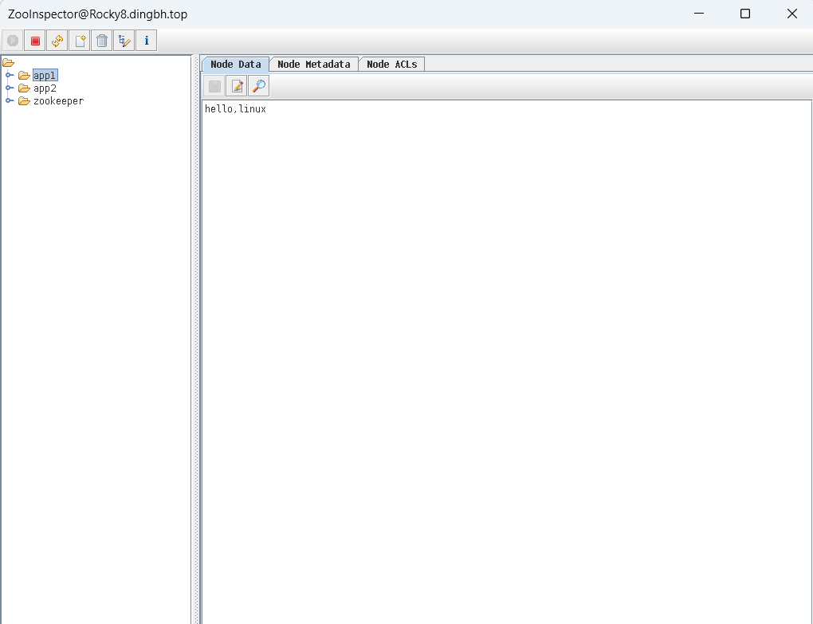

#### 2.5.3.2 Windows 客户端使用

先下载并安装 JDK
**注意: Oracle官网需要登录才能下载**

```
https://www.oracle.com/java/technologies/javase/javase-jdk8-downloads.html
```

**运行下面命令**

```sh
D:\技术\上课文件\消息队列与微服务文件\ZooInspector\build>java -jar zookeeper-dev-ZooInspector.jar

#或者直接使用Linux上面编译生成的文件zookinspector-1.0-SNAPSHOT-pkg.tar在Windows中解压缩,直接运行里的zooinspector.bat即可
```

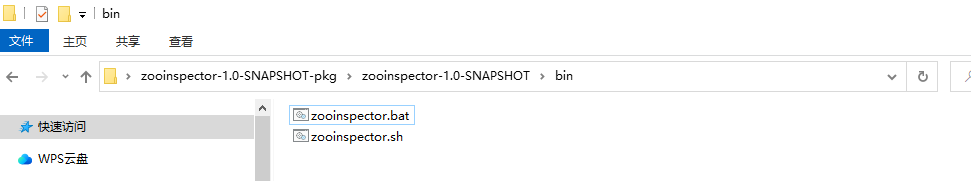

### 2.5.4 Python 访问 ZooKeeper

```sh
[root@zookeeper-node1 ~]#apt update && apt -y install python3 python3-kazoo
[root@zookeeper-node1 ~]#cat zookeepe_test.py 
#!/usr/bin/python3
from kazoo.client import KazooClient

zk = KazooClient(hosts='10.0.0.101:2181')
zk.start()

# 创建节点：makepath 设置为 True ，父节点不存在则创建，其他参数不填均为默认
zk.create('/zkapp/test',b'this is a test',makepath=True)
# 操作完后关闭zk连接
data=zk.get('/zkapp/test')
print(data)
zk.stop()

[root@zookeeper-node1 ~]#chmod +x ./zookeepe_test.py
[root@zookeeper-node1 ~]#./zookeepe_test.py
```

### 2.5.5 Golang 访问 ZooKeeper

